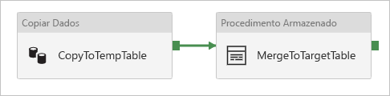

# <a name="copy-and-transform-data-in-azure-sql-managed-instance-by-using-azure-data-factory"></a>Copiar e transformar dados no Azure SQL Instância Gerenciada usando Azure Data Factory

[!INCLUDE[appliesto-adf-asa-md](includes/appliesto-adf-asa-md.md)]

Este artigo descreve como usar a atividade de cópia em Azure Data Factory para copiar dados de e para o SQL Instância Gerenciada do Azure e usar o fluxo de dados para transformar dados no Instância Gerenciada SQL do Azure. Para saber mais sobre o Azure Data Factory, leia as [artigo introdutório](introduction.md).

## <a name="supported-capabilities"></a>Funcionalidades com suporte

Este conector do SQL Instância Gerenciada tem suporte para as seguintes atividades:

- [Atividade de cópia](copy-activity-overview.md) com [matriz de fonte/coletor compatível](copy-activity-overview.md)
- [Fluxo de dados de mapeamento](concepts-data-flow-overview.md)
- [Atividade de pesquisa](control-flow-lookup-activity.md)
- [Atividade GetMetadata](control-flow-get-metadata-activity.md)

Para a atividade de cópia, este conector do banco de dados SQL do Azure dá suporte a essas funções:

- Copiar dados usando a autenticação do SQL e a autenticação do token de aplicativo do Azure Active Directory (Azure AD) com uma entidade de serviço ou identidades gerenciadas para recursos do Azure.
- Como fonte, recuperar dados usando uma consulta SQL ou um procedimento armazenado. Você também pode optar por copiar paralelamente da fonte do SQL MI, consulte a seção [cópia paralela do SQL mi](#parallel-copy-from-sql-mi) para obter detalhes.
- Como um coletor, criar automaticamente a tabela de destino se não existir com base no esquema de origem; acrescentar dados a uma tabela ou invocar um procedimento armazenado com lógica personalizada durante a cópia.

>[!NOTE]
> O SQL Instância Gerenciada [Always Encrypted](/sql/relational-databases/security/encryption/always-encrypted-database-engine) não tem suporte neste conector agora. Para solucionar o trabalho, você pode usar um [conector ODBC genérico](connector-odbc.md) e um SQL Server driver ODBC por meio de um Integration Runtime auto-hospedado. Saiba mais [usando Always Encrypted](#using-always-encrypted) seção. 

## <a name="prerequisites"></a>Pré-requisitos

Para acessar o ponto de [extremidade público](../azure-sql/managed-instance/public-endpoint-overview.md)do SQL instância gerenciada, você pode usar um Azure data Factory tempo de execução de integração do Azure gerenciado. Certifique-se de habilitar o ponto de extremidade público e também permitir o tráfego de ponto de extremidade público no grupo de segurança de rede para que Azure Data Factory possa se conectar ao seu banco de dados. Para obter mais informações, consulte [este guia](../azure-sql/managed-instance/public-endpoint-configure.md).

Para acessar o ponto de extremidade particular do SQL Instância Gerenciada, configure um [tempo de execução de integração auto-hospedado](create-self-hosted-integration-runtime.md) que pode acessar o banco de dados. Se você provisionar o tempo de execução de integração auto-hospedado na mesma rede virtual que sua instância gerenciada, certifique-se de que seu computador de tempo de execução de integração esteja em uma sub-rede diferente da instância gerenciada. Se você provisionar o tempo de execução de integração auto-hospedado em uma rede virtual diferente da instância gerenciada, você poderá usar um emparelhamento de rede virtual ou uma rede virtual para a conexão de rede virtual. Para obter mais informações, confira [Conectar seu aplicativo à Instância Gerenciada de SQL](../azure-sql/managed-instance/connect-application-instance.md).

## <a name="get-started"></a>Introdução

[!INCLUDE [data-factory-v2-connector-get-started](../../includes/data-factory-v2-connector-get-started.md)]

As seções a seguir fornecem detalhes sobre as propriedades que são usadas para definir Azure Data Factory entidades específicas para o conector do SQL Instância Gerenciada.

## <a name="linked-service-properties"></a>Propriedades do serviço vinculado

As propriedades a seguir têm suporte para o serviço vinculado do SQL Instância Gerenciada:

| Propriedade | Descrição | Obrigatório |
|:--- |:--- |:--- |
| type | A propriedade Type deve ser definida como **AzureSqlMI**. | Sim |
| connectionString |Essa propriedade especifica as informações de **ConnectionString** necessárias para se conectar ao SQL instância gerenciada usando a autenticação do SQL. Para obter mais informações, consulte os exemplos a seguir. <br/>A porta padrão é a 1433. Se você estiver usando o SQL Instância Gerenciada com um ponto de extremidade público, especifique explicitamente a porta 3342.<br> Você também pode colocar uma senha em Azure Key Vault. Se for a autenticação do SQL, extraia a `password` configuração da cadeia de conexão. Para obter mais informações, consulte o exemplo de JSON após a tabela e [armazenar as credenciais em Azure Key Vault](store-credentials-in-key-vault.md). |Sim |
| servicePrincipalId | Especifique a ID do cliente do aplicativo. | Sim, quando você usa a autenticação do Azure AD com uma entidade de serviço |
| servicePrincipalKey | Especifique a chave do aplicativo. Marque este campo como **SecureString** para armazená-lo com segurança em Azure data Factory ou [fazer referência a um segredo armazenado em Azure Key Vault](store-credentials-in-key-vault.md). | Sim, quando você usa a autenticação do Azure AD com uma entidade de serviço |
| locatário | Especifique as informações do locatário, como o nome de domínio ou a ID do locatário, sob a qual seu aplicativo reside. Recupere-as passando o mouse no canto superior direito do Portal do Azure. | Sim, quando você usa a autenticação do Azure AD com uma entidade de serviço |
| azureCloudType | Para autenticação de entidade de serviço, especifique o tipo de ambiente de nuvem do Azure no qual seu aplicativo do Azure AD está registrado. <br/> Os valores permitidos são **AzurePublic**, **AzureChina**, **AzureUsGovernment** e **AzureGermany**. Por padrão, o ambiente de nuvem do data factory é usado. | Não |
| connectVia | Esse [Integration Runtime](concepts-integration-runtime.md) é usado para se conectar ao armazenamento de dados. Você pode usar um tempo de execução de integração auto-hospedado ou um tempo de execução de integração do Azure se sua instância gerenciada tiver um ponto de extremidade público e permitir que Azure Data Factory o acesse. Se não especificado, o Azure Integration Runtime padrão será usado. |Sim |

Para diferentes tipos de autenticação, consulte as seções a seguir sobre pré-requisitos e amostras JSON, respectivamente:

- [Autenticação do SQL](#sql-authentication)
- [Autenticação de token de aplicativo do Azure AD: entidade de serviço](#service-principal-authentication)
- [Autenticação de token de aplicativo do Azure AD: identidades gerenciadas para recursos do Azure](#managed-identity)

### <a name="sql-authentication"></a>Autenticação do SQL

**Exemplo 1: usar a autenticação do SQL**

```json
{
    "name": "AzureSqlMILinkedService",
    "properties": {
        "type": "AzureSqlMI",
        "typeProperties": {
            "connectionString": "Data Source=<hostname,port>;Initial Catalog=<databasename>;Integrated Security=False;User ID=<username>;Password=<password>;"
        },
        "connectVia": {
            "referenceName": "<name of Integration Runtime>",
            "type": "IntegrationRuntimeReference"
        }
    }
}
```

**Exemplo 2: usar a autenticação do SQL com uma senha no Azure Key Vault**

```json
{
    "name": "AzureSqlMILinkedService",
    "properties": {
        "type": "AzureSqlMI",
        "typeProperties": {
            "connectionString": "Data Source=<hostname,port>;Initial Catalog=<databasename>;Integrated Security=False;User ID=<username>;",
            "password": { 
                "type": "AzureKeyVaultSecret", 
                "store": { 
                    "referenceName": "<Azure Key Vault linked service name>", 
                    "type": "LinkedServiceReference" 
                }, 
                "secretName": "<secretName>" 
            }
        },
        "connectVia": {
            "referenceName": "<name of Integration Runtime>",
            "type": "IntegrationRuntimeReference"
        }
    }
}
```

### <a name="service-principal-authentication"></a>Autenticação de entidade de serviço

Para usar uma autenticação de token de aplicativo do Azure AD baseada no serviço principal, siga estas etapas:

1. Siga as etapas para [provisionar um administrador de Azure Active Directory para seu instância gerenciada](../azure-sql/database/authentication-aad-configure.md#provision-azure-ad-admin-sql-managed-instance).

2. [Crie um aplicativo do Azure Active Directory](../active-directory/develop/howto-create-service-principal-portal.md#register-an-application-with-azure-ad-and-create-a-service-principal) no portal do Azure. Anote o nome do aplicativo e os seguintes valores que definem o serviço vinculado:

    - ID do aplicativo
    - Chave do aplicativo
    - ID do locatário

3. [Crie logons](/sql/t-sql/statements/create-login-transact-sql) para a identidade gerenciada Azure data Factory. No SQL Server Management Studio (SSMS), conecte-se à sua instância gerenciada usando uma conta de SQL Server que seja um **sysadmin**. No banco de dados **mestre**, execute o seguinte T-SQL:

    ```sql
    CREATE LOGIN [your application name] FROM EXTERNAL PROVIDER
    ```

4. [Crie usuários de banco de dados independente](../azure-sql/database/authentication-aad-configure.md#create-contained-users-mapped-to-azure-ad-identities) para a identidade gerenciada Azure data Factory. Conecte-se ao banco de dados do ou para o qual você deseja copiar dados. Execute o seguinte T-SQL: 
  
    ```sql
    CREATE USER [your application name] FROM EXTERNAL PROVIDER
    ```

5. Conceda à identidade gerenciada Data Factory permissões necessárias como faria normalmente para usuários do SQL e outros. Execute o código a seguir. Para mais opções, confira [este documento](/sql/t-sql/statements/alter-role-transact-sql).

    ```sql
    ALTER ROLE [role name e.g. db_owner] ADD MEMBER [your application name]
    ```

6. Configure um serviço vinculado do SQL Instância Gerenciada no Azure Data Factory.

**Exemplo: usar a autenticação de entidade de serviço**

```json
{
    "name": "AzureSqlDbLinkedService",
    "properties": {
        "type": "AzureSqlMI",
        "typeProperties": {
            "connectionString": "Data Source=<hostname,port>;Initial Catalog=<databasename>;",
            "servicePrincipalId": "<service principal id>",
            "servicePrincipalKey": {
                "type": "SecureString",
                "value": "<service principal key>"
            },
            "tenant": "<tenant info, e.g. microsoft.onmicrosoft.com>"
        },
        "connectVia": {
            "referenceName": "<name of Integration Runtime>",
            "type": "IntegrationRuntimeReference"
        }
    }
}
```

### <a name="managed-identities-for-azure-resources-authentication"></a><a name="managed-identity"></a> Identidades gerenciadas para autenticação de recursos do Azure

Um data factory pode ser associado a uma [identidade gerenciada para recursos do Azure](data-factory-service-identity.md), que representa esse data factory específico. Você pode usar essa identidade gerenciada para autenticação do SQL Instância Gerenciada. O factory designado pode acessar dados do banco de dados e copiá-los para o banco de dados usando essa identidade.

Para usar a autenticação de identidade gerenciada, siga estas etapas.

1. Siga as etapas para [provisionar um administrador de Azure Active Directory para seu instância gerenciada](../azure-sql/database/authentication-aad-configure.md#provision-azure-ad-admin-sql-managed-instance).

2. [Crie logons](/sql/t-sql/statements/create-login-transact-sql) para a identidade gerenciada Azure data Factory. No SQL Server Management Studio (SSMS), conecte-se à sua instância gerenciada usando uma conta de SQL Server que seja um **sysadmin**. No banco de dados **mestre**, execute o seguinte T-SQL:

    ```sql
    CREATE LOGIN [your Data Factory name] FROM EXTERNAL PROVIDER
    ```

3. [Crie usuários de banco de dados independente](../azure-sql/database/authentication-aad-configure.md#create-contained-users-mapped-to-azure-ad-identities) para a identidade gerenciada Azure data Factory. Conecte-se ao banco de dados do ou para o qual você deseja copiar dados. Execute o seguinte T-SQL: 
  
    ```sql
    CREATE USER [your Data Factory name] FROM EXTERNAL PROVIDER
    ```

4. Conceda à identidade gerenciada Data Factory permissões necessárias como faria normalmente para usuários do SQL e outros. Execute o código a seguir. Para mais opções, confira [este documento](/sql/t-sql/statements/alter-role-transact-sql).

    ```sql
    ALTER ROLE [role name e.g. db_owner] ADD MEMBER [your Data Factory name]
    ```

5. Configure um serviço vinculado do SQL Instância Gerenciada no Azure Data Factory.

**Exemplo: usa a autenticação de identidade gerenciada**

```json
{
    "name": "AzureSqlDbLinkedService",
    "properties": {
        "type": "AzureSqlMI",
        "typeProperties": {
            "connectionString": "Data Source=<hostname,port>;Initial Catalog=<databasename>;"
        },
        "connectVia": {
            "referenceName": "<name of Integration Runtime>",
            "type": "IntegrationRuntimeReference"
        }
    }
}
```

## <a name="dataset-properties"></a>Propriedades do conjunto de dados

Para obter uma lista completa das seções e das propriedades disponíveis para uso para definir conjuntos de dados, confira o artigo sobre conjuntos de dados. Esta seção fornece uma lista das propriedades com suporte pelo conjunto de Instância Gerenciada do SQL.

Para copiar dados de e para o SQL Instância Gerenciada, há suporte para as seguintes propriedades:

| Propriedade | Descrição | Obrigatório |
|:--- |:--- |:--- |
| type | A propriedade Type do conjunto de conjuntos deve ser definida como **AzureSqlMITable**. | Sim |
| esquema | Nome do esquema. |Não para fonte, Sim para o coletor  |
| tabela | Nome da tabela/exibição. |Não para fonte, Sim para o coletor  |
| tableName | Nome da tabela/exibição com esquema. Essa propriedade é compatível com versões anteriores. Para uma nova carga de trabalho, use `schema` e `table`. | Não para fonte, Sim para o coletor |

**Exemplo**

```json
{
    "name": "AzureSqlMIDataset",
    "properties":
    {
        "type": "AzureSqlMITable",
        "linkedServiceName": {
            "referenceName": "<SQL Managed Instance linked service name>",
            "type": "LinkedServiceReference"
        },
        "schema": [ < physical schema, optional, retrievable during authoring > ],
        "typeProperties": {
            "schema": "<schema_name>",
            "table": "<table_name>"
        }
    }
}
```

## <a name="copy-activity-properties"></a>Propriedades da atividade de cópia

Para obter uma lista completa das seções e propriedades disponíveis para uso para definir atividades, confia o artigo [Pipelines](concepts-pipelines-activities.md). Esta seção fornece uma lista das propriedades com suporte pela fonte e pelo coletor do SQL Instância Gerenciada.

### <a name="sql-managed-instance-as-a-source"></a>SQL Instância Gerenciada como uma fonte

>[!TIP]
>Para carregar dados do SQL de MI com eficiência usando o particionamento de dados, saiba mais em [cópia paralela do SQL mi](#parallel-copy-from-sql-mi).

Para copiar dados do SQL Instância Gerenciada, as propriedades a seguir têm suporte na seção origem da atividade de cópia:

| Propriedade | Descrição | Obrigatório |
|:--- |:--- |:--- |
| type | A propriedade Type da fonte da atividade de cópia deve ser definida como **SqlMISource**. | Sim |
| sqlReaderQuery |Essa propriedade usa a consulta SQL personalizada para ler dados. Um exemplo é `select * from MyTable`. |Não |
| sqlReaderStoredProcedureName |Essa propriedade é o nome do procedimento armazenado que lê dados da tabela de origem. A última instrução SQL deve ser uma instrução SELECT no procedimento armazenado. |Não |
| storedProcedureParameters |Esses parâmetros são para o procedimento armazenado.<br/>Valores permitidos são pares de nome ou valor. Os nomes e o uso de maiúsculas e minúsculas dos parâmetros devem corresponder aos nomes e o uso de maiúsculas e minúsculas dos parâmetros do procedimento armazenado. |Não |
| isolationLevel | Especifica o comportamento de bloqueio de transação para a origem do SQL. Os valores permitidos são: **ReadCommitted**, **READUNCOMMITTED**, **REPEATABLEREAD**, **Serializable**, **snapshot**. Se não for especificado, o nível de isolamento padrão do banco de dados será usado. Veja [este documento](/dotnet/api/system.data.isolationlevel) para obter mais detalhes. | Não |
| partitionOptions | Especifica as opções de particionamento de dados usadas para carregar dados do SQL MI. <br>Os valores permitidos são: **None** (padrão), **PhysicalPartitionsOfTable** e **DynamicRange**.<br>Quando uma opção de partição está habilitada (ou seja, não `None` ), o grau de paralelismo para carregar dados simultaneamente do SQL mi é controlado pela [`parallelCopies`](copy-activity-performance-features.md#parallel-copy) configuração na atividade de cópia. | Não |
| partitionSettings | Especifique o grupo de configurações para o particionamento de dados. <br>Aplicar quando a opção de partição não estiver `None` . | Não |
| ***Em `partitionSettings` :*** | | |
| partitionColumnName | Especifique o nome da coluna de origem **no tipo inteiro ou de data/hora** ( `int` , `smallint` , `bigint` ,,,, `date` `smalldatetime` `datetime` `datetime2` ou `datetimeoffset` ) que será usado pelo particionamento de intervalo para cópia paralela. Se não for especificado, o índice ou a chave primária da tabela será detectado automaticamente e usado como a coluna de partição.<br>Aplicar quando a opção de partição for `DynamicRange`. Se você usar uma consulta para recuperar os dados de origem, conecte-se  `?AdfDynamicRangePartitionCondition ` à cláusula WHERE. Para obter um exemplo, consulte a seção [cópia paralela do banco de dados SQL](#parallel-copy-from-sql-mi) . | Não |
| partitionUpperBound | O valor máximo da coluna de partição para divisão de intervalo de partição. Esse valor é usado para decidir o stride da partição, não para filtrar as linhas na tabela. Todas as linhas da tabela ou do resultado da consulta serão particionadas e copiadas. Se não for especificado, a atividade de cópia detectará o valor automaticamente.  <br>Aplicar quando a opção de partição for `DynamicRange`. Para obter um exemplo, consulte a seção [cópia paralela do banco de dados SQL](#parallel-copy-from-sql-mi) . | Não |
| partitionLowerBound | O valor mínimo da coluna de partição para divisão de intervalo de partição. Esse valor é usado para decidir o stride da partição, não para filtrar as linhas na tabela. Todas as linhas da tabela ou do resultado da consulta serão particionadas e copiadas. Se não for especificado, a atividade de cópia detectará o valor automaticamente.<br>Aplicar quando a opção de partição for `DynamicRange`. Para obter um exemplo, consulte a seção [cópia paralela do banco de dados SQL](#parallel-copy-from-sql-mi) . | Não |

**Observe os seguintes pontos:**

- Se **sqlReaderQuery** for especificado para **SqlMISource**, a atividade de cópia executará essa consulta na fonte de instância gerenciada do SQL para obter os dados. Você também pode especificar um procedimento armazenado especificando o **sqlReaderStoredProcedureName** e o **storedProcedureParameters** se o procedimento armazenado usa parâmetros.
- Ao usar o procedimento armazenado na origem para recuperar dados, observe que, se o procedimento armazenado for projetado como retornando um esquema diferente quando um valor de parâmetro diferente for passado, você poderá encontrar uma falha ou conferir um resultado inesperado ao importar o esquema da interface do usuário ou ao copiar dados para o SQL Database com a criação automática de tabela.

**Exemplo: usar uma consulta SQL**

```json
"activities":[
    {
        "name": "CopyFromAzureSqlMI",
        "type": "Copy",
        "inputs": [
            {
                "referenceName": "<SQL Managed Instance input dataset name>",
                "type": "DatasetReference"
            }
        ],
        "outputs": [
            {
                "referenceName": "<output dataset name>",
                "type": "DatasetReference"
            }
        ],
        "typeProperties": {
            "source": {
                "type": "SqlMISource",
                "sqlReaderQuery": "SELECT * FROM MyTable"
            },
            "sink": {
                "type": "<sink type>"
            }
        }
    }
]
```

**Exemplo: usar um procedimento armazenado**

```json
"activities":[
    {
        "name": "CopyFromAzureSqlMI",
        "type": "Copy",
        "inputs": [
            {
                "referenceName": "<SQL Managed Instance input dataset name>",
                "type": "DatasetReference"
            }
        ],
        "outputs": [
            {
                "referenceName": "<output dataset name>",
                "type": "DatasetReference"
            }
        ],
        "typeProperties": {
            "source": {
                "type": "SqlMISource",
                "sqlReaderStoredProcedureName": "CopyTestSrcStoredProcedureWithParameters",
                "storedProcedureParameters": {
                    "stringData": { "value": "str3" },
                    "identifier": { "value": "$$Text.Format('{0:yyyy}', <datetime parameter>)", "type": "Int"}
                }
            },
            "sink": {
                "type": "<sink type>"
            }
        }
    }
]
```

**A definição do procedimento armazenado**

```sql
CREATE PROCEDURE CopyTestSrcStoredProcedureWithParameters
(
    @stringData varchar(20),
    @identifier int
)
AS
SET NOCOUNT ON;
BEGIN
    select *
    from dbo.UnitTestSrcTable
    where dbo.UnitTestSrcTable.stringData != stringData
    and dbo.UnitTestSrcTable.identifier != identifier
END
GO
```

### <a name="sql-managed-instance-as-a-sink"></a>SQL Instância Gerenciada como um coletor

> [!TIP]
> Saiba mais sobre os comportamentos de gravação com suporte, as configurações e as práticas recomendadas da [prática recomendada para carregar dados no SQL instância gerenciada](#best-practice-for-loading-data-into-sql-managed-instance).

Para copiar dados para o SQL Instância Gerenciada, as propriedades a seguir têm suporte na seção coletor de atividade de cópia:

| Propriedade | Descrição | Obrigatório |
|:--- |:--- |:--- |
| type | A propriedade Type do coletor da atividade de cópia deve ser definida como **SqlMISink**. | Sim |
| preCopyScript |Esta propriedade especifica uma consulta SQL para que a atividade de cópia seja executada antes de gravar dados no SQL Instância Gerenciada. É chamado apenas uma vez por execução de cópia. Você pode usar essa propriedade para limpar os dados previamente carregados. |Não |
| tableOption | Especifica se a [tabela do coletor deve ser criada automaticamente](copy-activity-overview.md#auto-create-sink-tables) se não existir com base no esquema de origem. Não há suporte para a criação de tabela automática quando o coletor especifica o procedimento armazenado. Os valores permitidos são `none` (padrão) e `autoCreate`. |Não |
| sqlWriterStoredProcedureName | O nome do procedimento armazenado que define como aplicar dados de origem em uma tabela de destino. <br/>Este procedimento armazenado é *chamado por lote*. Para operações que são executadas apenas uma vez e não têm nada a ver com os dados de origem, por exemplo, excluir ou truncar, use a `preCopyScript` propriedade.<br>Consulte o exemplo de [invocar um procedimento armazenado de um coletor SQL](#invoke-a-stored-procedure-from-a-sql-sink). | Não |
| storedProcedureTableTypeParameterName |O nome do parâmetro do tipo de tabela especificado no procedimento armazenado.  |Não |
| sqlWriterTableType |O nome do tipo de tabela a ser usado no procedimento armazenado. A atividade de cópia disponibiliza aqueles dados sendo movidos em uma tabela temporária com esse tipo de tabela. O código de procedimento armazenado pode mesclar os dados que estão sendo copiados com os dados existentes. |Não |
| storedProcedureParameters |Parâmetros para o procedimento armazenado.<br/>Valores permitidos são pares de nome e valor. Nomes e uso de maiúsculas e minúsculas de parâmetros devem corresponder aos nomes e o uso de maiúsculas e minúsculas dos parâmetros do procedimento armazenado. | Não |
| writeBatchSize |Número de linhas a serem inseridas na tabela SQL *por lote*.<br/>Os valores permitidos são inteiros para o número de linhas. Por padrão, Azure Data Factory determina dinamicamente o tamanho do lote apropriado com base no tamanho da linha.  |Não |
| writeBatchTimeout |Essa propriedade especifica o tempo de espera para a operação de inserção em lotes a ser concluída antes de atingir o tempo limite.<br/>Os valores permitidos são para o TimeSpan. Um exemplo é "00:30:00", que é de 30 minutos. |Não |

**Exemplo 1: acrescentar dados**

```json
"activities":[
    {
        "name": "CopyToAzureSqlMI",
        "type": "Copy",
        "inputs": [
            {
                "referenceName": "<input dataset name>",
                "type": "DatasetReference"
            }
        ],
        "outputs": [
            {
                "referenceName": "<SQL Managed Instance output dataset name>",
                "type": "DatasetReference"
            }
        ],
        "typeProperties": {
            "source": {
                "type": "<source type>"
            },
            "sink": {
                "type": "SqlMISink",
                "tableOption": "autoCreate",
                "writeBatchSize": 100000
            }
        }
    }
]
```

**Exemplo 2: invocar um procedimento armazenado durante a cópia**

Saiba mais detalhes em [invocar um procedimento armazenado de um coletor de Mi do SQL](#invoke-a-stored-procedure-from-a-sql-sink).

```json
"activities":[
    {
        "name": "CopyToAzureSqlMI",
        "type": "Copy",
        "inputs": [
            {
                "referenceName": "<input dataset name>",
                "type": "DatasetReference"
            }
        ],
        "outputs": [
            {
                "referenceName": "<SQL Managed Instance output dataset name>",
                "type": "DatasetReference"
            }
        ],
        "typeProperties": {
            "source": {
                "type": "<source type>"
            },
            "sink": {
                "type": "SqlMISink",
                "sqlWriterStoredProcedureName": "CopyTestStoredProcedureWithParameters",
                "storedProcedureTableTypeParameterName": "MyTable",
                "sqlWriterTableType": "MyTableType",
                "storedProcedureParameters": {
                    "identifier": { "value": "1", "type": "Int" },
                    "stringData": { "value": "str1" }
                }
            }
        }
    }
]
```

## <a name="parallel-copy-from-sql-mi"></a>Cópia paralela do SQL MI

O conector do Azure SQL Instância Gerenciada na atividade de cópia fornece particionamento de dados interno para copiar dados em paralelo. Você pode encontrar opções de particionamento de dados na guia **origem** da atividade de cópia.


Quando você habilita a cópia particionada, a atividade de cópia executa consultas paralelas em sua fonte de MI do SQL para carregar dados por partições. O grau paralelo é controlado pela configuração do [`parallelCopies`](copy-activity-performance-features.md#parallel-copy) na atividade de cópia. Por exemplo, se você definir `parallelCopies` como quatro, data Factory gera e executa quatro consultas de maneira simultânea com base na opção de partição e nas configurações especificadas, e cada consulta recupera uma parte dos dados do Mi do SQL.

É recomendável habilitar a cópia paralela com o particionamento de dados, especialmente quando você carrega grandes quantidades de dados de sua MI SQL. Veja a seguir as configurações sugeridas para cenários diferentes. Ao copiar dados para o armazenamento de dados baseado em arquivo, é recomendável gravar em uma pasta como vários arquivos (apenas especifique o nome da pasta). nesse caso, o desempenho é melhor do que gravar em um único arquivo.

| Cenário                                                     | Configurações sugeridas                                           |
| ------------------------------------------------------------ | ------------------------------------------------------------ |
| Carga total de uma tabela grande, com partições físicas.        | **Opção de partição**: partições físicas da tabela. <br><br/>Durante a execução, Data Factory detecta automaticamente as partições físicas e copia os dados por partições. <br><br/>Para verificar se a tabela tem uma partição física ou não, você pode fazer referência a [essa consulta](#sample-query-to-check-physical-partition). |
| Carga total de uma tabela grande, sem partições físicas, enquanto com uma coluna de número inteiro ou de data e hora para o particionamento de dados. | **Opções de partição**: partição de intervalo dinâmico.<br>**Coluna de partição** (opcional): Especifique a coluna usada para particionar dados. Se não for especificado, a coluna índice ou chave primária será usada.<br/>**Limite superior** da partição e **limite inferior da partição** (opcional): especifique se você deseja determinar o stride da partição. Isso não é para filtrar as linhas na tabela, todas as linhas da tabela serão particionadas e copiadas. Se não for especificado, a atividade de cópia detectará automaticamente os valores.<br><br>Por exemplo, se a coluna de partição "ID" tiver valores varia de 1 a 100, e você definir o limite inferior como 20 e o limite superior como 80, com cópia paralela como 4, Data Factory recuperará dados por 4 partições-IDs no intervalo <= 20, [21, 50], [51, 80] e >= 81, respectivamente. |
| Carregue uma grande quantidade de dados usando uma consulta personalizada, sem partições físicas, enquanto com uma coluna de número inteiro ou data/hora para o particionamento de dados. | **Opções de partição**: partição de intervalo dinâmico.<br>**Consulta**: `SELECT * FROM <TableName> WHERE ?AdfDynamicRangePartitionCondition AND <your_additional_where_clause>`.<br>**Coluna de partição**: especifique a coluna usada para particionar dados.<br>**Limite superior** da partição e **limite inferior da partição** (opcional): especifique se você deseja determinar o stride da partição. Isso não é para filtrar as linhas na tabela, todas as linhas no resultado da consulta serão particionadas e copiadas. Se não for especificado, a atividade de cópia detectará o valor automaticamente.<br><br>Durante a execução, Data Factory substitui `?AdfRangePartitionColumnName` pelo nome real da coluna e os intervalos de valores de cada partição e envia para o SQL mi. <br>Por exemplo, se a coluna de partição "ID" tiver valores varia de 1 a 100, e você definir o limite inferior como 20 e o limite superior como 80, com cópia paralela como 4, Data Factory recuperará dados por 4 partições-IDs no intervalo <= 20, [21, 50], [51, 80] e >= 81, respectivamente. <br><br>Aqui estão mais exemplos de consultas para cenários diferentes:<br> 1. consulte a tabela inteira: <br>`SELECT * FROM <TableName> WHERE ?AdfDynamicRangePartitionCondition`<br> 2. consulta de uma tabela com seleção de coluna e filtros de cláusula WHERE adicionais: <br>`SELECT <column_list> FROM <TableName> WHERE ?AdfDynamicRangePartitionCondition AND <your_additional_where_clause>`<br> 3. consultar com subconsultas: <br>`SELECT <column_list> FROM (<your_sub_query>) AS T WHERE ?AdfDynamicRangePartitionCondition AND <your_additional_where_clause>`<br> 4. consulta com partição na subconsulta: <br>`SELECT <column_list> FROM (SELECT <your_sub_query_column_list> FROM <TableName> WHERE ?AdfDynamicRangePartitionCondition) AS T`
|

Práticas recomendadas para carregar dados com a opção de partição:

1. Escolha coluna distinta como coluna de partição (como chave primária ou chave exclusiva) para evitar a distorção de dados. 
2. Se a tabela tiver uma partição interna, use a opção de partição "partições físicas da tabela" para obter um melhor desempenho.    
3. Se você usar Azure Integration Runtime para copiar dados, poderá definir "[unidades de integração de dados (DIU)](copy-activity-performance-features.md#data-integration-units)" maiores (>4) para utilizar mais recursos de computação. Verifique os cenários aplicáveis ali.
4. O "[grau de paralelismo de cópia](copy-activity-performance-features.md#parallel-copy)" controla os números de partição, definindo esse número muito grande em algum momento que afeta o desempenho, recomenda definir esse número como (DIU ou número de nós de ir de hospedagem interna) * (2 a 4).

**Exemplo: carregamento completo de uma tabela grande com partições físicas**

```json
"source": {
    "type": "SqlMISource",
    "partitionOption": "PhysicalPartitionsOfTable"
}
```

**Exemplo: consulta com a partição do intervalo dinâmico**

```json
"source": {
    "type": "SqlMISource",
    "query": "SELECT * FROM <TableName> WHERE ?AdfDynamicRangePartitionCondition AND <your_additional_where_clause>",
    "partitionOption": "DynamicRange",
    "partitionSettings": {
        "partitionColumnName": "<partition_column_name>",
        "partitionUpperBound": "<upper_value_of_partition_column (optional) to decide the partition stride, not as data filter>",
        "partitionLowerBound": "<lower_value_of_partition_column (optional) to decide the partition stride, not as data filter>"
    }
}
```

### <a name="sample-query-to-check-physical-partition"></a>Exemplo de consulta para verificar a partição física

```sql
SELECT DISTINCT s.name AS SchemaName, t.name AS TableName, pf.name AS PartitionFunctionName, c.name AS ColumnName, iif(pf.name is null, 'no', 'yes') AS HasPartition
FROM sys.tables AS t
LEFT JOIN sys.objects AS o ON t.object_id = o.object_id
LEFT JOIN sys.schemas AS s ON o.schema_id = s.schema_id
LEFT JOIN sys.indexes AS i ON t.object_id = i.object_id 
LEFT JOIN sys.index_columns AS ic ON ic.partition_ordinal > 0 AND ic.index_id = i.index_id AND ic.object_id = t.object_id 
LEFT JOIN sys.columns AS c ON c.object_id = ic.object_id AND c.column_id = ic.column_id 
LEFT JOIN sys.partition_schemes ps ON i.data_space_id = ps.data_space_id 
LEFT JOIN sys.partition_functions pf ON pf.function_id = ps.function_id 
WHERE s.name='[your schema]' AND t.name = '[your table name]'
```

Se a tabela tiver uma partição física, você verá "HasPartition" como "Sim", como a seguir.


## <a name="best-practice-for-loading-data-into-sql-managed-instance"></a>Prática recomendada para carregar dados no SQL Instância Gerenciada

Quando você copia dados para o SQL Instância Gerenciada, pode ser necessário um comportamento de gravação diferente:

- [Append](#append-data): meus dados de origem têm apenas registros novos.
- [Upsert](#upsert-data): meus dados de origem têm inserções e atualizações.
- [Substituir](#overwrite-the-entire-table): Eu quero recarregar toda a tabela de dimensões a cada vez.
- [Gravar com lógica personalizada](#write-data-with-custom-logic): preciso de processamento extra antes da inserção final na tabela de destino. 

Consulte as respectivas seções sobre como configurar o em Azure Data Factory e as práticas recomendadas.

### <a name="append-data"></a>Acrescentar dados

Acrescentar dados é o comportamento padrão do conector do coletor de Instância Gerenciada do SQL. Azure Data Factory faz uma inserção em massa para gravar em sua tabela com eficiência. Você pode configurar a origem e o coletor de acordo com a atividade de cópia.

### <a name="upsert-data"></a>Upsert data

**Opção 1:** Quando você tem uma grande quantidade de dados a serem copiados, você pode carregar em massa todos os registros em uma tabela de preparo usando a atividade de cópia e, em seguida, executar uma atividade de procedimento armazenado para aplicar uma instrução [Merge](/sql/t-sql/statements/merge-transact-sql) ou Insert/Update em uma única imagem. 

Atualmente, a atividade de cópia não dá suporte nativo ao carregamento de dados em uma tabela temporária de banco de dado. Há uma maneira avançada de configurá-lo com uma combinação de várias atividades, consulte [otimizar cenários de Upsert em massa do banco de dados SQL](https://github.com/scoriani/azuresqlbulkupsert). Abaixo mostra um exemplo de como usar uma tabela permanente como preparo.

Por exemplo, em Azure Data Factory, você pode criar um pipeline com uma **atividade de cópia** encadeada com uma **atividade de procedimento armazenado**. O primeiro copia os dados do seu repositório de origem em uma tabela de preparo do SQL Instância Gerenciada do Azure, por exemplo, **UpsertStagingTable**, como o nome da tabela no conjunto de dados. Em seguida, o último invoca um procedimento armazenado para mesclar dados de origem da tabela de preparo na tabela de destino e limpar a tabela de preparo.



No banco de dados, defina um procedimento armazenado com lógica de MESCLAgem, como o exemplo a seguir, que é apontado da atividade de procedimento armazenado anterior. Suponha que o destino seja a tabela de **marketing** com três colunas: **ProfileId**, **estado** e **categoria**. Faça o Upsert com base na coluna **ProfileId** .

```sql
CREATE PROCEDURE [dbo].[spMergeData]
AS
BEGIN
    MERGE TargetTable AS target
    USING UpsertStagingTable AS source
    ON (target.[ProfileID] = source.[ProfileID])
    WHEN MATCHED THEN
        UPDATE SET State = source.State
    WHEN NOT matched THEN
        INSERT ([ProfileID], [State], [Category])
      VALUES (source.ProfileID, source.State, source.Category);
    
    TRUNCATE TABLE UpsertStagingTable
END
```

**Opção 2:** Você pode optar por [invocar um procedimento armazenado na atividade de cópia](#invoke-a-stored-procedure-from-a-sql-sink). Essa abordagem executa cada lote (conforme governado pela `writeBatchSize` Propriedade) na tabela de origem em vez de usar BULK INSERT como a abordagem padrão na atividade de cópia.

### <a name="overwrite-the-entire-table"></a>Substituir a tabela inteira

Você pode configurar a propriedade **preCopyScript** em um coletor de atividade de cópia. Nesse caso, para cada atividade de cópia executada, Azure Data Factory executa o script primeiro. Em seguida, ele executa a cópia para inserir os dados. Por exemplo, para substituir a tabela inteira com os dados mais recentes, especifique um script para primeiro excluir todos os registros antes de carregar em massa os novos dados da origem.

### <a name="write-data-with-custom-logic"></a>Gravar dados com lógica personalizada

As etapas para gravar dados com lógica personalizada são semelhantes às descritas na seção de [dados Upsert](#upsert-data) . Quando você precisa aplicar processamento extra antes da inserção final dos dados de origem na tabela de destino, você pode carregar em uma tabela de preparo e, em seguida, invocar a atividade de procedimento armazenado, ou invocar um procedimento armazenado no coletor de atividade de cópia para aplicar dados.

## <a name="invoke-a-stored-procedure-from-a-sql-sink"></a><a name="invoke-a-stored-procedure-from-a-sql-sink"></a> Invocar um procedimento armazenado de um coletor SQL

Ao copiar dados para o SQL Instância Gerenciada, você também pode configurar e invocar um procedimento armazenado especificado pelo usuário com parâmetros adicionais em cada lote da tabela de origem. O recurso de procedimento armazenado aproveita os [parâmetros com valor de tabela](/dotnet/framework/data/adonet/sql/table-valued-parameters).

Você pode usar um procedimento armazenado quando os mecanismos internos de cópia não atendem à finalidade. Um exemplo é quando você deseja aplicar processamento extra antes da inserção final dos dados de origem na tabela de destino. Alguns exemplos de processamento extra são quando você deseja mesclar colunas, Pesquisar valores adicionais e inserir em mais de uma tabela.

O exemplo a seguir mostra como usar um procedimento armazenado para fazer um upsert em uma tabela no banco de dados do SQL Server. Suponha que os dados de entrada e a tabela de **marketing** do coletor tenham três colunas: **ProfileId**, **estado** e **categoria**. Faça o Upsert com base na coluna **ProfileId** e aplique-o somente para uma categoria específica chamada "produtoA".

1. No banco de dados, defina o tipo de tabela com o mesmo nome que **sqlWriterTableType**. O esquema do tipo de tabela é o mesmo que o esquema retornado pelos dados de entrada.

    ```sql
    CREATE TYPE [dbo].[MarketingType] AS TABLE(
        [ProfileID] [varchar](256) NOT NULL,
        [State] [varchar](256) NOT NULL,
        [Category] [varchar](256) NOT NULL
    )
    ```

2. No banco de dados, defina o procedimento armazenado com o mesmo nome que **sqlWriterStoredProcedureName**. Ele manipula os dados de entrada da sua origem especificada e mescla na tabela de saída. O nome do parâmetro do tipo de tabela no procedimento armazenado é o mesmo que **TableName** definido no DataSet.

    ```sql
    CREATE PROCEDURE spOverwriteMarketing @Marketing [dbo].[MarketingType] READONLY, @category varchar(256)
    AS
    BEGIN
    MERGE [dbo].[Marketing] AS target
    USING @Marketing AS source
    ON (target.ProfileID = source.ProfileID and target.Category = @category)
    WHEN MATCHED THEN
        UPDATE SET State = source.State
    WHEN NOT MATCHED THEN
        INSERT (ProfileID, State, Category)
        VALUES (source.ProfileID, source.State, source.Category);
    END
    ```

3. Em Azure Data Factory, defina a seção **coletor de Mi do SQL** na atividade de cópia da seguinte maneira:

    ```json
    "sink": {
        "type": "SqlMISink",
        "sqlWriterStoredProcedureName": "spOverwriteMarketing",
        "storedProcedureTableTypeParameterName": "Marketing",
        "sqlWriterTableType": "MarketingType",
        "storedProcedureParameters": {
            "category": {
                "value": "ProductA"
            }
        }
    }
    ```

## <a name="mapping-data-flow-properties"></a>Propriedades do fluxo de dados de mapeamento

Ao transformar dados no fluxo de dados de mapeamento, você pode ler e gravar em tabelas do Azure SQL Instância Gerenciada. Para obter mais informações, confira [transformação de origem](data-flow-source.md) e [transformação do coletor](data-flow-sink.md) nos fluxos de dados de mapeamento.

> [!NOTE]
> O conector do SQL Instância Gerenciada do Azure no fluxo de dados de mapeamento está disponível atualmente como visualização pública. Você pode se conectar ao ponto de extremidade público do SQL Instância Gerenciada, mas não ao ponto de extremidade privado ainda.

### <a name="source-transformation"></a>Transformação de origem

A tabela abaixo lista as propriedades com suporte pela fonte de Instância Gerenciada do SQL do Azure. Você pode editar essas propriedades na guia **Opções de origem** .

| Nome | Descrição | Obrigatório | Valores permitidos | Propriedade de script de fluxo de dados |
| ---- | ----------- | -------- | -------------- | ---------------- |
| Tabela | Se você selecionar tabela como entrada, o fluxo de dados buscará todos os dados da tabela especificada no conjunto. | Não | - |- |
| Consulta | Se você selecionar consulta como entrada, especifique uma consulta SQL para buscar dados da origem, o que substitui qualquer tabela que você especificar no DataSet. O uso de consultas é uma ótima maneira de reduzir linhas para teste ou pesquisas.<br><br>Não há suporte para a cláusula **order by** , mas você pode definir uma instrução SELECT FROM completa. Também pode usar funções de tabela definidas pelo usuário. **Select * de udfGetData ()** é um UDF no SQL que retorna uma tabela que você pode usar no fluxo de dados.<br>Exemplo de consulta: `Select * from MyTable where customerId > 1000 and customerId < 2000`| Não | String | Consulta |
| Tamanho do lote | Especifique um tamanho de lote para dividir dados grandes em leituras. | Não | Integer | batchSize |
| Nível de Isolamento | Escolha um dos seguintes níveis de isolamento:<br>-Leitura confirmada<br>-Leitura não confirmada (padrão)<br>-Leitura repetida<br>-Serializável<br>-Nenhum (ignorar nível de isolamento) | Não | <small>READ_COMMITTED<br/>READ_UNCOMMITTED<br/>REPEATABLE_READ<br/>SERIALIZABLE<br/>NONE</small> |isolationLevel |

#### <a name="azure-sql-managed-instance-source-script-example"></a>Exemplo de script de origem do Azure SQL Instância Gerenciada

Quando você usa o Azure SQL Instância Gerenciada como tipo de fonte, o script de fluxo de dados associado é:

```
source(allowSchemaDrift: true,
    validateSchema: false,
    isolationLevel: 'READ_UNCOMMITTED',
    query: 'select * from MYTABLE',
    format: 'query') ~> SQLMISource
```

### <a name="sink-transformation"></a>Transformação de coletor

A tabela abaixo lista as propriedades com suporte pelo coletor de Instância Gerenciada do SQL do Azure. Você pode editar essas propriedades na guia **Opções do coletor** .

| Nome | Descrição | Obrigatório | Valores permitidos | Propriedade de script de fluxo de dados |
| ---- | ----------- | -------- | -------------- | ---------------- |
| Método Update | Especifique quais operações são permitidas no destino do banco de dados. O padrão é permitir apenas inserções.<br>Para atualizar, upsertr ou excluir linhas, uma [transformação ALTER Row](data-flow-alter-row.md) é necessária para marcar linhas para essas ações. | Sim | `true` ou `false` | pode ser excluído <br/>Insertable <br/>atualizável <br/>upsertable |
| Colunas de chaves | Para atualizações, upserts e exclusões, coluna (s) de chave devem ser definidas para determinar qual linha alterar.<br>O nome da coluna que você escolhe como a chave será usado como parte da atualização subsequente, Upsert, Delete. Portanto, você deve escolher uma coluna que exista no mapeamento do coletor. | Não | Array | chaves |
| Ignorar colunas de chave de gravação | Se você não quiser gravar o valor na coluna de chave, selecione "ignorar a gravação de colunas de chave". | Não | `true` ou `false` | skipKeyWrites |
| Ação tabela |Determina se deve-se recriar ou remover todas as linhas da tabela de destino antes da gravação.<br>- **Nenhum**: nenhuma ação será feita para a tabela.<br>- **Recriar**: a tabela será descartada e recriada. Necessário ao criar uma tabela dinamicamente.<br>- **Truncar**: todas as linhas da tabela de destino serão removidas. | Não | `true` ou `false` | recriar<br/>truncate |
| Tamanho do lote | Especifique quantas linhas estão sendo gravadas em cada lote. Tamanhos de lote maiores aprimoram a compactação e a otimização de memória, mas geram risco de exceções de memória insuficiente ao armazenar dados em cache. | Não | Integer | batchSize |
| Scripts SQL anteriores e posteriores | Especifique scripts SQL de várias linhas que serão executados antes (pré-processamento) e após (pós-processamento) os dados são gravados no banco de dado do coletor. | Não | String | preSQLs<br>postSQLs |

#### <a name="azure-sql-managed-instance-sink-script-example"></a>Exemplo de script de coletor de Instância Gerenciada do SQL do Azure

Quando você usa o SQL do Azure Instância Gerenciada como tipo de coletor, o script de fluxo de dados associado é:

```
IncomingStream sink(allowSchemaDrift: true,
    validateSchema: false,
    deletable:false,
    insertable:true,
    updateable:true,
    upsertable:true,
    keys:['keyColumn'],
    format: 'table',
    skipDuplicateMapInputs: true,
    skipDuplicateMapOutputs: true) ~> SQLMISink
```

## <a name="lookup-activity-properties"></a>Pesquisar propriedades de atividade

Para saber detalhes sobre as propriedades, verifique [Atividade de pesquisa](control-flow-lookup-activity.md).

## <a name="getmetadata-activity-properties"></a>Propriedades de atividade GetMetadata

Para saber detalhes sobre as propriedades, verifique [Atividade GetMetadata](control-flow-get-metadata-activity.md) 

## <a name="data-type-mapping-for-sql-managed-instance"></a>Mapeamento de tipo de dados para SQL Instância Gerenciada

Quando os dados são copiados para e do SQL Instância Gerenciada usando a atividade de cópia, os seguintes mapeamentos são usados de tipos de dados do SQL Instância Gerenciada para Azure Data Factory tipos de dados provisórios. Para saber mais sobre como a atividade de cópia mapeia do tipo de dados e esquema de origem para o coletor, confira [Mapeamentos de tipo de dados e esquema](copy-activity-schema-and-type-mapping.md).

| Tipo de dados do SQL Instância Gerenciada | Tipo de dados provisório do Azure Data Factory |
|:--- |:--- |
| BIGINT |Int64 |
| binary |Byte[] |
| bit |Boolean |
| char |String, Char[] |
| date |Datetime |
| Datetime |Datetime |
| datetime2 |Datetime |
| Datetimeoffset |DateTimeOffset |
| Decimal |Decimal |
| FILESTREAM attribute (varbinary(max)) |Byte[] |
| Float |Double |
| image |Byte[] |
| INT |Int32 |
| money |Decimal |
| NCHAR |String, Char[] |
| ntext |String, Char[] |
| numeric |Decimal |
| NVARCHAR |String, Char[] |
| real |Single |
| rowversion |Byte[] |
| smalldatetime |Datetime |
| SMALLINT |Int16 |
| SMALLMONEY |Decimal |
| sql_variant |Objeto |
| text |String, Char[] |
| time |TimeSpan |
|  timestamp |Byte[] |
| TINYINT |Int16 |
| UNIQUEIDENTIFIER |Guid |
| varbinary |Byte[] |
| varchar |String, Char[] |
| Xml |Cadeia de caracteres |

>[!NOTE]
> Para tipos de dados que são mapeados para o tipo provisório decimal, a atividade de cópia atualmente dá suporte à precisão de até 28. Se você tiver dados que exijam precisão maior que 28, considere converter para uma cadeia de caracteres em uma consulta SQL.

## <a name="using-always-encrypted"></a>Como usar o Always Encrypted

Ao copiar dados de/para o Azure SQL Instância Gerenciada com [Always Encrypted](/sql/relational-databases/security/encryption/always-encrypted-database-engine), use o [conector odbc genérico](connector-odbc.md) e SQL Server driver odbc por meio de Integration Runtime hospedados internamente. Este conector do Azure SQL Instância Gerenciada não oferece suporte a Always Encrypted agora. 

Mais especificamente:

1. Configure um Integration Runtime auto-hospedado se você não tiver um. Confira o artigo de [Integration Runtime auto-hospedado](create-self-hosted-integration-runtime.md) para obter detalhes.

2. Baixe o driver ODBC de 64 bits para SQL Server [aqui](/sql/connect/odbc/download-odbc-driver-for-sql-server)e instale na máquina Integration Runtime. Saiba mais sobre como esse driver funciona [usando Always Encrypted com o driver ODBC para SQL Server](/sql/connect/odbc/using-always-encrypted-with-the-odbc-driver#using-the-azure-key-vault-provider).

3. Crie um serviço vinculado com o tipo ODBC para se conectar ao banco de dados SQL, consulte os exemplos a seguir:

    - Para usar a **autenticação do SQL**: Especifique a cadeia de conexão ODBC como abaixo e selecione Autenticação **básica** para definir o nome de usuário e a senha.

        ```
        Driver={ODBC Driver 17 for SQL Server};Server=<serverName>;Database=<databaseName>;ColumnEncryption=Enabled;KeyStoreAuthentication=KeyVaultClientSecret;KeyStorePrincipalId=<servicePrincipalKey>;KeyStoreSecret=<servicePrincipalKey>
        ```

    - Se você executar Integration Runtime auto-hospedados na máquina virtual do Azure, poderá usar a **autenticação de identidade gerenciada** com a identidade da VM do Azure: 

        1. Siga os mesmos [pré-requisitos](#managed-identity) para criar um usuário de banco de dados para a identidade gerenciada e conceder a função apropriada em seu banco de dados.
        2. Em serviço vinculado, especifique a cadeia de conexão ODBC, conforme mostrado abaixo, e selecione Autenticação **anônima** como a própria cadeia de conexão indica `Authentication=ActiveDirectoryMsi` .

        ```
        Driver={ODBC Driver 17 for SQL Server};Server=<serverName>;Database=<databaseName>;ColumnEncryption=Enabled;KeyStoreAuthentication=KeyVaultClientSecret;KeyStorePrincipalId=<servicePrincipalKey>;KeyStoreSecret=<servicePrincipalKey>; Authentication=ActiveDirectoryMsi;
        ```

4. Crie DataSet e copie a atividade com o tipo ODBC adequadamente. Saiba mais no artigo [conector ODBC](connector-odbc.md) .

## <a name="next-steps"></a>Próximas etapas
Para obter uma lista de armazenamentos de dados com suporte como fontes e coletores pela atividade de cópia no Azure Data Factory, consulte [armazenamentos de dados com suporte](copy-activity-overview.md#supported-data-stores-and-formats).