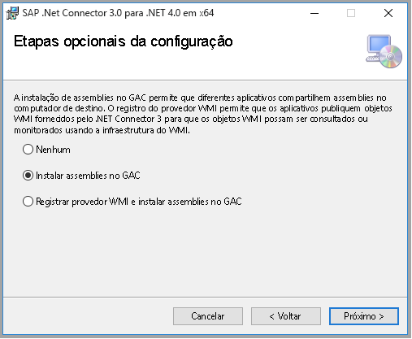

# <a name="copy-data-from-sap-business-warehouse-via-open-hub-using-azure-data-factory"></a>Copiar dados do SAP Business Warehouse via Open Hub com o Azure Data Factory

[!INCLUDE[appliesto-adf-asa-md](includes/appliesto-adf-asa-md.md)]

Este artigo descreve como usar a atividade de cópia no Azure Data Factory para copiar dados de um banco de dados SAP BW (Business Warehouse) via Open Hub. Ele amplia o artigo [Visão geral da atividade de cópia](copy-activity-overview.md) que apresenta uma visão geral da atividade de cópia.

>[!TIP]
>Para saber mais sobre o suporte geral do ADF no cenário de integração de dados do SAP, confira o [white paper Integração de dados do SAP usando o Azure Data Factory](https://github.com/Azure/Azure-DataFactory/blob/master/whitepaper/SAP%20Data%20Integration%20using%20Azure%20Data%20Factory.pdf) com introdução, comparação e diretrizes referentes a cada conector SAP.

## <a name="supported-capabilities"></a>Funcionalidades com suporte

Há suporte para esse conector do SAP Business Warehouse via Open Hub nas seguintes atividades:

- [Atividade de cópia](copy-activity-overview.md) com [matriz de fonte/coletor com suporte](copy-activity-overview.md)
- [Atividade de pesquisa](control-flow-lookup-activity.md)

Você pode copiar dados do SAP Business Warehouse via Open Hub para qualquer armazenamento de dados de coletor com suporte. Para obter uma lista de armazenamentos de dados com suporte como origens/coletores da atividade de cópia, confira a tabela [Armazenamentos de dados com suporte](copy-activity-overview.md#supported-data-stores-and-formats).

Especificamente, este conector do SAP Business Warehouse Open Hub dá suporte a:

- SAP Business Warehouse **versão 7.01 ou superior (em uma Pilha de Pacote de Suporte SAP recente lançada após o ano de 2015)** . Não há suporte para o SAP BW/4HANA nesse conector.
- Cópia de dados por meio da tabela local do Destino do Open Hub que pode ser DSO, InfoCube, MultiProvider, DataSource etc.
- À cópia de dados usando a autenticação Básica.
- Conexão com um servidor de aplicativos ou um servidor de mensagens SAP.
- Recuperação de dados via RFC.

## <a name="sap-bw-open-hub-integration"></a>Integração do SAP BW Open Hub 

O [Serviço do SAP BW Open Hub](https://wiki.scn.sap.com/wiki/display/BI/Overview+of+Open+Hub+Service) é uma maneira eficiente de extrair dados do SAP BW. O diagrama a seguir mostra um dos fluxos típicos que os clientes têm em seu sistema SAP, caso em que os dados fluem do SAP ECC -> PSA -> DSO -> Cubo.

O SAP BW OHD (Destino de Open Hub) define o destino ao qual os dados do SAP são retransmitidos. Todos os objetos compatíveis com o DTP (Processo de Transferência de Dados) do SAP podem ser usados como fontes de dados do Open Hub, por exemplo, DSO, InfoCube, DataSource etc. O tipo de Destino do Open Hub, local em que os dados retransmitidos são armazenados, podem ser tabelas de banco de dados (locais ou remotas) e arquivos simples. Esse conector do SAP BW Open Hub é compatível com copiar dados da tabela local do OHD no BW. Caso você esteja usando outros tipos, poderá conectar-se diretamente ao banco de dados ou sistema de arquivos usando outros conectores.


## <a name="delta-extraction-flow"></a>Fluxo de extração de delta

O conector do SAP BW Open Hub para ADF oferece duas propriedades opcionais, `excludeLastRequest` e `baseRequestId`, que podem ser usadas para processar a carga delta do Open Hub. 

- **excludeLastRequestId**: indica se os registros da última solicitação devem ser excluídos. O valor padrão é true. 
- **baseRequestId**: a ID da solicitação do carregamento delta. Depois que ele for definido, somente os dados com requestId maior do que o valor dessa propriedade serão recuperados. 

Em geral, a extração do SAP InfoProviders para o ADF (Azure Data Factory) consiste em duas etapas: 

1. **DTP (Processo de Transferência de Dados) do SAP BW** Esta etapa copia os dados de um SAP BW InfoProvider para uma tabela do SAP BW Open Hub 

1. **Cópia de dados do ADF** Nesta etapa, a tabela do Open Hub é lida pelo Conector do ADF 


Na primeira etapa, um DTP é executado. Cada execução cria uma ID de solicitação do SAP. A ID da solicitação é armazenada na tabela do Open Hub e é usada pelo conector do ADF para identificação do delta. As duas etapas são executadas de modo assíncrono: o DTP é disparado pelo SAP e a cópia de dados do ADF é disparada por meio do ADF. 

Por padrão, o ADF não lê o último delta da tabela do Open Hub (a opção "Excluir última solicitação" é verdadeira). Aqui, os dados no ADF não são 100% atualizados com os dados na tabela do Open Hub (o último delta está ausente). Em troca, esse procedimento garante que nenhuma linha seja perdida por causa da extração assíncrona. Isso funciona bem mesmo quando o ADF está lendo a tabela do Open Hub enquanto o DTP ainda está fazendo gravações na mesma tabela. 

Normalmente, a ID de solicitação máxima copiada na última execução pelo ADF é mantida em um armazenamento de dados de preparo (como o Blob do Azure no diagrama acima). Portanto, a mesma solicitação não é lida uma segunda vez pelo ADF na execução seguinte. Enquanto isso, observe que os dados não são excluídos automaticamente da tabela do Open Hub.

Para um tratamento de delta adequado, não é permitido ter IDs de solicitação de DTPs diferentes na mesma tabela do Open Hub. Portanto, você não deve criar mais de um DTP para cada OHD (Destino do Open Hub). Se precisar da extração completa e de delta do mesmo InfoProvider, você deverá criar dois OHDs para o mesmo InfoProvider. 

## <a name="prerequisites"></a>Pré-requisitos

Para usar esse conector do SAP Business Warehouse Open Hub, você precisa:

- Configurar um Integration Runtime auto-hospedado com versão 3.13 ou superior. Consulte o artigo [Self-hosted integration runtime](create-self-hosted-integration-runtime.md) (Integration Runtime auto-hospedado) para obter detalhes.

- Baixar a versão de **64 bits do [SAP .NET Connector 3.0](https://support.sap.com/en/product/connectors/msnet.html)** do site da SAP e instalá-la no computador de IR auto-hospedado. Ao instalar, na janela de etapas de instalação opcionais, verifique se você selecionou a opção **Instalar Assemblies no GAC** conforme mostra a imagem a seguir. 

    

- O usuário do SAP que está sendo usado no conector do Data Factory BW precisa ter as seguintes permissões: 

    - Autorização para RFC e SAP BW. 
    - Permissões para a Atividade de "Executar" do Objeto de Autorização "S_SDSAUTH".

- Criar tipo de Destino do SAP Open Hub como **Tabela de Banco de Dados** com opção "Chave Técnica" marcada.  Também é recomendável deixar a opção Excluir Dados da Tabela desmarcada, embora não seja necessário. Use o DTP (execute-o diretamente ou integre-o à cadeia de processo existente) para inserir dados do objeto de origem (como um cubo) escolhido para a tabela de destino do Open Hub.

## <a name="getting-started"></a>Introdução

> [!TIP]
>
> Para obter um passo a passo de como usar o conector do SAP BW Open Hub, confira [Carregar dados do SAP BW (Business Warehouse) usando o Azure Data Factory](load-sap-bw-data.md).

[!INCLUDE [data-factory-v2-connector-get-started](../../includes/data-factory-v2-connector-get-started.md)]

As seções a seguir apresentam detalhes sobre as propriedades usadas para definir entidades do Data Factory específicas do conector do SAP Business Warehouse Open Hub.

## <a name="linked-service-properties"></a>Propriedades do serviço vinculado

As propriedades a seguir têm suporte no serviço vinculado do SAP BW Open Hub (Business Warehouse):

| Propriedade | Descrição | Obrigatório |
|:--- |:--- |:--- |
| type | A propriedade de tipo precisa ser definida como **SapOpenHub** | Yes |
| Servidor | Nome do servidor no qual reside a instância do SAP BW. | Yes |
| systemNumber | Número de sistema do sistema SAP BW.<br/>Valor permitido: número decimal de dois dígitos representado como uma cadeia de caracteres. | Yes |
| messageServer | O nome do host do servidor de mensagens SAP.<br/>Use-o para se conectar a um servidor de mensagens SAP. | Não |
| messageServerService | O nome do serviço ou o número da porta do servidor de mensagens.<br/>Use-o para se conectar a um servidor de mensagens SAP. | Não |
| systemId | A ID do sistema SAP em que a tabela está localizada.<br/>Use-a para se conectar a um servidor de mensagens SAP. | Não |
| logonGroup | O grupo de logon para o sistema SAP.<br/>Use-o para se conectar a um servidor de mensagens SAP. | Não |
| clientId | ID de Cliente do cliente no sistema SAP W.<br/>Valor permitido: número decimal de três dígitos representado como uma cadeia de caracteres. | Yes |
| Linguagem | Idioma que o sistema SAP usa. | Não (o valor padrão é **EN**)|
| userName | Nome do usuário que tem acesso ao servidor SAP. | Sim |
| password | Senha do usuário. Marque este campo como uma SecureString para armazená-la com segurança no Data Factory ou [faça referência a um segredo armazenado no Azure Key Vault](store-credentials-in-key-vault.md). | Sim |
| connectVia | O [Integration Runtime](concepts-integration-runtime.md) a ser usado para se conectar ao armazenamento de dados. É necessário um Integration Runtime auto-hospedado, conforme mencionado nos [Pré-requisitos](#prerequisites). |Sim |

**Exemplo:**

```json
{
    "name": "SapBwOpenHubLinkedService",
    "properties": {
        "type": "SapOpenHub",
        "typeProperties": {
            "server": "<server name>",
            "systemNumber": "<system number>",
            "clientId": "<client id>",
            "userName": "<SAP user>",
            "password": {
                "type": "SecureString",
                "value": "<Password for SAP user>"
            }
        },
        "connectVia": {
            "referenceName": "<name of Integration Runtime>",
            "type": "IntegrationRuntimeReference"
        }
    }
}
```

## <a name="dataset-properties"></a>Propriedades do conjunto de dados

Para obter uma lista completa das seções e propriedades disponíveis para definir os conjuntos de dados, confira o artigo sobre [Conjuntos de Dados](concepts-datasets-linked-services.md). Esta seção fornece uma lista das propriedades compatíveis com o conjunto de dados do SAP BW Open Hub.

Para copiar dados de e para o SAP BW Open Hub, defina a propriedade type do conjunto de dados como **SapOpenHubTable**. Há suporte para as seguintes propriedades.

| Propriedade | Descrição | Obrigatório |
|:--- |:--- |:--- |
| type | A propriedade type deve ser definida como **SapOpenHubTable**.  | Yes |
| openHubDestinationName | O nome de Destino do Open Hub do qual copiar dados. | Yes |

Se você está definindo `excludeLastRequest` e `baseRequestId` no conjunto de dados, ainda há suporte para eles no estado em que se encontram, mas, de agora em diante, recomendamos usar o novo modelo na origem de atividade.

**Exemplo:**

```json
{
    "name": "SAPBWOpenHubDataset",
    "properties": {
        "type": "SapOpenHubTable",
        "typeProperties": {
            "openHubDestinationName": "<open hub destination name>"
        },
        "schema": [],
        "linkedServiceName": {
            "referenceName": "<SAP BW Open Hub linked service name>",
            "type": "LinkedServiceReference"
        }
    }
}
```

## <a name="copy-activity-properties"></a>Propriedades da atividade de cópia

Para obter uma lista completa das seções e propriedades disponíveis para definir atividades, confia o artigo [Pipelines](concepts-pipelines-activities.md). Esta seção fornece uma lista das propriedades com suporte pela fonte do SAP BW Open Hub.

### <a name="sap-bw-open-hub-as-source"></a>SAP BW Open Hub como origem

Para copiar dados do SAP BW Open Hub, há suporte para as seguintes propriedades na seção **origem** da atividade Copy:

| Propriedade | Descrição | Obrigatório |
|:--- |:--- |:--- |
| type | A propriedade **type** da origem da atividade Copy precisa ser definida como **SapOpenHubSource**. | Yes |
| excludeLastRequest | Se você deseja excluir os registros da última solicitação. | Não (o padrão é **true**) |
| baseRequestId | A ID da solicitação do carregamento delta. Depois que ele for definido, somente os dados com requestId **maior do que** o valor dessa propriedade serão recuperados.  | Não |
| customRfcReadTableFunctionModule | Um módulo de função RFC personalizado que pode ser usado para ler dados de uma tabela SAP. <br/> Use um módulo de função RFC personalizado para definir como os dados são recuperados do sistema SAP e retornados para o Data Factory. O módulo de função personalizado precisa ter uma interface implementada (importação, exportação, tabelas) semelhante a `/SAPDS/RFC_READ_TABLE2`, que é a interface padrão usada pelo Data Factory. | Não |

>[!TIP]
>Se a tabela do Open Hub contém apenas os dados gerados por ID de solicitação única, por exemplo, você sempre realiza carga completa e substitui os dados existentes na tabela ou somente executa o DTP uma vez para teste; lembre-se de desmarcar a opção "excludeLastRequest" para copiar os dados.

Para acelerar o carregamento de dados, defina [`parallelCopies`](copy-activity-performance-features.md#parallel-copy) na atividade Copy para carregar dados do SAP BW Open Hub em paralelo. Por exemplo, se você definir `parallelCopies` como quatro, o Data Factory executará simultaneamente quatro chamadas RFC, sendo que cada uma delas vai recuperar uma parte dos dados da tabela do SAP BW Open Hub particionada pelas IDs do pacote e da solicitação do DTP. Isso se aplica quando o número de IDs exclusivas de pacote e de solicitação do DTP é maior que o valor de `parallelCopies`. Ao copiar os dados para o armazenamento de dados baseado em arquivo, também recomendamos gravá-los em uma pasta como vários arquivos (apenas especifique o nome da pasta) para obter um desempenho melhor do que gravá-los em um arquivo.

**Exemplo:**

```json
"activities":[
    {
        "name": "CopyFromSAPBWOpenHub",
        "type": "Copy",
        "inputs": [
            {
                "referenceName": "<SAP BW Open Hub input dataset name>",
                "type": "DatasetReference"
            }
        ],
        "outputs": [
            {
                "referenceName": "<output dataset name>",
                "type": "DatasetReference"
            }
        ],
        "typeProperties": {
            "source": {
                "type": "SapOpenHubSource",
                "excludeLastRequest": true
            },
            "sink": {
                "type": "<sink type>"
            },
            "parallelCopies": 4
        }
    }
]
```

## <a name="data-type-mapping-for-sap-bw-open-hub"></a>Mapeamento de tipo de dados para SAP BW Open Hub

Ao copiar dados do SAP BW Open Hub, os seguintes mapeamentos são usados de tipos de dados do SAP BW para tipos de dados provisórios do Azure Data Factory. Consulte [Mapeamentos de tipo de dados e esquema](copy-activity-schema-and-type-mapping.md) para saber mais sobre como a atividade de cópia mapeia o tipo de dados e esquema de origem para o coletor.

| Tipo SAP ABAP | Tipo de dados provisório do Data Factory |
|:--- |:--- |
| C (Cadeia de caracteres) | String |
| I (inteiro) | Int32 |
| F (Flutuante) | Double |
| D (Data) | String |
| T (Hora) | String |
| P (BCD Empacotado, Moeda, Decimal, Qtd) | Decimal |
| N (Numc) | String |
| X (Binário e Bruto) | String |

## <a name="lookup-activity-properties"></a>Pesquisar propriedades de atividade

Para saber detalhes sobre as propriedades, verifique [Pesquisar atividade](control-flow-lookup-activity.md).

## <a name="troubleshooting-tips"></a>Dicas de solução de problemas

**Sintomas:** se você estiver executando o SAP BW no HANA e observar que apenas o subconjunto de dados é copiado usando a atividade Copy do ADF (1 milhão linhas), a possível causa será que você habilitou a opção "SAP HANA execução" no DTP. Nesse caso, o ADF poderá recuperar somente o primeiro lote de dados.

**Resolução:** desabilite a opção "Execução do SAP HANA" no DTP, reprocesse os dados e tente executar a atividade Copy novamente.

## <a name="next-steps"></a>Próximas etapas
Para obter uma lista de armazenamentos de dados com suporte como origens e coletores pela atividade de cópia no Azure Data Factory, consulte [Armazenamentos de dados com suporte](copy-activity-overview.md#supported-data-stores-and-formats).
