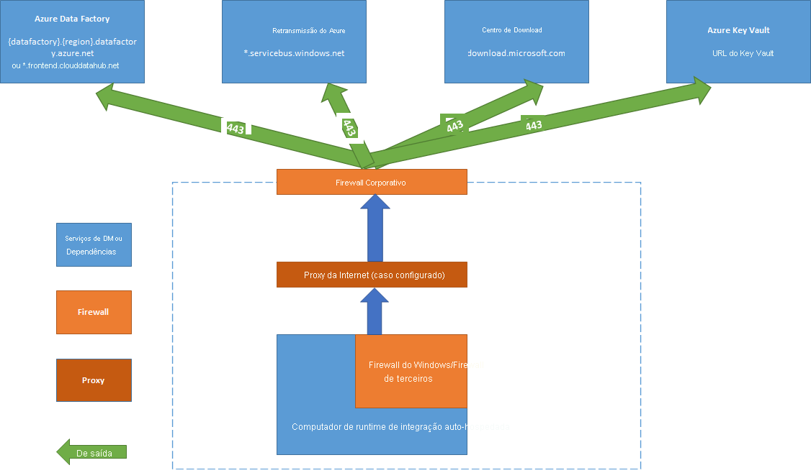

# <a name="create-and-configure-a-self-hosted-integration-runtime"></a>Criar e configurar um runtime de integração auto-hospedada

[!INCLUDE[appliesto-adf-asa-md](includes/appliesto-adf-asa-md.md)]

O IR (Integration Runtime) é a infraestrutura de computação usada pelo Azure Data Factory para fornecer funcionalidades de integração de dados entre diferentes ambientes de rede. Para obter detalhes sobre o IR, confira [Visão geral do Integration Runtime](concepts-integration-runtime.md).

Um tempo de execução de integração auto-hospedado pode executar atividades de cópia entre um armazenamento de dados de nuvem e um armazenamento de dados em uma rede privada. Ele também pode distribuir atividades de transformação em relação aos recursos de computação em uma rede local ou em uma rede virtual do Azure. A instalação de um tempo de execução de integração auto-hospedado precisa de um computador local ou de uma máquina virtual dentro de uma rede privada.  

Este artigo descreve como você pode criar e configurar um IR para hospedagem interna.

[!INCLUDE [updated-for-az](../../includes/updated-for-az.md)]

## <a name="considerations-for-using-a-self-hosted-ir"></a>Considerações para o uso de um IR auto-hospedado

- Você pode usar um único tempo de execução de integração auto-hospedado para várias fontes de dados locais. Você também pode compartilhá-lo com outro data factory no mesmo locatário do Azure Active Directory (AD do Azure). Para obter mais informações, confira [Compartilhando um runtime de integração auto-hospedada](./create-shared-self-hosted-integration-runtime-powershell.md).
- Você pode instalar apenas uma instância de um tempo de execução de integração auto-hospedado em qualquer computador único. Se você tiver duas fábricas de dados que precisam acessar fontes de dados locais, use o recurso de [compartilhamento de ir](./create-shared-self-hosted-integration-runtime-powershell.md) via hospedagem interna para compartilhar o ir auto-hospedado ou instale o ir do modo auto-hospedado em dois computadores locais, um para cada data Factory.  
- O Integration Runtime de hospedagem interna não precisa estar no mesmo computador que a fonte de dados. No entanto, ter o tempo de execução de integração auto-hospedado próximo à fonte de dados reduz o tempo para o tempo de execução de integração auto-hospedado se conectar à fonte de dados. Recomendamos que você instale o tempo de execução de integração auto-hospedado em um computador diferente daquele que hospeda a fonte de dados local. Quando o tempo de execução de integração e a fonte de dados hospedados internamente estão em computadores diferentes, o Integration Runtime não compete com a fonte de dados para recursos.
- Você pode ter vários runtimes da integração auto-hospedada em diferentes computadores conectados à mesma fonte de dados local. Por exemplo, se você tiver dois tempos de execução de integração auto-hospedados que atendem a duas data factories, a mesma fonte de dados local poderá ser registrada com ambas as fábricas de dados.
- Use um tempo de execução de integração auto-hospedado para dar suporte à integração de dados em uma rede virtual do Azure.
- Trate a fonte de dados como uma fonte de dados local protegida por um firewall mesmo quando você usar o Microsoft Azure ExpressRoute. Use o tempo de execução de integração auto-hospedado para conectar o serviço à fonte de dados.
- Use o tempo de execução de integração auto-hospedado mesmo se o armazenamento de dados estiver na nuvem em uma máquina virtual de IaaS (infraestrutura como serviço) do Azure.
- As tarefas podem falhar em um Integration Runtime de hospedagem interna que você instalou em um Windows Server para o qual a criptografia compatível com FIPS está habilitada. Para contornar esse problema, você tem duas opções: armazenar credenciais/valores secretos em um Azure Key Vault ou desabilitar a criptografia em conformidade com FIPS no servidor. Para desabilitar a criptografia compatível com FIPS, altere o valor da subchave do registro a seguir de 1 (habilitado) para 0 (desabilitado): `HKLM\System\CurrentControlSet\Control\Lsa\FIPSAlgorithmPolicy\Enabled` . Se você usar o [tempo de execução de integração auto-hospedado como um proxy para o tempo de execução de integração do SSIS](./self-hosted-integration-runtime-proxy-ssis.md), a criptografia compatível com FIPS poderá ser habilitada e será usada ao mover dados do local para o armazenamento de BLOBs do Azure como uma área de preparo.

## <a name="command-flow-and-data-flow"></a>Fluxo de comando e fluxo de dados

Quando você move dados entre o local e a nuvem, a atividade usa um tempo de execução de integração auto-hospedado para transferir os dados entre uma fonte de dados local e a nuvem.

Aqui está um resumo de alto nível das etapas de fluxo de dados para copiar com um IR auto-hospedado:


1. Um desenvolvedor de dados cria um tempo de execução de integração auto-hospedado em um data factory do Azure usando o portal do Azure ou o cmdlet do PowerShell.

2. O desenvolvedor de dados cria um serviço vinculado para um armazenamento de dados local. O desenvolvedor faz isso especificando a instância do Integration Runtime de hospedagem interna que o serviço deve usar para se conectar a armazenamentos de dados.

3. O nó do runtime de integração auto-hospedada criptografa a credencial usando a DPAPI (Interface de Programação do Aplicativo de Proteção de Dados) do Windows e salva as credenciais localmente. Se vários nós forem definidos para alta disponibilidade, as credenciais serão mais sincronizadas em outros nós. Cada nó criptografa as credenciais usando a DPAPI e as armazena localmente. A sincronização de credenciais é transparente para o desenvolvedor de dados e é tratada pelo IR auto-hospedado.

4. Azure Data Factory se comunica com o Integration Runtime de hospedagem interna para agendar e gerenciar trabalhos. A comunicação é por meio de um canal de controle que usa uma conexão de [retransmissão do Azure](../azure-relay/relay-what-is-it.md#wcf-relay) compartilhada. Quando um trabalho de atividade precisa ser executado, o Data Factory enfileira a solicitação junto com qualquer informação de credencial. Ele faz isso, caso as credenciais ainda não estejam armazenadas no tempo de execução de integração auto-hospedado. O tempo de execução de integração auto-hospedado inicia o trabalho depois de sondar a fila.

5. O Integration Runtime de hospedagem interna copia dados entre um repositório local e um armazenamento em nuvem. A direção da cópia depende de como a atividade de cópia é configurada no pipeline de dados. Para esta etapa, o Integration Runtime de hospedagem interna se comunica diretamente com serviços de armazenamento baseados em nuvem como o armazenamento de BLOBs do Azure por meio de um canal HTTPS seguro.

## <a name="prerequisites"></a>Pré-requisitos

- As versões do Windows com suporte são:
  - Windows 8.1
  - Windows 10
  - Windows Server 2012
  - Windows Server 2012 R2
  - Windows Server 2016
  - Windows Server 2019

Não há suporte para a instalação do tempo de execução de integração auto-hospedado em um controlador de domínio.

- O tempo de execução de integração auto-hospedado requer um sistema operacional de 64 bits com .NET Framework 4.7.2 ou superior. Confira [Requisitos de sistema do .NET Framework](/dotnet/framework/get-started/system-requirements) para obter detalhes.
- A configuração mínima recomendada para o computador de tempo de execução de integração auto-hospedado é um processador de 2 GHz com 4 núcleos, 8 GB de RAM e 80 GB de espaço disponível no disco rígido. Para obter detalhes sobre os requisitos do sistema, consulte [baixar](https://www.microsoft.com/download/details.aspx?id=39717).
- Se o computador host hibernar, o Integration Runtime de hospedagem interna não responderá às solicitações de dados. Configure um plano de energia adequado no computador antes de instalar o runtime de integração auto-hospedada. Se o computador estiver configurado para hibernar, o instalador do Integration Runtime auto-hospedado solicitará uma mensagem.
- Você deve ser um administrador no computador para instalar e configurar com êxito o tempo de execução de integração auto-hospedado.
- As execuções de atividade de cópia acontecem com uma frequência específica. O uso do processador e da RAM no computador segue o mesmo padrão com horários de pico e ocioso. O uso de recursos também depende muito da quantidade de dados movidos. Quando vários trabalhos de cópia estiverem em andamento, você verá o uso do recurso aumentar durante horários de pico.
- As tarefas podem falhar durante a extração de dados nos formatos parquet, ORC ou Avro. Para obter mais informações sobre parquet, consulte [parquet Format in Azure data Factory](./format-parquet.md#using-self-hosted-integration-runtime). A criação do arquivo é executada no computador de integração auto-hospedado. Para funcionar conforme o esperado, a criação do arquivo requer os seguintes pré-requisitos:
  - [Visual C++ redistribuível 2010](https://download.microsoft.com/download/3/2/2/3224B87F-CFA0-4E70-BDA3-3DE650EFEBA5/vcredist_x64.exe) Pacote (x64)
  - Java Runtime (JRE) versão 8 de um provedor de JRE, como [adotar o OpenJDK](https://adoptopenjdk.net/). Verifique se a `JAVA_HOME` variável de ambiente está definida como a pasta JRE (e não apenas a pasta JDK).

## <a name="setting-up-a-self-hosted-integration-runtime"></a>Configurando um tempo de execução de integração auto-hospedado

Para criar e configurar um tempo de execução de integração auto-hospedado, use os procedimentos a seguir.

### <a name="create-a-self-hosted-ir-via-azure-powershell"></a>Criar um IR auto-hospedado via Azure PowerShell

1. Você pode usar Azure PowerShell para esta tarefa. Veja um exemplo:

    ```powershell
    Set-AzDataFactoryV2IntegrationRuntime -ResourceGroupName $resourceGroupName -DataFactoryName $dataFactoryName -Name $selfHostedIntegrationRuntimeName -Type SelfHosted -Description "selfhosted IR description"
    ```
  
2. [Faça o download](https://www.microsoft.com/download/details.aspx?id=39717) e instale o runtime de integração auto-hospedada em um computador local.

3. Recupere a chave de autenticação e registre o runtime de integração auto-hospedada com ela. Aqui está um exemplo do PowerShell:

    ```powershell

    Get-AzDataFactoryV2IntegrationRuntimeKey -ResourceGroupName $resourceGroupName -DataFactoryName $dataFactoryName -Name $selfHostedIntegrationRuntimeName  

    ```

### <a name="create-a-self-hosted-ir-via-azure-data-factory-ui"></a>Criar um IR auto-hospedado via interface do usuário do Azure Data Factory

Use as etapas a seguir para criar um IR auto-hospedado usando Azure Data Factory interface do usuário.

1. Na página **Vamos começar** da interface do usuário do Azure Data Factory, selecione a [guia Gerenciar](./author-management-hub.md) no painel mais à esquerda.

   

1. Selecione **Runtimes de integração** no painel esquerdo e, em seguida, selecione **+ Novo**.

   

1. Na página **instalação do Integration Runtime** , selecione **Azure, auto-hospedado** e, em seguida, selecione **continuar**.

1. Na página a seguir, selecione **auto-hospedado** para criar um Self-Hosted ir e, em seguida, selecione **continuar**.
   

1. Insira um nome para o IR e selecione **criar**.

1. Na página **instalação do Integration Runtime** , selecione o link em **opção 1** para abrir a instalação expressa em seu computador. Ou siga as etapas em **opção 2** para configurar manualmente. As instruções a seguir são baseadas na configuração manual:

   

    1. Copie e cole a chave de autenticação. Selecione **baixar e instalar o Integration Runtime**.

    1. Baixe o runtime de integração auto-hospedada em uma máquina local do Windows. Execute o instalador.

    1. Na página **registrar Integration Runtime (auto-hospedado)** , Cole a chave que você salvou anteriormente e selecione **registrar**.

       

    1. Na página **Novo nó do Integration Runtime (auto-hospedado)** , selecione **Concluir**.

1. Depois que o tempo de execução de integração auto-hospedado for registrado com êxito, você verá a seguinte janela:

    

### <a name="set-up-a-self-hosted-ir-on-an-azure-vm-via-an-azure-resource-manager-template"></a>Configurar um IR auto-hospedado em uma VM do Azure por meio de um modelo de Azure Resource Manager

Você pode automatizar a configuração de IR auto-hospedada em uma máquina virtual do Azure usando o [modelo de ir para criar autohost](https://github.com/Azure/azure-quickstart-templates/tree/master/101-vms-with-selfhost-integration-runtime). O modelo fornece uma maneira fácil de ter um IR totalmente funcional para hospedagem interna em uma rede virtual do Azure. O IR tem recursos de alta disponibilidade e escalabilidade, desde que você defina a contagem de nós como 2 ou superior.

### <a name="set-up-an-existing-self-hosted-ir-via-local-powershell"></a>Configurar um IR para hospedagem interna existente via PowerShell local

Você pode usar uma linha de comando para configurar ou gerenciar um IR autônomo existente. Esse uso pode ajudar especialmente a automatizar a instalação e o registro de nós IR hospedados internamente.

Dmgcmd.exe está incluído no instalador auto-hospedado. Ele está localizado normalmente na pasta C:\Program Files\Microsoft Integration Runtime\4.0\Shared\. Esse aplicativo dá suporte a vários parâmetros e pode ser invocado por meio de uma linha de comando usando scripts em lotes para automação.

Use o aplicativo da seguinte maneira:

```powershell
dmgcmd ACTION args...
```

Aqui estão os detalhes das ações e dos argumentos do aplicativo: 

|ACTION|args|Descrição|
|------|----|-----------|
|`-rn`,<br/>`-RegisterNewNode`|"`<AuthenticationKey>`" ["`<NodeName>`"]|Registre um nó de tempo de execução de integração auto-hospedado com a chave de autenticação especificada e o nome do nó.|
|`-era`,<br/>`-EnableRemoteAccess`|"`<port>`" ["`<thumbprint>`"]|Habilite o acesso remoto no nó atual para configurar um cluster de alta disponibilidade. Ou habilite as credenciais de configuração diretamente no IR de hospedagem interna sem passar pelo Azure Data Factory. Você faz o último usando o cmdlet **New-AzDataFactoryV2LinkedServiceEncryptedCredential** de um computador remoto na mesma rede.|
|`-erac`,<br/>`-EnableRemoteAccessInContainer`|"`<port>`" ["`<thumbprint>`"]|Habilite o acesso remoto ao nó atual quando o nó for executado em um contêiner.|
|`-dra`,<br/>`-DisableRemoteAccess`||Desabilite o acesso remoto ao nó atual. O acesso remoto é necessário para a instalação de vários nós. O cmdlet do PowerShell **New-AzDataFactoryV2LinkedServiceEncryptedCredential** ainda funciona mesmo quando o acesso remoto está desabilitado. Esse comportamento é verdadeiro, desde que o cmdlet seja executado no mesmo computador que o nó IR auto-hospedado.|
|`-k`,<br/>`-Key`|"`<AuthenticationKey>`"|Substituir ou atualizar a chave de autenticação anterior. Tenha cuidado com essa ação. O nó IR auto-hospedado anterior pode ficar offline se a chave for de um tempo de execução de integração novo.|
|`-gbf`,<br/>`-GenerateBackupFile`|"`<filePath>`" "`<password>`"|Gere um arquivo de backup para o nó atual. O arquivo de backup inclui a chave do nó e as credenciais do armazenamento de dados.|
|`-ibf`,<br/>`-ImportBackupFile`|"`<filePath>`" "`<password>`"|Restaure o nó de um arquivo de backup.|
|`-r`,<br/>`-Restart`||Reinicie o serviço de host do Integration Runtime auto-hospedado.|
|`-s`,<br/>`-Start`||Inicie o serviço de host do Integration Runtime auto-hospedado.|
|`-t`,<br/>`-Stop`||Pare o serviço de host do Integration Runtime auto-hospedado.|
|`-sus`,<br/>`-StartUpgradeService`||Inicie o serviço de atualização do Integration Runtime de hospedagem interna.|
|`-tus`,<br/>`-StopUpgradeService`||Pare o serviço de atualização do Integration Runtime de hospedagem interna.|
|`-tonau`,<br/>`-TurnOnAutoUpdate`||Ative a atualização automática do Integration Runtime de hospedagem interna.|
|`-toffau`,<br/>`-TurnOffAutoUpdate`||Desative a atualização automática do Integration Runtime de hospedagem interna.|
|`-ssa`,<br/>`-SwitchServiceAccount`|"`<domain\user>`" ["`<password>`"]|Defina DIAHostService para executar como uma nova conta. Use a senha vazia "" para contas de sistema e contas virtuais.|

## <a name="install-and-register-a-self-hosted-ir-from-microsoft-download-center"></a>Instalar e registrar um IR auto-hospedado do centro de download da Microsoft

1. Acesse a [página de downloads do Microsoft Integration Runtime](https://www.microsoft.com/download/details.aspx?id=39717).
2. Selecione **baixar**, selecione a versão de 64 bits e selecione **Avançar**. Não há suporte para a versão de 32 bits.
3. Execute o arquivo de identidade gerenciado diretamente ou salve-o em seu disco rígido e execute-o.
4. Na janela de **boas-vindas** , selecione um idioma e selecione **Avançar**.
5. Aceite os Termos de Licença para Software Microsoft e selecione **Avançar**.
6. Selecione **pasta** para instalar o runtime de integração auto-hospedada e selecione **Avançar**.
7. Na página **pronto para instalar** , selecione **instalar**.
8. Selecione **concluir** para concluir a instalação.
9. Obtenha a chave de autenticação usando o PowerShell. Aqui há um exemplo do PowerShell para recuperar a chave de autenticação:

    ```powershell
    Get-AzDataFactoryV2IntegrationRuntimeKey -ResourceGroupName $resourceGroupName -DataFactoryName $dataFactoryName -Name $selfHostedIntegrationRuntime
    ```

10. Na janela **registrar Integration Runtime (auto-hospedado)** do Microsoft Integration Runtime Configuration Manager em execução em seu computador, execute as seguintes etapas:

    1. Cole a chave de autenticação na área de texto.

    2. Opcionalmente, selecione **Mostrar chave de autenticação** para ver o texto da chave.

    3. Selecione **Registrar**.

## <a name="service-account-for-self-hosted-integration-runtime"></a>Conta de serviço para o tempo de execução de integração auto-hospedado

A conta de serviço de logon padrão do tempo de execução de integração auto-hospedado é **NT SERVICE\DIAHostService**. Você pode vê-lo em **Serviços-> Integration Runtime > Propriedades do serviço-> logon**.


Verifique se a conta tem a permissão de fazer logon como um serviço. Caso contrário, o tempo de execução de integração auto-hospedado não pode ser iniciado com êxito. Você pode verificar a permissão em **diretiva de segurança local – configurações de segurança de >-> políticas locais-> atribuição de direitos de usuário-> fazer logon como um serviço**


## <a name="notification-area-icons-and-notifications"></a>Ícones e notificações da área de notificação

Se você mover o cursor sobre o ícone ou a mensagem na área de notificação, poderá ver detalhes sobre o estado do tempo de execução de integração auto-hospedado.


## <a name="high-availability-and-scalability"></a>Alta disponibilidade e escalabilidade

Você pode associar um Integration Runtime de hospedagem interna a vários computadores locais ou máquinas virtuais no Azure. Esses computadores são chamados de nós. Você pode ter até quatro nós associados a um runtime de integração auto-hospedada. Os benefícios de ter vários nós em computadores locais que têm um gateway instalado para um gateway lógico são:

- Maior disponibilidade do tempo de execução de integração auto-hospedado para que ele não seja mais o ponto único de falha em sua solução de Big Data ou integração de dados de nuvem com Data Factory. Essa disponibilidade ajuda a garantir a continuidade quando você usa até quatro nós.
- Desempenho e taxa de transferência aprimorados durante a movimentação de dados entre os armazenamentos de dados de nuvem e locais. Obtenha mais informações sobre [comparações de desempenho](copy-activity-performance.md).

Você pode associar vários nós instalando o software de tempo de execução de integração auto-hospedado do [centro de download](https://www.microsoft.com/download/details.aspx?id=39717). Em seguida, registre-o usando qualquer uma das chaves de autenticação que foram obtidas do cmdlet **New-AzDataFactoryV2IntegrationRuntimeKey** , conforme descrito no [tutorial](tutorial-hybrid-copy-powershell.md).

> [!NOTE]
> Você não precisa criar um novo tempo de execução de integração auto-hospedado para associar cada nó. Você pode instalar o runtime de integração auto-hospedada em outro computador e registrá-lo usando a mesma chave de autenticação.

> [!NOTE]
> Antes de adicionar outro nó para alta disponibilidade e escalabilidade, verifique se a opção **acesso remoto à intranet** está habilitada no primeiro nó. Para fazer isso, selecione **Microsoft Integration Runtime Configuration Manager**  >  **configurações**  >  **acesso remoto à intranet**.

### <a name="scale-considerations"></a>Considerações de escala

#### <a name="scale-out"></a>Escalar horizontalmente

Quando o uso do processador é alto e a memória disponível está baixa no IR de hospedagem interna, adicione um novo nó para ajudar a escalar horizontalmente a carga entre os computadores. Se as atividades falharem porque expirarem ou o nó IR do auto-hospedado estiver offline, ele ajudará se você adicionar um nó ao gateway.

#### <a name="scale-up"></a>Escalar verticalmente

Quando o processador e a RAM disponível não são bem utilizados, mas a execução de trabalhos simultâneos atinge os limites de um nó, aumenta aumentando o número de trabalhos simultâneos que um nó pode executar. Você também pode querer escalar verticalmente quando as atividades atingirem o tempo limite, pois o IR hospedado automaticamente está sobrecarregado. Conforme mostrado na imagem a seguir, você pode aumentar a capacidade máxima de um nó:  


### <a name="tlsssl-certificate-requirements"></a>Requisitos de certificado TLS/SSL

Aqui estão os requisitos para o certificado TLS/SSL que você usa para proteger a comunicação entre os nós do tempo de execução de integração:

- O certificado deve ser um certificado X509 v3 publicamente confiável. Recomendamos que você use certificados emitidos por uma autoridade de certificação (CA) de parceiro público.
- Cada nó do runtime de integração deve confiar nesse certificado.
- Não recomendamos certificados de SAN (nome alternativo da entidade) porque apenas o último item de SAN é usado. Todos os outros itens de SAN são ignorados. Por exemplo, se você tiver um certificado de SAN cujas SANs são **Node1.domain.contoso.com** e **NODE2.domain.contoso.com**, você poderá usar esse certificado somente em um computador cujo FQDN (nome de domínio totalmente qualificado) seja **NODE2.domain.contoso.com**.
- O certificado pode usar qualquer tamanho de chave suportado pelo Windows Server 2012 R2 para certificados TLS/SSL.
- Não há suporte para certificados que usam chaves CNG.  

> [!NOTE]
> Este certificado é usado:
>
> - Para criptografar portas em um nó IR de hospedagem interna.
> - Para a comunicação de nó para nó para sincronização de estado, que inclui a sincronização de credenciais de serviços vinculados entre nós.
> - Quando um cmdlet do PowerShell é usado para configurações de credencial de serviço vinculado de dentro de uma rede local.
>
> Sugerimos que você use esse certificado se o seu ambiente de rede privada não for seguro ou se você quiser proteger a comunicação entre os nós em sua rede privada.
>
> A movimentação de dados em trânsito de um IR autohospedado para outros armazenamentos de dados sempre acontece dentro de um canal criptografado, independentemente de o certificado ser ou não definido.

## <a name="proxy-server-considerations"></a>Considerações do servidor proxy

Se o ambiente de rede corporativo usar um servidor proxy para acessar a Internet, configure o runtime de integração auto-hospedada para usar as definições de proxy apropriadas. Você pode definir o proxy durante a fase de registro inicial.


Quando configurado, o Integration Runtime de hospedagem interna usa o servidor proxy para se conectar à origem e ao destino do serviço de nuvem (que usam o protocolo HTTP ou HTTPS). É por isso que você seleciona **Alterar link** durante a configuração inicial.


Há três opções de configuração:

- Não **usar proxy**: o Integration Runtime de hospedagem interna não usa explicitamente nenhum proxy para se conectar aos serviços de nuvem.
- **Usar o proxy do sistema**: o Integration Runtime de hospedagem interna usa a configuração de proxy configurada em diahost.exe.config e diawp.exe.config. Se esses arquivos não especificarem nenhuma configuração de proxy, o Integration Runtime de hospedagem interna se conectará ao serviço de nuvem diretamente sem passar por um proxy.
- **Usar proxy personalizado**: defina a configuração de proxy http a ser usada para o tempo de execução de integração auto-hospedado, em vez de usar as configurações em diahost.exe.config e diawp.exe.config. Os valores de **endereço** e **porta** são necessários. Os valores de **nome de usuário** e **senha** são opcionais, dependendo da configuração de autenticação do proxy. Todas as configurações são criptografadas com a DPAPI do Windows no Integration Runtime auto-hospedado e armazenados localmente no computador.

O serviço de host do Integration Runtime é reiniciado automaticamente depois que você salva as configurações de proxy atualizadas.

Depois de registrar o tempo de execução de integração auto-hospedado, se você quiser exibir ou atualizar as configurações de proxy, use Microsoft Integration Runtime Configuration Manager.

1. Abra o **Configuration Manager do Microsoft Integration Runtime**.
1. Selecione a guia **Settings** (Configurações).
1. Em **proxy http**, selecione o link **alterar** para abrir a caixa de diálogo **Definir proxy http** .
1. Selecione **Avançar**. Em seguida, você verá um aviso que solicita sua permissão para salvar a configuração de proxy e reiniciar o serviço de host do Integration Runtime.

Você pode usar a ferramenta Configuration Manager para exibir e atualizar o proxy HTTP.


> [!NOTE]
> Se você configurar um servidor proxy com autenticação NTLM, o serviço de host do Integration Runtime será executado na conta de domínio. Se posteriormente você alterar a senha para a conta de domínio, lembre-se de atualizar as definições de configuração para o serviço e reiniciar o serviço. Devido a esse requisito, sugerimos que você acesse o servidor proxy usando uma conta de domínio dedicada que não exige que você atualize a senha com frequência.

### <a name="configure-proxy-server-settings"></a>Definir configurações do servidor proxy

Se você selecionar a opção **usar proxy do sistema** para o proxy http, o tempo de execução de integração auto-hospedado usará as configurações de proxy no diahost.exe.config e diawp.exe.config. Quando esses arquivos não especificam nenhum proxy, o Integration Runtime de hospedagem interna se conecta diretamente ao serviço de nuvem sem passar por um proxy. O procedimento a seguir fornece instruções para atualizar o arquivo diahost.exe.config:

1. No explorador de arquivos, faça uma cópia segura de C:\Program Files\Microsoft Integration Runtime\4.0\Shared\diahost.exe.config como um backup do arquivo original.
1. Abra o bloco de notas em execução como administrador.
1. No bloco de notas, abra o arquivo de texto C:\Program Files\Microsoft Integration Runtime\4.0\Shared\diahost.exe.config.
1. Localize a marca **System.net** padrão, conforme mostrado no código a seguir:

    ```xml
    <system.net>
        <defaultProxy useDefaultCredentials="true" />
    </system.net>
    ```

    Em seguida, você pode adicionar detalhes do servidor proxy, conforme mostrado no exemplo a seguir:

    ```xml
    <system.net>
        <defaultProxy enabled="true">
              <proxy bypassonlocal="true" proxyaddress="http://proxy.domain.org:8888/" />
        </defaultProxy>
    </system.net>
    ```

    A marca proxy permite que propriedades adicionais especifiquem as configurações necessárias, como `scriptLocation` . Consulte [ \<proxy\> elemento (configurações de rede)](/dotnet/framework/configure-apps/file-schema/network/proxy-element-network-settings) para obter a sintaxe.

    ```xml
    <proxy autoDetect="true|false|unspecified" bypassonlocal="true|false|unspecified" proxyaddress="uriString" scriptLocation="uriString" usesystemdefault="true|false|unspecified "/>
    ```

1. Salve o arquivo de configuração em seu local original. Em seguida, reinicie o serviço de host do Integration Runtime de hospedagem interna, que pega as alterações.

   Para reiniciar o serviço, use o miniaplicativo serviços no painel de controle. Ou, no Configuration Manager do Integration Runtime, selecione o botão **Interromper serviço** e, depois, selecione **Iniciar serviço**.

   Se o serviço não for iniciado, provavelmente você adicionou a sintaxe de marca XML incorreta no arquivo de configuração de aplicativo que você editou.

> [!IMPORTANT]
> Não se esqueça de atualizar diahost.exe.config e diawp.exe.config.

Você também precisa ter certeza de que Microsoft Azure está na lista de permissões da sua empresa. Você pode baixar a lista de endereços IP válidos do Azure no [centro de download da Microsoft](https://www.microsoft.com/download/details.aspx?id=41653).

### <a name="possible-symptoms-for-issues-related-to-the-firewall-and-proxy-server"></a>Possíveis sintomas para problemas relacionados ao firewall e ao servidor proxy

Se você vir mensagens de erro como as seguintes, a razão provável é a configuração incorreta do firewall ou do servidor proxy. Essa configuração impede que o tempo de execução de integração auto-hospedado se conecte a Data Factory para se autenticar. Para garantir que seu firewall e servidor proxy estejam configurados corretamente, confira a seção anterior.

- Ao tentar registrar o tempo de execução de integração auto-hospedado, você recebe a seguinte mensagem de erro: "falha ao registrar este Integration Runtime nó! Confirme se a chave de autenticação é válida e se o serviço de host do serviço de integração está em execução neste computador. "
- Ao abrir o Configuration Manager do Integration Runtime, você vê o status **Desconectado** ou **Conectando**. Ao exibir logs de eventos do Windows, em **Visualizador de eventos**  >  **logs de aplicativos e serviços**  >  **Microsoft Integration Runtime**, você verá mensagens de erro como esta:

  ```output
  Unable to connect to the remote server
  A component of Integration Runtime has become unresponsive and restarts automatically. Component name: Integration Runtime (Self-hosted).
  ```

### <a name="enable-remote-access-from-an-intranet"></a>Habilitar o acesso remoto de uma intranet

Se você usar o PowerShell para criptografar credenciais de um computador em rede que não seja onde você instalou o tempo de execução de integração auto-hospedado, poderá habilitar a opção **acesso remoto da intranet** . Se você executar o PowerShell para criptografar credenciais no computador em que você instalou o Integration Runtime de hospedagem interna, não será possível habilitar o **acesso remoto da intranet**.

Habilite o **acesso remoto da intranet** antes de adicionar outro nó para alta disponibilidade e escalabilidade.  

Quando você executa a instalação do tempo de execução de integração autohospedado versão 3,3 ou posterior, por padrão, o instalador do Integration Runtime auto-hospedado desabilita o **acesso remoto da intranet** no computador do Integration Runtime de hospedagem interna.

Ao usar um firewall de um parceiro ou de outras pessoas, você pode abrir manualmente a porta 8060 ou a porta configurada pelo usuário. Se você tiver um problema de firewall durante a configuração do tempo de execução de integração auto-hospedado, use o seguinte comando para instalar o tempo de execução de integração auto-hospedado sem configurar o firewall:

```cmd
msiexec /q /i IntegrationRuntime.msi NOFIREWALL=1
```

Se você optar por não abrir a porta 8060 no computador do Integration Runtime de hospedagem interna, use mecanismos diferentes do aplicativo de credenciais de configuração para configurar as credenciais do armazenamento de dados. Por exemplo, você pode usar o cmdlet do PowerShell **New-AzDataFactoryV2LinkedServiceEncryptCredential** .

## <a name="ports-and-firewalls"></a>Portas e firewalls

Há dois firewalls a serem considerados:

- O *firewall corporativo* que é executado no roteador central da organização
- O *Firewall do Windows* configurado como um daemon no computador local onde o tempo de execução de integração auto-hospedado está instalado



No nível do firewall corporativo, é necessário configurar os seguintes domínios e portas de saída:

[!INCLUDE [domain-and-outbound-port-requirements](./includes/domain-and-outbound-port-requirements-internal.md)]

No nível do firewall do Windows ou do computador, essas portas de saída são normalmente habilitadas. Se não forem, você poderá configurar os domínios e as portas em um computador do Integration Runtime de hospedagem interna.

> [!NOTE]
> Como atualmente a retransmissão do Azure não dá suporte à marca de serviço, você precisa usar a marca de serviço **AzureCloud** ou **Internet** em regras de NSG para a comunicação com a retransmissão do Azure.
> Para a comunicação com Azure Data Factory, você pode usar a marca de serviço **DataFactoryManagement** na configuração da regra NSG.

Com base na fonte e nos coletores, talvez seja necessário permitir domínios adicionais e portas de saída no firewall corporativo ou no firewall do Windows.

[!INCLUDE [domain-and-outbound-port-requirements](./includes/domain-and-outbound-port-requirements-external.md)]

Para alguns bancos de dados de nuvem, como o banco de dados SQL do Azure e Azure Data Lake, talvez seja necessário permitir endereços IP de máquinas do Integration Runtime de hospedagem interna em sua configuração de firewall.

### <a name="get-url-of-azure-relay"></a>Obter URL da retransmissão do Azure

Um domínio e uma porta necessários que precisam ser colocados na lista de permissões do firewall são para a comunicação com a retransmissão do Azure. O Integration Runtime de hospedagem interna o utiliza para criação interativa, como conexão de teste, pesquisa de lista de pastas e lista de tabelas, obter esquema e Visualizar dados. Se você não quiser permitir **. ServiceBus.Windows.net** e quiser ter URLs mais específicas, poderá ver todos os FQDNs exigidos pelo seu tempo de execução de integração auto-hospedado no portal do ADF. Siga estas etapas:

1. Acesse o portal do ADF e selecione seu Integration Runtime de hospedagem interna.
2. Na página Editar, selecione **nós**.
3. Selecione **exibir URLs de serviço** para obter todos os FQDNs.

   

4. Você pode adicionar esses FQDNs na lista de permissões de regras de firewall.

### <a name="copy-data-from-a-source-to-a-sink"></a>Copiar dados de uma origem para um coletor

Verifique se você habilitou corretamente as regras de firewall no firewall corporativo, o Firewall do Windows do computador de tempo de execução de integração auto-hospedado e o próprio repositório de dados. Habilitar essas regras permite que o tempo de execução de integração auto-hospedado se conecte com êxito à origem e ao coletor. Habilite as regras para cada repositório de dados que esteja envolvido na operação de cópia.

Por exemplo, para copiar de um armazenamento de dados local para um coletor de banco de dados SQL ou um coletor do Azure Synapse Analytics, execute as seguintes etapas:

1. Permita a comunicação TCP de saída na porta 1433 para o Firewall do Windows e o firewall corporativo.
2. Defina as configurações de firewall do banco de dados SQL para adicionar o endereço IP do computador de tempo de execução de integração auto-hospedado à lista de endereços IP permitidos.

> [!NOTE]
> Se o firewall não permitir a porta de saída 1433, o Integration Runtime de hospedagem interna não poderá acessar o banco de dados SQL diretamente. Nesse caso, você pode usar uma [cópia em etapas](copy-activity-performance.md) para o banco de dados SQL e o Azure Synapse Analytics. Nesse cenário, você precisa apenas de HTTPS (porta 443) para a movimentação de dados.

## <a name="installation-best-practices"></a>Melhores práticas de instalação

Você pode instalar o Integration Runtime de hospedagem interna baixando um pacote de instalação de identidade gerenciada do [centro de download da Microsoft](https://www.microsoft.com/download/details.aspx?id=39717). Consulte o artigo [mover dados entre o local e a nuvem](tutorial-hybrid-copy-powershell.md) para obter instruções passo a passo.

- Configure um plano de energia no computador host para o tempo de execução de integração auto-hospedado para que o computador não hiberne. Se o computador host hibernar, o runtime de integração auto-hospedada ficará offline.
- Faça backup regularmente das credenciais associadas ao tempo de execução de integração auto-hospedado.
- Para automatizar as operações de configuração de IR auto-hospedadas, consulte [configurar um ir de hospedagem interna existente por meio do PowerShell](#setting-up-a-self-hosted-integration-runtime).

## <a name="next-steps"></a>Próximas etapas

Para obter as instruções passo a passo, consulte [tutorial: copiar dados locais para a nuvem](tutorial-hybrid-copy-powershell.md).
