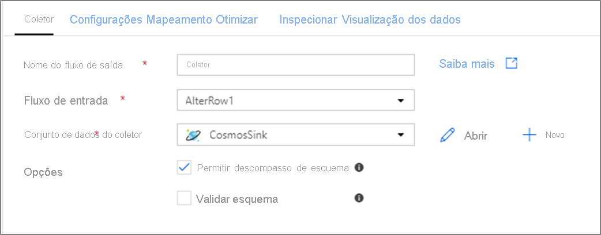

# Transformação do coletor no fluxo de dados de mapeamento

[!INCLUDE[appliesto-adf-asa-md](includes/appliesto-adf-asa-md.md)]

Depois de terminar de transformar seus dados, grave-os em um repositório de destino usando a transformação coletor. Cada fluxo de dados requer pelo menos uma transformação de coletor, mas você pode gravar tantos coletores quantos forem necessários para concluir o fluxo de transformação. Para gravar em coletores adicionais, crie novos fluxos por meio de novas ramificações e divisões condicionais.

Cada transformação de coletor é associada a exatamente um objeto de conjunto de Azure Data Factory ou serviço vinculado. A transformação do coletor determina a forma e o local dos dados que você deseja gravar.

## Conjuntos de valores embutidos

Ao criar uma transformação do coletor, escolha se as informações do coletor estão definidas dentro de um objeto de conjunto de dados ou na transformação do coletor. A maioria dos formatos está disponível somente em um ou outro. Para saber como usar um conector específico, consulte o documento do conector apropriado.

Quando há suporte para um formato tanto para dentro quanto para um objeto DataSet, há benefícios para ambos. Os objetos DataSet são entidades reutilizáveis que podem ser usadas em outros fluxos de dados e atividades como Copy. Essas entidades reutilizáveis são especialmente úteis quando você usa um esquema protegido. Conjuntos de valores não são baseados no Spark. Ocasionalmente, talvez seja necessário substituir certas configurações ou projeção de esquema na transformação do coletor.

Os conjuntos de linhas embutidos são recomendados quando você usa esquemas flexíveis, instâncias de coletor one-off ou coletores com parâmetros. Se o seu coletor for muito parametrizado, conjuntos de fontes embutidos permitem que você não crie um objeto "fictício". Os conjuntos de dados embutidos são baseados no Spark, e suas propriedades são nativas ao Flow.

Para usar um conjunto de linhas embutido, selecione o formato desejado no seletor de **tipo de coletor** . Em vez de selecionar um conjunto de um banco de uma coletor, você seleciona o serviço vinculado ao qual deseja se conectar.

##   Tipos de coletor com suporte

O mapeamento de fluxo de dados segue uma abordagem ELT (extração, carregamento e transformação) e funciona com conjuntos de dados de *preparo* que estão todos no Azure. No momento, os seguintes conjuntos de valores podem ser usados em uma transformação de origem.

| Connector | Formato | Conjunto de linhas/embutido |
| --------- | ------ | -------------- |
| [Armazenamento de Blobs do Azure](connector-azure-blob-storage.md#mapping-data-flow-properties) | [Avro](format-avro.md#mapping-data-flow-properties)  [Texto delimitado](format-delimited-text.md#mapping-data-flow-properties)  [Trifásico](format-delta.md)  [JSON](format-json.md#mapping-data-flow-properties)  [ORC](format-orc.md#mapping-data-flow-properties) [Parquet](format-parquet.md#mapping-data-flow-properties) | ✓/-  ✓/-  -/✓  ✓/-  ✓/✓ ✓/- |
| [Azure Cosmos DB (API do SQL)](connector-azure-cosmos-db.md#mapping-data-flow-properties) | | ✓/- |
| [Azure Data Lake Storage Gen1](connector-azure-data-lake-store.md#mapping-data-flow-properties) | [Avro](format-avro.md#mapping-data-flow-properties)  [Texto delimitado](format-delimited-text.md#mapping-data-flow-properties)  [JSON](format-json.md#mapping-data-flow-properties)  [ORC](format-orc.md#mapping-data-flow-properties) [Parquet](format-parquet.md#mapping-data-flow-properties) | ✓/-  ✓/-  ✓/-  ✓/✓ ✓/- |
| [Azure Data Lake Storage Gen2](connector-azure-data-lake-storage.md#mapping-data-flow-properties) | [Avro](format-avro.md#mapping-data-flow-properties)  [Common Data Service](format-common-data-model.md#sink-properties) [Texto delimitado](format-delimited-text.md#mapping-data-flow-properties)  [Trifásico](format-delta.md)  [JSON](format-json.md#mapping-data-flow-properties)  [ORC](format-orc.md#mapping-data-flow-properties) [Parquet](format-parquet.md#mapping-data-flow-properties) | ✓/-  -/✓  ✓/-  -/✓  ✓/- ✓/✓  ✓/- |
| [Banco de Dados do Azure para PostgreSQL](connector-azure-database-for-postgresql.md) |  | ✓/✓ |
| [Banco de Dados SQL do Azure](connector-azure-sql-database.md#mapping-data-flow-properties) | | ✓/- |
| [Instância Gerenciada do SQL do Azure (versão prévia)](connector-azure-sql-managed-instance.md#mapping-data-flow-properties) | | ✓/- |
| [Azure Synapse Analytics](connector-azure-sql-data-warehouse.md#mapping-data-flow-properties) | | ✓/- |
| [Snowflake](connector-snowflake.md) | | ✓/✓ |

As configurações específicas para esses conectores estão localizadas na guia **configurações** . Exemplos de script de fluxo de dados e informações nessas configurações estão localizados na documentação do conector.

Azure Data Factory tem acesso a mais de [90 conectores nativos](connector-overview.md). Para gravar dados para essas outras fontes do fluxo de dados, use a atividade de cópia para carregar esses dados de um coletor com suporte.

## Configurações do coletor

Depois de adicionar um coletor, configure por meio da guia **coletor** . Aqui, você pode escolher ou criar o conjunto de um no qual seu coletor grava. Os valores de desenvolvimento para parâmetros de conjunto de um podem ser definidos nas [configurações de depuração](concepts-data-flow-debug-mode.md). (O modo de depuração deve estar ativado.)

O vídeo a seguir explica várias opções de coletor diferentes para tipos de arquivo delimitados por texto.

> [!VIDEO https://www.microsoft.com/videoplayer/embed/RE4tf7T]

**Descompasso de esquema**: a [descompasso de esquema](concepts-data-flow-schema-drift.md) é a capacidade de data Factory de lidar nativamente com esquemas flexíveis em seus fluxos de dados sem a necessidade de definir explicitamente as alterações de coluna. Habilite **permitir descompasso de esquemas** para gravar colunas adicionais sobre o que está definido no esquema de dados do coletor.

**Validar esquema**: se validar esquema for selecionado, o fluxo de dados falhará se qualquer coluna do esquema de origem de entrada não for encontrada na projeção de origem ou se os tipos de dados não corresponderem. Use essa configuração para impor que os dados de origem atendam ao contrato de sua projeção definida. É útil em cenários de origem de banco de dados para sinalizar que os nomes ou tipos de coluna foram alterados.

## Coletor de cache

> [!VIDEO https://www.microsoft.com/en-us/videoplayer/embed/RE4HKt1]

Um *coletor de cache* é quando um fluxo de dados grava dados no cache do Spark em vez de em um repositório de dados. No mapeamento de fluxos de dados, você pode fazer referência a esses dados dentro do mesmo fluxo muitas vezes usando uma *pesquisa de cache*. Isso é útil quando você deseja fazer referência a dados como parte de uma expressão, mas não deseja unir explicitamente as colunas a ela. Exemplos comuns em que um coletor de cache pode ajudar a pesquisar um valor máximo em um armazenamento de dados e os códigos de erro correspondentes a um banco de dado de mensagens de erro. 

Para gravar em um coletor de cache, adicione uma transformação de coletor e selecione **cache** como o tipo de coletor. Ao contrário de outros tipos de coletor, você não precisa selecionar um conjunto de um DataSet ou um serviço vinculado porque não está gravando em um repositório externo. 

Nas configurações do coletor, você pode opcionalmente especificar as colunas de chave do coletor de cache. Elas são usadas como condições de correspondência ao usar a `lookup()` função em uma pesquisa de cache. Se você especificar colunas de chave, não poderá usar a `outputs()` função em uma pesquisa de cache. Para saber mais sobre a sintaxe de pesquisa de cache, consulte [pesquisas em cache](concepts-data-flow-expression-builder.md#cached-lookup).

Por exemplo, se eu especificar uma única coluna de chave de `column1` em um coletor de cache chamado `cacheExample` , `cacheExample#lookup()` a chamada teria um parâmetro que especifica qual linha no coletor de cache deve corresponder. A função gera uma única coluna complexa com Subcolunas para cada coluna mapeada.

> [!NOTE]
> Um coletor de cache deve estar em um fluxo de dados completamente independente de qualquer transformação que faça referência a ele por meio de uma pesquisa de cache. Um coletor de cache também deve ter o primeiro coletor gravado. 

## Mapeamento de campo

Semelhante a uma transformação selecionar, na guia **mapeamento** do coletor, você pode decidir quais colunas de entrada serão gravadas. Por padrão, todas as colunas de entrada, incluindo colunas descompassos, são mapeadas. Esse comportamento é conhecido como *automapeamento*.

Quando você desativa o mapeamento, pode adicionar mapeamentos fixos baseados em colunas ou mapeamentos baseados em regras. Com mapeamentos baseados em regras, você pode escrever expressões com correspondência de padrões. Mapeamento fixo mapeia nomes de coluna lógicos e físicos. Para obter mais informações sobre mapeamento baseado em regras, consulte [padrões de coluna no fluxo de dados de mapeamento](concepts-data-flow-column-pattern.md#rule-based-mapping-in-select-and-sink).

## Ordenação de coletor personalizado

Por padrão, os dados são gravados em vários coletores em uma ordem não determinística. O mecanismo de execução grava dados em paralelo, pois a lógica de transformação é concluída e a ordenação do coletor pode variar cada execução. Para especificar uma ordenação exata do coletor, habilite a **ordenação personalizada do coletor** na guia **geral** do fluxo de dados. Quando habilitado, os coletores são gravados sequencialmente em ordem crescente.

> [!NOTE]
> Ao utilizar [pesquisas armazenadas em cache](./concepts-data-flow-expression-builder.md#cached-lookup), certifique-se de que sua ordenação de coletor tenha os coletores em cache definidos como 1, o mais baixo (ou primeiro) na ordenação.

### Grupos de coletor

Você pode agrupar coletores aplicando o mesmo número de ordem para uma série de coletores. O ADF tratará esses coletores como grupos que podem ser executados em paralelo. As opções para execução paralela surgirão na atividade fluxo de dados do pipeline.

## Tratamento da linha de erros

Ao gravar em bancos de dados, determinadas linhas de dado podem falhar devido a restrições definidas pelo destino. Por padrão, uma execução de fluxo de dados falhará no primeiro erro obtido. Em determinados conectores, você pode optar por continuar se houver **erro** que permita que o fluxo de dados seja concluído mesmo se as linhas individuais tiverem erros. Atualmente, esse recurso está disponível apenas no banco de dados SQL do Azure. Para obter mais informações, consulte [erro de manipulação de linha no banco de dados SQL do Azure](connector-azure-sql-database.md#error-row-handling).

Veja abaixo um tutorial em vídeo sobre como usar a manipulação de linha de erro de banco de dados automaticamente na transformação do coletor.

> [!VIDEO https://www.microsoft.com/en-us/videoplayer/embed/RE4IWne]

## Visualização de dados no coletor

Ao buscar uma visualização de dados em um cluster de depuração, nenhum dado será gravado no coletor. Um instantâneo da aparência dos dados será retornado, mas nada será gravado no destino. Para testar a gravação de dados em seu coletor, execute uma depuração de pipeline na tela do pipeline.

## Próximas etapas

Agora que você criou o fluxo de dados, adicione uma [atividade de fluxo de dados ao seu pipeline](concepts-data-flow-overview.md).