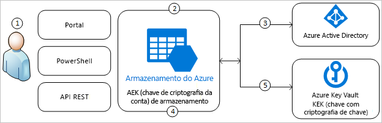
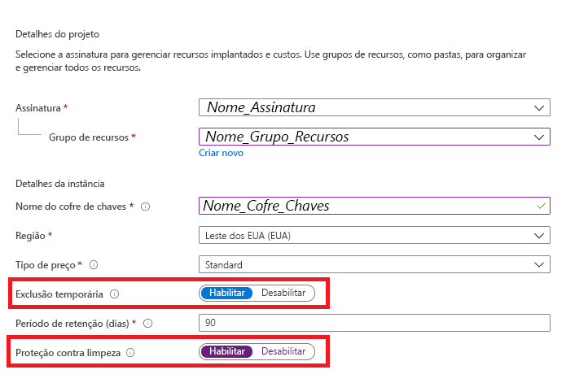
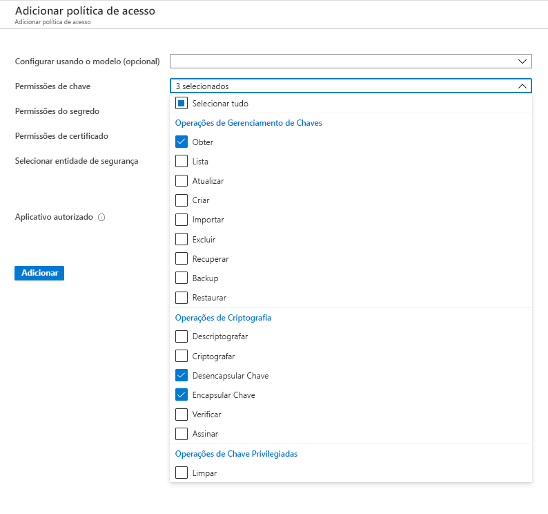
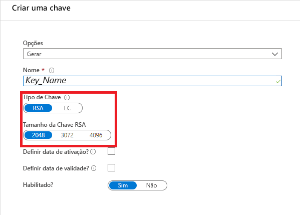
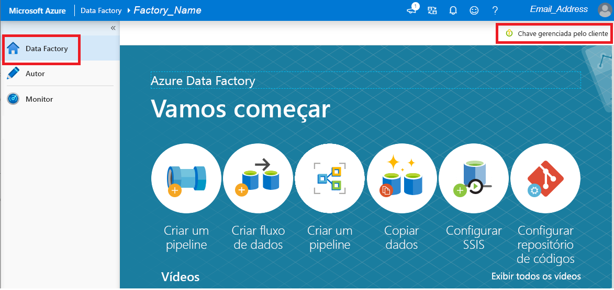

# Criptografar o Azure Data Factory com chaves gerenciadas pelo cliente

[!INCLUDE[appliesto-adf-xxx-md](includes/appliesto-adf-xxx-md.md)]

O Azure Data Factory criptografa dados em repouso, incluindo definições de entidade e todos os dados armazenados em cache enquanto as execuções estão em andamento. Por padrão, os dados são criptografados com uma chave gerenciada pela Microsoft gerada aleatoriamente, atribuída exclusivamente ao seu data factory. Para maior garantia de segurança, agora você pode habilitar a BYOK (Bring Your Own Key) com o recurso de chaves gerenciadas pelo cliente no Azure Data Factory. Quando você especifica uma chave gerenciada pelo cliente, o Data Factory usa __ambas__, a chave de sistema e a CMK, para criptografar os dados do cliente. A ausência de qualquer uma delas resultaria na Negação de Acesso aos dados e ao alocador.

O Azure Key Vault é obrigatório para armazenar as chaves gerenciadas pelo cliente. Você pode criar suas próprias chaves e armazená-las em um cofre de chaves ou pode usar as APIs do Azure Key Vault para gerar chaves. O cofre de chaves e o Data Factory devem estar no mesmo locatário do Azure AD (Azure Active Directory) e na mesma região, mas podem estar em assinaturas diferentes. Para obter mais informações sobre o Cofre da Chave do Azure, consulte [O que é o Cofre da Chave do Azure?](../key-vault/general/overview.md)

> [!NOTE]
> Uma chave gerenciada pelo cliente só pode ser configurada em um data factory vazio. O data factory não pode conter nenhum recurso, como serviços vinculados, pipelines ou fluxos de dados. É recomendável habilitar a chave gerenciada pelo cliente logo após a criação do alocador.

## Sobre as chaves gerenciadas pelo cliente

O diagrama a seguir mostra como o Data Factory usa o Azure Active Directory e o Azure Key Vault para fazer solicitações usando a chave gerenciada pelo cliente:

  

A seguinte lista explica as etapas enumeradas no diagrama:

1. Um administrador do Azure Key Vault concede permissões a chaves de criptografia para a identidade gerenciada associada ao Data Factory
1. Um administrador do Data Factory habilita o recurso de chave gerenciada pelo cliente no alocador
1. O Data Factory usa a identidade gerenciada associada ao alocador para autenticar o acesso ao Azure Key Vault por meio do Azure Active Directory
1. O Data Factory encapsula a chave de criptografia do alocador com a chave do cliente no Azure Key Vault
1. Para operações de leitura/gravação, o Data Factory envia solicitações ao Azure Key Vault para desencapsular a chave de criptografia da conta a fim de executar operações de criptografia e descriptografia

## Pré-requisitos – Configurar o Azure Key Vault e gerar chaves

### Habilitar as propriedades de Exclusão Temporária e Não Limpar no Azure Key Vault

O uso de chaves gerenciadas pelo cliente com o Data Factory exige que duas propriedades sejam definidas no Key Vault: __Exclusão Temporária__ e __Não Limpar__. Essas propriedades podem ser habilitadas usando o PowerShell ou a CLI do Azure em um cofre de chaves novo ou existente. Para saber como habilitar essas propriedades em um cofre de chaves existente, confira as seções intituladas _Como habilitar a exclusão temporária_ e _Como habilitar a proteção contra a limpeza_ em um dos seguintes artigos:

- [Como usar a exclusão reversível com o PowerShell](../key-vault/general/key-vault-recovery.md)
- [Como usar a exclusão temporária com a CLI](../key-vault/general/key-vault-recovery.md)

Se você estiver criando um novo Azure Key Vault por meio do portal do Azure, as propriedades __Exclusão Temporária__ e __Não Limpar__ podem ser habilitadas da seguinte maneira:

  

### Permitir ao Data Factory acesso ao Azure Key Vault

Verifique se o Azure Key Vault e o Azure Data Factory estão no mesmo locatário do Azure AD (Azure Active Directory) e na _mesma região_. No controle de acesso do Azure Key Vault, conceda à MSI (Identidade do Serviço Gerenciado) do data factory as seguintes permissões: _Obter_, _Desencapsular chave_ e _Encapsular chave_. Essas permissões são obrigatórias para habilitar as chaves gerenciadas pelo cliente no Data Factory.

  

### Gerar ou carregar uma chave gerenciada pelo cliente no Azure Key Vault

Você pode criar suas próprias chaves e armazená-las em um cofre de chaves ou pode usar as APIs do Azure Key Vault para gerar chaves. Somente chaves RSA de 2.048 bits são compatíveis com a criptografia do Data Factory. Para obter mais informações, consulte [Sobre chaves, segredos e certificados](../key-vault/general/about-keys-secrets-certificates.md).

  

## Habilitar chaves gerenciadas pelo cliente

1. Verifique se o Data Factory está vazio. O data factory não pode conter nenhum recurso, como serviços vinculados, pipelines ou fluxos de dados. Por enquanto, implantar uma chave gerenciada pelo cliente em um alocador não vazio resultará em um erro.

1. Para localizar o URI da chave no portal do Azure, navegue até o Azure Key Vault e selecione a configuração de Chaves. Selecione a chave desejada e clique nela para exibir suas versões. Selecione uma versão da chave para exibir as configurações

1. Copie o valor do campo Identificador da Chave, que fornece o URI

    

1. Inicie o portal do Azure Data Factory e, usando a barra de navegação à esquerda, vá para o Portal de Gerenciamento do Data Factory

1. Clique no ícone __Chave gerenciada pelo cliente__

    

1. Insira o URI da chave gerenciada pelo cliente que você copiou anteriormente

1. Clique em __Salvar__ e a criptografia da chave gerenciada pelo cliente será habilitada para o Data Factory

## Atualizar a versão da chave

Ao criar uma versão de uma chave, atualize o data factory para usar a nova versão. Siga etapas semelhantes àquelas descritas na seção _Habilitar chaves gerenciadas pelo cliente_, incluindo:

1. Localize o URI da nova versão da chave por meio do portal do Azure Key Vault

1. Navegue até as configurações da __Chave gerenciada pelo cliente__

1. Substitua e cole o URI da nova chave

1. Clique em __Salvar__ e o Data Factory passará a criptografar com a nova versão da chave

## Usar uma chave diferente

Para alterar a chave usada para a criptografia do Data Factory, você precisa atualizar manualmente as configurações do Data Factory. Siga etapas semelhantes àquelas descritas na seção _Habilitar chaves gerenciadas pelo cliente_, incluindo:

1. Localize o URI da nova chave por meio do portal do Azure Key Vault

1. Navegue até as configurações da __Chave gerenciada pelo cliente__

1. Substitua e cole o URI da nova chave

1. Clique em __Salvar__ e o Data Factory passará a criptografar com a nova chave

## Desabilitar as chaves gerenciadas pelo cliente

Por padrão, uma vez que o recurso de chave gerenciada pelo cliente está habilitado, você não pode remover a etapa de segurança extra. Sempre vamos esperar uma chave fornecida pelo cliente para criptografar o alocador e os dados.

## Próximas etapas

Percorra os [tutoriais](tutorial-copy-data-dot-net.md) para saber mais sobre o uso do Data Factory em mais cenários.