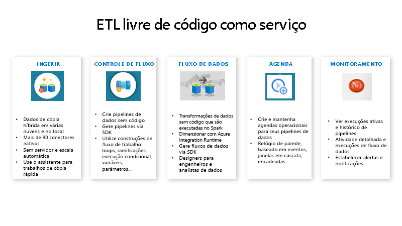

# O que é o Azure Data Factory?

[!INCLUDE[appliesto-adf-xxx-md](includes/appliesto-adf-xxx-md.md)]

No mundo de Big Data, os dados brutos e não organizados são, muitas vezes, armazenados em sistemas relacionais, não relacionais e outros sistemas de armazenamento. No entanto, os dados brutos em si não possuem o contexto ou significado apropriados para fornecer uma visão adequada para os analistas, cientistas de dados ou responsáveis por decisões de negócio. 

O Big Data requer um serviço que possa orquestrar e operacionalizar processos para refinar esses enormes repositórios de dados brutos em insights de negócio acionáveis. O Azure Data Factory é um serviço de nuvem gerenciado que foi criado para esses projetos híbridos complexos para extrair, transformar e carregar (ETL), extrair, carregar e transformar (ELT) e de integração de dados.

Por exemplo, imagine uma empresa de jogos que coleta petabytes de logs de jogos que são gerados por jogos na nuvem. A empresa deseja analisar esses logs para saber as preferências dos clientes, a faixa demográfica e o comportamento de uso. Ela também deseja identificar as oportunidades de venda adicional e venda cruzada, desenvolver recursos novos e cativantes para estimular o crescimento do negócio, e fornecer uma melhor experiência para os clientes.

Para analisar esses logs, a empresa precisa usar os dados de referência, como as informações sobre o cliente, sobre o jogo e sobre a campanha de marketing, que estão em um repositório de dados local. A empresa deseja usar esses dados provenientes do repositório de dados local, combinando-os com os dados de log adicionais que ela possui no repositório de dados na nuvem. 

Para extrair insights, ela espera processar os dados associados usando um cluster Spark na nuvem (Azure HDInsight) e publicar os dados transformados em um data warehouse de nuvem, como o Azure Synapse Analytics, para gerar um relatório baseado neles de maneira fácil. A empresa deseja automatizar esse fluxo de trabalho, e monitorá-lo e gerenciá-lo diariamente. Ela também deseja executá-lo quando entram arquivos no contêiner de armazenamento de blobs.

O Azure Data Factory é a plataforma que resolve esses cenários de dados. É o *serviço de integração de dados e ETL baseado em nuvem que lhe permite criar fluxos de trabalho orientados a dados para orquestrar a movimentação e a transformação de dados em escala*. Usando o Azure Data Factory, é possível criar e agendar fluxos de trabalho orientados a dados (chamados de pipelines) que podem ingerir dados de diferentes repositórios de dados. Você pode criar processos de ETL complexos que transformam os dados visualmente com fluxos de dados ou usando serviços de computação, como o Azure HDInsight Hadoop, o Azure Databricks e o Banco de Dados SQL do Azure. 

Além disso, você pode publicar os dados transformados em repositórios de dados, como o Azure Synapse Analytics, para consumo pelos aplicativos de BI (business intelligence). Por fim, por meio do Azure Data Factory, os dados brutos podem ser organizados em armazenamentos de dados e em data lakes importantes para possibilitar melhores decisões corporativas.

## Como ele funciona?

O Data Factory contém uma série de sistemas interconectados que fornecem uma plataforma de ponta a ponta para os engenheiros de dados.

### Conectar e coletar

As empresas possuem dados de vários tipos que estão localizados em diferentes fontes locais, na nuvem, estruturadas, não estruturadas e semiestruturadas, todos chegando em diferentes intervalos e velocidades. 

A primeira etapa ao criar um sistema de geração de informações é conectar todas as diferentes fontes de dados e processamento necessárias, como os serviços de software como serviço (SaaS), bancos de dados, compartilhamentos de arquivos e serviços Web FTP. A etapa seguinte é mover os dados conforme necessário para um local central para que estes sejam processados posteriormente.

Sem o Data Factory, as empresas devem criar componentes de movimentação de dados personalizados ou gravar serviços personalizados para integrar essas fontes de dados e processamento. É caro e difícil integrar e manter esses sistemas. Além disso, eles também, muitas vezes, não possuem o monitoramento, os alertas e os controles de nível empresarial oferecidos por um serviço totalmente gerenciado.

Com o Data Factory, você pode usar a [Atividade de Cópia](copy-activity-overview.md) em um pipeline de dados para mover os dados que estão em armazenamentos de dados de origem locais e na nuvem para um armazenamento de dados centralizado na nuvem para análise posterior. Por exemplo, é possível coletar dados no Azure Data Lake Storage e transformá-los posteriormente usando um serviço de computação do Azure Data Lake Analytics. Também é possível coletar dados no armazenamento de blobs do Azure e transformá-los posteriormente usando um cluster do Azure HDInsight Hadoop.

### Transformar e enriquecer
Depois que os dados estiverem presentes em um armazenamento de dados centralizado na nuvem, processe ou transforme os dados coletados usando fluxos de dados de mapeamento do ADF. Os fluxos de dados permitem que os engenheiros de dados criem e mantenham gráficos de transformação de dados que são executados no Spark sem a necessidade de entender os clusters ou a programação Spark.

Se você preferir codificar as transformações manualmente, o ADF é compatível com atividades externas para executar suas transformações em serviços de computação, tais como HDInsight Hadoop, Spark, Data Lake Analytics e Machine Learning.

### CI/CD e publicar
[O Data Factory oferece total compatibilidade para CI/CD](continuous-integration-deployment.md) dos pipelines de dados usando o Azure DevOps e o GitHub. Isso permite que você desenvolva e entregue incrementalmente seus processos de ETL antes de publicar o produto acabado. Após os dados brutos terem sido refinados para uma forma consumível pronta para negócios, carregue-os no Data Warehouse do Azure, no Banco de Dados SQL do Azure, no Azure CosmosDB ou em qualquer mecanismo analítico que os seus usuários empresariais possam acessar por meio de suas respectivas ferramentas de business intelligence.
### Monitoramento
Após ter criado e implantado com sucesso o pipeline de integração de dados, fornecendo valor empresarial com base em dados refinados, monitore as atividades e pipelines agendados para saber as taxas de sucesso e falha. O Azure Data Factory tem suporte interno para monitoramento de pipelines por meio do Azure Monitor, da API, do PowerShell, dos logs do Azure Monitor e dos painéis de integridade no portal do Azure.

## Conceitos de nível superior
Uma assinatura do Azure pode ter uma ou mais instâncias do Azure Data Factory (ou data factories). O Azure Data Factory é composto pelos componentes principais a seguir.
- Pipelines
- Atividades
- Conjunto de dados
- Serviços vinculados
- Fluxos de dados
- Runtimes de integração

Esses componentes trabalham juntos para oferecer a plataforma na qual você pode compor fluxos de trabalho orientados a dados com etapas para mover e transformar dados.

### Pipeline
Um data factory pode ter um ou mais pipelines. Um pipeline é um agrupamento lógico de atividades que realiza uma unidade de trabalho. Juntas, as atividades em um pipeline executam uma tarefa. Por exemplo, um pipeline pode conter um grupo de atividades que ingere dados provenientes de um blob do Azure e, em seguida, executa uma consulta Hive em um cluster HDInsight para particionar os dados. 

A vantagem disso é que o pipeline permite que você gerencie atividades como um conjunto, em vez de gerenciar cada uma individualmente. As atividades em um pipeline podem ser encadeadas para operarem de modo sequencial ou elas podem operar de forma independente em paralelo.

### Fluxos de dados de mapeamento
Crie e gerencie grafos de lógica de transformação de dados que você pode usar para transformar dados de qualquer tamanho. Você pode criar uma biblioteca reutilizável de rotinas de transformação de dados e executar esses processos de maneira expandida em seus pipelines do ADF. O Data Factory executará sua lógica em um cluster Spark que será ativado e desativado quando você precisar. Você jamais precisará gerenciar ou manter os clusters.

### Atividade
As atividades representam uma etapa de processamento em um pipeline. Por exemplo, você pode usar uma atividade de cópia para copiar dados de um repositório de dados para outro. Da mesma forma, você pode usar uma atividade do Hive que executa uma consulta de Hive em um cluster do Azure HDInsight para transformar ou analisar seus dados. O Data Factory dá suporte a três tipos de atividades: atividades de movimentação de dados, atividades de transformação de dados e atividades de controle.

### Conjunto de dados
Os conjuntos de dados representam as estruturas de dados nos repositórios de dados, que simplesmente apontam para ou fazem referência aos dados que você deseja usar em suas atividades como entradas ou saídas. 

### Serviços vinculados
Os serviços vinculados são como cadeias de conexão, que definem as informações de conexão necessárias para que o Data Factory se conecte aos recursos externos. Pense dessa maneira: um serviço vinculado define a conexão à fonte de dados e um conjunto de dados representa a estrutura dos dados. Por exemplo, um serviço vinculado de Armazenamento do Azure especifica a cadeia de conexão para conectar-se à conta de Armazenamento do Azure. Além disso, um conjunto de dados de blob do Azure especifica o contêiner de blob e a pasta que contém os dados.

Serviços vinculados são usados para duas finalidades no Data Factory:

- Para representar um **armazenamento de dados** que inclui, mas não está limitado a, um banco de dados do SQL Server, um banco de dados Oracle, um compartilhamento de arquivo ou uma conta de armazenamento de blobs do Azure. Para obter uma lista dos armazenamentos de dados com suporte, consulte o artigo [Copy activity](copy-activity-overview.md) (Atividade de cópia).

- Para representar um **recurso de computação** que pode hospedar a execução de uma atividade. Por exemplo, a atividade HDInsightHive é executada em um cluster Hadoop do HDInsight. Para obter uma lista das atividades de transformação e dos ambientes de computação com suporte, confira o artigo [transformar dados](transform-data.md).

### Gatilhos
Os gatilhos representam a unidade de processamento que determina quando uma execução de pipeline precisa ser inicializada. Existem diferentes tipos de gatilhos para diferentes tipos de eventos.

### Execuções de pipeline
Uma execução de pipeline é uma instância da execução do pipeline. As execuções de pipeline normalmente são instanciadas por meio da transmissão de argumentos para os parâmetros que são definidos em pipelines. Os argumentos podem ser passados manualmente ou na definição do gatilho.

### Parâmetros
Os parâmetros são pares chave-valor da configuração somente leitura.  Os parâmetros são definidos no pipeline. Os argumentos para os parâmetros definidos são passados durante a execução por um contexto de execução criado por um gatilho ou por um pipeline executado manualmente. As atividades no pipeline consomem os valores de parâmetro.

Um conjunto de dados é um parâmetro fortemente tipado e uma entidade reutilizável/referenciável. Uma atividade pode referenciar conjuntos de dados e consumir as propriedades que são estabelecidas na definição do conjunto de dados.

Um serviço vinculado também é um parâmetro fortemente tipado que contém as informações de conexão para um armazenamento de dados ou para um ambiente de computação. Ele também é uma entidade reutilizável/referenciável.

### Fluxo de controle
O fluxo de controle é uma orquestração de atividades do pipeline que inclui o encadeamento de atividades em uma sequência, ramificação, definindo parâmetros no nível do pipeline, e passando argumentos durante a invocação do pipeline sob demanda ou por meio de um gatilho. Também inclui transmissão de estado personalizada e contêineres de looping, ou seja, iteradores for-each.

### Variáveis
As variáveis podem ser usadas dentro dos pipelines para armazenar valores temporários e também podem ser usadas em conjunto com parâmetros para habilitar a passagem de valores entre pipelines, fluxos de dados e outras atividades.

## Próximas etapas
Aqui estão os documentos importantes das próximas etapas a serem explorados:

- [Conjuntos de dados e serviços vinculados](concepts-datasets-linked-services.md)
- [Pipelines e atividades](concepts-pipelines-activities.md)
- [runtime de integração](concepts-integration-runtime.md)
- [Fluxos de dados de mapeamento](concepts-data-flow-overview.md)
- [Interface do usuário do Data Factory no portal do Azure](quickstart-create-data-factory-portal.md)
- [Ferramenta Copiar Dados no portal do Azure](quickstart-create-data-factory-copy-data-tool.md)
- [PowerShell](quickstart-create-data-factory-powershell.md)
- [.NET](quickstart-create-data-factory-dot-net.md)
- [Python](quickstart-create-data-factory-python.md)
- [REST](quickstart-create-data-factory-rest-api.md)
- [Modelo do Azure Resource Manager](quickstart-create-data-factory-resource-manager-template.md)
 
