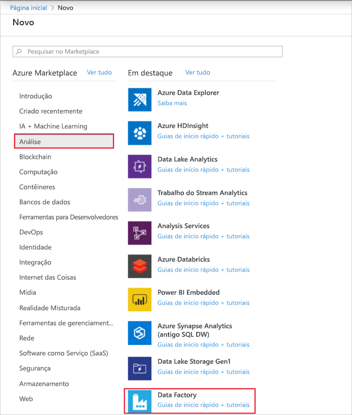
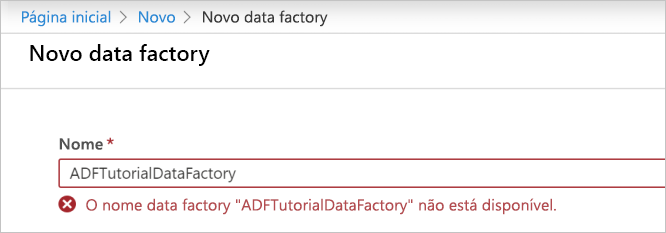
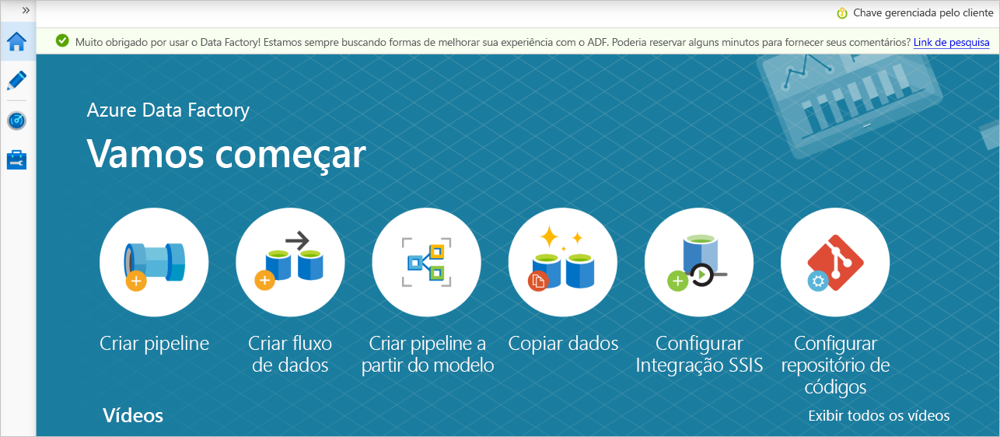

# <a name="transform-data-using-mapping-data-flows"></a>Transformar dados usando o mapeamento de fluxos de dados

Se estiver se familiarizando com o Azure Data Factory, confira [Introdução ao Azure Data Factory](introduction.md).

Neste tutorial, você usará a interface do usuário do Azure Data Factory (UX) para criar um pipeline que copia e transforma dados de uma fonte de Gen2 de Azure Data Lake Storage (ADLS) para um coletor ADLS Gen2 usando o fluxo de dados de mapeamento. O padrão de configuração neste tutorial pode ser expandido após a transformação de dados usando o fluxo de dados de mapeamento

Neste tutorial, você executa as seguintes etapas:

> [!div class="checklist"]
> * Criar um data factory.
> * Crie um pipeline com uma atividade de fluxo de dados.
> * Crie um fluxo de dados de mapeamento com quatro transformações. 
> * Executar teste do pipeline.
> * Monitorar uma atividade de fluxo de dados

## <a name="prerequisites"></a>Pré-requisitos
* **Assinatura do Azure**. Caso você não tenha uma assinatura do Azure, crie uma [conta gratuita do Azure](https://azure.microsoft.com/free/) antes de começar.
* **Conta de Armazenamento do Azure**. Você usa o armazenamento ADLS como um repositório de dados de *origem* e de *coletor* . Se você não tiver uma conta de armazenamento, confira [Criar uma conta de armazenamento do Azure](../storage/common/storage-quickstart-create-account.md) a fim de conhecer as etapas para criar uma.

O arquivo que estamos transformando neste tutorial é MoviesDB. csv, que pode ser encontrado [aqui](https://raw.githubusercontent.com/djpmsft/adf-ready-demo/master/moviesDB.csv). Para recuperar o arquivo do GitHub, copie o conteúdo para um editor de texto de sua escolha para salvar localmente como um arquivo. csv. Para carregar o arquivo em sua conta de armazenamento, consulte [carregar BLOBs com o portal do Azure](../storage/blobs/storage-quickstart-blobs-portal.md). Os exemplos referenciarão um contêiner chamado ' sample-data '.

## <a name="create-a-data-factory"></a>Criar uma data factory

Nesta etapa, você cria um data factory e abre o Data Factory UX para criar um pipeline no data factory. 

1. Abra o **Microsoft Edge** ou **Google Chrome**. Atualmente, a interface do usuário Data Factory tem suporte apenas nos navegadores da Web Microsoft Edge e Google Chrome.
2. No menu à esquerda, selecione **Criar um recurso** > **Analytics** > **Data Factory**: 
  
   

3. Na página **Novo data factory**, em **Nome**, insira **ADFTutorialDataFactory**. 
 
   O nome do Azure Data Factory deve ser *globalmente exclusivo*. Se você receber uma mensagem de erro sobre o valor do nome, insira um nome diferente para o data factory. (por exemplo, yournameADFTutorialDataFactory). Para ver as regras de nomenclatura para artefatos do Data Factory, confira [Data Factory – Regras de nomenclatura](naming-rules.md).
        
     
4. Selecione a **assinatura** do Azure na qual deseja criar o data factory. 
5. Em **Grupo de Recursos**, use uma das seguintes etapas:
     
    a. Selecione **Usar existente**e selecione um grupo de recursos existente na lista suspensa.

    b. Selecione **Criar novo**e insira o nome de um grupo de recursos. 
         
    Para saber mais sobre grupos de recursos, confira [Usar grupos de recursos para gerenciar recursos do Azure](../azure-resource-manager/resource-group-overview.md). 
6. Em **Versão**, selecione **V2**.
7. Em **Local**, informe uma localização para o data factory. Apenas os locais com suporte são exibidos na lista suspensa. Os armazenamentos de dados (por exemplo, o armazenamento do Azure e o SQL Database) e as computações (por exemplo, Azure HDInsight) usados pelo data factory podem estar em outras regiões.
8. Selecione **Criar**. 
9. Depois que a criação for concluída, você verá o aviso no centro de notificações. Selecione **Ir para o recurso** para navegar até a página do Data Factory.
10. Clique em **Criar e Monitorar** para iniciar a IU do Azure Data Factory em uma guia separada.

## <a name="create-a-pipeline-with-a-data-flow-activity"></a>Criar um pipeline com uma atividade de fluxo de dados

Nesta etapa, você criará um pipeline que contém uma atividade de fluxo de dados.

1. Na página **Introdução**, selecione **Criar pipeline**. 

   

1. Na guia **geral** do pipeline, digite **TransformMovies** para o **nome** do pipeline.
1. Na barra superior da fábrica, deslize o controle deslizante de **depuração do fluxo de dados** em. O modo de depuração permite o teste interativo da lógica de transformação em um cluster do Spark ao vivo. Os clusters de fluxo de dados levam de 5-7 minutos para ser ativados e os usuários são recomendados para ativar a depuração primeiro se planejam realizar o desenvolvimento de fluxo de dados. Para obter mais informações, consulte [modo de depuração](concepts-data-flow-debug-mode.md).

    
1. No painel **atividades** , expanda o acorde **e a transformação** . Arraste e solte a atividade **fluxo de dados** do painel para a tela do pipeline.

    
1. No pop-up **adicionando fluxo de dados** , selecione **criar novo fluxo de dados** e, em seguida, nomeie o fluxo de dados **TransformMovies**. Clique em concluir quando terminar.

    

## <a name="build-transformation-logic-in-the-data-flow-canvas"></a>Criar lógica de transformação na tela de fluxo de dados

Depois de criar o fluxo de dados, você será enviado automaticamente para a tela fluxo de dados. Nesta etapa, você criará um fluxo de dados que usa o moviesDB. csv no armazenamento ADLS e agrega a classificação média de Comedies de 1910 a 2000. Em seguida, você escreverá esse arquivo de volta para o armazenamento ADLS.

1. Na tela fluxo de dados, adicione uma fonte clicando na caixa **Adicionar origem** .

    
1. Nomeie sua fonte **MoviesDB**. Clique em **novo** para criar um novo conjunto de fonte de origem.
    
    
1. Escolha **Azure data Lake Storage Gen2**. Clique em Continuar.

    
1. Escolha **DelimitedText**. Clique em Continuar.

    
1. Nomeie seu DataSet **MoviesDB**. Na lista suspensa serviço vinculado, escolha **novo**.

    
1. Na tela de criação de serviço vinculado, nomeie o serviço vinculado ADLS Gen2 **ADLSGen2** e especifique o método de autenticação. Em seguida, insira suas credenciais de conexão. Neste tutorial, estamos usando a chave de conta para se conectar à nossa conta de armazenamento. Você pode clicar em **testar conexão** para verificar se suas credenciais foram inseridas corretamente. Clique em criar quando terminar.

    
1. Depois de voltar à tela de criação do conjunto de arquivos, insira onde o arquivo está localizado no campo **caminho do arquivo** . Neste tutorial, o arquivo moviesDB. csv está localizado em contêiner-dados de exemplo. Como o arquivo tem cabeçalhos, marque **a primeira linha como cabeçalho**. Selecione **do repositório/conexão** para importar o esquema de cabeçalho diretamente do arquivo no armazenamento. Clique em OK quando terminar.

    
1. Se o cluster de depuração for iniciado, vá para a guia **visualização de dados** da transformação origem e clique em **Atualizar** para obter um instantâneo dos dados. Você pode usar a visualização de dados para verificar se a transformação está configurada corretamente.
    
    
1. Ao lado do nó de origem na tela fluxo de dados, clique no ícone de adição para adicionar uma nova transformação. A primeira transformação que você está adicionando é um **filtro**.
    
    
1. Nomeie sua transformação de filtro **FilterYears**. Clique na caixa expressão ao lado de **filtrar em** para abrir o construtor de expressões. Aqui você especificará sua condição de filtragem. 
    
    
1. O construtor de expressões de fluxo de dados permite criar expressões interativamente para usar em várias transformações. As expressões podem incluir funções internas, colunas do esquema de entrada e parâmetros definidos pelo usuário. Para obter mais informações sobre como criar expressões, consulte [Construtor de expressões de fluxo de dados](concepts-data-flow-expression-builder.md).
    
    Neste tutorial, você deseja filtrar filmes de gênero comédia que se passaram entre os anos 1910 e 2000. Como ano, atualmente é uma cadeia de caracteres, você precisa convertê-lo em um inteiro usando a função ```toInteger()```. Use os operadores maior que ou igual a (> =) e menor ou igual a (< =) para comparar com os valores de ano literal 1910 e 200-. Union essas expressões junto com o operador and (& &). A expressão é exibida como:

    ```toInteger(year) >= 1910 && toInteger(year) <= 2000```

    Para descobrir quais filmes são Comedies, você pode usar a função ```rlike()``` para localizar o padrão ' comédia ' nos gêneros de coluna. Union a expressão RLIKE com a comparação de anos para obter:

    ```toInteger(year) >= 1910 && toInteger(year) <= 2000 && rlike(genres, 'Comedy')```

    Se você tiver um cluster de depuração ativo, poderá verificar sua lógica clicando em **Atualizar** para ver a saída da expressão em comparação com as entradas usadas. Há mais de uma resposta certa sobre como você pode realizar essa lógica usando a linguagem de expressão de fluxo de dados.
    
    

    Clique em **salvar e concluir** quando terminar com sua expressão.

1. Busque uma **visualização de dados** para verificar se o filtro está funcionando corretamente.
    
    
1. A próxima transformação que você adicionará é uma transformação **agregação** em **modificador de esquema**.
    
    
1. Nomeie sua transformação agregada **AggregateComedyRatings**. Na guia **Agrupar por** , selecione **ano** na lista suspensa para agrupar as agregações pelo ano em que o filme surgiu.
    
    
1. Vá para a guia **agregações** . Na caixa de texto à esquerda, nomeie a coluna de agregação **AverageComedyRating**. Clique na caixa de expressão à direita para inserir a expressão de agregação por meio do construtor de expressões.
    
    
1. Para obter a média de **classificação**de coluna, use a função de agregação ```avg()```. Como a **classificação** é uma cadeia de caracteres e ```avg()``` usa uma entrada numérica, devemos converter o valor em um número por meio da função ```toInteger()```. Essa expressão é semelhante a:

    ```avg(toInteger(Rating))```
    
    Clique em **salvar e concluir** quando terminar. 

    
1. Vá para a guia **visualização de dados** para exibir a saída da transformação. Observe que apenas duas colunas estão lá, **year** e **AverageComedyRating**.
    
    
1. Em seguida, você deseja adicionar uma transformação de **coletor** em **destino**.
    
    
1. Nomeie o **coletor**do coletor. Clique em **novo** para criar o conjunto de seus conjuntos de coleta.
    
    
1. Escolha **Azure data Lake Storage Gen2**. Clique em Continuar.

    
1. Escolha **DelimitedText**. Clique em Continuar.

    
1. Nomeie seu conjunto de **MoviesSink**de banco de seu coletor. Para o serviço vinculado, escolha o serviço vinculado ADLS Gen2 que você criou na etapa 6. Insira uma pasta de saída na qual os dados são gravados. Neste tutorial, estamos gravando na pasta ' output ' no contêiner ' sample-data '. A pasta não precisa existir com antecedência e pode ser criada dinamicamente. Defina **a primeira linha como o cabeçalho** como verdadeiro e selecione **nenhum** para o **esquema de importação**. Clique em Concluir.
    
    

Agora você concluiu a criação do fluxo de dados. Você está pronto para executá-lo em seu pipeline.

## <a name="running-and-monitoring-the-data-flow"></a>Executando e monitorando o fluxo de dados

Você pode depurar um pipeline antes de publicá-lo. Nesta etapa, você vai disparar uma execução de depuração do pipeline de fluxo de dados. Embora a visualização de dados não grave dados, uma execução de depuração gravará dados no destino do coletor.

1. Vá para a tela do pipeline. Clique em **depurar** para disparar uma execução de depuração.
    
    
1. A depuração de pipeline de atividades de fluxo de dados usa o cluster de depuração ativo, mas ainda levará pelo menos um minuto para ser inicializado. Você pode acompanhar o progresso por meio da guia **saída** . Quando a execução for bem-sucedida, clique no ícone de óculos para abrir o painel Monitoramento.
    
    
1. No painel Monitoramento, você pode ver o número de linhas e o tempo gasto em cada etapa de transformação.
    
    
1. Clique em uma transformação para obter informações detalhadas sobre as colunas e o particionamento dos dados.
    
    

Se você seguiu este tutorial corretamente, deve ter escrito 83 linhas e 2 colunas na pasta do coletor. Você pode verificar se os dados estão corretos verificando seu armazenamento de BLOBs.

## <a name="next-steps"></a>Próximas etapas

O pipeline neste tutorial executa um fluxo de dados que agrega a classificação média de Comedies de 1910 a 2000 e grava os dados em ADLS. Você aprendeu como:

> [!div class="checklist"]
> * Criar um data factory.
> * Crie um pipeline com uma atividade de fluxo de dados.
> * Crie um fluxo de dados de mapeamento com quatro transformações. 
> * Executar teste do pipeline.
> * Monitorar uma atividade de fluxo de dados

Saiba mais sobre a [linguagem de expressão de fluxo de dados](data-flow-expression-functions.md).