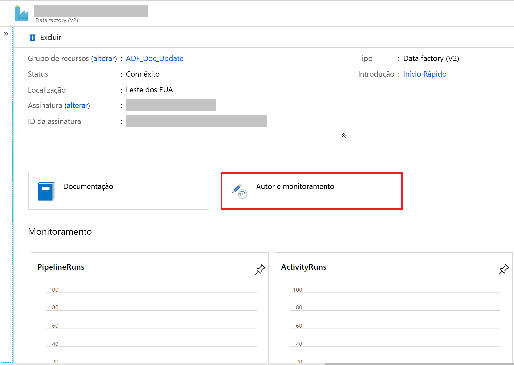

# Copiar arquivos novos e alterados incrementalmente com base em LastModifiedDate usando a ferramenta de Copiar Dados

[!INCLUDE[appliesto-adf-asa-md](includes/appliesto-adf-asa-md.md)]

Neste tutorial, você usará o portal do Azure para criar um data factory. Em seguida, você usará a ferramenta Copiar Dados para criar um pipeline que copia incrementalmente somente arquivos novos e alterados, do armazenamento de BLOBs do Azure para o armazenamento de BLOBs do Azure. Ele usa `LastModifiedDate` para determinar quais arquivos copiar.

Depois de concluir as etapas aqui, Azure Data Factory examinará todos os arquivos no repositório de origem, aplicará o filtro de arquivo por `LastModifiedDate` e copiará para o repositório de destino somente os arquivos que forem novos ou foram atualizados desde a última vez. Observe que, se Data Factory examina um grande número de arquivos, você ainda deve esperar longas durações. A verificação de arquivos é demorada, mesmo quando a quantidade de dados copiados é reduzida.

> [!NOTE]
> Se estiver se familiarizando com o Data Factory, confira a [Introdução ao Azure Data Factory](introduction.md).

Neste tutorial, você concluirá estas tarefas:

> [!div class="checklist"]
> * Criar um data factory.
> * Usar a ferramenta Copy Data para criar um pipeline.
> * Monitore as execuções de pipeline e de atividade.

## Pré-requisitos

* **Assinatura do Azure**: Se você não tiver uma assinatura do Azure, crie uma [conta gratuita](https://azure.microsoft.com/free/) antes de começar.
* **Conta de armazenamento do Azure**: Use o armazenamento de BLOB para os armazenamentos de dados de origem e de coletor. Se você não tiver uma conta de armazenamento do Azure, siga as instruções em [criar uma conta de armazenamento](../storage/common/storage-account-create.md).

## Criar dois contêineres no armazenamento de BLOBs

Prepare o armazenamento de BLOBs para o tutorial ao concluir estas etapas:

1. Crie um contêiner chamado **origem**. Você pode usar várias ferramentas para executar essa tarefa, como [Gerenciador de armazenamento do Azure](https://storageexplorer.com/).

2. Crie um contêiner chamado **destino**.

## Criar um data factory

1. No painel esquerdo, selecione **Criar um recurso**. Selecione   >  **Data Factory** de integração:

   

2. Na página **Novo data factory**, em **Nome**, insira **ADFTutorialDataFactory**.

   O nome do seu data factory deve ser globalmente exclusivo. Você pode receber essa mensagem de erro:

   

   Se você receber uma mensagem de erro sobre o valor do nome, insira um nome diferente para o data factory. Por exemplo, use o nome _**seunome**_**ADFTutorialDataFactory**. Para ver as regras de nomenclatura de artefatos do Data Factory, confira [Regras de nomenclatura do Data Factory](naming-rules.md).
3. Em **assinatura**, selecione a assinatura do Azure na qual você criará o novo data Factory.
4. Em **grupo de recursos**, execute uma destas etapas:

    * Selecione **usar existente** e, em seguida, selecione um grupo de recursos existente na lista.

    * Selecione **criar novo** e insira um nome para o grupo de recursos.
         
    Para saber mais sobre grupos de recursos, confira [Usar grupos de recursos para gerenciar recursos do Azure](../azure-resource-manager/management/overview.md).

5. Em **Versão**, selecione **V2**.
6. Em **Local**, selecione o local para o data factory. Somente os locais com suporte aparecem na lista. Os armazenamentos de dados (por exemplo, o armazenamento do Azure e o Azure SQL Database) e computações (por exemplo, Azure HDInsight) que seu data factory usa podem estar em outros locais e regiões.
8. Selecione **Criar**.
9. Depois que o data factory for criado, a data factory home page será exibida.
10. Para abrir a interface do usuário do Azure Data Factory (IU) em uma guia separada, selecione o bloco **criar & monitor** :

    

## Usar a ferramenta Copy Data para criar um pipeline

1. Na página **vamos** começar, selecione o bloco **copiar dados** para abrir a ferramenta copiar dados:

   

2. Na página **Propriedades** , execute as seguintes etapas:

    a. Em **nome da tarefa**, insira **DeltaCopyFromBlobPipeline**.

    b. Em **cadência da tarefa ou no agendamento da tarefa**, selecione **executar regularmente na agenda**.

    c. Em **tipo de gatilho**, selecione **janela em cascata**.

    d. Em **recorrência**, insira **15 minuto (s)**.

    e. Selecione **Avançar**.

    Data Factory cria um pipeline com o nome de tarefa especificado.

    

3. Na página **armazenamento de dados de origem** , conclua estas etapas:

    a. Selecione  **criar nova conexão** para adicionar uma conexão.

    b. Selecione **armazenamento de BLOBs do Azure** na galeria e selecione **continuar**:

    

    c. Na página **novo serviço vinculado (armazenamento de BLOBs do Azure)** , selecione sua conta de armazenamento na lista **nome da conta de armazenamento** . Teste a conexão e, em seguida, selecione **criar**.

    d. Selecione o novo serviço vinculado e, em seguida, selecione **Avançar**:

   

4. Na página **Escolha o arquivo de entrada ou a pasta**, execute as seguintes etapas:

    a. Procure e selecione a pasta de **origem** e selecione **escolher**.

    

    b. Em **comportamento de carregamento de arquivo**, selecione **carga incremental: LastModifiedDate**.

    c. Selecione **cópia binária** e, em seguida, selecione **Avançar**:

     

5. Na página **armazenamento de dados de destino** , selecione o serviço **AzureBlobStorage** que você criou. Essa é a mesma conta de armazenamento que o armazenamento de dados de origem. Em seguida, selecione **Avançar**.

6. Na página **Escolha o arquivo de saída ou a pasta**, execute as seguintes etapas:

    a. Procure e selecione a pasta de **destino** e selecione **escolher**:

    

    b. Selecione **Avançar**.

7. Na página **Configurações**, selecione **Avançar**.

8. Na página **Resumo** , examine as configurações e, em seguida, selecione **Avançar**.

    

9. Na **página Implantação**, selecione **Monitorar** para monitorar o pipeline (tarefa).

    

10. Observe que a guia **Monitor** à esquerda é selecionada automaticamente. O aplicativo alterna para a guia **Monitor** . Você verá o status do pipeline. Selecione **Atualizar** para atualizar a lista. Selecione o link em **nome do pipeline** para exibir os detalhes da execução da atividade ou executar o pipeline novamente.

    

11. Há apenas uma atividade (a atividade de cópia) no pipeline, para que você veja apenas uma entrada. Para obter detalhes sobre a operação de cópia, selecione o link **detalhes** (o ícone de óculos) na coluna **nome da atividade** . Para obter detalhes sobre as propriedades, consulte [visão geral da atividade de cópia](copy-activity-overview.md).

    

    Como não há arquivos no contêiner de origem em sua conta de armazenamento de BLOBs, você não verá nenhum arquivo copiado para o contêiner de destino na conta:

    

12. Crie um arquivo de texto vazio e nomeie-o **file1.txt**. Carregue esse arquivo de texto no contêiner de origem em sua conta de armazenamento. Você pode usar várias ferramentas para executar essas tarefas, como [Gerenciador de armazenamento do Azure](https://storageexplorer.com/).

    

13. Para voltar à exibição de **execuções de pipeline** , selecione **todas as execuções de pipeline** e aguarde até que o mesmo pipeline seja disparado automaticamente.  

14. Quando a segunda execução de pipeline for concluída, siga as mesmas etapas mencionadas anteriormente para examinar os detalhes da execução da atividade.  

    Você verá que um arquivo (file1.txt) foi copiado do contêiner de origem para o contêiner de destino da sua conta de armazenamento de BLOBs:

    

15. Crie outro arquivo de texto vazio e nomeie-o **file2.txt**. Carregue esse arquivo de texto no contêiner de origem em sua conta de armazenamento de BLOBs.

16. Repita as etapas 13 e 14 para o segundo arquivo de texto. Você verá que apenas o novo arquivo (file2.txt) foi copiado do contêiner de origem para o contêiner de destino da sua conta de armazenamento durante a execução desse pipeline.  

    Você também pode verificar se apenas um arquivo foi copiado usando [Gerenciador de armazenamento do Azure](https://storageexplorer.com/) para verificar os arquivos:

    

## Próximas etapas
Acesse o tutorial a seguir para saber como transformar dados usando um cluster Apache Spark no Azure:

> [!div class="nextstepaction"]
>[Transformar dados na nuvem usando um cluster Apache Spark](tutorial-transform-data-spark-portal.md)
