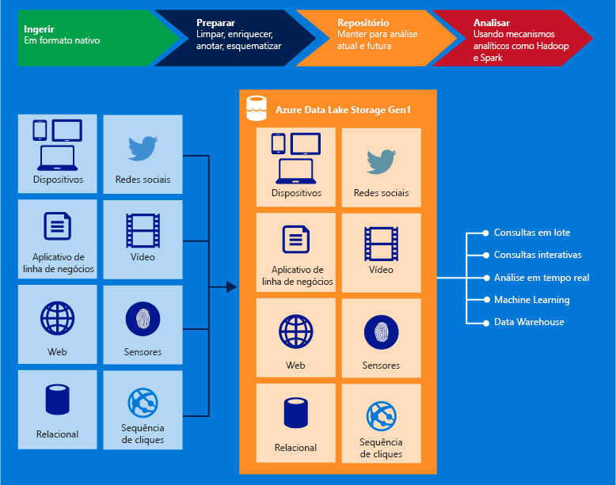

# O que é o Azure Data Lake Storage Gen1?

[!INCLUDE [data-lake-storage-gen1-rename-note.md](../../includes/data-lake-storage-gen1-rename-note.md)]

O Azure Data Lake Storage Gen1 é um repositório de hiperescala em toda a empresa para cargas de trabalho analíticas de big data. O Azure Data Lake permite que você capture dados de qualquer tamanho, tipo e velocidade de ingestão em um único lugar para análises operacionais e exploratórias.

O Data Lake Storage Gen1 pode ser acessado a partir do Hadoop (disponível com o cluster HDInsight) usando as APIs REST compatíveis com WebHDFS. Ele foi desenvolvido para permitir a análise dos dados armazenados e está ajustado para trabalhar em cenários de análise de dados. O Data Lake Storage Gen1 inclui todas as funcionalidades de nível empresarial: segurança, capacidade de gerenciamento, escalabilidade, confiabilidade e disponibilidade.

## Principais recursos

Alguns dos principais recursos do Data Lake Storage Gen1 incluem o seguinte.

### Desenvolvido para Hadoop

O Data Lake Storage Gen1 é um sistema de arquivos Apache Hadoop compatível com o HDFS (Sistema de Arquivos Distribuído Hadoop) e que funciona com o ecossistema Hadoop. Seus aplicativos ou serviços existentes do HDInsight que usam a API WebHDFS podem ser facilmente integrados ao Data Lake Storage Gen1. O Data Lake Storage Gen1 também exibe uma interface REST compatível com WebHDFS para aplicativos.

Analise com facilidade os dados armazenados no Data Lake Storage Gen1 usando estruturas analíticas do Hadoop, como o MapReduce ou o Hive. Provisione clusters do Azure HDInsight e configure-os para acessar diretamente os dados armazenados no Data Lake Storage Gen1.

### Armazenamento ilimitado, arquivos em petabytes

O Data Lake Storage Gen1 fornece armazenamento ilimitado e pode armazenar uma variedade de dados para análise. Ele não impõe limites de tamanhos de conta, tamanhos de arquivo ou volume de dados que podem ser armazenados em um data lake. O tamanho de arquivos individuais pode variar de quilobytes a petabytes. Os dados são armazenados permanentemente pela criação de várias cópias. Não há nenhum limite de tempo durante o qual os dados podem ficar armazenados no data lake.

### Desempenho ajustado para a análise de big data

O Data Lake Storage Gen1 foi desenvolvido para executar sistemas analíticos de grande escala que exigem uma alta taxa de transferência para consultar e analisar grandes volumes de dados. O Data Lake espalha partes de um arquivo por vários servidores de armazenamento individuais. Isso melhora a produtividade da leitura do arquivo em paralelo para a realização de análises de dados.

### Pronto para empresas: altamente disponível e seguro

O Data Lake Storage Gen1 fornece disponibilidade e confiabilidade padrão do setor. Seus ativos de dados são armazenados permanentemente por meio de cópias redundantes, a fim de se proteger contra quaisquer falhas inesperadas.

O Data Lake Storage Gen1 também fornece segurança de nível corporativo para os dados armazenados. Para obter mais informações, consulte [Protegendo dados no Armazenamento de dados do Lake Azure Gen1](#DataLakeStoreSecurity).

### Todos os dados

O Data Lake Storage Gen1 pode armazenar qualquer dado no formato nativo, sem a necessidade de transformações prévias. O Data Lake Storage Gen1 não exige que um esquema seja definido antes de os dados serem carregados, deixando a estrutura analítica individual interpretar os dados e definir um esquema no momento da análise. A capacidade de armazenar arquivos de tamanhos e formatos arbitrários possibilita ao Data Lake Storage Gen1 processar dados estruturados, semi-estruturados e não estruturados.

Os contêineres Data Lake Storage Gen1 para dados são essencialmente pastas e arquivos. Você trabalha nos dados armazenados usando SDKs, o portal do Azure e o Azure PowerShell. Se você colocar os dados no repositório usando essas interfaces e os contêineres apropriados, poderá armazenar qualquer tipo de dados. O Data Lake Storage Gen1 não executa nenhum tratamento especial de dados com base no tipo de dados que armazena.

## Proteção de dados

O Data Lake Storage Gen1 usa o Azure AD (Azure Active Directory) para autenticação e as ACLs (listas de controle de acesso) para gerenciar o acesso aos seus dados.

| Recurso | Descrição |
| --- | --- |
| Autenticação |O Data Lake Storage Gen1 integra-se ao Azure AD para o gerenciamento de identidades e acesso de todos os dados armazenados no Data Lake Storage Gen1. Devido à integração, o Data Lake Storage Gen1 se beneficia de todos os recursos do Azure AD, como autenticação multifator, acesso condicional, controle de acesso baseado em função do Azure, monitoramento do uso do aplicativo, monitoramento e alerta de segurança etc. O Data Lake Storage Gen1 oferece suporte ao protocolo OAuth 2.0 para autenticação na interface REST. Confira [Autenticação do Data Lake Storage Gen1](data-lakes-store-authentication-using-azure-active-directory.md).|
| Controle de acesso |O Data Lake Storage Gen1 fornece controle de acesso, suportando permissões no estilo POSIX expostas pelo protocolo WebHDFS. Habilite as ACLs na pasta raiz, nas subpastas e nos arquivos individuais. Para obter mais informações sobre como as ACLs funcionam no contexto do Data Lake Storage Gen1, confira [Controle de acesso no Data Lake Storage Gen1](data-lake-store-access-control.md). |
| Criptografia |O Data Lake Storage Gen1 também fornece criptografia para dados armazenados na conta. Você especifica as configurações de criptografia ao criar uma conta do Data Lake Storage Gen1. É possível optar por ter os dados criptografados ou não escolher nenhuma criptografia. Para obter mais informações, consulte [Criptografia no Data Lake Storage Gen1](data-lake-store-encryption.md). Para obter instruções de como fornecer a configuração relacionada à criptografia, confira [Introdução ao Data Lake Storage Gen1 usando o portal do Azure](data-lake-store-get-started-portal.md). |

Para obter instruções sobre como proteger dados no Data Lake Storage Gen1, consulte [Protegendo dados no Armazenamento de dados do Azure Data Lake Gen1](data-lake-store-secure-data.md).

## Compatibilidade de aplicativos

O Azure Data Lake Storage Gen1 é compatível com a maioria dos componentes de software livre no ecossistema do Hadoop. Ele também se integra bem aos outros serviços do Azure. Para saber mais sobre como você pode usar o Data Lake Storage Gen1 com componentes de software livre e outros serviços do Azure, use os seguintes links:

- Confira [Aplicativos e serviços compatíveis com o Azure Data Lake Storage Gen1](data-lake-store-compatible-oss-other-applications.md) para obter uma lista de aplicativos de software livre interoperáveis com o Data Lake Storage Gen1.
- Confira [Integração aos outros serviços do Azure](data-lake-store-integrate-with-other-services.md) para entender como usar o Data Lake Storage Gen1 com outros serviços do Azure para permitir uma gama mais ampla de cenários.
- Veja [Cenários para usar o Data Lake Storage Gen1](data-lake-store-data-scenarios.md) para aprender a usar o Data Lake Storage Gen1 em cenários como a ingestão de dados, o processamento de dados, o download de dados e a visualização de dados.

## Sistema de arquivos do Data Lake Storage Gen1

O Data Lake Storage Gen1 pode ser acessado por meio do novo sistema de arquivos AzureDataLakeFilesystem (adl://) em ambientes do Hadoop (disponíveis no cluster HDInsight). Os aplicativos e os serviços que usam adl:// podem aproveitar otimizações adicionais de desempenho que não estão atualmente disponíveis no WebHDFS. Como resultado, o Data Lake Storage Gen1 oferece a flexibilidade de fazer uso do melhor desempenho com a opção recomendada de usar adl:// ou manter o código existente, continuando a usar a API do WebHDFS diretamente. O Azure HDInsight aproveita totalmente o AzureDataLakeFilesystem para fornecer o melhor desempenho no Data Lake Storage Gen1.

Você pode acessar seus dados no Data Lake Storage Gen1 usando `adl://<data_lake_storage_gen1_name>.azuredatalakestore.net`. Para obter mais informações sobre como acessar os dados no Data Lake Storage Gen1, confira [Exibir propriedades dos dados armazenados](data-lake-store-get-started-portal.md#properties).

## Próximas etapas

- [Introdução ao Data Lake Storage Gen1 usando o portal do Azure](data-lake-store-get-started-portal.md)
- [Introdução ao Data Lake Storage Gen1 usando o SDK do .NET](data-lake-store-get-started-net-sdk.md)
- [Usar o Azure HDInsight com o Data Lake Storage Gen1](data-lake-store-hdinsight-hadoop-use-portal.md)