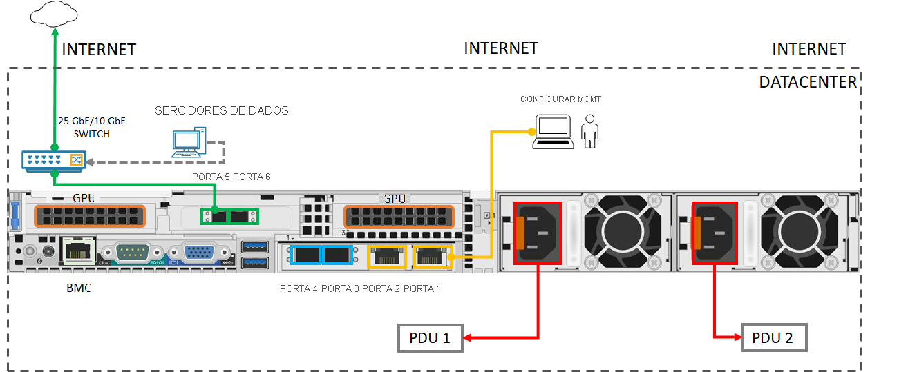

# Início Rápido: Introdução ao Azure Stack Edge Pro com GPU 

Este guia de início rápido detalha os pré-requisitos e as etapas necessárias para implantar o dispositivo de GPU do Azure Stack Edge Pro. As etapas de início rápido são executadas no portal do Azure e na IU da Web local do dispositivo. 

O procedimento total deve levar cerca de 1,5 horas para ser concluído. Para obter instruções detalhadas passo a passo, acesse [Tutorial: preparar a implantação do GPU do Azure Stack Edge Pro](azure-stack-edge-gpu-deploy-prep.md#deployment-configuration-checklist). 

## Pré-requisitos

Antes de implantar, verifique se os seguintes pré-requisitos foram cumpridos:

1. O dispositivo de GPU do Azure Stack Edge Pro é entregue na unidade, [desempacotado](azure-stack-edge-gpu-deploy-install.md#unpack-the-device) e [montado no rack](azure-stack-edge-gpu-deploy-install.md#rack-the-device). 
1. Configure sua rede de modo que o dispositivo possa acessar [as portas e os padrões de URL listados](azure-stack-edge-gpu-system-requirements.md#networking-port-requirements). 
1. Você tem acesso de colaborador ou proprietário à assinatura do Azure.
1. No portal do Azure, acesse **Página Inicial > Assinaturas > Sua assinatura > Provedores de recursos**. Pesquise `Microsoft.DataBoxEdge` e registre o provedor de recursos. Repita para registrar `Microsoft.Devices` se você for criar um recurso do Hub IoT para implantar cargas de trabalho de computação.
1. Verifique se você tem um mínimo de dois IPs gratuitos, estáticos e contíguos para nós Kubernetes e pelo menos um IP estático para o serviço do IoT Edge. Para cada módulo ou serviço externo, você deve implantar um IP adicional.
1. Confira a [lista de verificação de implantação](azure-stack-edge-gpu-deploy-checklist.md) para obter tudo o que você precisa para a configuração do dispositivo. 

## Etapas de implantação.

1. **Instalar**: Conecte a porta 1 a um computador cliente por meio de um cabo cruzado ou um adaptador Ethernet USB. Conecte pelo menos uma outra porta de dispositivo para dados, de preferência de 25 GbE (da porta 3 à porta 6) à Internet por meio de pelo menos um comutador de 1 GbE e cabos de cobre SFP+. Conecte os cabos de alimentação fornecidos às unidades de fonte de alimentação e separe as saídas de distribuição de energia. Pressione o botão de energia no painel frontal para ligar o dispositivo.  

    Confira a [Matriz de Interoperabilidade do Cavium FastlinQ série 41000](https://www.marvell.com/documents/xalflardzafh32cfvi0z/) e os [produtos compatíveis com adaptador de rede de canal dual port 25G ConnectX-4 da Mellanox](https://docs.mellanox.com/display/ConnectX4LxFirmwarev14271016/Firmware+Compatible+Products) para obter cabos de rede e comutadores compatíveis.

    Aqui está a configuração mínima de cabeamento necessária para implantar o dispositivo:  

2. **Conectar**: Defina as configurações de IPv4 no adaptador Ethernet do computador com um endereço IP estático **192.168.100.5** e sub-rede **255.255.255.0**. Abra o navegador e conecte-se à IU da Web local do dispositivo em https://192.168.100.10. Isso pode levar alguns minutos. Continue na página da Web quando vir o aviso do certificado de segurança.

3. **Entrar**: entre no dispositivo com a senha padrão *Password1*. Altere a senha de administrador do dispositivo. A senha deve conter entre 8 e 16 caracteres e 3 dos caracteres maiúsculos, minúsculos, numéricos ou especiais.

4. **Configurar a rede**: aceite a configuração padrão do DHCP para a porta de dados conectada se você tiver um servidor DHCP na rede. Caso contrário, forneça um IP, um servidor DNS e um gateway padrão. Veja mais informações sobre [Configurações de rede](azure-stack-edge-gpu-deploy-configure-network-compute-web-proxy.md#configure-network).

5. **Configurar rede de computação**: crie um comutador virtual habilitando uma porta no dispositivo. Insira 2 IPs estáticos gratuitos e contíguos para nós Kubernetes na mesma rede em que criou o comutador. Forneça pelo menos 1 IP estático para o serviço de Hub do IoT Edge acessar módulos de computação e um IP estático para cada serviço extra ou contêiner que você deseja acessar de fora do cluster do Kubernetes. 

    O Kubernetes é obrigatório para implantar todas as cargas de trabalho em contêineres. Veja mais informações em [Configurações de rede de computação](azure-stack-edge-gpu-deploy-configure-network-compute-web-proxy.md#enable-compute-network).

6. **Configurar proxy Web**: se você usa um proxy Web no ambiente, insira o IP do servidor proxy Web em `http://<web-proxy-server-FQDN>:<port-id>`. Defina a autenticação como **Nenhuma**. Veja mais informações sobre [Configurações do proxy Web](azure-stack-edge-gpu-deploy-configure-network-compute-web-proxy.md#configure-web-proxy).

7. **Configurar dispositivo**: insira um nome de dispositivo e domínio DNS ou aceite os padrões. 

8. **Configurar servidor de atualização**: aceite o servidor padrão do Microsoft Update ou especifique um servidor WSUS (Windows Server Update Services) e o caminho para ele. 

9. **Definir configurações de tempo**: aceite as configurações de tempo padrão ou defina o fuso horário, o servidor NTP primário e o servidor NTP secundário na rede local ou como servidores públicos.

10. **Configurar certificados**: se você alterou o nome do dispositivo e/ou o domínio DNS, então precisa gerar certificados ou adicionar certificados para ativar o dispositivo. 

    - Para testar cargas de trabalho que não são de produção, use a opção [Gerar certificados](azure-stack-edge-gpu-deploy-configure-certificates.md#generate-device-certificates). 
    - Se você usa seus certificados, inclusive as cadeias de assinaturas, então [Adicione certificados](azure-stack-edge-gpu-deploy-configure-certificates.md#bring-your-own-certificates) no formato apropriado. Certifique-se de carregar primeiro a cadeia de assinaturas. Confira [Criar certificados](azure-stack-edge-gpu-create-certificates-tool.md) e [Carregar certificados por meio da IU local](azure-stack-edge-gpu-deploy-configure-certificates.md#bring-your-own-certificates).

11. **Ativar**: obter a chave de ativação 

    1. Na portal do Azure, acesse **Recurso do Azure Stack Edge > Visão geral > Configuração do dispositivo > Ativar > Gerar chave**. Copie a chave. 
    1. Na IU da Web local, vá para **Introdução > Ativar** e forneça a chave de ativação. Quando a chave é aplicada, o dispositivo leva alguns minutos para a ativação. Baixe o arquivo `<device-serial-number>`.json quando solicitado a armazenar com segurança as chaves de dispositivo necessárias para uma recuperação futura. 

12. **Configurar computação**: no portal do Azure, vá para **Visão geral > Dispositivo**. Verifique se o dispositivo está **Online**. No painel esquerdo, vá para **Computação de borda > Introdução > Configurar a computação de borda > Computação**. Forneça um serviço de Hub IoT novo ou existente e aguarde cerca de 20 minutos para que a computação seja configurada. Confira mais informações em [Tutorial: configurar a computação no dispositivo de GPU do Azure Stack Edge Pro](azure-stack-edge-gpu-deploy-configure-compute.md)

Você está pronto para implantar cargas de trabalho de computação no dispositivo [por meio do IoT Edge](azure-stack-edge-gpu-deploy-sample-module-marketplace.md), [por meio do `kubectl`](azure-stack-edge-gpu-create-kubernetes-cluster.md) ou [por meio do Kubernetes habilitado para Azure Arc](azure-stack-edge-gpu-deploy-arc-kubernetes-cluster.md). Se você tiver problemas durante a instalação, vá para [Solucionar problemas do dispositivo](), [problemas de pedido](azure-stack-edge-gpu-troubleshoot.md), [problemas de certificado](azure-stack-edge-gpu-certificate-troubleshooting.md) ou problemas do Kubernetes. 

## Próximas etapas

[Instalar o GPU do Azure Stack Edge Pro](./azure-stack-edge-gpu-deploy-install.md)

