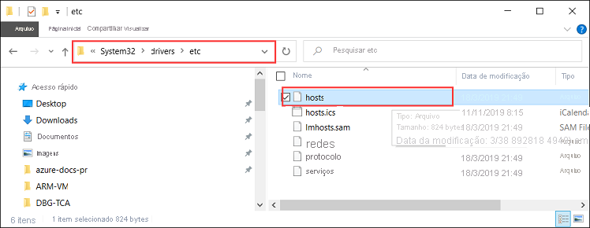
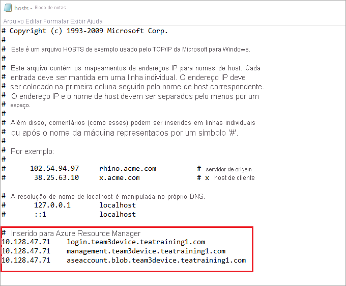

# <a name="deploy-vms-on-your-azure-stack-edge-pro-gpu-device-via-azure-powershell-script"></a>Implantar VMs em seu dispositivo Azure Stack Edge pro GPU via script Azure PowerShell

<!--[!INCLUDE [applies-to-skus](../../includes/azure-stack-edge-applies-to-all-sku.md)]-->

Este tutorial descreve como criar e gerenciar uma VM em seu dispositivo Azure Stack Edge pro usando um script Azure PowerShell.

## <a name="prerequisites"></a>Pré-requisitos

Antes de começar a criar e gerenciar uma VM em seu dispositivo Azure Stack Edge pro usando esse script, você precisará certificar-se de ter concluído os pré-requisitos listados nas etapas a seguir:

### <a name="for-azure-stack-edge-pro-device-via-the-local-web-ui"></a>Para Azure Stack dispositivo pro Edge por meio da interface do usuário da Web local

1. Você concluiu as configurações de rede no dispositivo Azure Stack Edge Pro, conforme descrito na [Etapa 1: Configurar o dispositivo Azure Stack Edge Pro](azure-stack-edge-j-series-connect-resource-manager.md#step-1-configure-azure-stack-edge-pro-device).

2. Você habilitou um adaptador de rede para computação. Esse IP do adaptador de rede é usado para criar um comutador virtual para a implantação da VM. As seguintes etapas descreverão o processo:

    1. Vá para as **configurações de computação**. Selecione o adaptador de rede que será usado para criar um comutador virtual.

        > [!IMPORTANT] 
        > Você só pode configurar uma porta para computação.

    2. Habilite a computação no adaptador de rede. O Azure Stack Edge Pro criará e gerenciará um comutador virtual correspondente a esse adaptador de rede.

3. Você criou e instalou todos os certificados em seu dispositivo Azure Stack Edge pro e no repositório de raiz confiável do seu cliente. Siga o procedimento descrito na [Etapa 2: Criar e instalar certificados](azure-stack-edge-j-series-connect-resource-manager.md#step-2-create-and-install-certificates).

### <a name="for-your-windows-client"></a>Para seu cliente Windows

1. Você definiu o protocolo de Internet virtual (VIP) de serviços consistentes do Azure na sua página de **rede** na interface do usuário da Web local do dispositivo. Você precisa adicionar este VIP a:

    - Ao arquivo de host no cliente OU
    - À configuração do servidor DNS
    
    > [!IMPORTANT]
    > Recomendamos que você modifique a configuração do servidor DNS para a resolução de nome do ponto de extremidade.

    1. Inicie o **Bloco de notas** como administrador (é necessário ter privilégios de Administrador para salvar o arquivo) e abra o arquivo **hosts** localizado em `C:\Windows\System32\Drivers\etc`.
    
        
    
    2. Adicione as seguintes entradas ao arquivo **hosts** substituindo-as por valores apropriados para seu dispositivo:
    
        ```
        <Azure consistent services VIP> login.<appliance name>.<DNS domain>
        <Azure consistent services VIP> management.<appliance name>.<DNS domain>
        <Azure consistent services VIP> <storage name>.blob.<appliance name>.<DNS domain>
        ```
        Para a conta de armazenamento, você pode fornecer um nome que você deseja que o script use posteriormente para criar uma nova conta de armazenamento. O script não verifica se essa conta de armazenamento é existente.

    3. Use a imagem a seguir para referência. Salve o arquivo **hosts**.

        

2. [Baixe o script do PowerShell](https://aka.ms/ase-vm-powershell) usado neste procedimento.

3. Verifique se o seu cliente Windows está executando o PowerShell 5,0 ou posterior.

4. Certifique-se de que o `Azure.Storage Module version 4.5.0` esteja instalado em seu sistema. Você pode obter esse módulo do [Galeria do PowerShell](https://www.powershellgallery.com/packages/Azure.Storage/4.5.0). Para instalar este módulo, digite:

    `Install-Module -Name Azure.Storage -RequiredVersion 4.5.0`

    Para verificar a versão do módulo instalado, digite:

    `Get-InstalledModule -name Azure.Storage`

    Para desinstalar qualquer outro módulo de versão, digite:

    `Uninstall-Module -Name Azure.Storage`

5. [Baixe o AzCopy 10](https://docs.microsoft.com/azure/storage/common/storage-use-azcopy-v10#download-azcopy) para o cliente do Windows. Anote esse local, pois você irá passá-lo como um parâmetro durante a execução do script.

6. Verifique se o seu cliente Windows está executando o TLS 1,2 ou posterior.


## <a name="create-a-vm"></a>Criar uma máquina virtual

1. Execute o PowerShell como administrador.
2. Vá para a pasta em que você baixou o script em seu cliente.  
3. Use o comando a seguir para executar o script:
 
    `.\ArmPowershellClient.ps1 -VNetAddressSpace <AddressSpace> -NicPrivateIp <Private IP> -VHDPath <Path> -VHDFile <VHD File, with extension> -StorageAccountName <Name> -OS <Windows/Linux> -VMSize <Supported VM Size> -VMUserName <UserName to be used to login into VM> -VMPassword <Password for the VM login> --AzCopy10Path <Absolute Path>`

    Aqui estão os exemplos em que o script é executado para criar uma VM do Windows e uma VM do Linux.

    **Para uma VM do Windows:**

    `.\ArmPowershellClient.ps1 -VNetAddressSpace 5.5.0.0/16 -NicPrivateIp 5.5.168.73 -VHDPath \\intel01\d$\vm_vhds\AzureWindowsVMmode -VHDFile WindowsServer2016Datacenter.vhd -StorageAccountName teaaccount1 -OS Windows -VMSize Standard_D1_v2 -VMUserName Administrator -VMPassword Password1 -AzCopy10Path C:\azcopy10\azcopy.exe`

    **Para uma VM do Linux:**

    `.\ArmPowershellClient.ps1 -VNetAddressSpace 5.5.0.0/16 -NicPrivateIp 5.5.168.83 -VHDPath \\intel01\d$\vm_vhds\AzurestackLinux -VHDFile ubuntu13.vhd -StorageAccountName sa2 -OS Linux -VMSize Standard_D1_v2 -VMUserName Administrator -VMPassword Password1 -AzCopy10Path C:\azcopy10\azcopy.exe`
    
4. Para limpar os recursos criados pelo script, use os seguintes comandos:
    
    ```powershell
    Get-AzureRmVM | Remove-AzureRmVM -Force
    Get-AzureRmNetworkInterface | Remove-AzureRmNetworkInterface -Force
    Get-AzureRmResource | Remove-AzureRmResource -f
    Get-AzureRmResourceGroup | Remove-AzureRmResourceGroup -f
    ```


## <a name="next-steps"></a>Próximas etapas

[Implantar VMs usando cmdlets Azure PowerShell](azure-stack-edge-j-series-deploy-virtual-machine-powershell.md)
