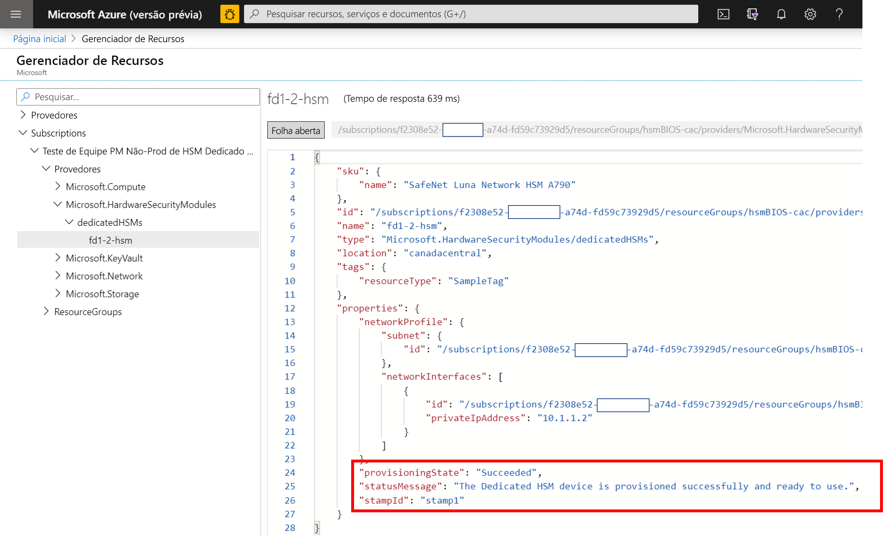
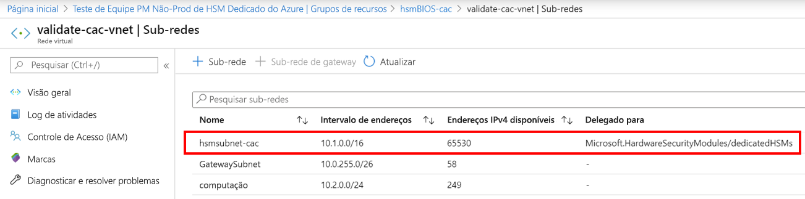
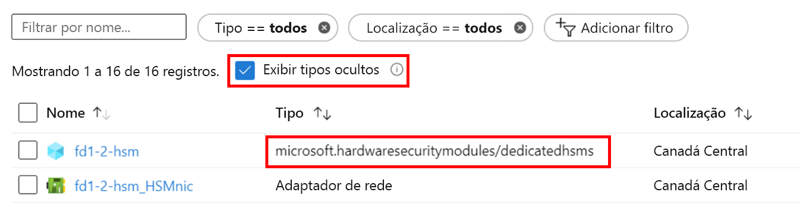

# <a name="troubleshooting-the-azure-dedicated-hsm-service"></a>Solução de problemas do serviço de HSM Dedicado do Azure

O serviço HSM Dedicado do Azure tem duas facetas distintas. Em primeiro lugar, o registro e a implantação no Azure dos dispositivos HSM com seus componentes de rede subjacentes. Em segundo lugar, a configuração dos dispositivos HSM em preparação para o uso/integração com uma determinada carga de trabalho ou aplicativo. Embora os dispositivos [HSM 7 da Thales Luna](https://cpl.thalesgroup.com/encryption/hardware-security-modules/network-hsms) sejam os mesmos no Azure, como você compraria diretamente da Thales, o fato de que eles são um recurso no Azure cria algumas considerações exclusivas. Essas considerações e informações de solução de problemas resultantes ou melhores práticas são documentadas aqui para garantir alta visibilidade e acesso a informações críticas. Depois que o serviço estiver em uso, as informações definitivas estarão disponíveis por meio de solicitações de suporte à Microsoft ou diretamente à Thales. 

> [!NOTE]
> Deve-se observar que, antes de executar qualquer configuração em um dispositivo HSM implantado recentemente, ele deve ser atualizado com todos os patches relevantes. Um patch necessário específico é [KB0019789](https://supportportal.gemalto.com/csm?id=kb_article_view&sys_kb_id=19a81c8bdb9a1fc8d298728dae96197d&sysparm_article=KB0019789) no portal de suporte da Thales, que trata de um problema em que o sistema deixa de responder durante a reinicialização.

## <a name="hsm-registration"></a>Registro do HSM

O HSM dedicado não está disponível gratuitamente para uso, pois ele está fornecendo recursos de hardware na nuvem e, portanto, é um recurso precioso que precisa de proteção. Portanto, usamos um processo de inclusão na lista de permitidos por email usando HSMrequest@microsoft.com. 

### <a name="getting-access-to-dedicated-hsm"></a>Como obter acesso ao HSM dedicado

Primeiro, pergunte-se quais casos de uso você tem que não podem ser resolvidos pelo [Azure Key Vault](https://docs.microsoft.com/en-us/azure/key-vault/general/overview) ou pelo [HSM gerenciado do Azure](https://docs.microsoft.com/en-us/azure/key-vault/managed-hsm/overview). Depois, se você acreditar que somente o HSM Dedicado será adequado aos seus requisitos de armazenamento de chaves, envie um email para HSMrequest@microsoft.com para solicitar acesso. Descreva seu aplicativo e os casos de uso, as regiões em que você gostaria de ter os HSMs e o volume de HSMs que está procurando. Se você trabalha com um representante da Microsoft, como um executivo de conta ou arquiteto de soluções de nuvem, inclua-o em qualquer solicitação.

## <a name="hsm-provisioning"></a>Provisionamento de HSM

O provisionamento de um dispositivo HSM no Azure pode ser feito por meio da CLI ou do PowerShell. Ao registrar-se para o serviço, um modelo de ARM de exemplo será fornecido e a assistência será prestada para a personalização inicial. 

### <a name="hsm-deployment-failure-information"></a>Informações de falha de implantação do HSM

O HSM dedicado é compatível com a CLI e o PowerShell para implantação, de modo que as informações de erro baseadas no portal são limitadas e não detalhadas. Informações melhores podem ser encontradas usando o Gerenciador de Recursos. A página inicial do portal tem um ícone para isso e informações de erro mais detalhadas estão disponíveis. Essas informações ajudam muito quando são coladas ao criar uma solicitação de suporte relacionada a problemas de implantação.



### <a name="hsm-subnet-delegation"></a>Delegação de sub-rede do HSM
O principal motivo para falhas de implantação é esquecer de configurar a delegação apropriada para a sub-rede definida pelo cliente na qual os HSMs serão provisionados. Definir essa delegação faz parte dos pré-requisitos da VNet e da sub-rede para implantação. Mais detalhes podem ser encontrados nos tutoriais.



### <a name="hsm-deployment-race-condition"></a>Condição de corrida de implantação do HSM

O modelo do ARM padrão fornecido para implantação tem recursos relacionados ao gateway do HSM e do ExpressRoute. Os recursos de rede são uma dependência para a implantação bem-sucedida do HSM, e o momento certo pode ser crucial.  Ocasionalmente, vimos falhas de implantação relacionadas a problemas de dependência e executar novamente a implantação costuma resolver o problema. Caso contrário, a exclusão de recursos e a reimplantação geralmente são bem-sucedidas. Depois de tentar fazer isso e ainda encontrar o problema, gere uma solicitação de suporte no portal do Azure selecionando o tipo de problema "Problemas ao configurar a instalação do Azure".

### <a name="hsm-deployment-using-terraform"></a>Implantação do HSM usando o Terraform

Alguns clientes usaram Terraform como um ambiente de automação, em vez de modelos do ARM, conforme fornecido ao registrarem-se para esse serviço. Os HSMs não podem ser implantados dessa maneira, mas os recursos de rede dependentes podem. O Terraform tem um módulo para chamar um modelo do ARM mínimo que tem a implantação do HSM.  Nessa situação, é preciso cuidado para garantir que os recursos de rede, como o gateway do ExpressRoute necessário, sejam totalmente implantados antes da implantação de HSMs. O comando da CLI a seguir pode ser usado para testar a implantação concluída e ser integrado conforme necessário. Substitua os espaços reservados em colchetes angulares pela sua nomenclatura específica. Você deve procurar um resultado "provisioningState is Succeeded"

```azurecli
az resource show --ids /subscriptions/<subid>/resourceGroups/<myresourcegroup>/providers/Microsoft.Network/virtualNetworkGateways/<myergateway>
```

### <a name="deployment-failure-based-on-quota"></a>Falha na implantação com base na cota
As implantações poderão falhar se você exceder dois HSMs por selo e quatro HSMs por região. Para evitar essa situação, verifique se você excluiu recursos de implantações anteriormente com falha antes de implantá-los novamente. Consulte o item "Como faço para ver HSMs" abaixo para verificar os recursos. Se você acreditar que precisa exceder essa cota, que é principalmente estabelecida como uma proteção, envie um email para HSMrequest@microsoft.com com detalhes.

### <a name="deployment-failure-based-on-capacity"></a>Falha na implantação com base na capacidade
Quando um selo ou região específica está ficando cheia, ou seja, quase todos os HSMs livres são provisionados, isso pode levar a falhas de implantação. Cada selo tem 12 HSMs disponíveis para clientes, o que significa 24 HSMs por região. Há também dois sobressalentes e um dispositivo de teste em cada selo. Se você acreditar que pode ter atingido um limite, envie um email para HSMrequest@microsoft.com para obter informações sobre o nível de preenchimento de selos específicos.

###  <a name="how-do-i-see-hsms-when-provisioned"></a>Como faço para ver HSMs quando provisionados?
Uma vez que o HSM Dedicado é um serviço de inclusão na lista de permitidos, ele é considerado um "Tipo Oculto" no portal do Azure. Para ver os recursos do HSM, marque a caixa de seleção "Mostrar tipos ocultos", conforme mostrado abaixo. O recurso NIC sempre segue o HSM e é um bom local para descobrir o endereço IP do HSM antes de usar o SSH para se conectar.



## <a name="networking-resources"></a>Recursos de rede

A implantação do HSM Dedicado tem uma dependência dos recursos de rede e algumas limitações decorrentes a serem consideradas.

### <a name="provisioning-expressroute"></a>Como provisionar o ExpressRoute

O HSM dedicado usa o gateway do ExpressRoute como um "túnel" para comunicação entre o espaço de endereços IP privado do cliente e o HSM físico em um datacenter do Azure.  Considerando que há uma restrição de um gateway por VNET, os clientes que precisam de conexão com seus recursos locais por meio do ExpressRoute precisarão usar outra VNET para essa conexão.  

### <a name="hsm-private-ip-address"></a>Endereço IP privado do HSM

Os modelos de exemplo fornecidos para o HSM Dedicado pressupõem que o IP do HSM será automaticamente extraído de um determinado intervalo de sub-rede. Você pode especificar um endereço IP explícito para o HSM por meio de um atributo "NetworkInterfaces" no modelo do ARM. 


## <a name="hsm-initialization"></a>Inicialização do HSM

A inicialização prepara um novo HSM para uso ou um HSM existente para reutilização. A inicialização do HSM deve ser concluída antes que você possa gerar ou armazenar objetos, permitir que os clientes se conectem ou executem operações criptográficas.

### <a name="lost-credentials"></a>Credenciais perdidas

A perda da senha do administrador do Shell resultará na perda do material da chave HSM. Uma solicitação de suporte deve ser feita para redefinir o HSM.
Ao inicializar o HSM, armazene as credenciais com segurança. As credenciais de shell e HSM devem ser mantidas de acordo com as políticas da empresa.

### <a name="failed-logins"></a>Logons com falha

Fornecer credenciais incorretas para HSMs pode ter consequências destrutivas. A seguir estão os comportamentos padrão para Funções do HSM.

| Função | Limite (nº de tentativas) | Resultado de muitas tentativas de logon inválidas | Recuperação |
|--|--|--|--|
| SO do HSM | 3 |  O HSM está zerando (todas as identidades de objetos HSM e todas as partições foram removidas)  |  O HSM deve ser reinicializado. O conteúdo pode ser restaurado de backups. | 
| SO da partição | 10 |  A partição está zerando. |  A partição deve ser reinicializada. O conteúdo pode ser restaurado do backup. |  
| Audit | 10 | Bloquear | Desbloqueado automaticamente após 10 minutos. |  
| Crypto Officer | 10 (pode ser reduzido) | Se política do HSM 15: Habilitar redefinição de SO do PIN da partição está definido como 1 (habilitado), as funções CO e CU estão bloqueadas.<br>Se política do HSM 15: Habilitar a redefinição de SO do PIN da partição está definido como 0 (desabilitado), as funções CO e CU estão bloqueadas permanentemente e o conteúdo da partição não está mais acessível. Essa é a configuração padrão. | A função CO deve ser desbloqueada e a credencial deve ser redefinida pelo SO da Partição usando `role resetpw -name co`.<br>A partição deve ser reinicializada e o material de chave deve ser restaurado de um dispositivo de backup. |  

## <a name="hsm-configuration"></a>Configuração do HSM 

Os seguintes itens são uma situação em que os erros de configuração são comuns ou têm um impacto que vale a pena destacar:

### <a name="hsm-documentation-and-software"></a>Software e documentação do HSM
O software e a documentação dos dispositivos [HSM 7 da Thales Luna](https://cpl.thalesgroup.com/encryption/hardware-security-modules/network-hsms) não estão disponíveis na Microsoft e precisam ser baixados diretamente da Thales. O registro é necessário usando a ID do Cliente da Thales recebida durante o processo de registro. Os dispositivos, conforme fornecidos pela Microsoft, têm a versão de software 7.2 e a versão de firmware 7.0.3. No início de 2020, a Thales tornou a documentação pública e ela pode ser encontrada [aqui](https://thalesdocs.com/gphsm/luna/7.2/docs/network/Content/Home_network.htm).  

### <a name="hsm-networking-configuration"></a>Configuração de rede do HSM

Tenha cuidado ao configurar a rede no HSM.  O HSM tem uma conexão por meio do gateway do ExpressRoute de um espaço de endereços IP privado do cliente diretamente para o HSM.  Esse canal de comunicação destina-se somente à comunicação do cliente e a Microsoft não tem acesso. Se o HSM estiver configurado de maneira que esse caminho de rede seja afetado, isso significará que toda a comunicação com o HSM será removida.  Nessa situação, a única opção é gerar uma solicitação de suporte da Microsoft por meio do portal do Azure para que o dispositivo seja redefinido. Esse procedimento de redefinição define o HSM de volta para o estado inicial e toda a configuração e o material da chave são perdidos.  A configuração deve ser recriada e, quando o dispositivo ingressar no grupo de HA, ele obterá o material da chave replicado.  

### <a name="hsm-device-reboot"></a>Reinicialização de dispositivo do HSM

Algumas alterações de configuração exigem que o HSM seja desligado ou reinicializado. Os testes da Microsoft do HSM no Azure determinaram que, em algumas ocasiões, a reinicialização poderia parar de responder. A implicação é que uma solicitação de suporte deve ser criada no portal do Azure solicitando a reinicialização física e que pode levar até 48 horas para ser concluída, considerando que se trata de um processo manual em um datacenter do Azure.  Para evitar essa situação, verifique se você implantou o patch de reinicialização disponível diretamente da Thales. Confira [KB0019789](https://supportportal.gemalto.com/csm?sys_kb_id=d66911e2db4ffbc0d298728dae9619b0&id=kb_article_view&sysparm_rank=1&sysparm_tsqueryId=d568c35bdb9a4850d6b31f3b4b96199e&sysparm_article=KB0019789) nos Downloads do HSM 7 da Thales Luna 7.2 para obter um patch recomendado para um problema em que o sistema deixa de responder durante a reinicialização (observação: você precisará ter se registrado no [portal de suporte ao cliente da Thales](https://supportportal.thalesgroup.com/csm) para download).

### <a name="ntls-certificates-out-of-sync"></a>Certificados NTLS fora de sincronia
Um cliente pode perder a conectividade com um HSM quando um certificado expira ou é substituído por meio de atualizações de configuração. A configuração do cliente de troca de certificado deve ser reaplicada a cada HSM.
Exemplo de NTLS registrando em log com um certificado inválido:

> NTLS[8508]: info : 0 : Solicitação de conexão recebida... : 192.168.50.2/59415 NTLS[8508]: A mensagem de erro de SSLAccept é: error:14094418:SSL routines:ssl3_read_bytes:tlsv1 alert unknown ca NTLS[8508]: Erro durante a aceitação de SSL ( RC_SSL_ERROR ) NTLS[8508]: info : 0xc0000711 : Falha ao estabelecer um canal seguro com o cliente: 192.168.50.2/59415 : RC_SSL_FAILED_HANDSHAKE NTLS[8508]: info : 0 : A instância de Conexão "Nome de host desconhecido" do cliente NTLS foi removida: 192.168.50.2/59415

### <a name="failed-tcp-communication"></a>Falha na comunicação TCP

A comunicação da instalação do Cliente Luna com o HSM requer pelo menos a porta TCP 1792. Considere isso, uma vez que todas as configurações de rede são alteradas no ambiente.

### <a name="failed-ha-group-member-doesnt-recover"></a>O membro do grupo de HA com falha não se recupera

Se um membro do grupo de HA com falha não se recuperar, ele deverá ser recuperado manualmente do cliente Luna usando o comando hagroup recover.
É necessário configurar uma contagem de repetição para que um grupo de HA habilite a recuperação automática. Por padrão, um grupo de HA não tentará recuperar um membro de HA no grupo quando ele for recuperado.

### <a name="ha-group-doesnt-sync"></a>O grupo de HA não está sincronizado

No caso em que as partições de membro não têm o mesmo domínio de clonagem, o comando de sincronização de HA exibirá o seguinte: Aviso: A sincronização poderá falhar.  Os membros no slot 0 e no slot 1 têm configurações conflitantes para a clonagem da chave privada.
Uma nova partição com o domínio de clonagem correto deve ser adicionada ao grupo de HA, seguida da remoção da partição configurada incorretamente.

## <a name="hsm-deprovisioning"></a>Desprovisionamento do HSM 

Apenas quando totalmente concluído com um HSM ele poderá ser desprovisionado, então a Microsoft o redefinirá e o retornará para um pool gratuito. 

### <a name="how-to-delete-an-hsm-resource"></a>Como excluir um recurso do HSM

O recurso do Azure para um HSM não pode ser excluído, a menos que o HSM esteja em um estado "zerado".  Portanto, todo o material da chave deve ter sido excluído antes de tentar excluí-la como um recurso. A maneira mais rápida de zerar é obter a senha de administrador do HSM incorreta três vezes (observação: isso se refere ao administrador do HSM e não ao administrador no nível do dispositivo). O shell Luna tem um comando `hsm -factoryreset` que zera, mas só pode ser executado via console na porta serial e os clientes não têm acesso a isso.

## <a name="next-steps"></a>Próximas etapas

Este artigo forneceu informações sobre áreas no ciclo de vida de implantação do HSM que podem ter problemas ou exigir solução de problemas ou avaliação cuidadosa. Espero que este artigo ajude você a evitar atrasos e frustrações desnecessários e, se você tiver contribuições ou alterações relevantes, gere uma solicitação de suporte com a Microsoft e avise-nos. 
