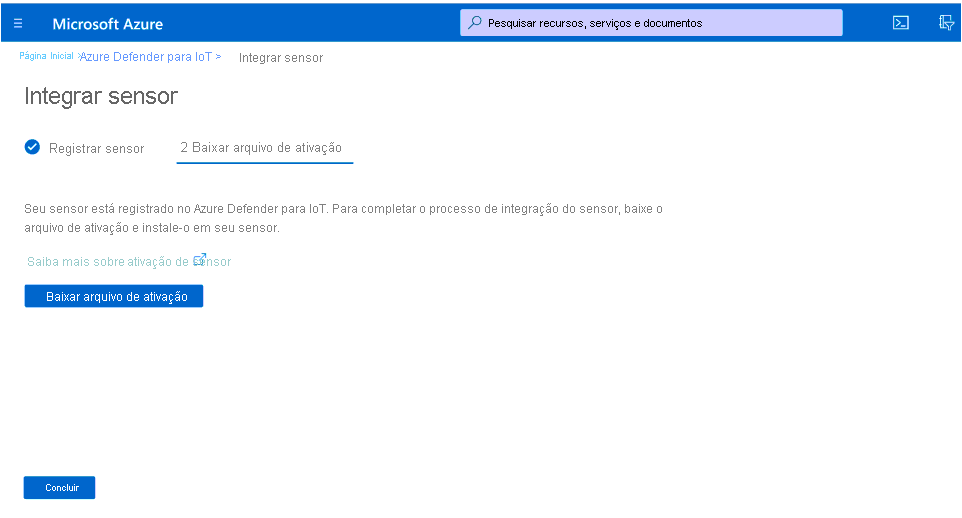
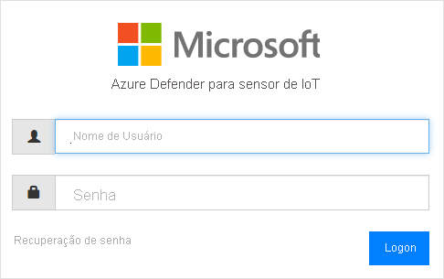
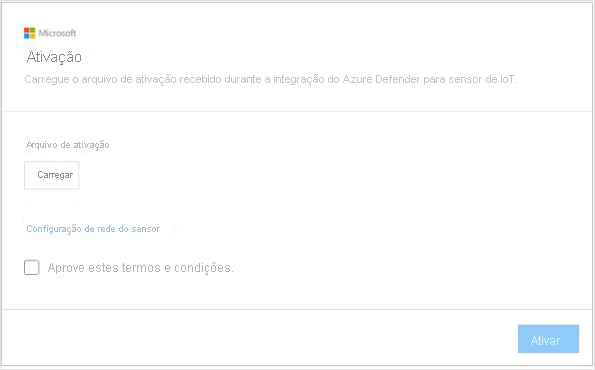
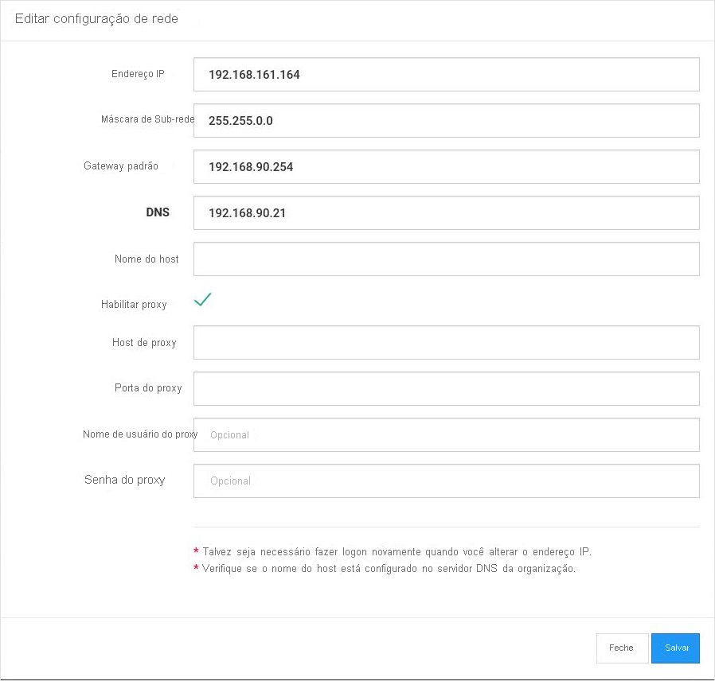

# Início Rápido: Implantar e integrar um sensor

Este artigo fornece uma visão geral do processo de implantação de um sensor. Os sensores precisam ser integrados ao portal do Azure Defender para IoT.

Esse processo exige a aquisição de um sensor pré-configurado ou a aquisição de um dispositivo de sensor certificado e a instalação do software do sensor por conta própria.

Se você estiver trabalhando com um dispositivo de sensor certificado, examine o [guia de especificações de hardware do Azure Defender para IoT](https://aka.ms/AzureDefenderforIoTBareMetalAppliance) antes de começar.

> [!NOTE]
> O console de gerenciamento local do Azure Defender para IoT não precisa ser integrado.

A integração de sensores permite:

|||
|------ | ----------- |
| **Definir um nome de sensor** | Nomeie o sensor que você está integrando e associe-o a um Hub IoT ou uma assinatura.  Confira **Integrar sensores** para obter mais informações.|
|**Escolher uma assinatura e um número de dispositivos confirmados**|Selecione uma assinatura e o número de dispositivos cobertos pela assinatura. Insira o número em incrementos de 1.000.|
| **Definir um modo de gerenciamento de sensor** | Defina o local em que serão exibidas as informações de ativo, de alerta e outras detectadas pelo sensor. Isso é determinado com base no **Modo de gerenciamento de sensor** definido por você.  **Modo gerenciado localmente** : as informações detectadas pelo sensor são exibidas no console do sensor. As informações de detecção também são compartilhadas com o console de gerenciamento local se o sensor está conectado a ele.  **Modo gerenciado na nuvem** : as informações detectadas pelo sensor são exibidas no console do sensor. Além disso, as informações de alerta são entregues por meio de um Hub IoT e podem ser compartilhadas com outros serviços do Azure, por exemplo, o Azure Sentinel. Confira **Integrar sensor** para obter mais informações. |
| **Adquirir um arquivo de ativação do sensor** | Para os sensores **gerenciados localmente** , um arquivo de ativação é usado para gerenciar os períodos autorizados de ativação do sensor.  Para os sensores **gerenciados na nuvem** , um arquivo de ativação é usado como uma conexão entre o sensor e um Hub IoT. Para obter mais informações, confira **Integrar sensores** . |
| **Carregar um arquivo de ativação no sensor** | Os arquivos de ativação precisam ser carregados nos sensores empresariais. O monitoramento de rede e o acesso aos recursos do console do sensor não estarão disponíveis até que o arquivo de ativação seja carregado. Para obter mais informações, confira **Carregar arquivos de ativação do sensor** . |
| **Atualizar os parâmetros de rede do sensor antes da ativação** | Atualize os parâmetros definidos durante a instalação do sensor. Para obter mais informações, confira **Erro! Fonte de referência não encontrada** .|

**Para implantar um sensor:**

1. Acesse o Azure Defender para IoT no portal do Azure.

2. Selecione **Introdução.**

3. Na seção **Descobrir sua rede** , selecione **Configurar** .

   

4. Selecione uma opção para adquirir um sensor.

   

  - **Comprar um sensor pré-configurado** : a Microsoft e a Arrow fizeram uma parceria para fornecer sensores pré-configurados. Para comprar um sensor pré-configurado, entre em contato com a Arrow pelo email <hardware.sales@arrow.com>. O sensor será entregue nas suas instalações. A versão mais atual está instalada.

  - **Traga o próprio dispositivo (Instalação de ISO)** : a solução é executada em dispositivos certificados. Use o [guia de especificações de hardware do Azure Defender para IoT](https://aka.ms/AzureDefenderforIoTBareMetalAppliance) como referência ao adquirir seu dispositivo certificado.

    - Selecione uma versão no menu **Selecionar versão** .

    - Selecione **Baixar** e salve o arquivo. Veja o **Guia de Instalação do Azure Defender para IoT** para obter detalhes sobre como baixar a imagem ISO e instalar o software do sensor.

5. Depois que o software for instalado no seu sensor ou você tiver recebido um sensor pré-configurado, execute as tarefas de configuração de rede. Veja o [guia de configuração de rede](https://aka.ms/AzureDefenderForIoTNetworkSetup) para obter detalhes.

## Integrar um sensor

Os sensores precisam ser integrados ao portal do Azure Defender para IoT. A integração é realizada em duas fases:

1. Registrar o sensor no portal do Azure Defender para IoT.

2. Baixar um arquivo de ativação para o sensor. O arquivo será carregado posteriormente no sensor.

**Para acessar a página de integração:**

1. Navegue até a página **Introdução** do Microsoft Azure Defender para IoT.

2. Selecione **2) Integrar** no Azure Defender para IoT.

   

3. A página **Integrar sensor** será aberta. Ela fornece opções para registrar o sensor e baixar o arquivo de ativação.

   

**Para registrar o sensor:**

1. Escolha um nome de sensor. Para os sensores gerenciados na nuvem, o nome definido aqui é aplicado ao nome exibido no console do sensor: esse nome não pode ser alterado no console. Para os sensores gerenciados localmente, o nome aplicado aqui será armazenado no Azure, mas poderá ser atualizado no console do sensor. É recomendável incluir o endereço IP do sensor que você instalou como parte do nome ou usar um nome facilmente identificável. Isso garantirá um acompanhamento mais fácil e uma nomenclatura consistente entre o nome de registro no portal do Azure Defender para IoT e o IP do sensor implantado exibido no console do sensor.

2. Selecione uma assinatura na lista suspensa de assinaturas.
3. No campo **Dispositivos confirmados** , insira o número de dispositivos cobertos pela assinatura. Você deverá inserir novamente esse número para cada sensor integrado que estiver associado à mesma assinatura.  Por exemplo, se a assinatura “A” estiver associada a seis mil dispositivos, insira 6.000 para cada sensor associado à assinatura “A”.   
4. Escolha um modo de gerenciamento de sensor usando a alternância **Conexão com a nuvem** . Se a alternância estiver ativada, o sensor será **Gerenciado na nuvem** . Se a alternância estiver desativada, o sensor será **Gerenciado localmente** .

| Modo de gerenciamento de sensor | Descrição                                                |
| ---------------------- | ---------------------------------------------------------  |
| **Gerenciado na nuvem**          | As informações detectadas pelo sensor são exibidas no console do sensor. Além disso, as informações de alerta são entregues por meio de um Hub IoT e podem ser compartilhadas com outros serviços do Azure, por exemplo, o Azure Sentinel.  Escolha um Hub IoT a ser associado a este sensor.  Você precisará carregar um arquivo de ativação gerenciado na nuvem para os sensores gerenciados na nuvem.  Confira **Carregar arquivos de ativação do sensor** para obter detalhes. |
| **Gerenciado localmente**        | As informações detectadas pelos sensores gerenciados localmente são exibidas no console do sensor. Se você estiver trabalhando em uma rede desconectada e quiser obter uma exibição unificada de todas as informações detectadas por vários sensores gerenciados localmente, trabalhe com o console de gerenciamento local.  Os sensores *gerenciados localmente* são associados a uma assinatura do Azure e contêm instruções sobre o período de validade da ativação do sensor.  Escolha uma assinatura a ser associada a este sensor.  Você precisará carregar um arquivo de ativação gerenciado localmente para cada sensor. Confira **Carregar arquivos de ativação do sensor** para obter detalhes. |

5. Selecione **Registrar** .

6. Na página Baixar arquivo de ativação, selecione **Baixar arquivo de ativação** .

   

7. Salve o arquivo. O nome do arquivo é formatado como `<hub_name>_<sensor_name>`. O nome do sensor refere-se ao nome definido acima.

8. Selecione **Concluir** .

9. Para concluir o processo de integração do sensor, carregue o arquivo no seu sensor no console do Azure Defender para IoT.
 
## Carregar um arquivo de ativação do sensor

Este artigo descreve como carregar um arquivo de ativação no sensor. Você deverá ter recebido o arquivo ao integrar o sensor.

**Arquivos de ativação gerenciados localmente**

Os sensores gerenciados localmente são associados a uma assinatura do Azure.  O arquivo de ativação dos sensores gerenciados localmente contém uma data de validade. Um mês antes dessa data, uma mensagem de aviso será exibida na parte superior do console do sensor. O aviso permanecerá visível até que você tenha atualizado o arquivo de ativação.

Você poderá continuar trabalhando com os recursos do Azure Defender para IoT depois que o arquivo de ativação expirar.

**Arquivos de ativação gerenciados na nuvem**

Os sensores gerenciados na nuvem são associados a um Hub IoT do Azure. Esses sensores não são limitados por períodos do arquivo de ativação. O arquivo de ativação para sensores gerenciados na nuvem é usado para garantir a conexão com o Hub IoT.

Para obter detalhes sobre os Hubs IoT, confira [Sobre o Hub IoT](../iot-hub/about-iot-hub.md).

**Para carregar o arquivo de ativação:**

1. Verifique se você tem o seguinte:

   - Endereço IP do sensor – definido durante a instalação

   - Credenciais de logon do usuário necessárias para o sensor

2. Acesse o console do Azure Defender para IoT no navegador usando o endereço IP desse sensor.

3. Faça logon no console do sensor do Azure Defender para IoT.

   

4. Após o logon bem-sucedido, a tela Ativação será aberta. Selecione Carregar e escolha o arquivo de ativação salvo.

   

5. Aprove os termos e as condições.

6. Selecione **Ativar** . Os parâmetros de configuração de rede do sensor foram definidos durante a instalação do software ou no momento da compra de um sensor pré-configurado. Os seguintes parâmetros foram definidos:
   - Endereço IP
   - DNS  
   - Gateway padrão
   - Máscara de sub-rede
   - Nome do host
 
   O ideal é atualizar essas informações antes de ativar o sensor, porque:
   - Você precisará alterar os parâmetros pré-configurados definidos  
   - Você desejará reconfigurar os parâmetros de rede após a instalação. Você também poderá definir as configurações de proxy antes de ativar o sensor.

7. Selecione o link **Configuração de Rede do Sensor** na caixa de diálogo Ativação.  

   

8. Os parâmetros definidos durante a instalação são exibidos. Uma opção Definir proxy também está disponível. Atualize as informações, conforme necessário, e selecione **Salvar** .
 
 
## Próximas etapas

Neste artigo, você aprendeu a implantar e integrar sensores. Para saber mais sobre como começar a usá-lo, confira o seguinte artigo:

- [Guia de Introdução](getting-started.md)