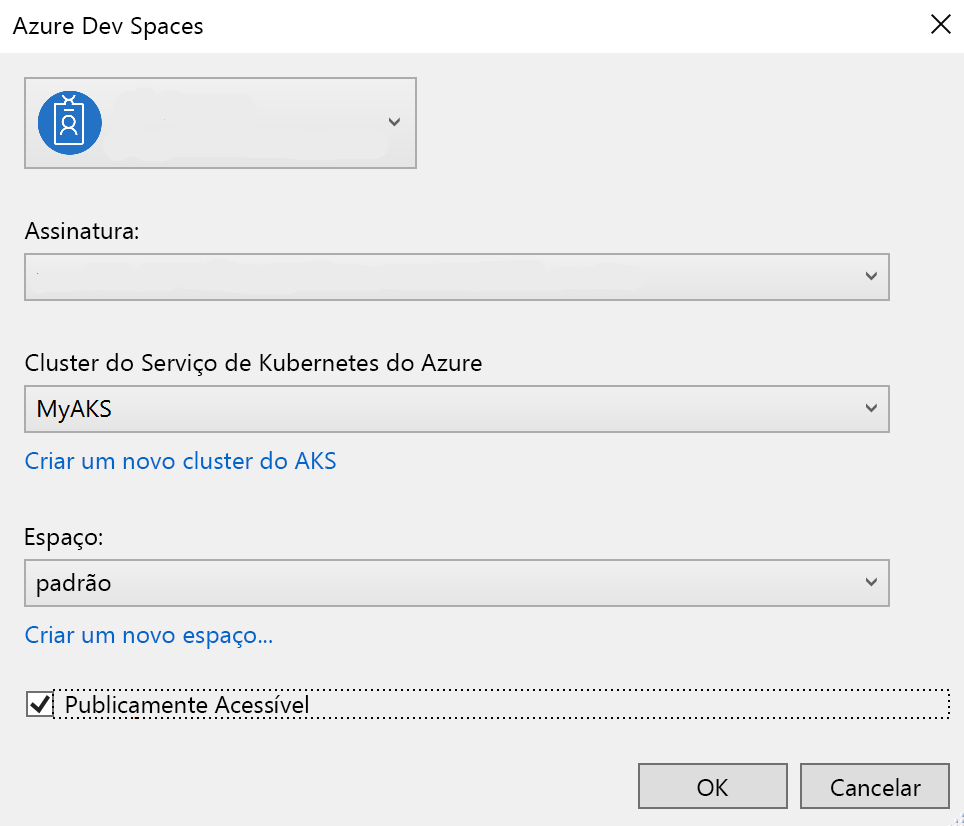

# <a name="create-a-kubernetes-dev-space-visual-studio-and-net-core-with-azure-dev-spaces"></a>Criar um espaço de desenvolvimento do Kubernetes: Visual Studio e .NET Core com o Azure Dev Spaces

Neste guia, você aprenderá a:

- Configure o Azure Dev Spaces com um cluster Kubernetes gerenciado no Azure.
- Desenvolva o código em contêineres iterativamente usando o Visual Studio.
- Desenvolva independentemente dois serviços separados e use a descoberta de serviço de DNS do Kubernetes para fazer uma chamada para outro serviço.
- Desenvolva e teste o código produtivamente em um ambiente de equipe.

> [!NOTE]
> **Caso tenha problemas** a qualquer momento, veja a seção [Solução de problemas](troubleshooting.md).

## <a name="install-the-azure-cli"></a>Instalar a CLI do Azure
O Azure Dev Spaces requer somente uma configuração mínima do computador local. A maior parte da configuração do seu espaço de desenvolvimento é armazenada na nuvem e pode ser compartilhada com outros usuários. Comece baixando e executando a [CLI do Azure](/cli/azure/install-azure-cli?view=azure-cli-latest).

### <a name="sign-in-to-azure-cli"></a>Entrar na CLI do Azure
Entre no Azure. Digite o seguinte comando em uma janela de terminal:

```azurecli
az login
```

> [!NOTE]
> Caso não tenha uma assinatura do Azure, é possível criar uma [conta gratuita](https://azure.microsoft.com/free).

#### <a name="if-you-have-multiple-azure-subscriptions"></a>Caso tenha várias assinaturas do Azure...
Você pode exibir suas assinaturas, executando: 

```azurecli
az account list --output table
```

Localize a assinatura que tenha *True* em *IsDefault*.
Se não for a assinatura que você deseja usar, é possível alterar a assinatura padrão:

```azurecli
az account set --subscription <subscription ID>
```

## <a name="create-a-kubernetes-cluster-enabled-for-azure-dev-spaces"></a>Criar um cluster Kubernetes habilitado para Azure Dev Spaces

No prompt de comando, crie o grupo de recursos em uma [região que dá suporte ao Azure Dev Spaces][supported-regions].

```azurecli
az group create --name MyResourceGroup --location <region>
```

Crie um cluster Kubernetes com o seguinte comando:

```azurecli
az aks create -g MyResourceGroup -n MyAKS --location <region> --generate-ssh-keys
```

São necessários alguns minutos para criar o cluster.

### <a name="configure-your-aks-cluster-to-use-azure-dev-spaces"></a>Configurar o cluster AKS para usar Azure Dev Spaces

Insira o seguinte comando da CLI do Azure, usando o grupo de recursos que contém o cluster do AKS e o nome do cluster do AKS. O comando configura o cluster com suporte para o Azure Dev Spaces.

   ```azurecli
   az aks use-dev-spaces -g MyResourceGroup -n MyAKS
   ```
   
> [!IMPORTANT]
> O processo de configuração do Azure Dev Spaces remove o namespace `azds` no cluster, se existir.

## <a name="get-the-visual-studio-tools"></a>Obter as ferramentas do Visual Studio
Instale a última versão do [Visual Studio 2019](https://www.visualstudio.com/vs/) no Windows com a carga de trabalho de desenvolvimento do Azure.

## <a name="create-a-web-app-running-in-a-container"></a>Criar um aplicativo Web em execução em um contêiner

Nesta seção, você criará um aplicativo Web ASP.NET Core e o executará em um contêiner no Kubernetes.

### <a name="create-an-aspnet-web-app"></a>Criar um aplicativo Web ASP .NET

No Visual Studio, crie um projeto. No momento, o projeto deve ser um **aplicativo Web do ASP.NET Core**. Nomeie o projeto '**webfrontend**'.


Selecione o modelo **aplicativo Web (Model-View-Controller)** e verifique se você está usando **.NET Core** e **ASP.NET Core 2.0** nas duas listas suspensas na parte superior do diálogo. Clique em **OK** para criar o projeto.


### <a name="enable-dev-spaces-for-an-aks-cluster"></a>Habilitar Espaços de Desenvolvimento para um cluster AKS

Com o projeto recém-criado, selecione **Azure Dev Spaces** na lista suspensa de configurações de inicialização, conforme mostrado abaixo.


Na caixa de diálogo que é exibida em seguida, verifique se você está conectado à conta apropriada e selecione um cluster Kubernetes existente.



Deixe a lista suspensa **Espaço** como `default` por enquanto. Posteriormente, você aprenderá mais sobre essa opção. Marque a caixa de seleção **Publicamente Acessível** para que o aplicativo Web possa ser acessado por meio de um ponto de extremidade público. Essa configuração não é necessária, mas será útil para demonstrar alguns conceitos deste passo a passo. Não se preocupe: em ambos os casos, você conseguirá depurar o site usando o Visual Studio.


Clique em **OK** para selecionar ou criar o cluster.

Se você escolher um cluster que não foi habilitado para trabalhar com Azure Dev Spaces, verá uma mensagem perguntando se deseja configurá-lo.


Escolha **OK**.

> [!IMPORTANT]
> O processo de configuração do Azure Dev Spaces remove o namespace `azds` no cluster, se existir.

 Uma tarefa em segundo plano será iniciada para isso. Ela levará alguns minutos para ser concluída. Para ver se ele ainda está sendo criado, passe o ponteiro sobre o ícone **Tarefas em segundo plano** no canto inferior esquerdo da barra de status, conforme mostrado na imagem a seguir.


> [!NOTE]
> Só será possível depurar seu aplicativo depois que o espaço de desenvolvimento for criado com êxito.

### <a name="look-at-the-files-added-to-project"></a>Examinar os arquivos adicionados ao projeto
Enquanto aguarda a criação do espaço de desenvolvimento, examine os arquivos que foram adicionados ao projeto quando optar por usar um espaço de desenvolvimento.

Primeiro, você pode ver que uma pasta chamada `charts` foi adicionada e, dentro dessa pasta, foi feito scaffold de um [gráfico Helm](https://docs.helm.sh) para seu aplicativo. Esses arquivos são usados para implantar seu aplicativo no espaço de desenvolvimento.

Você verá que um arquivo chamado `Dockerfile` foi adicionado. Esse arquivo tem as informações necessárias para empacotar o aplicativo no formato padrão do Docker.

E, por último, você verá um arquivo chamado `azds.yaml`, que contém a configuração de tempo de desenvolvimento que é necessária para o espaço de desenvolvimento.


## <a name="debug-a-container-in-kubernetes"></a>Depurar um contêiner no Kubernetes
Depois que o espaço de desenvolvimento for criado com êxito, você poderá depurar o aplicativo. Defina um ponto de interrupção no código, por exemplo, na linha 20 no arquivo `HomeController.cs` onde a variável `Message` é definida. Clique em **F5** para iniciar a depuração. 

O Visual Studio vai se comunicar com o espaço de desenvolvimento para criar e implantar o aplicativo e abrirá um navegador com o aplicativo Web em execução. Pode parecer que o contêiner está sendo executado localmente, mas, na verdade, ele está em execução no espaço de desenvolvimento no Azure. O motivo do endereço do localhost é que o Azure Dev Spaces cria um túnel SSH temporário para o contêiner em execução no AKS.

Clique no link **Sobre** na parte superior da página para disparar o ponto de interrupção. Você tem acesso completo às informações de depuração exatamente como teria se o código fosse executado localmente, por exemplo, a pilha de chamadas, as variáveis locais, as informações de exceção e muito mais.

## <a name="iteratively-develop-code"></a>Desenvolver código de forma iterativa

O Azure Dev Spaces não serve apenas para executar o código em Kubernetes; ele também serve para permitir que você veja as alterações de código entrarem em vigor de forma rápida e iterativa em um ambiente Kubernetes na nuvem.

### <a name="update-a-content-file"></a>Atualizar um arquivo de conteúdo


1. Localize o arquivo `./Views/Home/Index.cshtml` e edite o HTML. Por exemplo, altere a [linha 73 que diz `<h2>Application uses</h2>`](https://github.com/Azure/dev-spaces/blob/master/samples/dotnetcore/getting-started/webfrontend/Views/Home/Index.cshtml#L73) para algo como: 
  
    ```html
    <h2>Hello k8s in Azure!</h2>`
    ```

2. Salve o arquivo.
3. Volte para o navegador e atualize a página. Você verá a página da Web exibir o HTML atualizado.

O que aconteceu? As edições em arquivos de conteúdo, como HTML e CSS, não exigem a recompilação em um aplicativo Web do .NET Core e, portanto, uma sessão F5 ativa sincroniza automaticamente os arquivos de conteúdo modificados no contêiner em execução no AKS. Assim, você pode ver suas edições de conteúdo imediatamente.

### <a name="update-a-code-file"></a>Atualizar um arquivo de código
A atualização dos arquivos de código requer um pouco mais de trabalho, pois um aplicativo .NET Core precisa recompilar e produzir os binários do aplicativo atualizado.

1. Pare o depurador no Visual Studio.
1. Abra o arquivo de código chamado `Controllers/HomeController.cs` e edite a mensagem exibida na página Sobre: `ViewData["Message"] = "Your application description page.";`
1. Salve o arquivo.
1. Pressione **F5** para reiniciar a depuração. 

Em vez de recompilar e reimplantar uma nova imagem de contêiner sempre que houver edições de código, o que geralmente levará um tempo considerável, o Azure Dev Spaces recompilará incrementalmente o código dentro do contêiner existente para fornecer um loop de edição/depuração mais rápido.

Atualize o aplicativo Web no navegador e vá para a página Sobre. Sua mensagem personalizada deverá aparecer na interface de usuário.

## <a name="next-steps"></a>Próximas etapas

Saiba mais sobre como funciona o Azure Dev Spaces.

> [!div class="nextstepaction"]
> [Como o Azure Dev Spaces funciona](how-dev-spaces-works.md)


[supported-regions]: https://azure.microsoft.com/global-infrastructure/services/?products=kubernetes-service
