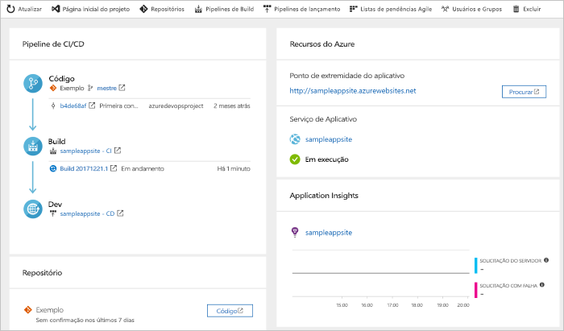

# Configurar um pipeline de CI/CD para um aplicativo Java com o Azure DevOps Starter

Neste início rápido, você usará a experiência simplificada do Azure DevOps Starter para configurar um pipeline de CI (integração contínua) e CD (entrega contínua) para seu aplicativo Java no Azure Pipelines. Use o Azure DevOps Starter para configurar tudo o que você precisa para desenvolver, implantar e monitorar seu aplicativo. 

## Pré-requisitos

- Uma conta do Azure com uma assinatura ativa. [Crie uma conta gratuitamente](https://azure.microsoft.com/free/?ref=microsoft.com&utm_source=microsoft.com&utm_medium=docs&utm_campaign=visualstudio). 
- Uma conta e uma organização do [Azure DevOps](https://azure.microsoft.com/services/devops/).

## Entre no Portal do Azure

O DevOps Starter cria um pipeline de CI/CD no Azure Pipelines. É possível criar uma nova organização do Azure DevOps ou usar uma existente. O DevOps Starter também cria recursos do Azure na assinatura do Azure de sua escolha.

1. Entre no [portal do Azure](https://portal.azure.com).

1. Na caixa de pesquisa, digite **DevOps Starter** e selecione. Clique em **Adicionar** para criar um.

    

## Selecionar um aplicativo de exemplo e o serviço do Azure

1. Selecione o aplicativo de exemplo do Java. Os exemplos do Java incluem uma opção de várias estruturas de aplicativo.

1. A estrutura de exemplo padrão é Spring. Mantenha a configuração padrão e selecione **Avançar**.  O Aplicativo Web para Contêineres é o destino de implantação padrão. A estrutura do aplicativo escolhida anteriormente determina o tipo de destino de implantação do serviço do Azure disponível aqui. 

2. Mantenha o serviço padrão e selecione **Avançar**.
 
## Configurar o Azure DevOps e uma assinatura do Azure 

1. Crie uma nova organização do Azure DevOps ou escolha uma organização existente. 
   
   1. Escolha um nome para o projeto. 
   
   1. Selecione a assinatura e o local do Azure, escolha um nome para o aplicativo e selecione **Concluído**.  
   Após alguns minutos, o dashboard do DevOps Starter será exibido no portal do Azure. Um aplicativo de exemplo é configurado em um repositório em sua organização do Azure DevOps, é executado um build, e seu aplicativo é implantado no Azure. Esse painel oferece visibilidade ao seu repositório de código, pipeline de CI/CD e seu aplicativo no Azure.
   
2. Selecione **Procurar** para exibir o aplicativo em execução.
   
    

O DevOps Starter configurou automaticamente um build de CI e gatilho de liberação.  Agora você está pronto para colaborar com uma equipe em um aplicativo Java com um processo de CI/CD que implanta automaticamente o trabalho mais recente em seu site da Web.

## Confirmar as alterações de código e executar CI/CD

O DevOps Starter cria um repositório Git no Azure Repos ou no GitHub. Para exibir o repositório e fazer alterações de código no seu aplicativo, faça o seguinte:

1. Na esquerda do painel do DevOps Starter, selecione o link para a ramificação principal. Esse link abre uma exibição do repositório de Git recém-criado.

1. Para exibir a URL de clone do repositório, selecione **Clone** na parte superior direita do navegador. Você pode clonar seu repositório Git no seu IDE favorito. Nas próximas etapas, você pode usar o navegador da Web para criar e confirmar as alterações de código diretamente na ramificação principal.

1. No lado direito do navegador, vá até o arquivo **src/main/webapp/index.html**.

1. Selecione **Editar**, depois faça uma alteração de alguma parte do texto.
    Por exemplo, altere partes do texto de uma das marcas div.

1. Selecione **Confirmar**, depois salve as alterações.

1. No navegador, acesse o painel do DevOps Starter.   
Agora você deve ver uma compilação em andamento. As alterações que você acabou de criar são compiladas e implantadas automaticamente por meio de um pipeline de CI/CD.

## Examinar o pipeline de CI/CD

 Na etapa anterior, o DevOps Starter configurou automaticamente um pipeline de CI/CD completo. Explore e personalize o pipeline conforme necessário. Siga as etapas a seguir para se familiarizar com os pipelines de build e de lançamento.

1. Na parte superior do painel do DevOps Starter, selecione **Pipelines de Build**. Esse link abre uma guia de navegador e o pipeline de build do seu novo projeto.

1. Aponte para o campo **Status**, depois selecione as reticências (...). Essa ação abre um menu no qual você pode iniciar várias atividades, como enfileirar um novo build, pausar um build e editar o pipeline de build.

1. Selecione **Editar**.

1. Nesse painel, é possível examinar as diversas tarefas do pipeline de build. O build realiza várias tarefas, como efetuar fetch das fontes do repositório Git, restaurar dependências e publicar saídas usadas para implantações.

1. Na parte superior do pipeline de build, selecione o nome desse pipeline.

1. Altere o nome do pipeline de build para algo mais descritivo, selecione **Salvar e enfileirar** e selecione **Salvar**.

1. Embaixo do nome do pipeline de build, selecione **Histórico**.   
No painel **Histórico**, é exibida uma trilha de auditoria das alterações recentes do build.  O Azure Pipelines controla quaisquer alterações feitas no pipeline de build e permite que você compare versões.

1. Selecione **Gatilhos**.  O DevOps Starter criou automaticamente um gatilho de CI, e cada confirmação no repositório inicia um novo build.  Você pode optar por incluir ou excluir os branches do processo de CI.

1. Selecione **Retenção**. Dependendo do seu cenário, você pode especificar políticas para manter ou remover um determinado número de compilações.

1. Selecione **Build e Lançamento** e selecione **Lançamentos**.  
 O DevOps Starter cria um pipeline de lançamento para gerenciar         implantações no Azure.

1. À esquerda, selecione as reticências (...) ao lado do pipeline de lançamento, depois selecione **Editar**. O pipeline de lançamento contém um pipeline, o qual define o processo de lançamento.  
    
12. Em **Artefatos**, selecione **Soltar**. O pipeline de build examinado nas etapas anteriores produz a saída usada para o artefato. 

1. Ao lado do ícone **Soltar**, selecione o **Gatilho de implantação contínua**. Esse pipeline de lançamento tem um gatilho de CD habilitado, o qual executa uma implantação sempre que houver um novo artefato de build disponível. Outra opção é desabilitar o gatilho para que suas implantações exijam uma execução manual. 

1. À esquerda, selecione **Tarefas**. As tarefas são as atividades realizadas pelo seu processo de implantação. Neste exemplo, uma tarefa foi criada para ser implantada no Serviço de Aplicativo do Azure.

1. À direita, selecione **Exibir versões**. Essa exibição mostra um histórico de versões.

1. Selecione as reticências (...) ao lado de uma das versões, depois selecione **Abrir**. Há vários menus para explorar, como um resumo da versão, itens de trabalho associados e testes.

1. Selecione **Confirmações**. Essa exibição mostra as confirmações de código associadas à implantação específica. 

1. Selecione **Logs**. Os logs contêm informações úteis sobre o processo de implantação. Eles podem ser exibidos durante e após as implantações.

## Limpar os recursos

É possível excluir o Serviço de Aplicativo do Azure e outros recursos relacionados quando você não precisa mais deles. Use a funcionalidade **Excluir** no painel do DevOps Starter.

## Próximas etapas

Quando você configurou seu processo de CI/CD, os pipelines de build e de lançamento foram criados automaticamente. Você pode modificar esses pipelines de build e de lançamento para atender às necessidades de sua equipe. Para saber mais sobre o pipeline de CI/CD, confira:

> [!div class="nextstepaction"]
> [Personalizar o processo de CD](/azure/devops/pipelines/release/define-multistage-release-process)