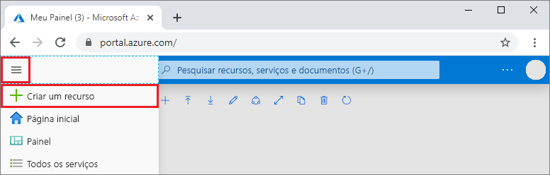
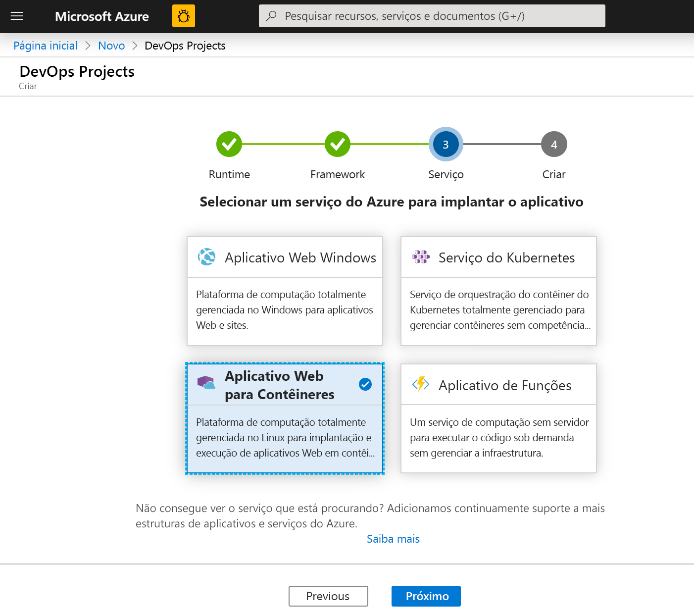
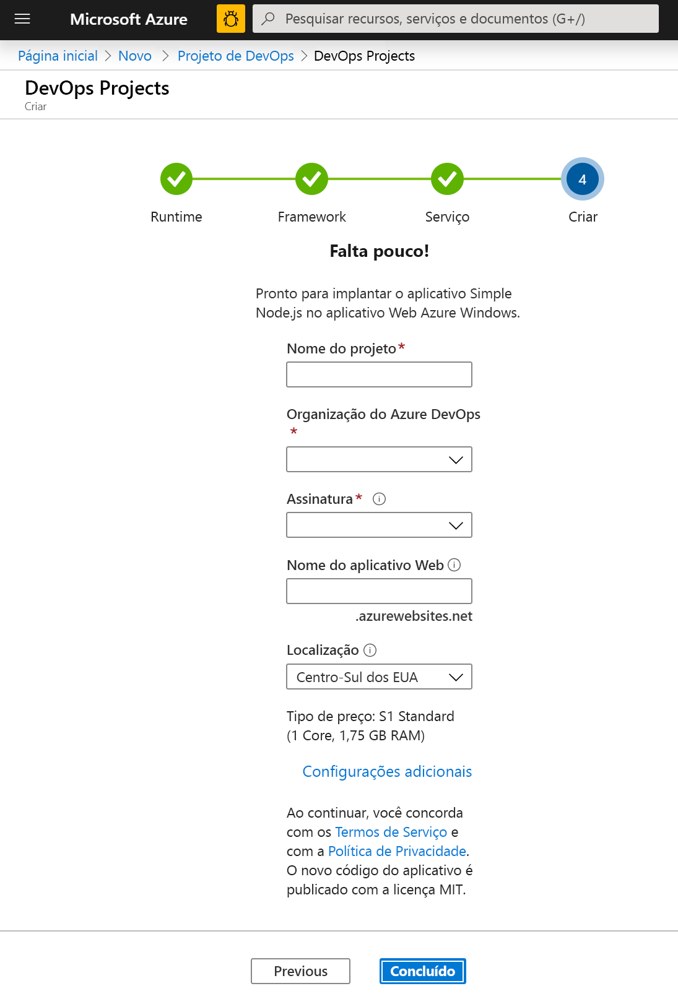
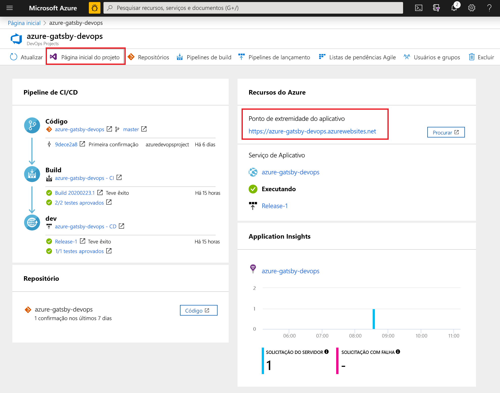
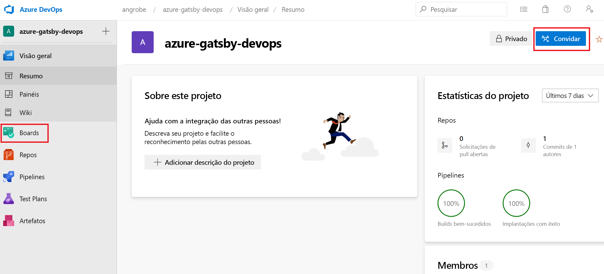
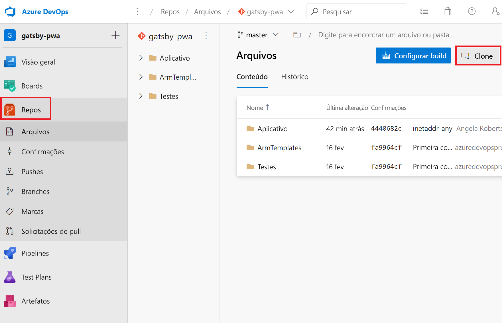
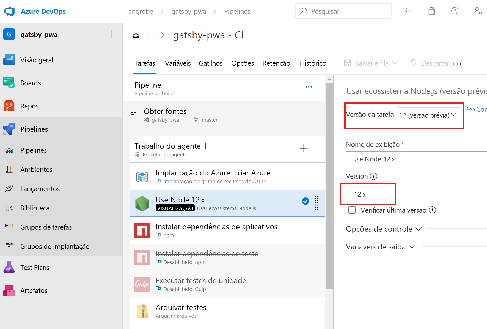
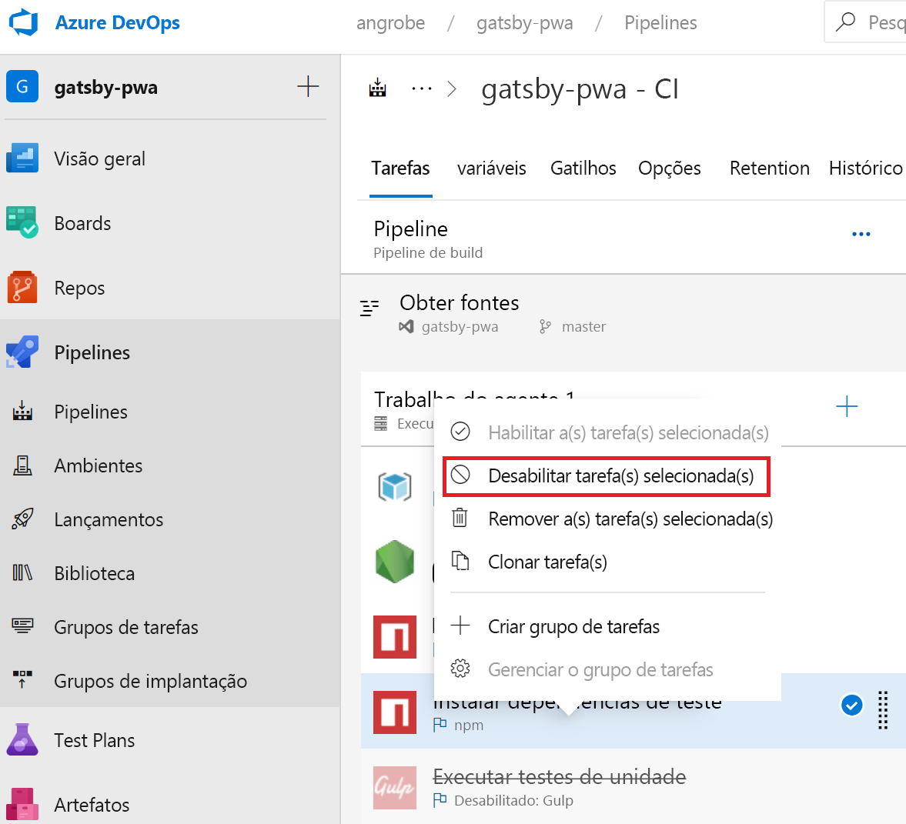
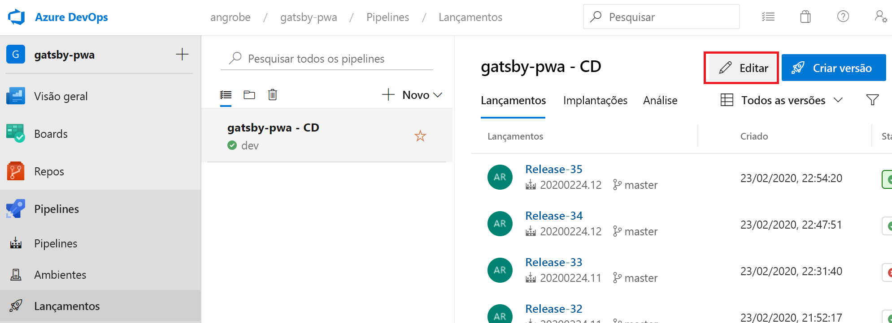
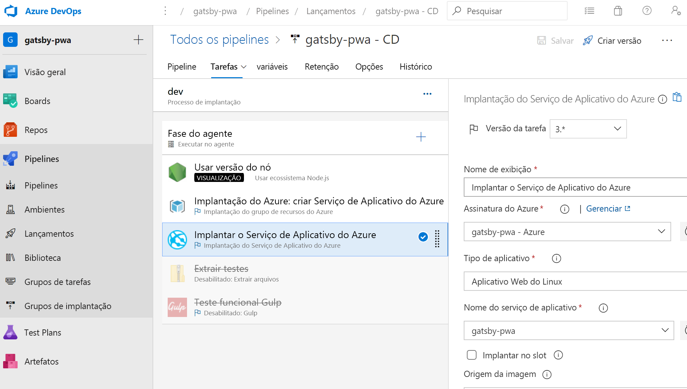

# <a name="create-a-cicd-pipeline-in-azure-pipelines-for-nodejs-with-azure-devops-starter"></a>Criar um pipeline de CI/CD no Azure Pipelines para Node.js com o Azure DevOps Starter

Neste guia de início rápido, você cria um PWA (aplicativo Web progressivo) em NodeJS usando [GatsbyJS](https://www.gatsbyjs.org/) e a experiência de criação de projeto simplificada do Azure DevOps Starter. Quando terminar, você terá um pipeline de CI/CD (integração contínua e entrega contínua) para o PWA no Azure Pipelines. O Azure DevOps Starter configura o que você precisa para desenvolver, implantar e monitorar.

## <a name="prerequisites"></a>Pré-requisitos

- Uma conta do Azure com uma assinatura ativa. [Crie uma conta gratuitamente](https://azure.microsoft.com/free/?ref=microsoft.com&utm_source=microsoft.com&utm_medium=docs&utm_campaign=visualstudio). 
- Uma organização do [Azure DevOps](https://azure.microsoft.com/services/devops/).

## <a name="sign-in-to-the-azure-portal"></a>Entre no Portal do Azure

O DevOps Starter cria um pipeline de CI/CD no Azure Pipelines. É possível criar uma nova organização do Azure DevOps ou usar uma existente. O DevOps Starter também cria recursos do Azure na assinatura do Azure de sua escolha.

1. Entre no [portal do Azure](https://portal.azure.com) e, no painel esquerdo, selecione **Criar um recurso**. 

   

1. Na caixa de pesquisa, digite **DevOps Starter** e selecione. Clique em **Adicionar** para criar um.

    

## <a name="select-a-sample-application-and-azure-service"></a>Selecionar um aplicativo de exemplo e o serviço do Azure

1. Selecione o aplicativo de exemplo do Node.js.   

     

1. A estrutura de exemplo padrão é **Express.js**. Altere a seleção para **Aplicativo Node.js simples** e, em seguida, selecione **Avançar**. 

     

1. Os destinos de implantação disponíveis nesta etapa são determinados pela estrutura do aplicativo selecionada na etapa 2. Neste exemplo, o **Aplicativo Web do Windows** é o destino de implantação padrão. Deixe **Aplicativo Web para Contêineres** definido e selecione **Avançar**.

    

## <a name="configure-a-project-name-and-an-azure-subscription"></a>Configurar um nome de projeto e uma assinatura do Azure

1. Na etapa final do fluxo de trabalho de criação do DevOps Starter, atribua um nome de projeto, selecione uma assinatura do Azure e selecione **Concluído**.  

    

1. Uma página de resumo é exibida enquanto o projeto é compilado e seu aplicativo é implantado no Azure. Após um breve período, um projeto é criado na [organização do Azure DevOps](https://dev.azure.com/) que inclui um repositório git, um quadro Kanban, um pipeline de implantação, planos de teste e os artefatos exigidos pelo seu aplicativo.  

## <a name="managing-your-project"></a>Gerenciando seu projeto

1. Navegue até **Todos os Recursos** e localize o DevOps Starter. Selecione o **DevOps Starter**.

    

1. Você é direcionado a um painel que fornece visibilidade da home page do projeto, do repositório de código, do pipeline de CI/CD e de um link para o aplicativo em execução. Selecione a **Home page do Projeto** para exibir seu aplicativo em **Azure DevOps** e, em outra guia do navegador, selecione o **Ponto de Extremidade do Aplicativo** para exibir o aplicativo de exemplo ao vivo. Alteramos este exemplo posteriormente para usar o PWA gerado pelo GatsbyJS.

     

1. Em seu projeto de Azure DevOps, você pode convidar membros da equipe para colaborar e estabelecer um quadro Kanban para começar a controlar seu trabalho. Para saber mais, clique [aqui](/azure/devops/user-guide/what-is-azure-devops).



## <a name="clone-the-repo-and-install-your-gatsby-pwa"></a>Clonar o repositório e instalar o PWA do Gatsby

O DevOps Starter cria um repositório git no Azure Repos ou no GitHub. Este exemplo criou um repositório do Azure. A próxima etapa é clonar o repositório e fazer alterações.

1. Selecione **Repos** em seu **Projeto do DevOps** e clique em **Clonar**.  Há vários mecanismos para clonar o repositório Git para sua área de trabalho.  Escolha aquele que se adapte à sua experiência de desenvolvimento.  

    

1. Depois que o repositório for clonado para a área de trabalho, faça algumas alterações no modelo inicial. Comece instalando a CLI do GatsbyJS por meio do terminal.

   ```powershell
    npm install -g gatsby
   ```

1. No terminal, navegue até a raiz do repositório. Ele deve conter três pastas parecidas com esta:

    ```powershell
    Mode                LastWriteTime         Length Name
    ----                -------------         ------ ----
    d-----        2/23/2020  10:42 PM                Application
    d-----        2/23/2020   3:05 PM                ArmTemplates
    d-----        2/23/2020   3:05 PM                Tests
    ```
    
1. Não queremos todos os arquivos na pasta do aplicativo porque vamos substituí-los por um iniciador do Gatsby. Execute os comandos a seguir, em sequência, para arrumar isso.
    
    ```powershell
    cp .\Application\Dockerfile .
    rmdir Application
    ```

1. Use a CLI do Gatsby para gerar um PWA de exemplo. Execute `gatsby new` no terminal para iniciar o assistente do PWA e selecione `gatsby-starter-blog` como o modelo inicial. Isto deve ficar semelhante a este exemplo:

    ```powershell
    c:\myproject> gatsby new
    √ What is your project called? ... my-gatsby-project
    ? What starter would you like to use? » - Use arrow-keys. Return to submit.
        gatsby-starter-default
        gatsby-starter-hello-world
    >   gatsby-starter-blog
        (Use a different starter)
    ```
    
1. Agora você tem uma pasta chamada `my-gatsby-project`. Renomeie-a para `Application` e copie o `Dockerfile` nela.
    
    ```powershell
    mv my-gatsby-project Application
    mv Dockerfile Application
    ```
    
1. Em seu editor favorito, abra o Dockerfile e altere a primeira linha de `FROM node:8` para `FROM node:12`. Essa alteração garante que o contêiner use o Node.js versão 12.x em vez da versão 8.x. O GatsbyJS requer versões mais modernas do Node.js.

1. Em seguida, abra o arquivo package.json na pasta do aplicativo e edite o [campo de scripts](https://docs.npmjs.com/files/package.json#scripts) para garantir que seus servidores de desenvolvimento e produção escutem em todas as interfaces de rede disponíveis (por exemplo, 0.0.0.0) e na porta 80. Sem essas configurações, o serviço de aplicativo do contêiner não consegue rotear o tráfego para o aplicativo de Node.js em execução dentro do contêiner. O campo `scripts` deve ser semelhante ao que está abaixo. Especificamente, você tem que alterar os destinos `develop`, `serve` e `start` de seus padrões.

    ```json
      "scripts": {
        "build": "gatsby build",
        "develop": "gatsby develop  -H 0.0.0.0 -p 80",
        "format": "prettier --write \"**/*.{js,jsx,json,md}\"",
        "start": "npm run serve",
        "serve": "npm run build && gatsby serve -H 0.0.0.0 -p 80",
        "clean": "gatsby clean",
        "test": "echo \"Write tests! -> https://gatsby.dev/unit-testing\" && exit 1"
      }
    ```
    
## <a name="edit-your-cicd-pipelines"></a>Editar seus pipelines de CI/CD

1. Antes de confirmar o código na seção anterior, faça algumas alterações em seus pipelines de build e lançamento. Edite o "Pipeline de Build" e atualize a tarefa do Node para usar o Node.js versão 12.x. Defina o campo **Versão da tarefa** como 1.x e o campo **Versão** como 12.x.

    

1. Neste guia de início rápido, não estamos criando testes de unidade e estamos desabilitando essas etapas em nosso pipeline de build. Ao escrever testes, você pode reabilitar essas etapas. Clique com o botão direito do mouse para selecionar as tarefas rotuladas como **Instalar dependências de teste** e **Executar testes de unidade** e desabilite-as.

    

1. Edite seu pipeline de lançamento.

    

1. Assim como no pipeline de build, altere a tarefa do Node para usar 12.x e desabilite as duas tarefas de teste. Seu lançamento deve ser semelhante a esta captura de tela.

    

1. À esquerda do navegador, vá até o arquivo **views/index.pug**.

1. Selecione **Editar**, depois faça uma alteração no cabeçalho h2.  Por exemplo, insira **Começar agora mesmo com o Azure DevOps Starter** ou faça outra alteração.

1. Selecione **Confirmar**, depois salve as alterações.

1. No navegador, acesse o painel do DevOps Starter.   
Agora você deve ver uma compilação em andamento. As alterações feitas são automaticamente compiladas e implantadas por meio de um pipeline de CI/CD.

## <a name="commit-your-changes-and-examine-the-azure-cicd-pipeline"></a>Confirmar suas alterações e examinar o pipeline de CI/CD do Azure

Nas duas etapas anteriores, você adicionou um PWA gerado pelo Gatsby ao repositório Git e editou os pipelines para compilar e implantar o código. Podemos confirmar o código e observá-lo em andamento por meio do pipeline de build e de lançamento.

1. Em um terminal na raiz do repositório Git do seu projeto, execute os seguintes comandos para enviar seu código por push para o projeto do Azure DevOps:

    ```powershell
    git add .
    git commit -m "My first Gatsby PWA"
    git push
    ```
    
1. Um build é iniciado assim que `git push` é concluída. Você pode acompanhar o progresso por meio do **Painel do Azure DevOps**.

3. Após alguns minutos, os pipelines de build e lançamento devem ser concluídos e o PWA deve ser implantado em um contêiner. Clique no link **Ponto de extremidade do aplicativo** no painel acima e você verá um projeto inicial do Gatsby para blogs.

## <a name="clean-up-resources"></a>Limpar os recursos

Exclua o Serviço de Aplicativo do Azure e outros recursos relacionados que você criou quando eles não forem mais necessários. Use a funcionalidade **Excluir** no painel do DevOps Starter.

## <a name="next-steps"></a>Próximas etapas

Quando você configura o processo de CI/CD, os pipelines de build e de lançamento são criados automaticamente. Você pode alterar esses pipelines de build e de lançamento para atender às necessidades de sua equipe. Para saber mais sobre o pipeline de CI/CD, confira:

> [!div class="nextstepaction"]
> [Personalizar o processo de CD](/azure/devops/pipelines/release/define-multistage-release-process)
