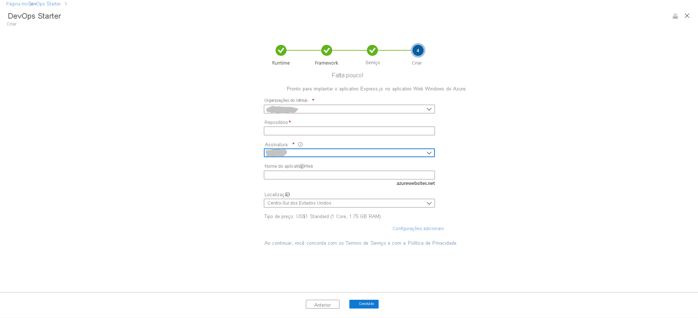

# Tutorial: Implantar o aplicativo Node.js no aplicativo Web do Azure usando o DevOps Starter para o GitHub Actions

O DevOps Starter para o GitHub Actions apresenta uma experiência simplificada na qual é possível escolher um aplicativo de exemplo para criar um fluxo de trabalho de CI (integração contínua) e CD (entrega contínua) a ser implantado no Azure. 

Além disso, o DevOps Starter:
* Cria automaticamente recursos do Azure, como um novo Aplicativo Web do Azure.
* Cria e configura um fluxo de trabalho no GitHub que inclui um trabalho de build para CI.
* O fluxo de trabalho também contém um trabalho de implantação para CD. 
* Cria um recurso do Azure Application Insights para monitoramento.

Neste tutorial, você irá:

> [!div class="checklist"]
> * Usar o DevOps Starter para implantar um aplicativo Node.js
> * Configurar o GitHub e uma assinatura do Azure 
> * Examinar o fluxo de trabalho do GitHub
> * Confirmar alterações no GitHub e implantá-las automaticamente no Azure
> * Configurar o monitoramento do Application Insights
> * Limpar os recursos

## Pré-requisitos

* Uma conta do Azure com uma assinatura ativa. [Crie uma conta gratuitamente](https://azure.microsoft.com/free/).

## Usar o DevOps Starter para implantar um aplicativo Node.js

O DevOps Starter cria um fluxo de trabalho no GitHub. Você pode usar uma organização do GitHub existente. O DevOps Starter também cria recursos do Azure como o Aplicativo Web na assinatura do Azure de sua escolha.

1. Entre no [portal do Azure](https://portal.azure.com).

1. Na caixa de pesquisa, digite **DevOps Starter** e selecione. Clique em **Adicionar** para criar um.

    

1. Verifique se o provedor de CI/CD está selecionado como o **GitHub Actions**.

    

1. Selecione **Node.js** e selecione **Avançar**.

1. Em **Escolher uma estrutura do aplicativo**, selecione **Express.js** e selecione **Avançar**. A estrutura do aplicativo que você escolheu em uma etapa anterior determina o tipo de destino de implantação do serviço do Azure disponível aqui. 

1. Selecione o **Aplicativo Web Windows** e depois selecione **Avançar**.

## Configurar o GitHub e uma assinatura do Azure

1. **Autorize** o GitHub e selecione uma organização do GitHub existente. 

1. Insira um nome para seu **Repositório GitHub**. 

1. Selecione seus serviços de assinatura do Azure. Opcionalmente, você pode selecionar **Alterar** e inserir mais detalhes de configuração, como a localização dos recursos do Azure.
 
1. Insira um nome para o Aplicativo Web e selecione **Concluído**. Depois de alguns minutos, o Aplicativo Web do Azure estará pronto. Um aplicativo de exemplo Node.js é configurado em um repositório em sua organização do GitHub, um fluxo de trabalho é disparado e seu aplicativo é implantado no Aplicativo Web do Azure recém-criado.

       

   Depois de concluído, o painel do DevOps Starter é exibido no portal do Azure. Também é possível navegar até o painel diretamente de **Todos os recursos** no portal do Azure. 

   O painel oferece visibilidade sobre seu repositório de código do GitHub, seu fluxo de trabalho de CI/CD e seu aplicativo em execução no Azure.   

   

O DevOps Starter configura automaticamente um gatilho que implanta alterações de código em seu repositório.
    
## Examinar o fluxo de trabalho do GitHub

Na etapa anterior, o DevOps Starter configurou automaticamente um fluxo de trabalho do GitHub completo. Explore e personalize o fluxo de trabalho conforme necessário. Siga as etapas a seguir para se familiarizar com o fluxo de trabalho.

1. Na esquerda do painel do DevOps Starter, selecione o **fluxo de trabalho do GitHub**. Esse link abre uma guia de navegador e o fluxo de trabalho do GitHub do seu novo projeto.
    > [!NOTE]
    > Não renomeie o arquivo de fluxo de trabalho. O nome do arquivo de fluxo de trabalho deve ser **devops-starter-workflow.yml** para que o painel reflita as alterações

1. O arquivo YAML do fluxo de trabalho contém todas as GitHub Actions necessárias para criar e implantar o aplicativo. Clique na opção **editar arquivo** para personalizar o arquivo de fluxo de trabalho.

1. Na guia **Código** do repositório, clique em **confirmações**. Essa exibição mostra as confirmações de código associadas à implantação específica.

1. Na guia **Ações** do repositório, você pode ver o histórico de todas as execuções de fluxo de trabalho do seu repositório.

1. Selecione a **execução mais recente** para ver todos os trabalhos que foram executados no fluxo de trabalho.

1. Clique nos **trabalhos** para ver os logs detalhados da execução do fluxo de trabalho. Os logs contêm informações úteis sobre o processo de implantação. Eles podem ser exibidos durante e após as implantações.

1. Clique na guia **Solicitação de pull** para ver todas as solicitações de pull em seu repositório

## Confirmar as alterações de código e executar CI/CD

O DevOps Starter cria um repositório no GitHub. Para exibir o repositório e fazer alterações de código no seu aplicativo, faça o seguinte:

1. Na esquerda do painel do DevOps Starter, selecione o link para a ramificação principal. Esse link abre uma exibição do repositório do GitHub recém-criado.

1. Para exibir a URL de clone do repositório, selecione **Clone** na parte superior direita do navegador. Você pode clonar seu repositório Git no seu IDE favorito. Nas próximas etapas, você pode usar o navegador da Web para criar e confirmar as alterações de código diretamente na ramificação principal.

1. À esquerda do navegador, acesse o arquivo **/Application/views/index.pug**.

1. Selecione **Editar**, depois faça uma alteração de alguma parte do texto.
    Por exemplo, altere partes do texto de uma das marcas.

1. Selecione **Confirmar**, depois salve as alterações.

1. No navegador, acesse o painel do DevOps Starter.   
Agora você deve ver um trabalho de build do fluxo de trabalho do GitHub em andamento. As alterações que você acabou de fazer são criadas e implantadas automaticamente por meio de um fluxo de trabalho do GitHub.

1. Depois de concluir a implantação, atualize o aplicativo para verificar as alterações.

## Configurar o monitoramento do Application Insights

Com o Azure Application Insights, você pode monitorar facilmente o aplicativo quanto à sua disponibilidade e uso. O DevOps Starter configura automaticamente um recurso do Application Insights para seu aplicativo. Além disso você pode configurar vários alertas e recursos de monitoramento conforme necessário.

1. No portal do Azure, vá até o painel do DevOps Starter. 

1. No canto inferior direito, selecione o link **Application Insights** para seu aplicativo. O painel do **Application Insights** é aberto. Essa exibição contém informações de uso, desempenho e monitoramento da disponibilidade do seu aplicativo.

    

1. Selecione **Intervalo de tempo** e selecione **Última hora**. Para filtrar os resultados, selecione **Atualizar**. Agora você consegue exibir todas as atividades dos últimos 60 minutos. 
    
1. Para sair do intervalo de tempo, selecione **x**.

1. Selecione **Alertas** e selecione **Adicionar alerta de métrica**. 

1. Insira um nome para o alerta.

1. Na lista suspensa **Métrica**, examine as várias métricas de alerta. O alerta padrão é para um **tempo de resposta do servidor maior do que 1 segundo**. Você pode configurar facilmente vários alertas para melhorar os recursos de monitoramento do seu aplicativo.

1. Marque a caixa de seleção **Notificar proprietários, colaboradores e leitores por email**. Como opção, você pode executar ações adicionais quando um alerta é exibido executando um aplicativo lógico do Azure.

1. Selecione **OK** para criar o alerta. Em poucos instantes, o alerta será exibido como ativo no painel. 

1. Saia da área de **Alertas** e volte até o painel do **Application Insights**.

1. Selecione **Disponibilidade** e selecione **Adicionar teste**. 

1. Insira um nome de teste e selecione **Criar**. Um teste de ping simples é criado para verificar a disponibilidade do seu aplicativo. Depois de alguns minutos, os resultados de teste estão disponíveis e o painel do Application Insights exibe um status de disponibilidade.

## Limpar os recursos

Caso esteja fazendo testes, é possível evitar o acúmulo de encargos de cobrança limpando seus recursos. Quando eles não forem mais necessários, será possível excluir a máquina virtual do Azure e os recursos relacionados criados neste tutorial. Para fazer isso, use a funcionalidade **Excluir** no painel do DevOps Starter. 

> [!IMPORTANT]
> O procedimento a seguir exclui os recursos permanentemente. A funcionalidade *Excluir* destrói os dados criados pelo projeto no DevOps Starter no Azure, e não será possível recuperá-los. Só use esse procedimento depois de ler os prompts com cuidado.

1. No portal do Azure, vá até o painel do DevOps Starter.
1. No canto superior direito, selecione **Excluir**. 
1. No prompt, selecione **Sim** para *excluir permanentemente* os recursos.

Opcionalmente, você pode modificar o fluxo de trabalho para atender às necessidades da sua equipe. Você também pode usar esse padrão de CI/CD como um modelo para outros repositórios. 

## Próximas etapas

Neste tutorial, você aprendeu a:

> [!div class="checklist"]
> * Usar o DevOps Starter para implantar um aplicativo Node.js
> * Configurar o GitHub e uma assinatura do Azure 
> * Examinar o fluxo de trabalho do GitHub
> * Confirmar alterações no GitHub e implantá-las automaticamente no Azure
> * Configurar o monitoramento do Application Insights
> * Limpar os recursos

Para saber mais sobre o GitHub Actions e fluxos de trabalho, confira:

> [!div class="nextstepaction"]
> [Personalizar fluxo de trabalho do GitHub](https://docs.github.com/actions/configuring-and-managing-workflows/configuring-and-managing-workflow-files-and-runs)
