# <a name="quickstart-create-a-hybrid-mode-instance-with-azure-portal--azure-database-migration-service"></a>Início Rápido: Criar uma instância do modo híbrido com portal do Azure e Serviço de Migração de Banco de Dados do Azure

O modo híbrido do Serviço de Migração de Banco de Dados do Azure gerencia migrações de banco de dados usando um trabalho de migração hospedado localmente junto com uma instância do Serviço de Migração de Banco de Dados do Azure em execução na nuvem. O modo híbrido é especialmente útil para cenários nos quais há uma falta de conectividade site a site entre a rede local e o Azure ou se há largura de banda de conectividade limitada de site a site.

>[!NOTE]
>Atualmente, o Serviço de Migração de Banco de Dados do Azure em execução no modo híbrido é compatível com migrações do SQL Server para:
>
>- Instância Gerenciada de SQL do Azure com tempo de inatividade quase zero (online).
>- Banco de Dados SQL do Azure individual com algum tempo de inatividade (offline).
>- MongoDb para Azure CosmosDB com tempo de inatividade quase zero (online).
>- MongoDb para Azure CosmosDB com algum tempo de inatividade (offline).

Nesse Início Rápido, use o portal do Azure para criar uma instância do Serviço de Migração de Banco de Dados do Azure no modo híbrido. Posteriormente, você baixa, instala e configura o Hybrid Worker em sua rede local. Durante a versão prévia, é possível usar o modo híbrido do Serviço de Migração de Banco de Dados do Azure para migrar dados de uma instância local do SQL Server para o Banco de Dados SQL do Azure.

> [!NOTE]
> O instalador híbrido do Serviço de Migração de Banco de Dados do Azure é executado no Microsoft Windows Server 2012 R2, no Windows Server 2016, no Windows Server 2019 e no Windows 10.

> [!IMPORTANT]
> O instalador híbrido do Serviço de Migração de Banco de Dados do Azure requer o .NET 4.7.2 ou posterior. Para encontrar as versões mais recentes do .NET, confira a página [Baixar o .NET Framework](https://dotnet.microsoft.com/download/dotnet-framework).

Se você não tiver uma assinatura do Azure, crie uma conta [gratuita](https://azure.microsoft.com/free/) antes de começar.

## <a name="sign-in-to-the-azure-portal"></a>Entre no Portal do Azure

Abra seu navegador da Web, navegue até o [portal do Microsoft Azure](https://portal.azure.com/) e insira suas credenciais para entrar no portal.

A exibição padrão é o painel de serviço.

## <a name="register-the-resource-provider"></a>Registre o provedor de recursos

Registre o provedor de recursos Microsoft.DataMigration antes de criar sua primeira instância do Serviço de Migração de Banco de Dados do Azure.

1. No portal do Azure, selecione **Assinaturas**, escolha a assinatura na qual você deseja criar a instância do Serviço de Migração de Banco de Dados do Azure e, em seguida, selecione **Provedores de recursos**.

    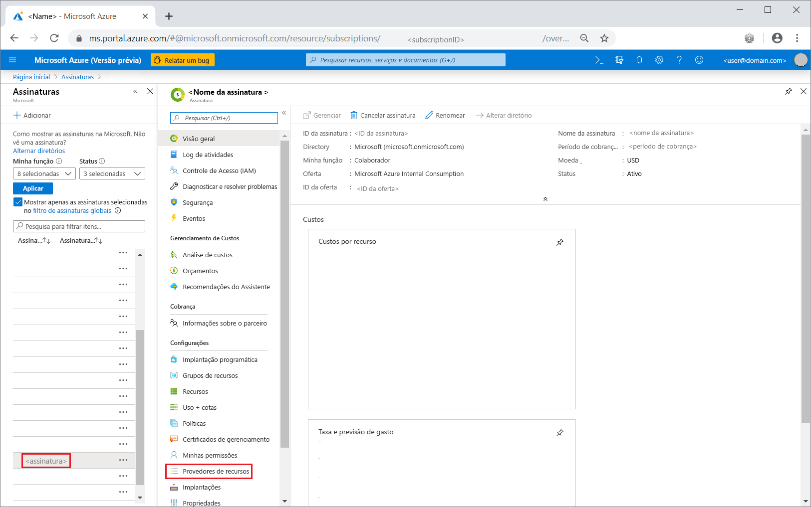

2. Pesquise por migração e, em seguida, à direita do **Microsoft.DataMigration**, selecione **Registrar**.

    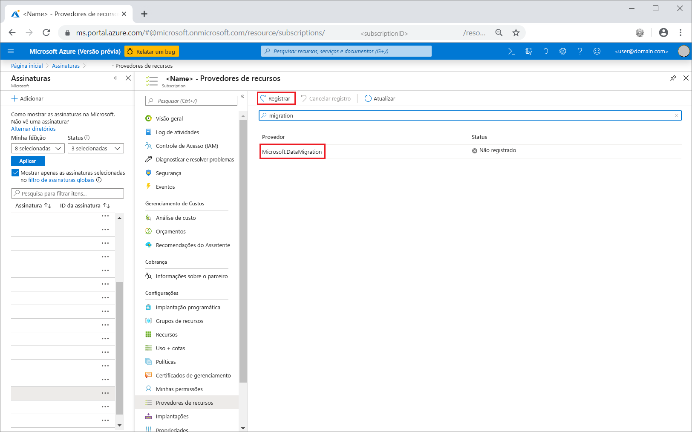

## <a name="create-an-instance-of-the-service"></a>Crie uma instância do serviço

1. Selecione +**Criar um recurso** para criar uma instância do Serviço de Migração de Banco de Dados do Azure.

2. Pesquise "migração" no Marketplace, selecione **Serviço de Migração de Banco de Dados do Azure** e, em seguida, na tela **Serviço de Migração de Banco de Dados do Azure**, selecione **Criar**.

3. Na tela **Criar Serviço de Migração**:

    - Escolha um **Nome de Serviço** que seja fácil de lembrar e exclusivo para identificar sua instância do Serviço de Migração de Banco de Dados do Azure.
    - Selecione a **Assinatura** do Azure na qual quer criar a instância.
    - Selecione um **Grupo de Recursos** existente ou crie um novo.
    - Escolha o **Local** mais próximo ao seu servidor de origem ou de destino.
    - No **Modo de serviço**, selecione **Híbrido (versão prévia)** .

         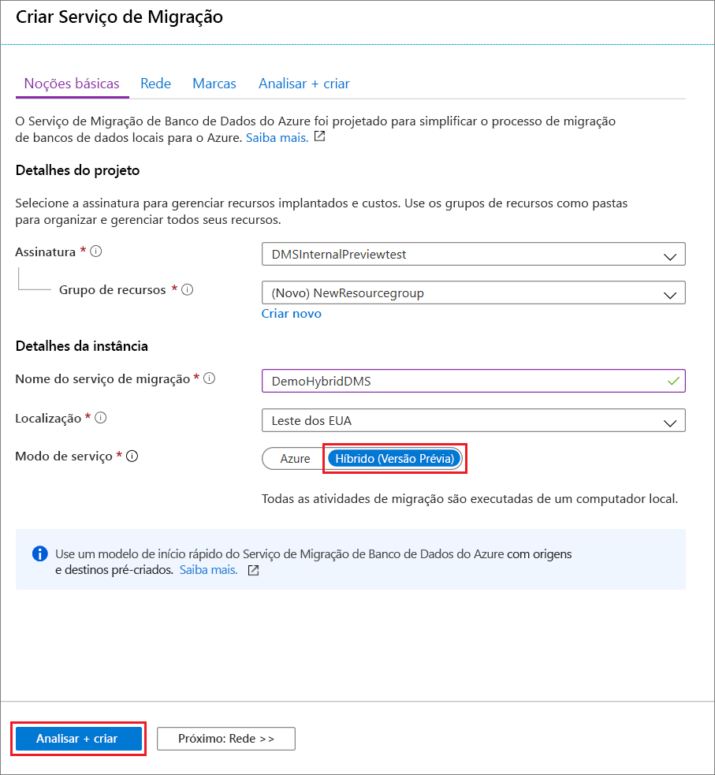

4. Selecione **Examinar + criar**.

5. Na guia **Examinar + criar**, revise os Termos, verifique as outras informações fornecidas e, em seguida, selecione **Criar**.

    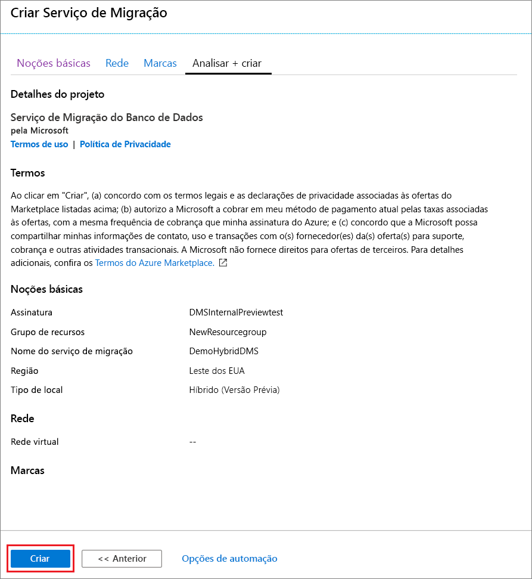

    Após alguns instantes, sua instância do Serviço de Migração de Banco de Dados do Azure no modo híbrido é criada e estará pronta para uso. A instância do Serviço de Migração de Banco de Dados do Azure é exibida conforme mostrado na imagem a seguir:

    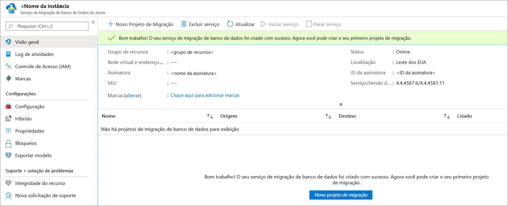

6. Depois que o serviço for criado, selecione **Propriedades** e, em seguida, copie o valor exibido na caixa **ID do recurso**, que será usado para instalar o Hybrid Worker do Serviço de Migração de Banco de Dados do Azure.

    

## <a name="create-azure-app-registration-id"></a>Criar a ID de registro do Aplicativo Azure

Você precisa criar uma ID de registro do Aplicativo Azure que o Hybrid Worker local possa usar para se comunicar com o Serviço de Migração de Banco de Dados do Azure na nuvem.

1. No portal do Azure, selecione **Azure Active Directory**, escolha **Registros de aplicativos** e, em seguida, selecione **Novo registro**.
2. Especifique um nome para o aplicativo e, em seguida, em **Tipos de conta com suporte**, selecione os tipos de contas com suporte para especificar quem pode usar o aplicativo.

    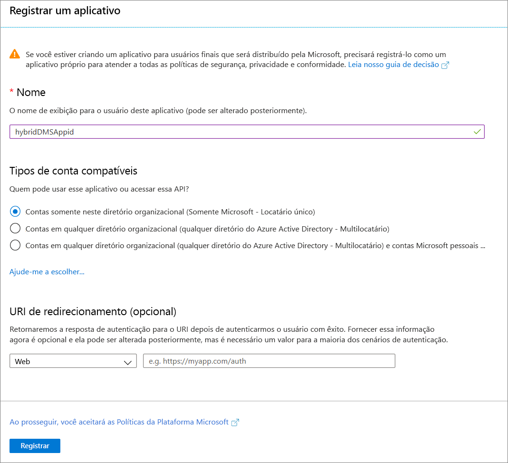

3. Use os valores padrão para os campos **URI de redirecionamento (opcional)** e, em seguida, selecione **Registrar**.

4. Após concluir o registro da ID do aplicativo, anote a **ID do aplicativo (cliente)** , que será usada ao instalar o Hybrid Worker.

5. Na portal do Azure, navegue até Serviço de Migração de Banco de Dados do Azure, selecione **IAM (controle de acesso)** e, em seguida, selecione **Adicionar atribuição de função** para atribuir acesso de colaborador à ID do aplicativo.

    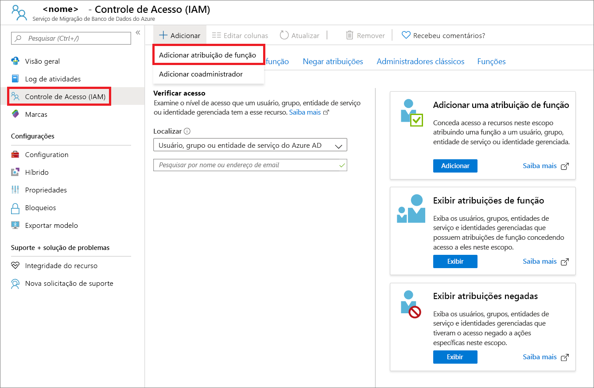

6. Selecione **Colaborador** como a função, atribua acesso à **Entidade de serviço ou usuário do Azure AD** e, em seguida, selecione o nome da ID do aplicativo.

    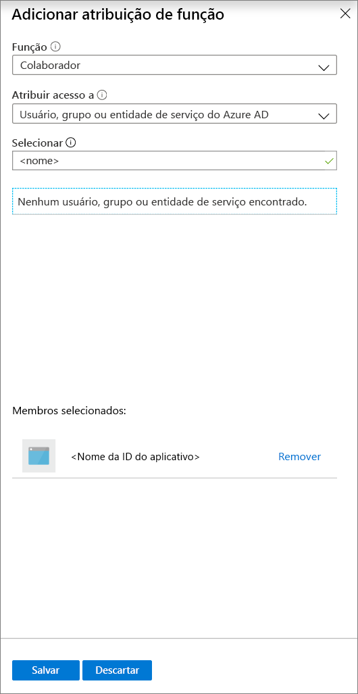

7. Selecione **Salvar** para salvar a atribuição de função para a ID do aplicativo no recurso de Serviço de Migração de Banco de Dados do Azure.

## <a name="download-and-install-the-hybrid-worker"></a>Baixar e instalar o Hybrid Worker

1. Na portal do Azure, navegue até sua instância do Serviço de Migração de Banco de Dados do Azure.

2. Em **Configurações**, selecione **Híbrido** e, em seguida, selecione **Baixar o instalador** para baixar o Hybrid Worker.

    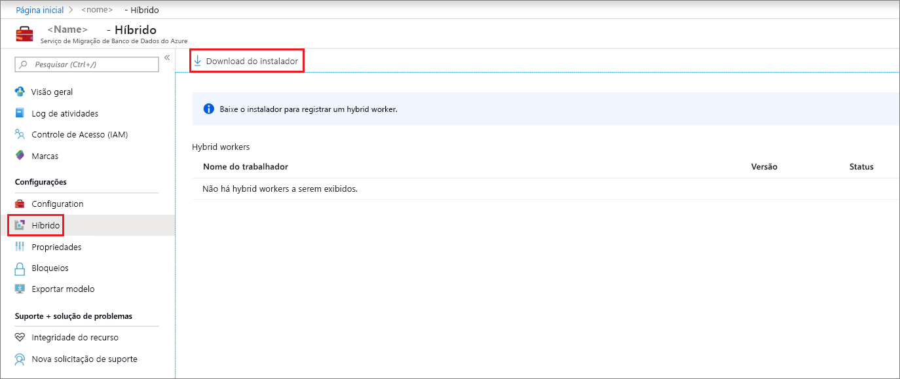

3. Extraia o arquivo ZIP no servidor que hospedará o Hybrid Worker do Serviço de Migração de Banco de Dados do Azure.

    > [!IMPORTANT]
    > O instalador híbrido do Serviço de Migração de Banco de Dados do Azure requer o .NET 4.7.2 ou posterior. Para encontrar as versões mais recentes do .NET, confira a página [Baixar o .NET Framework](https://dotnet.microsoft.com/download/dotnet-framework).

4. Na pasta de instalação, localize e abra o arquivo **dmsSettings.json**, especifique o **ApplicationId** e **resourceId** e salve o arquivo.

    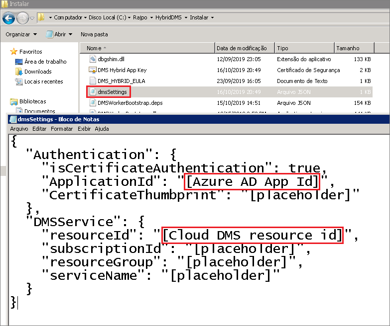

5. Gere um certificado que o Serviço de Migração de Banco de Dados do Azure possa usar para autenticar a comunicação do Hybrid Worker usando o comando a seguir.

    ```
    <drive>:\<folder>\Install>DMSWorkerBootstrap.exe -a GenerateCert
    ```

    Um certificado é gerado na pasta de instalação.

    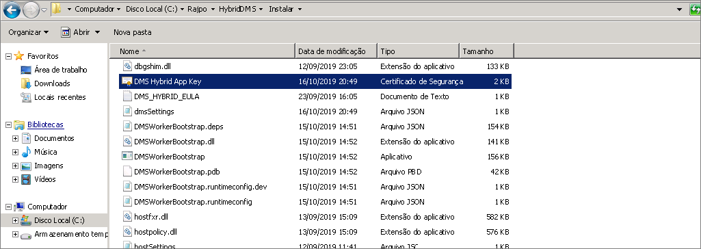

6. No portal do Azure, navegue até a ID do aplicativo, em **Gerenciar**, selecione **Certificado e segredos** e, em seguida, selecione **Carregar certificado** para selecionar o certificado público que você gerou.

    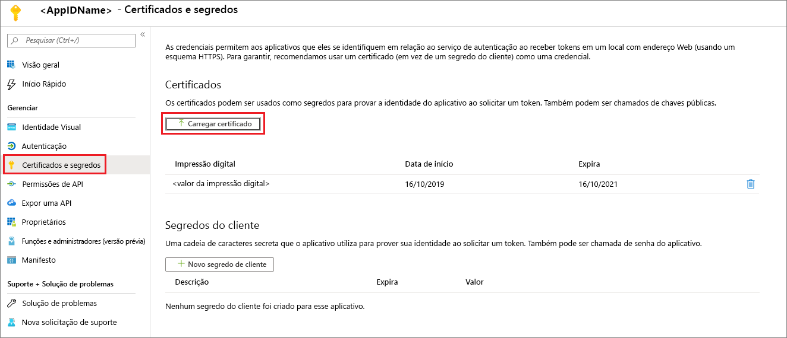

7. Instale o Hybrid Worker do Serviço de Migração de Banco de Dados do Azure em seu servidor local executando o seguinte comando:

    ```
    <drive>:\<folder>\Install>DMSWorkerBootstrap.exe -a Install -IAcceptDMSLicenseTerms -d
    ```

    > [!NOTE]
    > Ao executar o comando install, você também pode usar os seguintes parâmetros:
    >
    > - **-TelemetryOptOut** – impede que a função de trabalho de enviar telemetria, mas continua a registrar localmente no mínimo.  O instalador ainda envia telemetria.
    > - **-p {InstallLocation}** . Permite alterar o caminho de instalação, que, por padrão, é "C:\Program Files\DatabaseMigrationServiceHybrid".

8. Se o instalador for executado sem erros, o serviço mostrará um status online no Serviço de Migração de Banco de Dados do Azure e você estará pronto para migrar seus bancos de dados.

    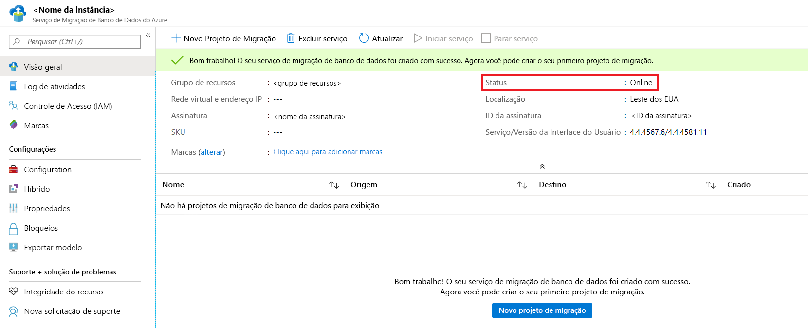

## <a name="uninstall-azure-database-migration-service-hybrid-mode"></a>Desinstalar o modo híbrido do Serviço de Migração de Banco de Dados do Azure

Atualmente, a desinstalação do modo híbrido do Serviço de Migração de Banco de Dados do Azure tem suporte apenas por meio do instalador do Hybrid Worker do Serviço de Migração de Banco de Dados do Azure no servidor local, usando o seguinte comando:

```
<drive>:\<folder>\Install>DMSWorkerBootstrap.exe -a uninstall
```

> [!NOTE]
> Ao executar o comando de desinstalação, você também pode usar o parâmetro "-ReuseCert", que mantém o certificado AdApp gerado pelo fluxo de trabalho do generateCert.  Isso permite usar o mesmo certificado que foi gerado e carregado anteriormente.

## <a name="set-up-the-azure-database-migration-service-hybrid-worker-using-powershell"></a>Configurar o Hybrid Worker do Serviço de Migração de Banco de Dados do Azure usando o PowerShell

Além da instalação do Hybrid Worker do Serviço de Migração de Banco de Dados do Azure por meio do portal do Azure, fornecemos um [script do PowerShell](https://techcommunity.microsoft.com/gxcuf89792/attachments/gxcuf89792/MicrosoftDataMigration/119/1/DMS_Hybrid_Script.zip) que você pode usar para automatizar as etapas de instalação do Hybrid Worker depois de criar uma instância do Serviço de Migração de Banco de Dados do Azure no modo híbrido. O script:

1. Cria um AdApp.
2. Baixa o instalador.
3. Executa o fluxo de trabalho generateCert.
4. Carrega o certificado.
5. Adiciona o AdApp como colaborador à sua instância do Serviço de Migração de Banco de Dados do Azure.
6. Executa o fluxo de trabalho de instalação.

Esse script destina-se a uma rápida criação de protótipos quando o usuário já tem todas as permissões necessárias no ambiente. Observe que, em seu ambiente de produção, o AdApp e o CERT podem ter requisitos diferentes, de modo que o script pode falhar.

> [!IMPORTANT]
> Esse script pressupõe que há uma instância do Serviço de Migração de Banco de Dados do Azure no modo híbrido e que a conta do Azure usada tenha permissões para criar AdApps no locatário e para modificar o Azure RBAC na assinatura.

Preencha os parâmetros na parte superior do script e, em seguida, executar o script de uma instância de Administrador do PowerShell.

## <a name="next-steps"></a>Próximas etapas

> [!div class="nextstepaction"]
> [Migrar o SQL Server para uma Instância Gerenciada de SQL do Azure online](tutorial-sql-server-managed-instance-online.md)
> [Migrar o SQL Server para um Banco de Dados SQL do Azure offline](tutorial-sql-server-to-azure-sql.md)
