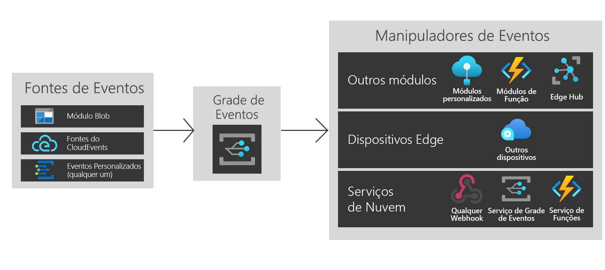

# O que é a Grade de Eventos do Azure no Azure IoT Edge?
A Grade de Eventos no IoT Edge traz a potência e a flexibilidade da Grade de Eventos do Azure para a borda. Crie tópicos, publique eventos e assine vários destinos, sejam eles módulos no mesmo dispositivo, em outros dispositivos de borda ou serviços na nuvem.

Assim como ocorre na nuvem, o módulo da Grade de Eventos no IoT Edge lida com o roteamento, a filtragem e a entrega confiável de eventos em escala. Filtre eventos para garantir que apenas eventos relevantes sejam enviados a manipuladores de eventos diferentes usando filtros avançados de cadeia de caracteres, numéricos e boolianos. A lógica de repetição de tentativa verifica se o evento alcança o destino do alvo mesmo se ele não está disponível no momento da publicação. Ela permite que você use a Grade de Eventos no IoT Edge como um mecanismo avançado de armazenamento e encaminhamento.

A Grade de Eventos no IoT Edge dá suporte ao CloudEvents v1.0 e a esquemas de evento personalizados. Ela dá suporte à mesma semântica Pub/Sub como Grade de Eventos na nuvem para facilitar a interoperabilidade.

Este artigo fornece uma visão geral da Grade de Eventos do Azure no IoT Edge. Para obter instruções detalhadas sobre como usar esse módulo no Edge, confira [Publicar e assinar eventos localmente](pub-sub-events-webhook-local.md). 

Esta imagem mostra algumas das maneiras como você pode usar a Grade de Eventos no IoT Edge e não é uma lista abrangente das funcionalidades com suporte.

## Quando usar a Grade de Eventos no IoT Edge

A Grade de Eventos no IoT Edge fornece um modelo de eventos confiável e fácil de usar entre a borda e a nuvem.

A Grade de Eventos no IoT Edge foi criada com uma área de superfície de runtime simétrica para o serviço de nuvem do Azure, para que você possa usar os mesmos eventos e chamadas à API onde for necessário. Quer você efetue as operações de pub/sub na nuvem, na borda ou entre as duas, a Grade de Eventos no IoT Edge agora pode ser sua solução ideal.

Use a Grade de Eventos no IoT Edge para disparar fluxos de trabalho simples entre módulos. Por exemplo, crie um tópico e publique eventos de "blob de armazenamento criado" do seu módulo de armazenamento para o tópico. Agora, você pode assinar uma ou várias funções ou módulos personalizados para esses tópicos.

Estenda sua funcionalidade entre dispositivos de borda. Se estiver publicando eventos de módulo de blob e quiser usar a capacidade computacional de vários dispositivos de borda próximos, crie assinaturas entre dispositivos.

Por fim, conecte-se à nuvem. Se seus eventos de módulo de blob são sincronizados periodicamente com a nuvem, usam a computação mais ampla disponível na nuvem ou enviam dados processados para cima, crie assinaturas de serviço de nuvem adicionais.

A Grade de Eventos no IoT Edge fornece uma arquitetura de eventos desacoplada flexível e confiável.

## Origens de eventos

Assim como ocorre na nuvem, a Grade de Eventos no IoT Edge permite a integração direta entre os módulos para criar arquiteturas controladas por eventos. No momento, os eventos podem ser enviados para a Grade de Eventos no IoT Edge de:

* Armazenamento de Blobs do Azure no IoT Edge
* Origens de CloudEvents
* Módulos e contêineres personalizados via HTTP POST

## Manipuladores de eventos

A Grade de Eventos no IoT Edge foi criada para enviar eventos para qualquer lugar que você desejar. Atualmente, há suporte para os seguintes destinos:

* Outros módulos, incluindo o Hub IoT, funções e módulos personalizados
* Outros dispositivos de borda
* WebHooks
* Serviço de nuvem da Grade de Eventos do Azure
* Hubs de Eventos
* Filas de barramento de serviço
* Tópicos do Service Bus
* Filas de Armazenamento

## Ambientes compatíveis
Atualmente, os ambientes do Windows de 64 bits, Linux de 64 bits e ARM de 32 bits são compatíveis.

## Conceitos

Há cinco conceitos da Grade de Eventos do Azure que possibilitam que você comece a usá-la:

* **Eventos** – o que aconteceu.
* **Origens do evento** – onde o evento ocorreu.
* **Tópicos** – o ponto de extremidade para onde os publicadores enviam eventos.
* **Assinaturas de evento** – o ponto de extremidade ou o mecanismo interno para encaminhar eventos; às vezes, para mais de um manipulador. As assinaturas também são usadas por manipuladores para filtrar de forma inteligente os eventos de entrada.
* **Manipuladores de eventos** – o aplicativo ou serviço que reage ao evento.

## Custo

A Grade de Eventos no IoT Edge é gratuita durante a versão prévia pública.

## Problemas
Relate problemas com o uso da Grade de Eventos no IoT Edge em [https://github.com/Azure/event-grid-iot-edge/issues](https://github.com/Azure/event-grid-iot-edge/issues).

## Próximas etapas

* [Publicar e assinar eventos no local](pub-sub-events-webhook-local.md)
* [Publicar e assinar eventos na nuvem](pub-sub-events-webhook-cloud.md)
* [Encaminhar eventos para a nuvem da Grade de Eventos](forward-events-event-grid-cloud.md)
* [Encaminhar eventos para Hub IoT](forward-events-iothub.md)
* [Reagir aos eventos do Armazenamento de Blobs localmente](react-blob-storage-events-locally.md)