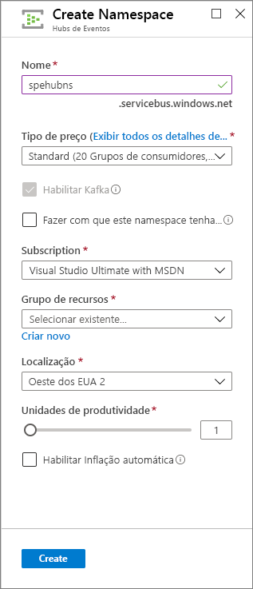
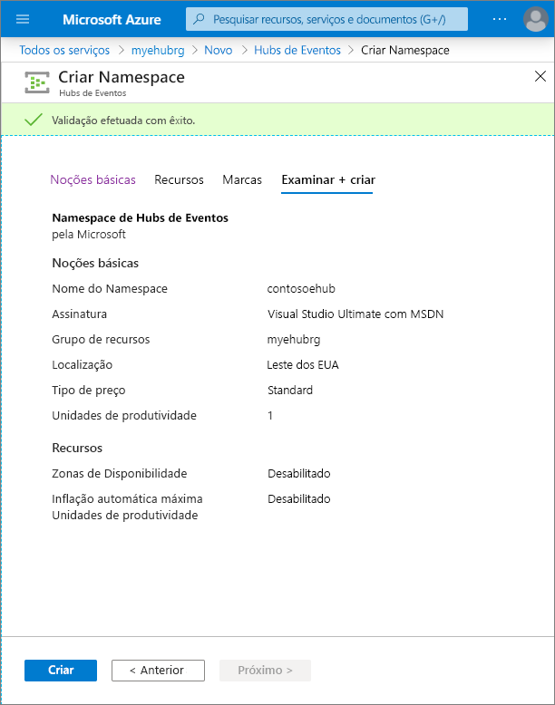
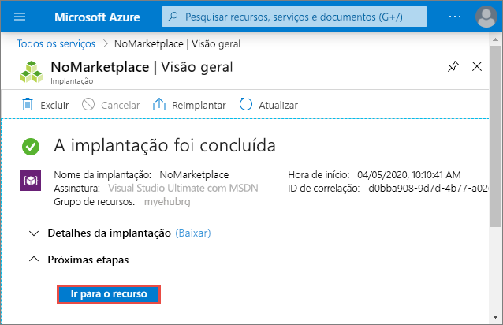
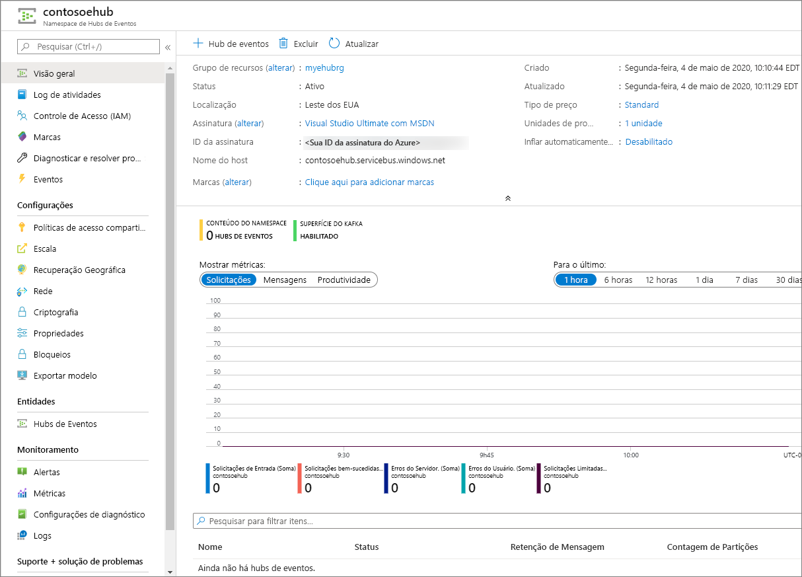

# Início Rápido: Criar um hub de eventos usando o portal do Azure
Os Hubs de Eventos do Azure são uma plataforma de streaming de Big Data e um serviço de ingestão de eventos capaz de receber e processar milhões de eventos por segundo. Os Hubs de Eventos podem processar e armazenar eventos, dados ou telemetria produzidos pelos dispositivos e software distribuídos. Os dados enviados para um Hub de Eventos podem ser transformados e armazenados usando qualquer provedor de análise em tempo real ou adaptadores de envio em lote/armazenamento. Para obter uma visão detalhada dos Hubs de Eventos, confira [Visão geral de Hubs de Eventos](event-hubs-about.md) e [Recursos de Hubs de Eventos](event-hubs-features.md).

Neste início rápido, você cria um hub de eventos usando o [portal do Azure](https://portal.azure.com).

## Pré-requisitos

Para concluir este início rápido, verifique se você tem:

- Assinatura do Azure. Se você não tiver [uma conta gratuita](https://azure.microsoft.com/free/), crie uma antes de começar.

## Criar um grupo de recursos

Um grupo de recursos é uma coleção lógica dos recursos do Azure. Todos os recursos são implantados e gerenciados em um grupo de recursos. Para criar um grupo de recursos:

1. Entre no [portal do Azure](https://portal.azure.com).
1. No painel de navegação esquerdo, clique em **Grupos de recursos**. Clique em **Adicionar**.

   

1. Para **Assinatura**, selecione o nome da assinatura do Azure na qual você deseja criar o grupo de recursos.
1. Digite um **nome exclusivo para o grupo de recursos**. O sistema imediatamente verifica para ver se o nome está disponível na assinatura do Azure selecionada no momento.
1. Selecione uma **região** para o grupo de recursos.
1. Selecione **Examinar + criar**.

   
1. Na página **Examinar + Criar**, selecione **Criar**. 

## Criar um namespace de Hubs de Eventos

Um namespace de Hubs de Eventos fornece um contêiner de escopo exclusivo, referenciado pelo nome de domínio totalmente qualificado, em que você cria uma ou mais hubs de eventos. Para criar um namespace em seu grupo de recursos usando o portal, faça o seguinte:

1. Faça logon no portal do Azure e clique em **Criar um recurso** na parte superior esquerda da tela.
1. Selecione **Todos os serviços** no menu à esquerda e selecione **estrela (`*`)** ao lado de **Hubs de Eventos** na categoria **Análise**. Confirme que **Hubs de Eventos** foi adicionado à **FAVORITOS** no menu de navegação à esquerda. 
    
   
1. Selecione **Hubs de Eventos** em **FAVORITOS** no menu de navegação à esquerda e selecione **Adicionar** na barra de ferramentas.

   
1. Na página **Criar namespace**, execute as seguintes etapas:  
   1. Selecione a **assinatura** na qual você deseja criar o namespace.  
   1. Selecione o **grupo de recursos** criado na etapa anterior.   
   1. Insira um **nome** para o namespace. O sistema imediatamente verifica para ver se o nome está disponível.  
   1. Selecione uma **localização** para o namespace.      
   1. Escolha o **tipo de preço** (Básico ou Standard).    
   1. Não altere as configurações das **unidades de produtividade**. Para saber mais sobre as unidades de produtividade, confira [Escalabilidade de Hubs de Eventos](event-hubs-scalability.md#throughput-units).  
   1. Selecione **Examinar + Criar** na parte inferior da página.
      
      
   1. Na página **Examinar + Criar**, examine as configurações e selecione **Criar**. Aguarde até que a implantação seja concluída. 
      
      
      
   1. Na página **Implantação**, selecione **Ir para o recurso** para navegar até a página de seu namespace. 
      
        
   1. Confirme que você vê a página **Namespace dos Hubs de Eventos** semelhante ao seguinte exemplo:   
      
             

      > [!NOTE]
      > Hubs de Eventos do Azure fornecem um ponto de extremidade do Kafka. Esse ponto de extremidade permite que seu namespace de Hubs de eventos entenda nativamente a mensagem de protocolo [Kafka Apache](https://kafka.apache.org/intro) e as APIs. Com essa funcionalidade, você pode se comunicar com seus Hubs de eventos, como você faria com tópicos Kafka sem alterar seus clientes de protocolo ou seus próprio clusters em execução. Hubs de Eventos dão suporte para [Apache Kafka versão 1.0.](https://kafka.apache.org/10/documentation.html) e posterior. Para obter mais informações, confira [Usar os Hubs de Eventos de aplicativos Apache Kafka](event-hubs-for-kafka-ecosystem-overview.md).
    
## Criar um Hub de Evento

Para criar um hub de eventos dentro do namespace, faça o seguinte:

1. Na página Namespace de Hubs de Eventos, selecione **Hubs de Eventos** no menu à esquerda.
1. Na parte superior da janela, clique em **+ Hub de Eventos**.
   
    
1. Digite um nome para seu hub de eventos e clique em **Criar**.
   
    
1. Você pode verificar o status da criação do hub de eventos em alertas. Depois que o hub de eventos for criado, você o verá na lista de Hubs de Eventos conforme mostrado na imagem a seguir:

    

## Próximas etapas

Neste artigo, você criou um grupo de recursos, um namespace de Hubs de Eventos e um hub de eventos. Para obter instruções passo a passo sobre como enviar eventos (ou) receber eventos de um hub de eventos, confira os tutoriais para **Enviar e receber eventos**: 

- [.NET Core](get-started-dotnet-standard-send-v2.md)
- [Java](get-started-java-send-v2.md)
- [Python](get-started-python-send-v2.md)
- [JavaScript](get-started-node-send-v2.md)
- [Go](event-hubs-go-get-started-send.md)
- [C (somente enviar)](event-hubs-c-getstarted-send.md)
- [Apache Storm (somente receber)](event-hubs-storm-getstarted-receive.md)

[Azure portal]: https://portal.azure.com/
[3]: ./media/event-hubs-quickstart-portal/sender1.png
[4]: ./media/event-hubs-quickstart-portal/receiver1.png
