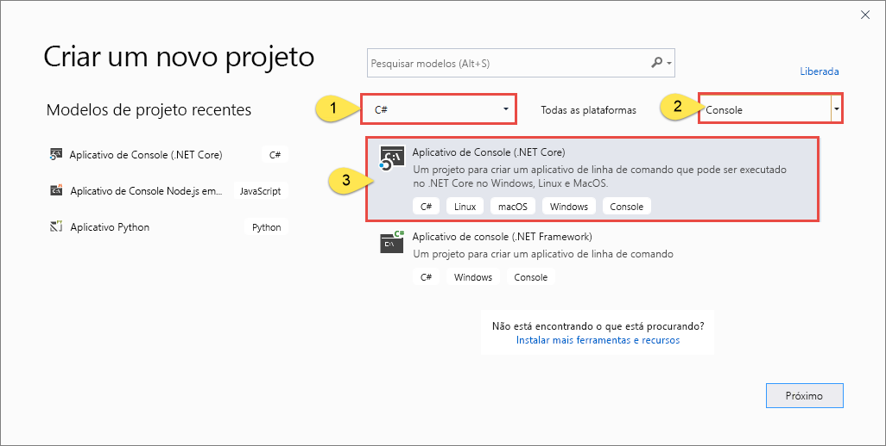
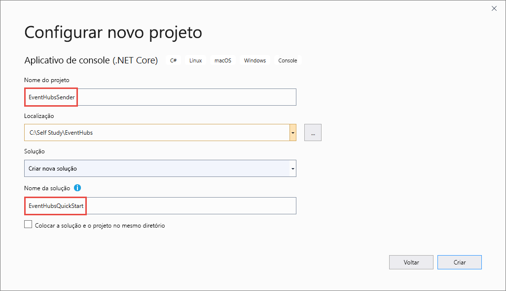

# <a name="send-events-to-and-receive-events-from-azure-event-hubs---net-azuremessagingeventhubs"></a>Enviar e receber eventos dos Hubs de Eventos do Azure – .NET (Azure.Messaging.EventHubs) 
Este início rápido mostra como enviar e receber eventos de um hub de eventos usando a biblioteca **Azure.Messaging.EventHubs** do .NET. 

> [!IMPORTANT]
> Este início rápido usa a nova biblioteca **Azure.Messaging.EventHubs**. Para ver um início rápido que usa a biblioteca antiga **Microsoft.Azure.EventHubs**, confira [Enviar e receber eventos usando a biblioteca Microsoft.Azure.EventHubs](event-hubs-dotnet-standard-get-started-send-legacy.md). 


## <a name="prerequisites"></a>Pré-requisitos
Se você estiver conhecendo agora os Hubs de Eventos do Azure, confira [Visão geral dos Hubs de Eventos](event-hubs-about.md) antes de prosseguir com este início rápido. 

Para concluir este início rápido, você precisará dos seguintes pré-requisitos:

- **Assinatura do Microsoft Azure**. Para usar os serviços do Azure, incluindo os Hubs de Eventos do Azure, você precisa ter uma assinatura.  Caso não tenha uma conta existente do Azure, inscreva-se em uma [avaliação gratuita](https://azure.microsoft.com/free/) ou use os benefícios do assinante do MSDN quando [criar uma conta](https://azure.microsoft.com).
- **Microsoft Visual Studio 2019**. A biblioteca de clientes dos Hubs de Eventos do Azure usa novos recursos que foram introduzidos no C# 8.0.  Você ainda pode usar a biblioteca com versões anteriores da linguagem C#, mas a nova sintaxe não estará disponível. Para usar a sintaxe completa, é recomendável que você compile com o [SDK do .NET Core](https://dotnet.microsoft.com/download) 3.0 ou superior e a [versão de linguagem](/dotnet/csharp/language-reference/configure-language-version#override-a-default) definida como `latest`. Se você estiver usando o Visual Studio, as versões anteriores ao Visual Studio 2019 não serão compatíveis com as ferramentas necessárias para compilar projetos C# 8.0. O Visual Studio 2019, incluindo a edição Community gratuita, pode ser baixado [aqui](https://visualstudio.microsoft.com/vs/).
- **Criar um namespace de Hubs de Eventos e um hub de eventos**. A primeira etapa é usar o [portal do Azure](https://portal.azure.com) para criar um namespace do tipo Hubs de eventos e obter as credenciais de gerenciamento das quais que seu aplicativo precisa para se comunicar com o hub de eventos. Para criar um namespace e um hub de eventos, siga o procedimento [nesse artigo](event-hubs-create.md). Em seguida, obtenha a **cadeia de conexão para o namespace dos Hubs de Eventos** seguindo as instruções do artigo: [Obter a cadeia de conexão](event-hubs-get-connection-string.md#get-connection-string-from-the-portal). Você usa a cadeia de conexão posteriormente no início rápido.

## <a name="send-events"></a>Enviar eventos 
Esta seção mostra como criar um aplicativo de console .NET Core para enviar eventos a um hub de eventos. 

### <a name="create-a-console-application"></a>Criar um aplicativo de console

1. Inicie o Visual Studio 2019. 
1. Selecione **Criar um novo projeto**. 
1. Na caixa de diálogo **Criar um projeto**, execute as seguintes etapas: Se essa caixa de diálogo não for exibida, selecione **Arquivo** no menu, **Novo** e, em seguida, **Projeto**. 
    1. Selecione **C#** como a linguagem de programação.
    1. Selecione **Console** como o tipo do aplicativo. 
    1. Selecione **Aplicativo de Console (.NET Core)** na lista de resultados. 
    1. Em seguida, selecione **Avançar**. 

            
1. Insira **EventHubsSender** como o nome do projeto, **EventHubsQuickStart** como o nome da solução e, em seguida, selecione **OK** para criar o projeto. 

    

### <a name="add-the-event-hubs-nuget-package"></a>Adicione o pacote NuGet de Hubs de Eventos

1. Selecione **Ferramentas** > **Gerenciador de Pacotes NuGet** > **Console do Gerenciador de Pacotes** no menu. 
1. Execute o seguinte comando para instalar o pacote NuGet **Azure.Messaging.EventHubs**:

    ```cmd
    Install-Package Azure.Messaging.EventHubs
    ```


### <a name="write-code-to-send-messages-to-the-event-hub"></a>Escrever código para enviar mensagens ao hub de eventos

1. Adicione as seguintes instruções `using` ao início do arquivo **Program.cs**:

    ```csharp
    using System;
    using System.Text;
    using System.Threading.Tasks;
    using Azure.Messaging.EventHubs;
    using Azure.Messaging.EventHubs.Producer;
    ```

2. Adicione constantes à classe `Program` da cadeia de conexão dos Hubs de Eventos e o nome do hub de eventos. Substitua os espaços reservados nos colchetes pelos valores adequados obtidos na criação do hub de eventos. Verifique se `{Event Hubs namespace connection string}` é a cadeia de conexão de nível de namespace e não a cadeia de hub de eventos. 

    ```csharp
    private const string connectionString = "<EVENT HUBS NAMESPACE - CONNECTION STRING>";
    private const string eventHubName = "<EVENT HUB NAME>";
    ```

3. Substitua o método `Main` pelo método `async Main` a seguir. Confira os comentários sobre código para obter detalhes. 

    ```csharp
        static async Task Main()
        {
            // Create a producer client that you can use to send events to an event hub
            await using (var producerClient = new EventHubProducerClient(connectionString, eventHubName))
            {
                // Create a batch of events 
                using EventDataBatch eventBatch = await producerClient.CreateBatchAsync();

                // Add events to the batch. An event is a represented by a collection of bytes and metadata. 
                eventBatch.TryAdd(new EventData(Encoding.UTF8.GetBytes("First event")));
                eventBatch.TryAdd(new EventData(Encoding.UTF8.GetBytes("Second event")));
                eventBatch.TryAdd(new EventData(Encoding.UTF8.GetBytes("Third event")));

                // Use the producer client to send the batch of events to the event hub
                await producerClient.SendAsync(eventBatch);
                Console.WriteLine("A batch of 3 events has been published.");
            }
        }
    ```
5. Compile o projeto e verifique se não há erros.
6. Execute o programa e aguarde a mensagem de confirmação. 
7. No portal do Azure, você poderá verificar se o hub de eventos recebeu as mensagens. Alterne para a exibição **Mensagens** na seção **Métricas**. Atualize a página para atualizar o gráfico. Poderá levar alguns segundos para que ela mostre que as mensagens foram recebidas. 

    [](./media/getstarted-dotnet-standard-send-v2/verify-messages-portal.png#lightbox)

    > [!NOTE]
    > Para obter o código-fonte completo com os comentários mais informativos, confira [este arquivo no GitHub](https://github.com/Azure/azure-sdk-for-net/blob/master/sdk/eventhub/Azure.Messaging.EventHubs/samples/Sample04_PublishingEvents.md)

## <a name="receive-events"></a>Receber eventos
Esta seção mostra como escrever um aplicativo de console .NET Core que recebe mensagens de um hub de eventos usando um processador de eventos. O processador de eventos simplifica o recebimento de eventos dos hubs de eventos gerenciando pontos de verificação persistentes e recebimentos paralelos desses hubs de eventos. Um processador de eventos é associado a um hub de eventos e a um grupo de consumidores específicos. Ele recebe eventos de várias partições no hub de eventos, transmitindo-os para um delegado do manipulador para processamento usando o código fornecido por você. 


> [!WARNING]
> Se executar esse código no Azure Stack Hub, você verá erros de runtime, a menos que direcione uma versão de API de Armazenamento específica. Isso ocorre porque o SDK dos Hubs de Eventos usa a API do Armazenamento do Microsoft Azure mais recente disponível no Azure, que pode não estar disponível em sua plataforma do Azure Stack Hub. O Azure Stack Hub pode dar suporte a uma versão diferente do SDK do Armazenamento de Blobs do que aquelas normalmente disponíveis no Azure. Se estiver usando o Armazenamento de Blobs do Azure como um repositório de pontos de verificação, verifique a [versão da API do Armazenamento do Azure com suporte para o build do Azure Stack Hub](/azure-stack/user/azure-stack-acs-differences?#api-version) e tenha como destino essa versão no código. 
>
> Por exemplo, se a execução estiver sendo feita no Azure Stack Hub versão 2005, a versão mais alta disponível para o serviço de Armazenamento será a versão 2019-02-02. Por padrão, a biblioteca de clientes do SDK dos Hubs de Eventos usa a versão mais alta disponível no Azure (2019-07-07 no momento do lançamento do SDK). Nesse caso, além de seguir as etapas desta seção, você também precisará adicionar o código para ter como destino a versão de API 2019-02-02 do serviço de Armazenamento. Para obter um exemplo de como ter como destino uma versão de API específica do Armazenamento, confira [esta amostra no GitHub](https://github.com/Azure/azure-sdk-for-net/tree/master/sdk/eventhub/Azure.Messaging.EventHubs.Processor/samples/). 
 

### <a name="create-an-azure-storage-and-a-blob-container"></a>Criar um Armazenamento do Azure e um contêiner de blob
Neste início rápido, você usará o Armazenamento do Azure como o repositório de pontos de verificação. Siga estas etapas para criar uma conta de Armazenamento do Azure. 

1. [Crie uma conta de Armazenamento do Azure](../storage/common/storage-account-create.md?tabs=azure-portal)
2. [Crie um contêiner de blob](../storage/blobs/storage-quickstart-blobs-portal.md#create-a-container)
3. [Obtenha a cadeia de conexão para a conta de armazenamento](../storage/common/storage-configure-connection-string.md)

    Anote a cadeia de conexão e o nome do contêiner. Você os usará no código de recebimento. 


### <a name="create-a-project-for-the-receiver"></a>Criar um projeto para o receptor

1. Na janela do Gerenciador de Soluções, clique com o botão direito do mouse na solução **EventHubQuickStart**, aponte para **Adicionar** e selecione **Novo Projeto**. 
1. Selecione **Aplicativo de Console (.NET Core)** e selecione **Avançar**. 
1. Insira **EventHubsReceiver** como o **Nome do projeto** e selecione **Criar**. 

### <a name="add-the-event-hubs-nuget-package"></a>Adicione o pacote NuGet de Hubs de Eventos

1. Selecione **Ferramentas** > **Gerenciador de Pacotes NuGet** > **Console do Gerenciador de Pacotes** no menu. 
1. Execute o seguinte comando para instalar o pacote NuGet **Azure.Messaging.EventHubs**:

    ```cmd
    Install-Package Azure.Messaging.EventHubs
    ```
1. Execute o seguinte comando para instalar o pacote NuGet **Azure.Messaging.EventHubs.Processor**:

    ```cmd
    Install-Package Azure.Messaging.EventHubs.Processor
    ```    

### <a name="update-the-main-method"></a>Atualizar o método Main 

1. Adicione as instruções `using` a seguir na parte superior do arquivo **Program.cs**.

    ```csharp
    using System;
    using System.Text;
    using System.Threading.Tasks;
    using Azure.Storage.Blobs;
    using Azure.Messaging.EventHubs;
    using Azure.Messaging.EventHubs.Consumer;
    using Azure.Messaging.EventHubs.Processor;
    ```
1. Adicione constantes à classe `Program` da cadeia de conexão dos Hubs de Eventos e o nome do hub de eventos. Substitua os espaços reservados nos colchetes pelos valores adequados obtidos na criação do hub de eventos. Substitua os espaços reservados entre colchetes pelos valores adequados obtidos na criação do hub de eventos e da conta de armazenamento (chaves de acesso/cadeia de conexão primária). Verifique se `{Event Hubs namespace connection string}` é a cadeia de conexão de nível de namespace e não a cadeia de hub de eventos.

    ```csharp
        private const string ehubNamespaceConnectionString = "<EVENT HUBS NAMESPACE - CONNECTION STRING>";
        private const string eventHubName = "<EVENT HUB NAME>";
        private const string blobStorageConnectionString = "<AZURE STORAGE CONNECTION STRING>";
        private const string blobContainerName = "<BLOB CONTAINER NAME>";
    ```
3. Substitua o método `Main` pelo método `async Main` a seguir. Confira os comentários sobre código para obter detalhes. 

    ```csharp
        static async Task Main()
        {
            // Read from the default consumer group: $Default
            string consumerGroup = EventHubConsumerClient.DefaultConsumerGroupName;

            // Create a blob container client that the event processor will use 
            BlobContainerClient storageClient = new BlobContainerClient(blobStorageConnectionString, blobContainerName);

            // Create an event processor client to process events in the event hub
            EventProcessorClient processor = new EventProcessorClient(storageClient, consumerGroup, ehubNamespaceConnectionString, eventHubName);

            // Register handlers for processing events and handling errors
            processor.ProcessEventAsync += ProcessEventHandler;
            processor.ProcessErrorAsync += ProcessErrorHandler;

            // Start the processing
            await processor.StartProcessingAsync();

            // Wait for 10 seconds for the events to be processed
            await Task.Delay(TimeSpan.FromSeconds(10));

            // Stop the processing
            await processor.StopProcessingAsync();
        }    
    ```
1. Agora, adicione os métodos de manipulador de erro e eventos à classe. 

    ```csharp
        static async Task ProcessEventHandler(ProcessEventArgs eventArgs)
        {
            // Write the body of the event to the console window
            Console.WriteLine("\tReceived event: {0}", Encoding.UTF8.GetString(eventArgs.Data.Body.ToArray()));

            // Update checkpoint in the blob storage so that the app receives only new events the next time it's run
            await eventArgs.UpdateCheckpointAsync(eventArgs.CancellationToken);
        }

        static Task ProcessErrorHandler(ProcessErrorEventArgs eventArgs)
        {
            // Write details about the error to the console window
            Console.WriteLine($"\tPartition '{ eventArgs.PartitionId}': an unhandled exception was encountered. This was not expected to happen.");
            Console.WriteLine(eventArgs.Exception.Message);
            return Task.CompletedTask;
        }    
    ```
1. Compile o projeto e verifique se não há erros.

    > [!NOTE]
    > Para obter o código-fonte completo com os comentários mais informativos, confira [este arquivo no GitHub](https://github.com/Azure/azure-sdk-for-net/blob/master/sdk/eventhub/Azure.Messaging.EventHubs.Processor/samples/Sample01_HelloWorld.md).
6. Execute o aplicativo receptor. 
1. Você deverá ver uma mensagem informando que o evento foi recebido. 

    

    Esses eventos são os três eventos que você enviou para o hub de eventos anteriormente executando o programa de remetente. 


## <a name="next-steps"></a>Próximas etapas
Confira os exemplos no GitHub. 

- [Exemplos de Hubs de Eventos no GitHub](https://github.com/Azure/azure-sdk-for-net/tree/master/sdk/eventhub/Azure.Messaging.EventHubs/samples)
- [Amostras do processador de eventos no GitHub](https://github.com/Azure/azure-sdk-for-net/tree/master/sdk/eventhub/Azure.Messaging.EventHubs.Processor/samples)
- [Exemplo do Azure RBAC (controle de acesso baseado em função do Azure)](https://github.com/Azure/azure-event-hubs/tree/master/samples/DotNet/Azure.Messaging.EventHubs/ManagedIdentityWebApp)
