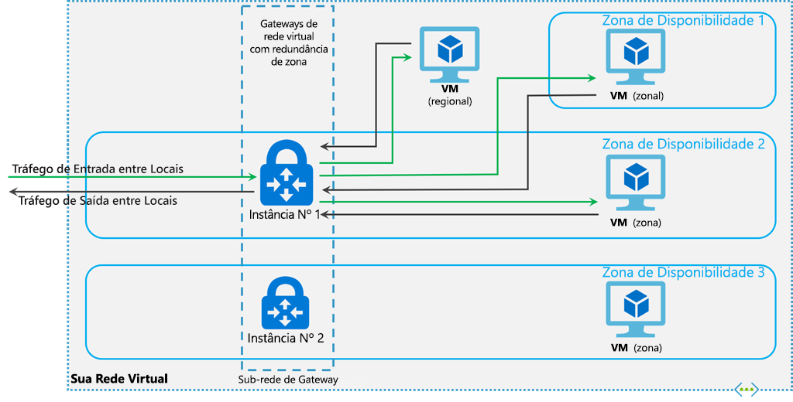

# <a name="about-expressroute-virtual-network-gateways"></a>Sobre os gateways de rede virtual do ExpressRoute

Para conectar sua rede virtual do Azure e sua rede local por meio do ExpressRoute, você deve primeiro criar um gateway de rede virtual. Um gateway de rede virtual tem duas finalidades: rotas de IP do Exchange entre as redes e rotear o tráfego de rede. Este artigo explica os tipos de gateway, as SKUs de gateway e o desempenho estimado por SKU. Este artigo também explica o ExpressRoute [FastPath](#fastpath), um recurso que permite que o tráfego de rede da sua rede local ignore o gateway de rede virtual para melhorar o desempenho.

## <a name="gateway-types"></a>Tipos de gateway

Quando você cria um gateway de rede virtual, precisa especificar várias configurações. Uma das configurações necessárias, '-GatewayType', especifica se o gateway é usado para tráfego de VPN ou ExpressRoute. Os dois tipos de gateway são:

* **Vpn** - Para enviar tráfego criptografado pela Internet pública, use o tipo de gateway 'Vpn'. Isso também é chamado de gateway de VPN. As conexões Site a Site, Ponto a Site e VNet a VNet usam um gateway VPN.

* **ExpressRoute** - Para enviar tráfego em uma conexão privada, use o tipo de gateway 'ExpressRoute'. Isso também é chamado de gateway ExpressRoute e é o tipo de gateway usado na configuração do ExpressRoute.

Cada rede virtual pode ter apenas um gateway de rede virtual por tipo de gateway. Por exemplo, você pode ter um gateway de rede virtual que usa - GatewayType Vpn, e outro que usa -GatewayType ExpressRoute.

## <a name="gateway-skus"></a><a name="gwsku"></a>SKUs do Gateway
[!INCLUDE [expressroute-gwsku-include](../../includes/expressroute-gwsku-include.md)]

Se você quiser atualizar seu gateway para um SKU de gateway mais potente, na maioria dos casos, você pode usar o cmdlet ' Resize-AzVirtualNetworkGateway ' do PowerShell. Isso funcionará em atualizações para as SKUs Standard e HighPerformance. No entanto, para atualizar para a SKU UltraPerformance, você precisará recriar o gateway. Recriar um gateway incorre em tempo de inatividade.

### <a name="estimated-performances-by-gateway-sku"></a><a name="aggthroughput"></a>Desempenhos estimados por SKU de gateway
A tabela a seguir mostra os tipos de gateway e os desempenhos estimados. Esta tabela aplica-se a ambos os modelos de implantação do Gerenciador de Recursos e clássico.

[!INCLUDE [expressroute-table-aggthroughput](../../includes/expressroute-table-aggtput-include.md)]

> [!IMPORTANT]
> O desempenho do aplicativo depende de vários fatores, como a latência de ponta a ponta e o número de fluxos de tráfego abertos pelo aplicativo. Os números na tabela representam o limite superior que o aplicativo, teoricamente, pode atingir em um ambiente ideal.
>
>

## <a name="gateway-subnet"></a><a name="gwsub"></a>Sub-rede do gateway

Antes de criar um gateway de ExpressRoute, você deve criar uma sub-rede de gateway. A sub-rede de gateway contém os endereços IP que as VMs do gateway de rede virtual e os serviços usam. Quando você cria seu gateway de rede virtual, as VMs de gateway são implantadas na sub-rede de gateway e configuradas com as configurações de gateway de ExpressRoute necessárias. Nunca implante mais nada (por exemplo, VMs adicionais) para a sub-rede de gateway. A sub-rede do gateway deve ser nomeada como GatewaySubnet para funcionar corretamente. Chamar a sub-rede de gateway de 'GatewaySubnet' permite que o Azure saiba que essa é a sub-rede para implantação nas VMs de gateway de rede virtual e nos serviços.

>[!NOTE]
>[!INCLUDE [vpn-gateway-gwudr-warning.md](../../includes/vpn-gateway-gwudr-warning.md)]
>

Quando você cria a sub-rede de gateway, pode especificar o número de endereços IP que contém a sub-rede. Os endereços IP na sub-rede do gateway são alocados para as VMs de gateway e para os serviços de gateway. Algumas configurações exigem mais endereços IP do que outras. 

Ao planejar o tamanho da sub-rede do gateway, consulte a documentação da configuração que você planeja criar. Por exemplo, a configuração de gateway ExpressRoute/VPN coexistente requer uma sub-rede de gateway maior do que a maioria das outras configurações. Além disso, convém certificar-se de que sua sub-rede de gateway contenha endereços IP suficientes para acomodar possíveis configurações adicionais futuras. Embora seja possível criar uma sub-rede de gateway tão pequena quanto/29, recomendamos que você crie uma sub-rede de gateway de/27 ou maior (/27,/26, etc.) se tiver o espaço de endereço disponível para fazer isso. Isso irá acomodar a maioria das configurações.

O exemplo de PowerShell do Resource Manager a seguir mostra uma sub-rede de gateway chamada GatewaySubnet. Você pode ver que a notação CIDR especifica /27, que permite endereços IP suficientes para a maioria das configurações existentes no momento.

```azurepowershell-interactive
Add-AzVirtualNetworkSubnetConfig -Name 'GatewaySubnet' -AddressPrefix 10.0.3.0/27
```

[!INCLUDE [vpn-gateway-no-nsg](../../includes/vpn-gateway-no-nsg-include.md)]

### <a name="zone-redundant-gateway-skus"></a><a name="zrgw"></a>SKUs de gateway redundantes de zona

Também é possível implantar gateways do ExpressRoute em Zonas de Disponibilidade do Azure. Isso separa fisicamente e logicamente em Zonas de disponibilidade diferentes, protegendo a conectividade de rede local com o Azure de falhas de nível de zona.



Gateways com redundância de zona usam novas SKUs de gateways específicas para gateway do ExpressRoute.

* ErGw1AZ
* ErGw2AZ
* ErGw3AZ

As novas SKUs de gateway também dão suporte a outras opções de implantação para melhor atender às suas necessidades. Ao criar um gateway de rede virtual usando as novas SKUs de gateway, você também terá a opção de implantar o gateway em uma zona específica. Isso é referido como um gateway de VPN. Ao implantar um gateway em zona, todas as instâncias do gateway são implantadas na mesma zona de disponibilidade.

## <a name="fastpath"></a><a name="fastpath"></a>FastPath

O gateway de rede virtual ExpressRoute foi projetado para trocar rotas de rede e rotear o tráfego de rede. O FastPath foi projetado para melhorar o desempenho do caminho de dados entre sua rede local e sua rede virtual. Quando habilitado, o FastPath envia o tráfego de rede diretamente às máquinas virtuais na rede virtual, ignorando o gateway.

Para obter mais informações sobre FastPath, incluindo limitações e requisitos, consulte [about FastPath](about-fastpath.md).

## <a name="rest-apis-and-powershell-cmdlets"></a><a name="resources"></a>Cmdlets do PowerShell e APIs REST
Para obter recursos técnicos adicionais e requisitos de sintaxe específicos ao usar cmdlets do PowerShell e APIs REST para configurações do gateway de rede virtual, veja as páginas a seguir:

| **Clássico** | **Resource Manager** |
| --- | --- |
| [PowerShell](/powershell/module/servicemanagement/azure.service/?view=azuresmps-4.0.0#azure) |[PowerShell](/powershell/module/az.network#networking) |
| [REST API](/previous-versions/azure/reference/jj154113(v=azure.100)) |[REST API](/rest/api/virtual-network/) |

## <a name="next-steps"></a>Próximas etapas

Para obter mais informações sobre as configurações de conexão disponíveis, consulte [visão geral do ExpressRoute](expressroute-introduction.md).

Para obter mais informações sobre como criar gateways de ExpressRoute, consulte [criar um gateway de rede virtual para ExpressRoute](expressroute-howto-add-gateway-resource-manager.md).

Para obter mais informações sobre como configurar gateways com redundância de zona, consulte [criar um gateway de rede virtual com redundância de zona](../../articles/vpn-gateway/create-zone-redundant-vnet-gateway.md).

Para obter mais informações sobre o FastPath, consulte [about FastPath](about-fastpath.md).