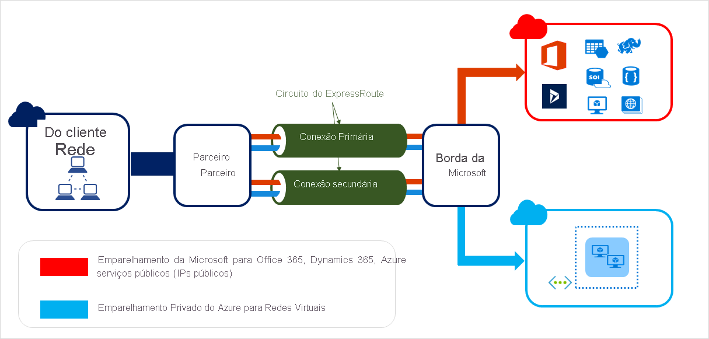
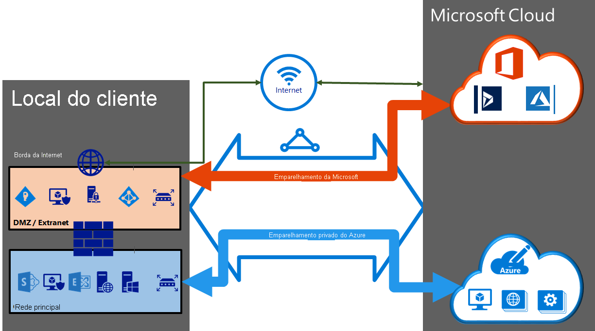

# Circuitos e emparelhamento do ExpressRoute

Os circuitos do ExpressRoute conectam sua infraestrutura local à Microsoft por meio de um provedor de conectividade. Este artigo ajuda você a reconhecer os circuitos e os domínios de roteamento/emparelhamento do ExpressRoute. A figura abaixo mostra uma representação lógica de conectividade entre sua WAN e a Microsoft.

> [!IMPORTANT]
> O emparelhamento público do Azure foi preterido e não está disponível para novos circuitos do ExpressRoute. Novos circuitos dão suporte ao emparelhamento da Microsoft e ao emparelhamento privado.  
>

## Circuitos do ExpressRoute

Um circuito do ExpressRoute representa uma conexão lógica entre a infraestrutura local e os serviços de nuvem da Microsoft por meio de um provedor de conectividade. É possível solicitar vários circuitos do ExpressRoute. Os circuitos podem estar na mesma região ou em regiões diferentes, bem como podem ser conectados aos seus locais por meio de diferentes provedores de conectividade.

Os circuitos do ExpressRoute não são mapeados para entidades físicas. Um circuito é identificado exclusivamente por um GUID padrão chamado de chave de serviço (s-key). A chave de serviço é a única informação trocada entre a Microsoft, o provedor de conectividade e você. A chave-s não é um segredo para fins de segurança. Há um mapeamento de 1:1 entre um circuito do ExpressRoute e a chave-s.

Os novos circuitos do ExpressRoute podem incluir dois emparelhamentos independentes: o emparelhamento privado e o emparelhamento da Microsoft. Entretanto, os circuitos do ExpressRoute existentes podem conter três emparelhamentos: Azure Público, Azure Privado e Microsoft. Cada emparelhamento é um par de sessões BGP independentes, cada uma delas configurada de modo redundante para alta disponibilidade. Há um mapeamento de 1:N (1 <= N <= 3) entre um circuito do ExpressRoute e os domínios de roteamento. Um circuito do ExpressRoute pode ter qualquer tipo de emparelhamento (um, dois ou os três) habilitado por circuito do ExpressRoute.

Cada circuito tem uma largura de banda fixa (50 Mbps, 100 Mbps, 200 Mbps, 500 Mbps, 1 Gbps, 10 Gbps) e é mapeado para um provedor de conectividade e um local de emparelhamento. A largura de banda selecionada é compartilhada entre todos os emparelhamentos para o circuito

### Cotas, limites e limitações

Cotas e limites padrão aplicam-se a todos os circuitos do ExpressRoute. Consulte a página [Limites, cotas e restrições de serviço e assinatura do Azure](../azure-resource-manager/management/azure-subscription-service-limits.md) para obter informações atualizadas sobre cotas.

## Emparelhamento do ExpressRoute

Um circuito do ExpressRoute tem vários domínios/emparelhamentos de roteamento associados a ele: Azure público, privado do Azure e Microsoft. Cada emparelhamento é configurado de modo idêntico em um par de roteadores (na configuração ativo-ativo ou de compartilhamento de carga) para alta disponibilidade. Os serviços do Azure estão categorizados como *público do Azure* e *privado do Azure* para representar os esquemas de endereçamento IP.

### Emparelhamento privado do Azure

Os serviços de computação do Azure, isto é, máquinas virtuais (IaaS) e serviços de nuvem (PaaS), implantados em uma rede virtual podem ser conectados por meio do domínio de emparelhamento privado. O domínio de emparelhamento privado é considerado uma extensão confiável de sua rede principal para o Microsoft Azure. Você pode configurar a conectividade bidirecional entre sua rede principal e as redes virtuais (VNets) do Azure. Esse emparelhamento permite a você se conectar a máquinas virtuais e serviços de nuvem diretamente em seus endereços IP privados.  

Você pode conectar mais de uma rede virtual ao domínio de emparelhamento privado. Examine a [Página de perguntas Frequentes](expressroute-faqs.md) para obter informações sobre limites e limitações. Você pode visitar a página [Limites, cotas e restrições de serviço e assinatura do Azure](../azure-resource-manager/management/azure-subscription-service-limits.md) para obter informações atualizadas sobre limites.  Consulte a página [Roteamento](expressroute-routing.md) para obter informações detalhadas sobre a configuração de roteamento.

### Emparelhamento da Microsoft

[!INCLUDE [expressroute-office365-include](../../includes/expressroute-office365-include.md)]

A conectividade com o Microsoft serviços online (Microsoft 365 e os serviços de PaaS do Azure) ocorre por meio do emparelhamento da Microsoft. Habilitamos a conectividade bidirecional entre sua WAN e os serviços de nuvem da Microsoft por meio do domínio de roteamento de emparelhamento da Microsoft. Você deve se conectar aos serviços de nuvem da Microsoft somente por endereços IP públicos que pertençam a você ou ao seu provedor de conectividade e deve seguir todas as regras definidas. Para saber mais, veja a página [pré-requisitos do ExpressRoute](expressroute-prerequisites.md).

Consulte a [página de perguntas frequentes](expressroute-faqs.md) para obter mais informações sobre serviços com suporte, custos e detalhes de configuração. Consulte a página [Locais do ExpressRoute](expressroute-locations.md) para saber mais sobre a lista de provedores de conectividade que dão suporte ao emparelhamento da Microsoft.

## Comparação de emparelhamento

A tabela a seguir compara os três emparelhamentos:

[!INCLUDE [peering comparison](../../includes/expressroute-peering-comparison.md)]

Você pode habilitar um ou mais domínios de roteamento como parte do seu circuito ExpressRoute. Também é possível optar por ter todos os domínios de roteamento na mesma VPN se você desejar combiná-los em um único domínio de roteamento. Você também pode colocá-los em diferentes domínios de roteamento, da mesma forma que no diagrama. A configuração recomendada é conectar o emparelhamento privado diretamente à rede principal, enquanto os vínculos de emparelhamento público e da Microsoft são conectados à sua DMZ.

Cada emparelhamento requer sessões BGP (um par para cada tipo de emparelhamento) separadas. Os pares de sessões BGP fornecem um link altamente disponível. Se estiver conectando por meio de provedores de conectividade da camada 2, você será responsável por configurar e gerenciar o roteamento. Saiba mais analisando os [fluxos de trabalho](expressroute-workflows.md) para configurar o ExpressRoute.

## Integridade do ExpressRoute

Os circuitos de ExpressRoute podem ser monitorados para disponibilidade, conectividade para VNets e utilização de largura de banda usando o [Monitor de Desempenho de Rede](../networking/network-monitoring-overview.md) (NPM).

O NPM monitora a integridade do peering privado do Azure e do peering da Microsoft. Confira nossa [postagem](https://azure.microsoft.com/blog/monitoring-of-azure-expressroute-in-preview/) para saber mais.

## Próximas etapas

* Encontrar um provedor de serviços. Consulte [Locais e provedores de serviços do ExpressRoute](expressroute-locations.md).
* Certifique-se que todos os pré-requisitos foram atendidos. Consulte [Pré-requisitos do ExpressRoute](expressroute-prerequisites.md).
* Configurar sua conexão do ExpressRoute.
  * [Criar e gerenciar circuitos de ExpressRoute](expressroute-howto-circuit-portal-resource-manager.md)
  * [Configurar o roteamento (emparelhamento) para circuitos ExpressRoute](expressroute-howto-routing-portal-resource-manager.md)