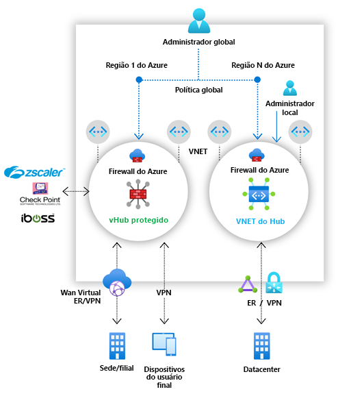

# O que é o Gerenciador de Firewall do Azure?

O Gerenciador de Firewall do Azure é um serviço de gerenciamento de segurança que fornece gerenciamento central de rotas e políticas de segurança para os parâmetros de segurança baseados em nuvem. 

O Gerenciador de Firewall pode fornecer gerenciamento de segurança para dois tipos de arquitetura de rede:

- **Hub virtual seguro**

   Um [Hub de WAN Virtual do Azure](../virtual-wan/virtual-wan-about.md#resources) é um recurso gerenciado pela Microsoft que possibilita criar arquiteturas de hub e spoke facilmente. Quando as políticas de segurança e roteamento são associadas a esse hub, ele é chamado de *[hub virtual seguro](secured-virtual-hub.md)* . 
- **Rede virtual de hub**

   Essa é uma rede virtual do Azure padrão que você cria e gerencia por conta própria. Quando as políticas de segurança são associadas a um hub como esse, ele é chamado de *rede virtual de hub*. Neste momento, apenas a Política de Firewall do Azure é compatível. Você pode emparelhar redes virtuais que contêm os serviços e servidores da sua carga de trabalho. Você também pode gerenciar firewalls em redes virtuais autônomas que não são emparelhadas com nenhum spoke.

Para obter uma comparação detalhada dos tipos de arquitetura de *hub virtual seguro* e *rede virtual de hub*, confira [Quais são as opções de arquitetura do Gerenciador de Firewall do Azure?](vhubs-and-vnets.md).

## Recursos do Gerenciador de Firewall do Azure

O Gerenciador de Firewall do Azure oferece os seguintes recursos:

### Implantação e configuração central do Firewall do Azure

Você pode implantar e configurar centralmente várias instâncias do Firewall do Azure que abrangem diferentes regiões e assinaturas do Azure. 

### Políticas hierárquicas (globais e locais)

Use o Gerenciador de Firewall do Azure para gerenciar de maneira centralizada as políticas do Firewall do Azure em vários hubs virtuais seguros. Suas equipes de TI centralizadas podem criar políticas globais de firewall para impor políticas de firewall em toda a organização entre as equipes. As políticas de firewall criadas localmente proporcionam um modelo de autoatendimento do DevOps para oferecer maior agilidade.

### Integração com a segurança como serviço de terceiros para oferecer segurança avançada

Além do Firewall do Azure, você pode integrar provedores de SECaaS (segurança como serviço) de terceiros para fornecer proteção adicional de rede para suas conexões de Internet de VNet e branch.

Esse recurso está disponível somente com implantações de hub virtual seguro.

- Filtragem de tráfego de VNet para Internet (V2I)

   - Filtre o tráfego de rede virtual de saída com seu provedor de segurança terceirizado preferido.
   - Aproveite a proteção avançada da Internet com reconhecimento de usuário para suas cargas de trabalho na nuvem em execução no Azure.

- Filtragem de tráfego de Branch para Internet (B2I)

   Aproveite a conectividade do Azure e a distribuição global para adicionar facilmente a filtragem de terceiros para cenários de branch para Internet.

Para obter mais informações sobre os provedores de parceiros de segurança, confira [O que são provedores de parceiros de segurança do Gerenciador de Firewall do Azure?](trusted-security-partners.md)

### Gerenciamento de rota centralizado

Encaminhe facilmente o tráfego para o hub seguro para filtragem e registro, sem a necessidade de configurar manualmente as Rotas Definidas pelo Usuário (UDR) nas redes virtuais de spoke. 

Esse recurso está disponível somente com implantações de hub virtual seguro.

Você pode usar provedores de terceiros para filtrar o tráfego de Branch para Internet (B2I), lado a lado com o Firewall do Azure para Branch para VNet (B2V), VNet para VNet (V2V) e VNet para Internet (V2I). 

## Disponibilidade de região

As Políticas de Firewall do Azure podem ser usadas entre regiões. Por exemplo, você pode criar uma política no oeste dos EUA e usá-la no leste dos EUA. 

## Problemas conhecidos

O Gerenciador de Firewall do Azure apresenta os seguintes problemas conhecidos:

|Problema  |Descrição  |Atenuação  |
|---------|---------|---------|
|Separação de tráfego|No momento, não há suporte para a separação de tráfego do Microsoft 365 e do PaaS público do Azure. Dessa forma, selecionar um provedor de terceiros para V2I ou B2I também envia todo o tráfego de PaaS público do Azure e do Microsoft 365 por meio do serviço do parceiro.|Investigando a divisão de tráfego no hub.
|Um hub virtual seguro por região|Você não pode ter mais de um hub virtual seguro por região.|Crie várias WANs virtuais em uma região.|
|As políticas básicas devem estar na mesma região que a política local|Crie todas as políticas locais na mesma região que a política básica. Você ainda pode aplicar uma política que foi criada em uma região em um hub seguro de outra região.|Investigando|
|Filtro do tráfego entre hubs em implantações de hub virtual seguro|Ainda não há suporte para a comunicação entre hubs virtuais seguros. No entanto, a comunicação entre hubs ainda funcionará se a filtragem de tráfego privado por meio do Firewall do Azure não estiver habilitada.|Investigando|
|Spokes em uma região diferente do hub virtual|Não há suporte para spokes em uma região diferente do hub virtual.|Investigando  Crie um hub por região e emparelhe as VNETs na mesma região do hub.|
|Tráfego de branch a branch com a filtragem de tráfego privado habilitada|Não há suporte para o tráfego de branch para branch quando a filtragem de tráfego privado está habilitada. |Em investigação.  Não proteja o tráfego privado se a conectividade de branch a branch for crítica.|
|Todos os Hubs Virtuais Seguros que compartilham a mesma WAN virtual devem estar no mesmo grupo de recursos.|Esse comportamento está alinhado aos Hubs da WAN Virtual hoje.|Crie várias WANs Virtuais para permitir que os Hubs Virtuais Seguros sejam criados em diferentes grupos de recursos.|
|Falha na adição de endereço IP em massa|O firewall do hub seguro entrará em um estado de falha se você adicionar vários endereços IP públicos.|Adicione incrementos menores de endereços IP públicos. Por exemplo, adicione 10 de cada vez.|
|Não há suporte à Proteção contra DDoS Standard com hubs virtuais seguros|A Proteção contra DDoS Standard não está integrada aos vWANs.|Investigando|
|Logs de atividade sem suporte completo|Atualmente, a política de firewall não dá suporte a logs de atividade.|Investigando|
|Algumas configurações de firewall não são migradas quando o firewall é migrado para usar a Política de Firewall|Os endereços privados de SNAT e Zonas de Disponibilidade não são migrados quando você faz a migração para a Política de Firewall do Azure.|Investigando| 

## Próximas etapas

- Examine [Visão geral da implantação do Gerenciador de Firewall do Azure](deployment-overview.md)
- Saiba mais sobre [Hubs virtuais seguros](secured-virtual-hub.md).
