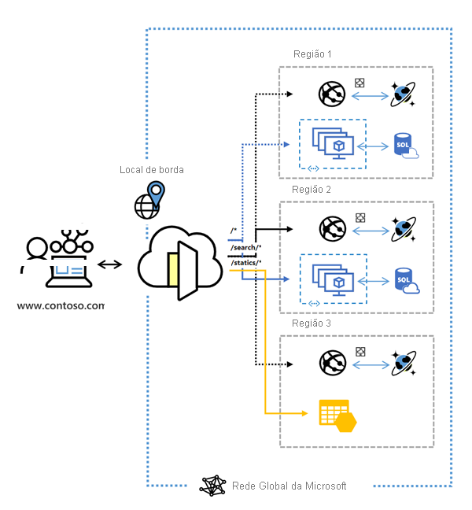

# O que é o Azure Front Door?

> [!IMPORTANT]
> Esta documentação é para o Azure Front Door. Procurando informações sobre o Azure Front Door Standard/Premium (versão prévia)? Veja [aqui](standard-premium/overview.md).

O Azure Front Door é um ponto de entrada global e escalonável que usa a rede de borda global da Microsoft para criar aplicativos Web rápidos, seguros e amplamente escalonáveis. Com o Front Door, é possível transformar os seus aplicativos consumidores e empresariais globais em modernos aplicativos robustos altamente personalizados e com alto desempenho, com conteúdo que alcança um público global por meio do Azure.

  

O Front Door funciona na Camada 7 (Camada HTTP/HTTPS) e usa o protocolo anycast com TCP de divisão e a rede global da Microsoft para aprimorar a conectividade global. Com base no método de roteamento, é possível garantir que o Front Door roteará as suas solicitações de cliente para o back-end de aplicativo mais rápido e disponível. Um back-end de aplicativo é qualquer serviço voltado para a Internet hospedado dentro ou fora do Azure. O Front Door oferece uma variedade de [métodos de roteamento de tráfego](front-door-routing-methods.md) e [opções de monitoramento de integridade de back-end](front-door-health-probes.md) para atender às diferentes necessidades dos aplicativos e cenários de failover automático. De maneira semelhante ao [Gerenciador de Tráfego](../traffic-manager/traffic-manager-overview.md), o Front Door é resiliente a falhas, incluindo falhas de uma região inteira do Azure.

>[!NOTE]
> O Azure fornece um conjunto de soluções de balanceamento de carga totalmente gerenciadas para seus cenários. 
> * Se você quiser realizar um roteamento global baseado em DNS e **não** tiver os requisitos para encerramento de protocolo TLS ("descarregamento de SSL") ou para processamento de camada de aplicativo por solicitação HTTP/HTTPS, examine [Gerenciador de Tráfego](../traffic-manager/traffic-manager-overview.md). 
> * Se você quiser balancear a carga entre os servidores em uma região na camada de aplicativo, examine o [Gateway de Aplicativo](../application-gateway/overview.md).
> * Para fazer o balanceamento de carga de camada de rede, examine [Load Balancer](../load-balancer/load-balancer-overview.md). 
> 
> Os cenários de ponta a ponta podem se beneficiar da combinação dessas soluções, conforme necessário.
> Para obter uma comparação das opções de balanceamento de carga do Azure, confira [Visão geral das opções de balanceamento de carga no Azure](/azure/architecture/guide/technology-choices/load-balancing-overview).

## Por que usar o Azure Front Door?

Com o Front Door, você pode criar, operar e escalar horizontalmente os seus aplicativos Web dinâmicos e o conteúdo estático. O Front Door permite que você defina, gerencie e monitore o roteamento global do seu tráfego da Web, otimizando-o para melhor desempenho de usuário final e confiabilidade por meio de um rápido failover global.

Principais recursos incluídos no Front Door:

* Desempenho de aplicativo acelerado usando o **[protocolo anycast](front-door-routing-architecture.md#anycast)** baseado no **[TCP dividido](front-door-routing-architecture.md#splittcp)** .

* Monitoramento da **[investigação de integridade](front-door-health-probes.md)** inteligente para recursos de back-end.

*  Roteamento **[baseado no caminho da URL](front-door-route-matching.md)** para solicitações.

* Habilita a hospedagem de vários sites para uma infraestrutura de aplicativo eficiente. 

* **[Afinidade de sessão](front-door-routing-methods.md#affinity)** baseada em cookie.

* **[Descarregamento de SSL](front-door-custom-domain-https.md)** e gerenciamento de certificado.

* Definir o próprio **[domínio personalizado](front-door-custom-domain.md)** . 

* Segurança de aplicativo com o **[WAF (Firewall de Aplicativo Web)](../web-application-firewall/overview.md)** integrado.

* Redirecione o tráfego de HTTP para HTTPS com o **[redirecionamento de URL](front-door-url-redirect.md)** .

* Caminho de encaminhamento personalizado com a **[Regravação de URL](front-door-url-rewrite.md)** .

* Suporte nativo de conectividade IPv6 de ponta a ponta e **[protocolo HTTP/2](front-door-http2.md)** .

## Preços

Para obter informações sobre preços, consulte [Preços do Front Door](https://azure.microsoft.com/pricing/details/frontdoor/). Confira [SLA para Azure Front Door](https://azure.microsoft.com/en-us/support/legal/sla/frontdoor/v1_0/).

## Novidades

Assine o RSS feed e veja as atualizações mais recentes dos recursos do Azure Front Door na página [Atualizações do Azure](https://azure.microsoft.com/updates/?category=networking&query=Azure%20Front%20Door).

## Próximas etapas

- Saiba como [criar um Front Door](quickstart-create-front-door.md).
- Saiba [como o Front Door funciona](front-door-routing-architecture.md).
