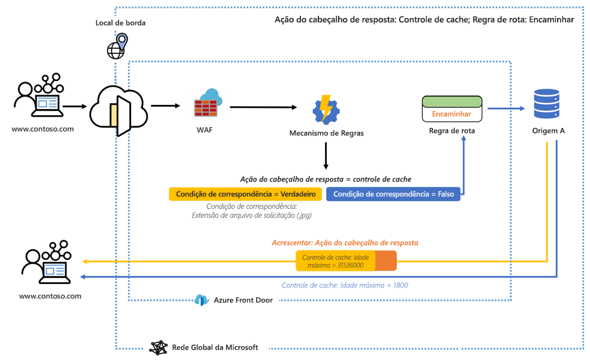
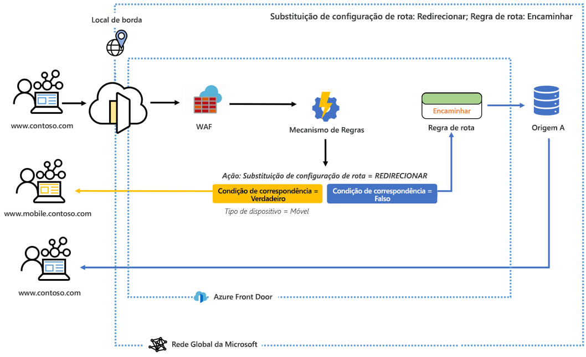

# O que é o mecanismo de regras para o Azure Front Door? 

O Mecanismo de Regras permite personalizar como as solicitações HTTP são tratadas na borda e fornece um comportamento mais controlado para seu aplicativo Web. O Mecanismo de Regras para o Azure Front Door tem vários recursos principais, incluindo:

* Impõe o protocolo HTTP para garantir que todos os usuários finais interajam com seu conteúdo por meio de uma conexão segura.
* Implementa cabeçalhos de segurança para impedir que ocorram vulnerabilidades com base no navegador, como os cabeçalhos HSTS (HTTP Strict-Transport-Security), X-XSS-Protection, Content-Security-Policy, X-Frame-Options e Access-Control-Allow-Origin para cenários do CORS (Compartilhamento de Recursos entre Origens). Os atributos baseados em segurança também podem ser definidos com cookies.
* Encaminha solicitações para versões móveis ou para desktop do seu aplicativo com base nos padrões de conteúdo dos cabeçalhos de solicitação, cookies ou cadeias de caracteres de consulta.
* Usa recursos de redirecionamento para retornar os redirecionamentos 301, 302, 307 e 308 para o cliente a fim de direcionar a novos nomes de host, caminhos ou protocolos.
- Modificar dinamicamente a configuração de cache da rota com base nas solicitações de entrada.
- Reescrever o caminho da URL de solicitação e encaminhar a solicitação para o back-end apropriado no seu pool de back-end configurado.

## Arquitetura 

O mecanismo de regras lida com solicitações na borda. Quando uma solicitação atinge o ponto de extremidade do Front Door, o WAF é executado primeiro, seguido pela configuração do Mecanismo de Regras associada ao Front-end/Domínio. Caso uma configuração do Mecanismo de Regras seja executada, isso significa que a regra de roteamento pai já é uma correspondência. Para que todas as ações sejam executadas em cada regra, todas as condições de correspondência dentro de uma regra têm de ser atendidas. Caso uma solicitação não corresponda a nenhuma das condições em sua configuração do Mecanismo de Regra, a Regra de Roteamento padrão será executada. 

Por exemplo, no diagrama a seguir, um Mecanismo de Regras será configurado para acrescentar um cabeçalho de resposta. O cabeçalho alterará a idade máxima do controle de cache caso a condição de correspondência seja atendida. 

Em outro exemplo, vemos que o mecanismo de regras está configurado para enviar um usuário para uma versão móvel do site quando a condição de correspondência, o tipo de dispositivo, é verdadeira. 

Em ambos os exemplos, quando nenhuma das condições de correspondência é atendida, a regra de rota especificada é executada. 

## Terminologia 

Com o Mecanismo de Regras do AFD, será possível criar uma combinação de configurações de Mecanismo de Regras. Cada uma delas será composta por um conjunto de regras. Veja a seguir a descrição de algumas terminologias úteis que você encontrará ao configurar o mecanismo de regras. 

- *Configuração do mecanismo de regras*: um conjunto de regras aplicadas a uma regra de rota. Cada configuração é limitada a 25 regras. Você pode criar até 10 configurações. 
- *Regra do mecanismo de regras*: uma regra composta por até 10 condições de correspondência e cinco ações.
- *Condição de correspondência*: há várias condições de correspondência que podem ser utilizadas para analisar suas solicitações de entrada. Uma regra pode conter até 10 condições de correspondência. As condições de correspondência são avaliadas com um operador **AND**. Uma lista completa de condições de correspondência pode ser encontrada [aqui](front-door-rules-engine-match-conditions.md). 
- *Ação*: as ações ditam o que acontece com as suas solicitações de entrada – ações de cabeçalho de solicitação/resposta, encaminhamentos, redirecionamentos e regravações estão disponíveis hoje. Uma regra pode conter até cinco ações. No entanto, uma regra poderá conter somente uma substituição de configuração de rota.  Uma lista completa de ações pode ser encontrada [aqui](front-door-rules-engine-actions.md).

## Próximas etapas

- Saiba como configurar sua primeira [Configuração do Mecanismo de Regras](front-door-tutorial-rules-engine.md). 
- Saiba como [criar um Front Door](quickstart-create-front-door.md).
- Saiba [como o Front Door funciona](front-door-routing-architecture.md).
