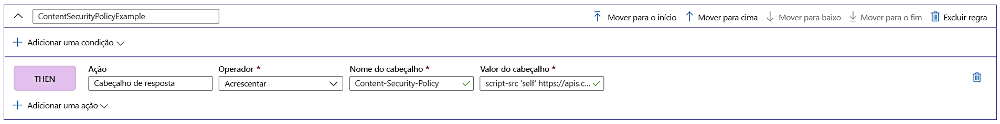

# Tutorial: Adicionar cabeçalhos de segurança com o Mecanismo de Regras

Este tutorial mostra como implementar cabeçalhos de segurança para impedir vulnerabilidades baseadas em navegador como HSTS (HTTP Strict-Transport-Security), X-XSS-Protection, Content-Security-Policy ou X-Frame-Options. Os atributos baseados em segurança também podem ser definidos com cookies.

O exemplo a seguir mostra como adicionar um cabeçalho Content-Security-Policy a todas as solicitações de entrada que correspondem ao caminho definido na rota à qual a configuração do mecanismo de regras está associada. Aqui, só permitiremos a execução de scripts do nosso site confiável, **https://apiphany.portal.azure-api.net** , no aplicativo.

Neste tutorial, você aprenderá como:
> [!div class="checklist"]
> - Configure um Content-Security-Policy no Mecanismo de Regras.

## Pré-requisitos

* Antes de poder concluir as etapas neste tutorial, é necessário criar primeiro um Front Door. Para saber mais, confira [Início Rápido: Criar um Front Door](quickstart-create-front-door.md).
* Se esta for a primeira vez que você usa o recurso Mecanismo de Regras, confira como [Configurar um Mecanismo de Regras](front-door-tutorial-rules-engine.md).

## Adicionar um cabeçalho Content-Security-Policy no portal do Azure

1. Clique em **Adicionar** para adicionar uma nova regra. Forneça um nome para a regra e clique em **Adicionar uma Ação** > **Cabeçalho de Resposta**.

1. Defina o Operador como **Acréscimo** para adicionar esse cabeçalho como uma resposta a todas as solicitações de entrada para essa rota.

1. Adicione o nome do cabeçalho: **Content-Security-Policy** e defina os valores que esse cabeçalho deverá aceitar. Nesse cenário, escolhemos *"script-src 'self' https://apiphany.portal.azure-api.net".*

   > [!NOTE]
   > Os valores de cabeçalho estão limitados a 128 caracteres.

1. Depois de adicionar todas as regras desejadas à configuração, não se esqueça de acessar sua rota preferencial e associar a configuração do mecanismo de regras à regra de rota. Essa etapa é necessária para permitir que a regra funcione. 

> [!NOTE]
> Neste cenário, não adicionamos [condições de correspondência](front-door-rules-engine-match-conditions.md) à regra. Todas as solicitações de entrada que corresponderem ao caminho definido na regra de rota terão essa regra aplicada. Caso deseje que ela só se aplique a um subconjunto dessas solicitações, lembre-se de adicionar as **condições de correspondência** específicas a essa regra.

## Limpar os recursos

Nas etapas anteriores, você configurou Cabeçalhos de segurança com o Mecanismo de Regras. Se você não quiser mais a regra, poderá removê-la clicando em Excluir regra.

:::image type="content" source="./media/front-door-rules-engine/rules-engine-delete-rule.png" alt-text="Excluir regra":::

## Próximas etapas

Para saber como configurar um Firewall de Aplicativo Web para seu Front Door, prossiga para o próximo tutorial.

> [!div class="nextstepaction"]
> [Firewall do Aplicativo Web e Front Door](front-door-waf.md)
