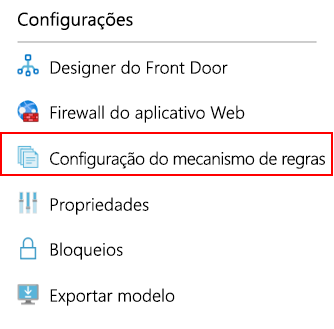
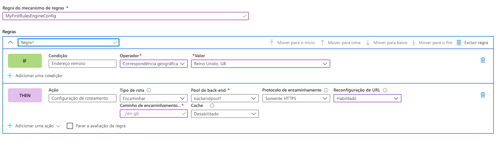
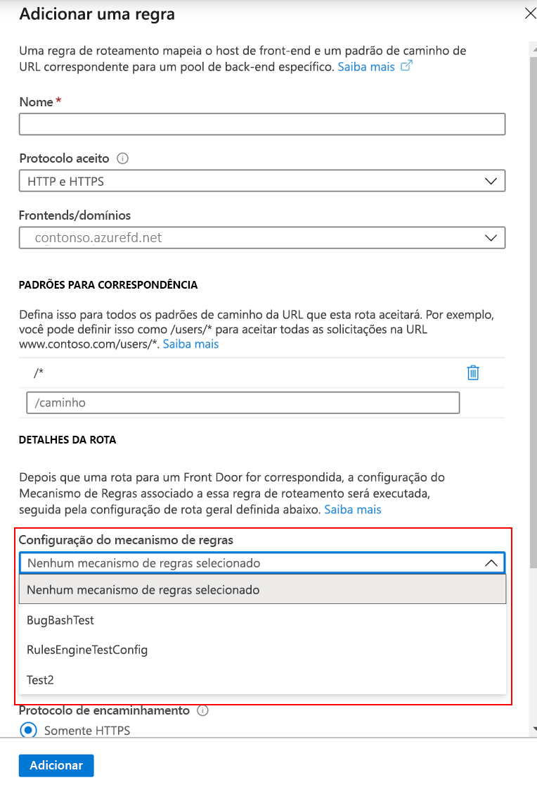

# <a name="tutorial-configure-your-rules-engine"></a>Tutorial: Configurar o mecanismo de regras

Este tutorial mostra as etapas usadas para criar uma configuração do Mecanismo de Regras e a sua primeira regra no portal do Azure e na CLI. 

Neste tutorial, você aprenderá como:
> [!div class="checklist"]
> - Configurar o Mecanismo de Regras usando o portal.
> - Configurar o Mecanismo de Regras usando a CLI do Azure

## <a name="prerequisites"></a>Pré-requisitos

* Antes de poder concluir as etapas neste tutorial, é necessário criar primeiro um Front Door. Para saber mais, confira [Início Rápido: Criar um Front Door](quickstart-create-front-door.md).

## <a name="configure-rules-engine-in-azure-portal"></a>Configurar o mecanismo de regras no portal do Azure
1. No recurso de Front Door, acesse **Configurações** e selecione **Configuração do mecanismo de regras**. Clique em **Adicionar**, dê um nome à sua configuração e comece a criar sua primeira configuração do mecanismo de regras.

    

1. Clique em **Adicionar Regra** para criar sua primeira regra. Em seguida, clicando **Adicionar condição** ou **Adicionar ação**, você pode definir sua regra.
    
    > [!NOTE]
    >- Para excluir uma condição ou ação da regra, use a lixeira no lado direito da condição ou ação específica.
    > - Para criar uma regra que se aplica a todo o tráfego de entrada, não especifique nenhuma condição.
    > - Para interromper a avaliação de regras depois que a primeira condição de correspondência for atendida, marque **Interromper a avaliação da regra restante**. Se essa opção estiver marcada e todas as condições de correspondência de determinada regra forem atendidos, as regras restantes na configuração não serão executadas.  

     

1. Determine a prioridade das regras em sua configuração usando os botões mover para cima, mover para baixo e mover para o topo. A prioridade está em ordem crescente, o que significa que a regra listada primeiro é a mais importante.

1. Depois de criar uma ou mais regras, pressione **Salvar**. Essa ação cria a configuração do mecanismo de regras.

1. Depois de criar uma ou mais configurações, associe uma configuração de mecanismo de regras a uma regra de rota. Embora uma configuração possa ser aplicada a muitas regras de rota, uma regra de rota pode conter apenas uma configuração de mecanismo de regras. Para fazer a associação, vá para **Designer do Front Door** > **Regras de rota**. Selecione a regra de rota à qual você gostaria de adicionar a configuração do mecanismo de regras, vá para **Detalhes da rota** > **Configuração do mecanismo de regras** e selecione a configuração que você deseja associar.

    


## <a name="configure-rules-engine-in-azure-cli"></a>Configurar o mecanismo de regras na CLI do Azure

1. Caso ainda não tenha feito isso, instale a [CLI do Azure](/cli/azure/install-azure-cli). Adicione a extensão "front-door":- az extension add --name front-door. Em seguida, faça logon e alterne para sua assinatura az account set --subscription <nome_ou_ID>.

1. Comece criando um mecanismo de regras – este exemplo mostra uma regra com uma ação baseada em cabeçalho e uma condição de correspondência. 

    ```azurecli-interactive
    az network front-door rules-engine rule create -f {front_door} -g {resource_group} --rules-engine-name {rules_engine} --name {rule1} --priority 1 --action-type RequestHeader --header-action Overwrite --header-name Rewrite --header-value True --match-variable RequestFilenameExtension --operator Contains --match-values jpg png --transforms Lowercase
    ```

1. Listar todas as regras. 

    ```azurecli-interactive
    az network front-door rules-engine rule list -f {front_door} -g {rg} --name {rules_engine}
    ```

1. Adicione uma ação de substituição de rota de encaminhamento. 

    ```azurecli-interactive
    az network front-door rules-engine rule action add -f {front_door} -g {rg} --rules-engine-name {rules_engine} --name {rule1} --action-type ForwardRouteOverride --backend-pool {backend_pool_name} --caching Disabled
    ```

1. Listar todas as ações em uma regra. 

    ```azurecli-interactive
    az network front-door rules-engine rule action list -f {front_door} -g {rg} -r {rules_engine} --name {rule1}
    ```

1. Vincular uma configuração do mecanismo de regras a uma regra de roteamento.  

    ```azurecli-interactive
    az network front-door routing-rule update -g {rg} -f {front_door} -n {routing_rule_name} --rules-engine {rules_engine}
    ```

1. Desvincular mecanismo de regras. 

    ```azurecli-interactive
    az network front-door routing-rule update -g {rg} -f {front_door} -n {routing_rule_name} --remove rulesEngine # case sensitive word ‘rulesEngine’
    ```

Para obter mais informações, uma lista completa de comandos do mecanismo de regras do AFD pode ser encontrada [aqui](/cli/azure/ext/front-door/network/front-door/rules-engine).   

## <a name="clean-up-resources"></a>Limpar os recursos

Nas etapas anteriores, você configurou e associou a configuração do Mecanismo de Regras para as suas regras de roteamento. Se você não quiser mais que a configuração do Mecanismo de Regras esteja associada ao Front Door, poderá remover a configuração executando as seguintes etapas:

1. Desassocie as regras de roteamento da configuração do Mecanismo de Regras clicando nos três pontos ao lado do nome do Mecanismo de Regras.

    :::image type="content" source="./media/front-door-rules-engine/front-door-rule-engine-routing-association.png" alt-text="Associar regras de roteamento":::

1. Desmarque todas as regras de roteamento às quais essa configuração do Mecanismo de Regras está associada e clique em salvar.

    :::image type="content" source="./media/front-door-rules-engine/front-door-routing-rule-association.png" alt-text="Associação de regra de roteamento":::

1. Agora você pode excluir a configuração do Mecanismo de Regras do seu Front Door.

    :::image type="content" source="./media/front-door-rules-engine/front-door-delete-rule-engine-configuration.png" alt-text="Excluir a configuração do Mecanismo de Regras":::

## <a name="next-steps"></a>Próximas etapas

Neste tutorial, você aprendeu a:

* Criar uma configuração do Mecanismo de Regras
* Associe a configuração às suas regras de roteamento do Front Door.

Para saber como adicionar cabeçalhos de segurança com o Mecanismo de Regras, prossiga para o próximo tutorial.

> [!div class="nextstepaction"]
> [Cabeçalhos de segurança com o Mecanismo de Regras](front-door-security-headers.md)