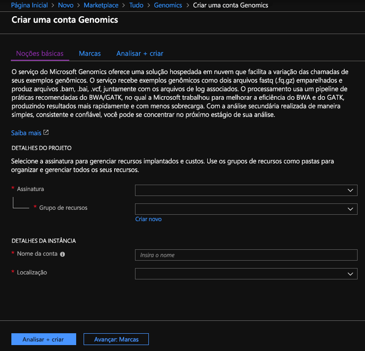
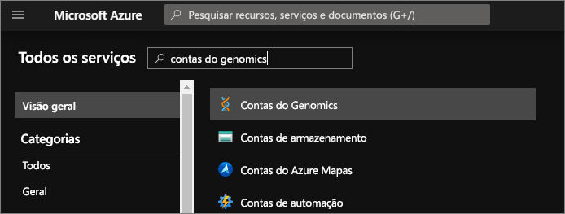
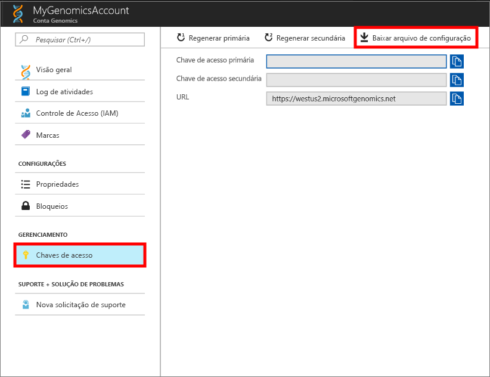
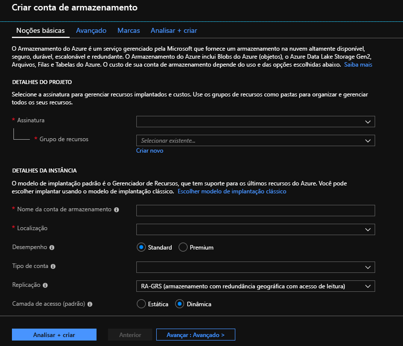

# <a name="quickstart-run-a-workflow-through-the-microsoft-genomics-service"></a>Início Rápido: Executar um fluxo de trabalho por meio do serviço Microsoft Genomics

Neste início rápido, você carregará dados de entrada para uma conta de Armazenamento de Blobs do Azure e executará um fluxo de trabalho por meio do serviço do Microsoft Genomics usando o cliente Genomics Python. O Microsoft Genomics é um serviço seguro e escalonável para análise secundária que pode processar um genoma rapidamente, começando com leituras brutas e produzindo leituras alinhadas e chamadas variáveis. 

## <a name="prerequisites"></a>Pré-requisitos

- Uma conta do Azure com uma assinatura ativa. [Crie uma conta gratuitamente](https://azure.microsoft.com/free/?ref=microsoft.com&utm_source=microsoft.com&utm_medium=docs&utm_campaign=visualstudio). 
- [Python 2.7.12+](https://www.python.org/downloads/release/python-2714/), com `pip` instalado e `python` em seu caminho do sistema. O cliente Microsoft Genomics não é compatível com o Python 3. 

## <a name="set-up-create-a-microsoft-genomics-account-in-the-azure-portal"></a>Configurar: Criar uma conta do Microsoft Genomics no portal do Azure

Para criar uma conta do Microsoft Genomics, navegue até [Criar uma conta do Genomics](https://portal.azure.com/#create/Microsoft.Genomics) no portal do Azure. Caso ainda não tenha uma assinatura do Azure, crie uma antes de criar uma conta do Microsoft Genomics. 



Configure sua conta do Genomics com as seguintes informações, conforme mostrado na imagem anterior. 

 |**Configuração**          |  **Valor sugerido**  | **Descrição do campo** |
 |:-------------       |:-------------         |:----------            |
 |Subscription         | O nome da sua assinatura|Essa é a unidade de cobrança para os serviços do Azure. Para obter detalhes sobre sua assinatura, consulte [Assinaturas](https://account.azure.com/Subscriptions) |      
 |Resource group       | MyResourceGroup       |  Grupos de recursos permitem agrupar vários recursos do Azure (conta de armazenamento, conta genômica, etc.) em um único grupo para um gerenciamento simples. Para saber mais, confira [Grupos de Recursos](https://docs.microsoft.com/azure/azure-resource-manager/resource-group-overview#resource-groups). Para obter nomes válidos do grupo de recursos, consulte [Regras de nomenclatura](/azure/architecture/best-practices/resource-naming) |
 |Nome da conta         | MyGenomicsAccount     |Escolha um identificador de conta exclusivo. Para nomes válidos, consulte [Regras de nomenclatura](/azure/architecture/best-practices/resource-naming) |
 |Location                   | Oeste dos EUA 2                    |    O serviço está disponível em Oeste dos EUA 2, Europa Ocidental e Sudeste Asiático |

Você pode selecionar **Notificações** na barra de menus superior para monitorar o processo de implantação.


Para obter mais informações sobre o Microsoft Genomics, confira [O que é Microsoft Genomics?](overview-what-is-genomics.md)

## <a name="set-up-install-the-microsoft-genomics-python-client"></a>Configurar: Instalar o cliente do Python para o Microsoft Genomics

Você precisa instalar o Python e o cliente Microsoft Genomics Python em seu ambiente local. 

### <a name="install-python"></a>Instalar o Python

O cliente Microsoft Genomics Python é compatível com o Python 2.7.12 ou com uma versão 2.7.xx posterior. 2.7.14 é a versão sugerida. Você pode encontrar o download [aqui](https://www.python.org/downloads/release/python-2714/). 

> [!IMPORTANT]
> O Python 3.x não é compatível com o Python 2.7.xx.  MSGen é um aplicativo Python 2.7. Ao executar o MSGen, verifique se o ambiente ativo do Python está usando uma versão 2.7.xx do Python. Talvez você receba erros ao tentar usar o MSGen com uma versão 3.x do Python.

### <a name="install-the-microsoft-genomics-client"></a>Instalar o cliente do Microsoft Genomics

Use o `pip` do Python para instalar o cliente Microsoft Genomics `msgen`. As instruções a seguir pressupõem que o Python já está no caminho do seu sistema. Se tiver problemas de não reconhecimento da instalação do `pip`, você precisará adicionar o Python e a subpasta de scripts ao seu caminho do sistema.

```
pip install --upgrade --no-deps msgen
pip install msgen
```

Se não desejar instalar `msgen` como um binário de todo o sistema nem modificar pacotes do Python de todo o sistema, use o sinalizador `–-user` com `pip`.
Se você usar a instalação baseada em pacote ou setup.py, todos os pacotes necessários são instalados. Caso contrário, os pacotes básicos necessários para `msgen` são 

 * [Azure-storage](https://pypi.python.org/pypi/azure-storage). 
 * [Requests](https://pypi.python.org/pypi/requests). 

Você pode instalar esses pacotes usando `pip`, `easy_install` ou por meio de procedimentos `setup.py` padrão. 

### <a name="test-the-microsoft-genomics-client"></a>Testar o cliente Microsoft Genomics
Para testar o cliente Microsoft Genomics, baixe o arquivo de configuração na sua conta do Genomics. No portal do Azure, navegue até sua conta do Genomics selecionando **Todos os serviços** na parte superior esquerda e pesquisando e selecionando contas do Genomics.



Selecione a conta do Genomics que acabou de criar, navegue até **Chaves de Acesso** e baixe o arquivo de configuração.



Teste o funcionamento do cliente Microsoft Genomics Python com o seguinte comando

```Python
msgen list -f "<full path where you saved the config file>"
```

## <a name="create-a-microsoft-azure-storage-account"></a>Criar uma Conta de Armazenamento do Microsoft Azure 
O serviço do Microsoft Genomics espera que entradas sejam armazenadas como blob de blocos em uma conta de armazenamento do Azure. Ele também grava arquivos de saída como blobs de blocos para um contêiner especificado pelo usuário em uma conta de armazenamento do Azure. As entradas e saídas podem residir em contas de armazenamento diferentes.
Caso já tenha seus dados em uma conta de armazenamento do Azure, você precisa verificar se eles estão no mesmo local que sua conta do Genomics. Caso contrário, incorrem encargos de saída ao executar o serviço do Microsoft Genomics. Caso ainda não tenha uma conta de armazenamento do Azure, você precisará criar uma e carregar seus dados. Você pode encontrar mais informações sobre contas de armazenamento do Azure [aqui](https://docs.microsoft.com/azure/storage/common/storage-create-storage-account), incluindo o que é uma conta de armazenamento e quais serviços ela fornece. Para criar uma conta de armazenamento do Azure, navegue até [Criar conta de armazenamento](https://portal.azure.com/#create/Microsoft.StorageAccount-ARM) no portal do Azure.  



Configure sua conta de armazenamento com as informações a seguir, conforme mostrado na imagem anterior. Use a maioria das opções padrão para uma conta de armazenamento, apenas especificando que a conta é BlobStorage, não para uso geral. O armazenamento de blob pode ser de duas a cinco vezes mais rápido para downloads e uploads.  O modelo de implantação padrão, Azure Resource Manager, é recomendado.  

 |**Configuração**          |  **Valor sugerido**  | **Descrição do campo** |
 |:-------------------------       |:-------------         |:----------            |
 |Subscription         | Sua assinatura do Azure |Para obter detalhes sobre sua assinatura, consulte [Assinaturas](https://account.azure.com/Subscriptions) |      
 |Resource group       | MyResourceGroup       |  Você pode selecionar o mesmo grupo de recursos que a sua conta do Genomics. Para obter nomes válidos do grupo de recursos, confira [Regras de nomenclatura](/azure/architecture/best-practices/resource-naming) |
 |Nome da conta de armazenamento         | MyStorageAccount     |Escolha um identificador de conta exclusivo. Para nomes válidos, confira [Regras de nomenclatura](/azure/architecture/best-practices/resource-naming) |
 |Location                  | Oeste dos EUA 2                  | Use a mesma localização que a da sua conta do Genomics para reduzir encargos de saída e a latência.  | 
 |Desempenho                  | Standard                   | O padrão é standard. Para obter mais detalhes sobre as contas de armazenamento standard e premium, confira [Introdução ao Armazenamento do Microsoft Azure](https://docs.microsoft.com/azure/storage/common/storage-introduction)    |
 |Tipo de conta       | BlobStorage       |  O armazenamento de blob pode ser de duas a cinco vezes mais rápido para downloads e uploads que o uso geral. |
 |Replicação                  | Armazenamento com redundância local                  | O armazenamento com redundância local replica seus dados dentro do datacenter da região em que você criou sua conta de armazenamento. Para obter mais informações, consulte [Replicação do Armazenamento do Azure](https://docs.microsoft.com/azure/storage/common/storage-redundancy)    |
 |Camada de acesso                  | Dinâmica                   | Uma camada de acesso indica que os objetos na conta de armazenamento serão acessados com mais frequência.    |

Em seguida, selecione **Examinar + criar** para criar a conta de armazenamento. Assim como você fez com a criação de sua conta do Genomics, você pode clicar em **Notificações** na barra de menus superior para monitorar o processo de implantação. 

## <a name="upload-input-data-to-your-storage-account"></a>Carregue os dados de entrada na sua conta de armazenamento

O serviço do Microsoft Genomics espera leituras finais emparelhadas (arquivos fastq ou bam) como arquivos de entrada. É possível optar por carregar seus próprios dados ou explorar usando dados de exemplo disponíveis publicamente e fornecidos para você. Caso queira usar os dados de exemplo disponíveis publicamente, eles ficam hospedados aqui:

[https://msgensampledata.blob.core.windows.net/small/chr21_1.fq.gz](https://msgensampledata.blob.core.windows.net/small/chr21_1.fq.gz)
[https://msgensampledata.blob.core.windows.net/small/chr21_2.fq.gz](https://msgensampledata.blob.core.windows.net/small/chr21_2.fq.gz)

Em sua conta de armazenamento, você precisa criar um contêiner de blob para seus dados de entrada e um segundo contêiner de blob para os dados de saída.  Carregue os dados de entrada em seu contêiner de blob de entrada. Várias ferramentas podem ser usadas para fazer isso, incluindo [Gerenciador de Armazenamento do Microsoft Azure](https://azure.microsoft.com/features/storage-explorer/), [BlobPorter](https://github.com/Azure/blobporter) ou [AzCopy](https://docs.microsoft.com/azure/storage/common/storage-use-azcopy?toc=%2fazure%2fstorage%2fblobs%2ftoc.json). 

## <a name="run-a-workflow-through-the-microsoft-genomics-service-using-the-python-client"></a>Execute um fluxo de trabalho por meio do serviço do Microsoft Genomics usando o cliente Python 

Para executar um fluxo de trabalho por meio do serviço do Microsoft Genomics, edite o arquivo *config.txt* para especificar o contêiner de armazenamento de entrada e saída para seus dados.
Abra o arquivo *config.txt* que você baixou da sua conta do Genomics. As seções que precisam ser especificadas são sua chave de assinatura e seis itens na parte inferior, o nome da conta de armazenamento e o nome da chave e do contêiner para a entrada e saída. É possível encontrar essas informações navegando no portal do Azure até **Chaves de acesso** da sua conta de armazenamento ou diretamente no Gerenciador de Armazenamento do Azure.  


Caso deseje executar o GATK4, defina o parâmetro `process_name` como `gatk4`.

Por padrão, o serviço Genomics gera arquivos VCF. Caso deseje obter uma saída gVCF em vez de uma saída VCF (equivalente a `-emitRefConfidence` no GATK 3.x e `emit-ref-confidence` no GATK 4.x), adicione o parâmetro `emit_ref_confidence` ao *config.txt* e defina-o como `gvcf`, conforme mostrado na figura anterior.  Para alterá-la novamente para a saída VCF, remova-a do arquivo *config.txt* ou defina o parâmetro `emit_ref_confidence` como `none`. 

### <a name="submit-your-workflow-to-the-microsoft-genomics-service-the-microsoft-genomics-client"></a>Enviar seu fluxo de trabalho para o serviço do Microsoft Genomics e o cliente Microsoft Genomics

Use o cliente Microsoft Genomics Python para enviar seu fluxo de trabalho com o seguinte comando:

```python
msgen submit -f [full path to your config file] -b1 [name of your first paired end read] -b2 [name of your second paired end read]
```

É possível exibir o status do trabalho usando o seguinte comando: 
```python
msgen list -f c:\temp\config.txt 
```

Assim que o fluxo de trabalho for concluído, será possível exibir os arquivos de saída em sua conta de Armazenamento do Azure no contêiner de saída que você configurou. 

## <a name="next-steps"></a>Próximas etapas
Neste artigo, você carregou os dados de entrada de exemplo no armazenamento do Azure e enviou um fluxo de trabalho para o serviço do Microsoft Genomics por meio do cliente Python `msgen`. Para saber mais sobre outros tipos de arquivo de entrada que podem ser usados com o serviço do Microsoft Genomics, confira as páginas a seguir: [FASTQ emparelhado](quickstart-input-pair-FASTQ.md) | [BAM](quickstart-input-BAM.md) | [Vários FASTQ ou BAM](quickstart-input-multiple.md). Você também pode explorar esse tutorial usando nosso [tutorial do bloco de anotações do Azure.](https://aka.ms/genomicsnotebook)
