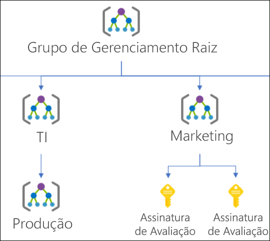

# <a name="organize-your-resources-with-azure-management-groups"></a>Organizar seus recursos com grupos de gerenciamento do Azure

Se sua organização tiver muitas assinaturas, talvez seja necessária uma maneira de gerenciar com eficiência o acesso, as políticas e a conformidade dessas assinaturas. Os grupos de gerenciamento do Azure fornecem um nível de escopo acima das assinaturas. Você organiza assinaturas em contêineres chamados "grupos de gerenciamento" e aplica as condições de governança aos grupos de gerenciamento. Todas as assinaturas dentro de um grupo de gerenciamento herdam automaticamente as condições aplicadas ao grupo de gerenciamento. Os grupos de gerenciamento fornecem gerenciamento de nível empresarial em larga escala, independentemente do tipo de assinaturas que você possa ter. Todas as assinaturas em um único grupo de gerenciamento devem confiar no mesmo locatário do Azure Active Directory.

Por exemplo, aplique políticas a um grupo de gerenciamento que limite as regiões disponíveis para a criação de VM (máquina virtual). Essa política seria aplicada a todos os grupos de gerenciamento, assinaturas e recursos nesse grupo de gerenciamento, permitindo que as VMs fossem criadas nessa região.

## <a name="hierarchy-of-management-groups-and-subscriptions"></a>Hierarquia de grupos de gerenciamento e assinaturas

É possível compilar uma estrutura flexível de grupos de gerenciamento e assinaturas para organizar seus recursos em uma hierarquia para políticas unificadas e gerenciamento de acesso. O diagrama a seguir mostra um exemplo de criação de uma hierarquia para governança usando grupos de gerenciamento.


É possível criar uma hierarquia que aplica uma política, por exemplo, que limite os locais de VM à Região Oeste dos EUA no grupo chamado “Produção”. Essa política herdará todas as assinaturas do EA nesse grupo de gerenciamento e será aplicada a todas as VMs sob essas assinaturas. Essa política de segurança não pode ser alterada pelo recurso ou pelo proprietário da assinatura, permitindo uma governança aprimorada.

Outro cenário em que você usaria grupos de gerenciamento é fornecer acesso de usuário a várias assinaturas. Ao mover várias assinaturas nesse grupo de gerenciamento, você poderá criar uma atribuição de [RBAC](../../role-based-access-control/overview.md) (controle de acesso baseado em função) no grupo de gerenciamento, que herdará esse acesso a todas as assinaturas.
Uma atribuição no grupo de gerenciamento pode permitir que os usuários tenham acesso a tudo o que precisam em vez de fazer script de atribuições de RBAC em várias assinaturas.

### <a name="important-facts-about-management-groups"></a>Fatos importantes sobre os grupos de gerenciamento

- 10.000 grupos de gerenciamento podem ter suporte em um único diretório.
- Uma árvore do grupo de gerenciamento pode dar suporte a até seis níveis de profundidade.
  - Esse limite não inclui o nível Raiz nem o nível da assinatura.
- Cada grupo de gerenciamento e assinatura pode dar suporte a apenas um pai.
- Cada grupo de gerenciamento pode ter vários elementos filhos.
- Todas as assinaturas e todos os grupos de gerenciamento estão em uma única hierarquia em cada diretório. Confira [Fatos importantes sobre o grupo de gerenciamento raiz](#important-facts-about-the-root-management-group).

## <a name="root-management-group-for-each-directory"></a>Grupo de gerenciamento raiz para cada diretório

Cada diretório recebe um único grupo de gerenciamento de nível superior chamado grupo de gerenciamento "Raiz".
Esse grupo de gerenciamento raiz é compilado na hierarquia para que todos os grupos de gerenciamento e assinaturas sejam dobrados nele. Esse grupo de gerenciamento raiz permite que políticas globais e atribuições de RBAC sejam aplicados no nível de diretório. O [administrador global do Azure AD precisa elevar-se](../../role-based-access-control/elevate-access-global-admin.md) para a função de Administrador de Acesso do Usuário desse grupo raiz inicialmente. Após elevar o acesso, o administrador poderá atribuir qualquer função de RBAC a outros usuários ou grupos do diretório para gerenciar a hierarquia. Como administrador, você pode atribuir sua própria conta como proprietário do grupo de gerenciamento raiz.

### <a name="important-facts-about-the-root-management-group"></a>Fatos importantes sobre o grupo de gerenciamento raiz

- Por padrão, o nome de exibição do grupo de gerenciamento raiz é **grupo raiz de locatário**. A ID é a ID do Azure Active Directory.
- Para alterar o nome de exibição, sua conta deve ser atribuída à função de Proprietário ou Colaborador no grupo de gerenciamento raiz. Confira [Alterar o nome de um grupo de gerenciamento](manage.md#change-the-name-of-a-management-group) para atualizar o nome de um grupo de gerenciamento.
- O grupo de gerenciamento raiz não pode ser movido nem excluído, ao contrário de outros grupos de gerenciamento.  
- Todas as assinaturas e todos os grupos de gerenciamento estão inseridos no único grupo de gerenciamento raiz dentro do diretório.
  - Todos os recursos do diretório estão inseridos no grupo de gerenciamento raiz para o gerenciamento global.
  - As novas assinaturas usam como padrão automaticamente o grupo de gerenciamento raiz quando criadas.
- Todos os clientes do Azure podem ver o grupo de gerenciamento raiz, mas nem todos os clientes têm acesso para gerenciá-lo.
  - Qualquer pessoa que tenha acesso a uma assinatura pode ver o contexto no qual essa assinatura está na hierarquia.  
  - Ninguém recebeu o acesso padrão ao grupo de gerenciamento raiz. Os administradores globais do Azure AD são os únicos usuários que podem se elevar para obter acesso.  Depois de obter acesso ao grupo de gerenciamento raiz, os administradores globais podem atribuir qualquer função de RBAC a outros usuários para gerenciá-la.  

> [!IMPORTANT]
> Qualquer atribuição de acesso de usuário ou atribuição de política no grupo de gerenciamento raiz **se aplica a todos os recursos do diretório**.
> Devido a isso, todos os clientes devem avaliar a necessidade de ter os itens definidos nesse escopo.
> As atribuições de acesso do usuário e de política devem ser "Deve ter" somente nesse escopo.  

## <a name="initial-setup-of-management-groups"></a>Configuração inicial dos grupos de gerenciamento

Quando um usuário começa a usar grupos de gerenciamento, ocorre um processo de configuração inicial. A primeira etapa é a criação do grupo de gerenciamento raiz no diretório. Depois que esse grupo é criado, todas as assinaturas existentes no diretório se tornam filho do grupo de gerenciamento raiz. O motivo para esse processo é verificar se há apenas uma hierarquia de grupo de gerenciamento em um diretório. A única hierarquia dentro do diretório permite que os clientes administrativos apliquem políticas e o acesso global que outros clientes no diretório não podem ignorar. Tudo que for atribuído na raiz será aplicado à hierarquia inteira, o que inclui todos os grupos de gerenciamento, as assinaturas, os grupos de recursos e os recursos desse locatário do Azure AD.

## <a name="trouble-seeing-all-subscriptions"></a>Problemas para ver todas as assinaturas

Alguns diretórios, que começaram usando grupos de gerenciamento na versão prévia antes de 25 de junho de 2018, podiam encontrar um problema em que nem todas as assinaturas estavam na hierarquia. O processo para colocar todas as assinaturas na hierarquia entrava em vigor depois que era feita uma atribuição de função ou de política no grupo de gerenciamento raiz no diretório. 

### <a name="how-to-resolve-the-issue"></a>Como resolver o problema

Há duas opções para resolver esse problema.

1. Remover todas as atribuições de Função e Política do grupo de gerenciamento raiz
   1. Ao remover as atribuições de função e política do grupo de gerenciamento raiz, o serviço preencherá todas as assinaturas na hierarquia no próximo ciclo de 24h.  Esse processo é usado para que não haja acesso acidental ou atribuição de política a todas as assinaturas de locatários.
   1. A melhor maneira de fazer esse processo sem afetar seus serviços é aplicar as atribuições de função ou política um nível abaixo do grupo de gerenciamento raiz. Em seguida, você pode remover todas as atribuições do escopo raiz.
1. Chamar a API diretamente para iniciar o processo de preenchimento
   1. Qualquer cliente no diretório pode chamar as APIs *TenantBackfillStatusRequest* ou *StartTenantBackfillRequest*. Quando a API StartTenantBackfillRequest é chamada, ela inicia o processo de configuração inicial de mover todas as assinaturas para a hierarquia. Esse processo também inicia a imposição de que a nova assinatura seja filha do grupo de gerenciamento raiz. Esse processo pode ser feito sem alterar as atribuições no nível raiz. Ao chamar a API, você informa não ter problemas que qualquer atribuição de política ou acesso na raiz possa ser aplicada a todas as assinaturas.

Se você tiver dúvidas sobre esse processo de preenchimento, entre em contato com: managementgroups@microsoft.com  
  
## <a name="management-group-access"></a>Acesso do grupo de gerenciamento

Os grupos de gerenciamento do Azure dão suporte ao [RBAC (Controle de Acesso Baseado em Função) do Azure](../../role-based-access-control/overview.md) para todos os acessos de recursos e definições de função.
Essas permissões são herdadas de recursos filho existentes na hierarquia. Qualquer função RBAC pode ser atribuída a um grupo de gerenciamento que herdará a hierarquia para os recursos.
Por exemplo, o colaborador da VM com a função RBAC pode ser atribuído a um grupo de gerenciamento. Essa função não tem nenhuma ação no grupo de gerenciamento, mas herdará de todas as VMs nesse grupo de gerenciamento.

O gráfico a seguir mostra a lista de funções e as ações compatíveis nos grupos de gerenciamento.

| Nome da função RBAC             | Criar | Renomear | Mover** | Excluir | Atribuir acesso | Atribuir política | Ler  |
|:-------------------------- |:------:|:------:|:------:|:------:|:-------------:| :------------:|:-----:|
|Proprietário                       | X      | X      | X      | X      | X             | X             | X     |
|Colaborador                 | X      | X      | X      | X      |               |               | X     |
|Colaborador de MG*             | X      | X      | X      | X      |               |               | X     |
|Leitor                      |        |        |        |        |               |               | X     |
|MG leitor*                  |        |        |        |        |               |               | X     |
|Colaborador da política de recurso |        |        |        |        |               | X             |       |
|Administrador de Acesso do Usuário   |        |        |        |        | X             | X             |       |

*: O Colaborador de MG e o Leitor de MG só permitem que os usuários executem essas ações no escopo do grupo de gerenciamento.  
**: Não são necessárias atribuições de função no grupo de gerenciamento raiz para mover uma assinatura ou um grupo de gerenciamento dele e para ele.  Confira [Gerenciar seus recursos com grupos de gerenciamento](manage.md) para obter detalhes de como mover itens dentro da hierarquia.

## <a name="custom-rbac-role-definition-and-assignment"></a>Atribuição e definição de função RBAC personalizada

O suporte à função RBAC personalizada para grupos de gerenciamento é compatível atualmente com algumas [limitações](#limitations).  Você pode definir o escopo do grupo de gerenciamento no escopo atribuível da definição de função.  Essa função personalizada de RBAC estará disponível para atribuição nesse grupo de gerenciamento e qualquer grupo de gerenciamento, assinatura, grupo de recursos ou recurso sob ele. Essa função personalizada herdará a hierarquia como qualquer função interna.    

### <a name="example-definition"></a>Definição de exemplo
[Definir e criar uma função personalizada](../../role-based-access-control/custom-roles.md) não muda com a inclusão de grupos de gerenciamento. Use o caminho completo para definir o grupo de gerenciamento **/providers/Microsoft.Management/managementgroups/{groupId}** . 

Use a ID do grupo de gerenciamento, e não o nome de exibição do grupo de gerenciamento. Esse erro comum ocorre porque ambos são campos definidos personalizados ao criar um grupo de gerenciamento. 

```json
...
{
  "Name": "MG Test Custom Role",
  "Id": "id", 
  "IsCustom": true,
  "Description": "This role provides members understand custom roles.",
  "Actions": [
    "Microsoft.Management/managementgroups/delete",
    "Microsoft.Management/managementgroups/read",
    "Microsoft.Management/managementgroup/write",
    "Microsoft.Management/managementgroup/subscriptions/delete",
    "Microsoft.Management/managementgroup/subscriptions/write",
    "Microsoft.resources/subscriptions/read",
    "Microsoft.Authorization/policyAssignments/*",
    "Microsoft.Authorization/policyDefinitions/*",
    "Microsoft.Authorization/policySetDefinitions/*",
    "Microsoft.PolicyInsights/*",
    "Microsoft.Authorization/roleAssignments/*",
    "Microsoft.Authorization/roledefinitions/*"
  ],
  "NotActions": [],
  "DataActions": [],
  "NotDataActions": [],
  "AssignableScopes": [
        "/providers/microsoft.management/managementGroups/ContosoCorporate"
  ]
}
...
```

### <a name="issues-with-breaking-the-role-definition-and-assignment-hierarchy-path"></a>Problemas com a interrupção da definição de função e o caminho da hierarquia de atribuição
As definições de função são um escopo atribuível em qualquer lugar dentro da hierarquia do grupo de gerenciamento. Uma definição de função pode ser definida em um grupo de gerenciamento pai enquanto a atribuição de função real existe na assinatura filho. Como há uma relação entre os dois itens, você receberá um erro ao tentar separar a atribuição de sua definição. 

Por exemplo:  Vamos examinar uma pequena seção de uma hierarquia para um visual. 



Digamos que haja uma função personalizada definida no grupo de gerenciamento de marketing. Essa função personalizada é então atribuída nas duas assinaturas de avaliação gratuita.  

Se tentarmos mover uma dessas assinaturas para ser um filho do grupo de gerenciamento de produção, essa mudança quebrará o caminho da atribuição de função de assinatura para a definição de função do grupo de gerenciamento de marketing. Nesse cenário, você receberá um erro informando que a movimentação não é permitida, pois ela interrompe essa relação.  

Há algumas opções diferentes para corrigir esse cenário:
- Remova a atribuição de função da assinatura antes de mover a assinatura para uma nova MG pai.
- Adicione a assinatura ao escopo atribuível da definição de função.
- Altere o escopo atribuível dentro da definição de função. No exemplo acima, você pode atualizar os escopos atribuíveis do marketing para o grupo de gerenciamento raiz para que ambas as ramificações da hierarquia possam alcançar a definição.   
- Crie uma função personalizada adicional que será definida na outra ramificação.  Essa nova função exigirá que a atribuição de função seja alterada também na assinatura.  

### <a name="limitations"></a>Limitações  
Há limitações ao usar funções personalizadas em grupos de gerenciamento. 

 - Você só pode definir um grupo de gerenciamento nos escopos atribuíveis de uma nova função.  Essa limitação está em vigor para reduzir o número de situações em que as definições de função e as atribuições de função são desconectadas.  Isso acontece quando uma assinatura ou um grupo de gerenciamento com uma atribuição de função é movido para um pai diferente que não tem a definição de função.   
 - As ações do plano de dados RBAC não podem ser definidas nas funções personalizadas do grupo de gerenciamento.  Essa restrição está em vigor porque há um problema de latência com ações RBAC atualizando os provedores de recursos do plano de dados. Esse problema de latência está sendo resolvido e essas ações serão desabilitadas da definição de função para reduzir os riscos.
 - O Azure Resource Manager não valida a existência do grupo de gerenciamento no escopo atribuível da definição de função.  Se houver uma ID de grupo de gerenciamento de digitação ou incorreta listada, a definição de função ainda será criada.   

## <a name="moving-management-groups-and-subscriptions"></a>Como mover grupos de gerenciamento e assinaturas 

Para que um grupo de gerenciamento ou assinatura seja um filho de outro grupo de gerenciamento, três regras precisam ser avaliadas como true.

Se você estiver executando a ação de mover, precisará de: 

-  Permissões de gravação de Atribuição de função e gravação de grupo de gerenciamento na no grupo de gerenciamento ou assinatura filho.
   - Exemplo de **Proprietário** de função interna
- Acesso de gravação do grupo de gerenciamento no grupo de gerenciamento pai alvo.
   - Exemplo de função interna: **Proprietário**, **Colaborador**, **Colaborador do Grupo de Gerenciamento**
- Acesso de gravação do grupo de gerenciamento no grupo de gerenciamento pai existente.
   - Exemplo de função interna: **Proprietário**, **Colaborador**, **Colaborador do Grupo de Gerenciamento**

**Exceção**: se o grupo de gerenciamento pai existente ou alvo for o grupo de gerenciamento raiz, os requisitos de permissões não se aplicarão. Como o grupo de gerenciamento raiz é o ponto de aterrissagem padrão para todos os novos grupos de gerenciamento e assinaturas, não é preciso ter permissões para mover um item.

Se a função de proprietário na assinatura for herdada do grupo de gerenciamento atual, seus destinos de movimentação serão limitados. Você só pode mover a assinatura para outro grupo de gerenciamento no qual você tem a função de Proprietário. Você não pode movê-lo para um grupo de gerenciamento em que você é um colaborador, pois você perderia a propriedade da assinatura. Se você estiver diretamente atribuído à função de Proprietário da assinatura (não herdada do grupo de gerenciamento), poderá movê-la para qualquer grupo de gerenciamento no qual você seja um colaborador. 

## <a name="audit-management-groups-using-activity-logs"></a>Auditar grupos de gerenciamento usando logs de atividades

Os grupos de gerenciamento são compatíveis com o [Log de atividades do Azure](../../azure-monitor/platform/platform-logs-overview.md). Você pode pesquisar todos os eventos que ocorrem para um grupo de gerenciamento no mesmo local central que os outros recursos do Azure.  Por exemplo, você pode ver todas as alterações de atribuições de função ou de política feitas em um grupo de gerenciamento específico.


Ao analisar a consulta em grupos de gerenciamento fora do portal do Azure, o escopo de destino dos grupos de gerenciamento é semelhante a **"/providers/Microsoft.Management/managementGroups/{yourMgID}"** .

## <a name="next-steps"></a>Próximas etapas

Para saber mais sobre grupos de gerenciamento, consulte:

- [Criar grupos de gerenciamento para organizar recursos do Azure](create.md)
- [Como alterar, excluir ou gerenciar seus grupos de gerenciamento](manage.md)
- [Analisar grupos de gerenciamento no Módulo de Recursos do Azure PowerShell](/powershell/module/az.resources#resources)
- [Revisar grupos de gerenciamento na API REST](/rest/api/resources/managementgroups)
- [Revisar grupos de gerenciamento na CLI do Azure](/cli/azure/account/management-group)
