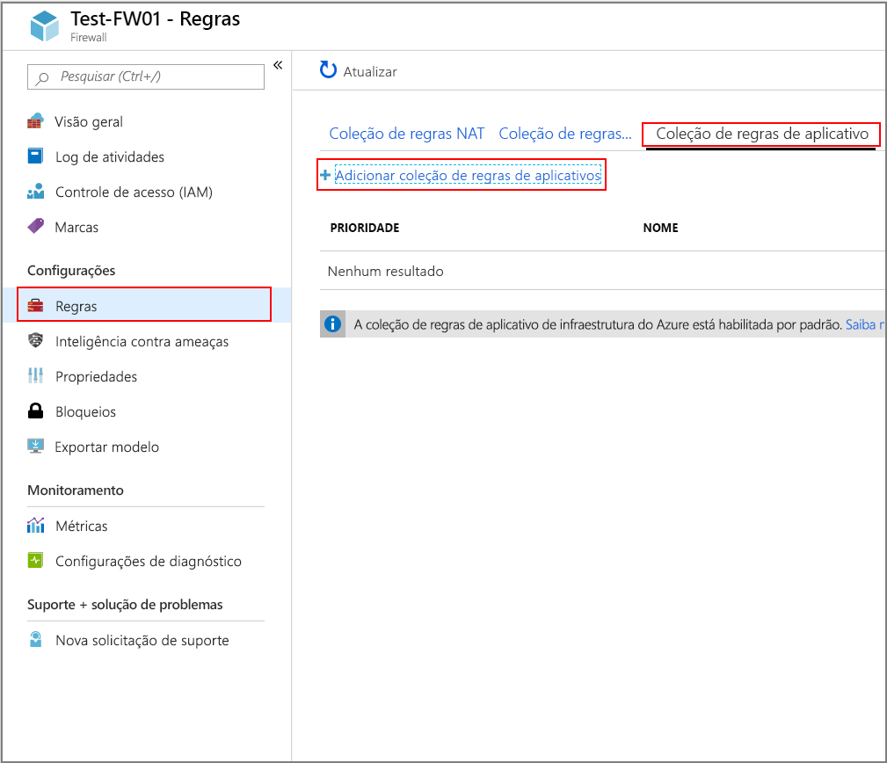
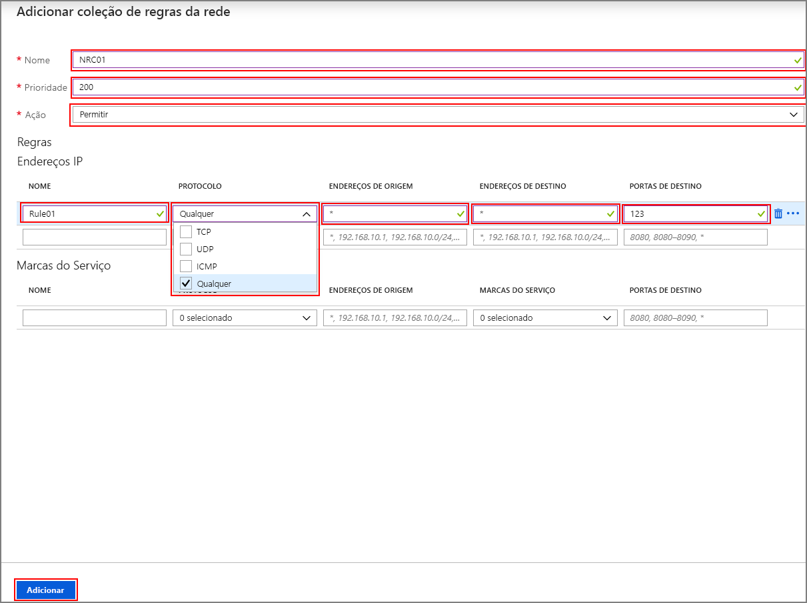

# <a name="configure-outbound-network-traffic-for-azure-hdinsight-clusters-using-firewall-preview"></a>Configurar o tráfego de rede de saída para clusters do Azure HDInsight usando o firewall (versão prévia)

Este artigo fornece as etapas para proteger o tráfego de saída do seu cluster HDInsight usando o Firewall do Azure. As etapas a seguir pressupõem que você está configurando um firewall do Azure para um cluster existente. Se você estiver implantando um novo cluster e atrás de um firewall, primeiro crie seu cluster e sub-rede HDInsight e, em seguida, siga as etapas neste guia.

## <a name="background"></a>Segundo plano

Os clusters do Azure HDInsight normalmente são implantados em sua própria rede virtual. O cluster tem dependências em serviços fora dessa rede virtual que exigem acesso à rede para funcionar corretamente.

Há várias dependências que exigem tráfego de entrada. O tráfego de gerenciamento de entrada não pode ser enviado por meio de um dispositivo de firewall. Os endereços de origem para esse tráfego são conhecidos e são publicados [aqui](hdinsight-management-ip-addresses.md). Você também pode criar regras de NSG (grupo de segurança de rede) com essas informações para proteger o tráfego de entrada para os clusters.

As dependências de tráfego de saída do HDInsight são quase totalmente definidas com FQDNs, que não têm endereços IP estáticos por trás delas. A falta de endereços estáticos significa que os NSGs (grupos de segurança de rede) não podem ser usados para bloquear o tráfego de saída de um cluster. Os endereços são alterados com frequência suficiente, pois não é possível configurar regras com base na resolução de nome atual e usá-las para configurar as regras de NSG.

A solução para proteger os endereços de saída é usar um dispositivo de firewall que possa controlar o tráfego de saída com base em nomes de domínio. O Firewall do Azure pode restringir o tráfego HTTP e HTTPS de saída com base no FQDN das marcas de destino ou [FQDN](https://docs.microsoft.com/azure/firewall/fqdn-tags).

## <a name="configuring-azure-firewall-with-hdinsight"></a>Configurando o Firewall do Azure com o HDInsight

Um resumo das etapas para bloquear a saída do HDInsight existente com o Firewall do Azure é:
1. Crie um firewall.
1. Adicionar regras de aplicativo ao firewall
1. Adicione regras de rede ao firewall.
1. Crie uma tabela de roteamento.

### <a name="create-a-new-firewall-for-your-cluster"></a>Criar um novo firewall para o cluster

1. Crie uma sub-rede chamada **AzureFirewallSubnet** na rede virtual onde o cluster existe. 
1. Crie um novo firewall **Test-FW01** usando as etapas em [tutorial: implantar e configurar o Firewall do Azure usando o portal do Azure](../firewall/tutorial-firewall-deploy-portal.md#deploy-the-firewall).

### <a name="configure-the-firewall-with-application-rules"></a>Configurar o firewall com regras de aplicativo

Crie uma coleção de regras de aplicativo que permita que o cluster envie e receba comunicações importantes.

Selecione o novo firewall **Test-FW01** no portal do Azure. Clique em **regras** em **configurações**  >  coleção de**regras de aplicativo**  > **Adicionar coleção de regras de aplicativo**.



Na tela **Adicionar coleção de regras de aplicativo** , conclua as seguintes etapas:

1. Insira um **nome**, uma **prioridade**e clique em **permitir** no menu suspenso **ação** e insira as seguintes regras na **seção marcas de FQDN** :

   | **Nome** | **Endereço de origem** | **Marca FQDN** | **Observações** |
   | --- | --- | --- | --- |
   | Rule_1 | * | HDInsight e WindowsUpdate | Necessário para serviços HDIs |

1. Adicione as seguintes regras à **seção FQDNs de destino** :

   | **Nome** | **Endereço de origem** | **Protocolo: porta** | **FQDNS de destino** | **Observações** |
   | --- | --- | --- | --- | --- |
   | Rule_2 | * | https: 443 | login.windows.net | Permite a atividade de logon do Windows |
   | Rule_3 | * | https: 443 | login.microsoftonline.com | Permite a atividade de logon do Windows |
   | Rule_4 | * | https: 443, http: 80 | < storage_account_name. blob. Core. Windows. net > | Se o seu cluster tiver o suporte de WASB, adicione uma regra para WASB. Para usar somente conexões HTTPS, verifique se ["transferência segura necessária"](https://docs.microsoft.com/azure/storage/common/storage-require-secure-transfer) está habilitada na conta de armazenamento. |

1. Clique em **Adicionar**.

   

### <a name="configure-the-firewall-with-network-rules"></a>Configurar o firewall com regras de rede

Crie as regras de rede para configurar corretamente o cluster HDInsight.

1. Selecione o novo firewall **Test-FW01** no portal do Azure.
1. Clique em **regras** em **configurações**  >  coleção de**regras de rede**  > **Adicionar coleção de regras de rede**.
1. Na tela **Adicionar coleção de regras de rede** , insira um **nome**, uma **prioridade**e clique em **permitir** no menu suspenso **ação** .
1. Crie as seguintes regras na seção **endereços IP** :

   | **Nome** | **Protocolo** | **Endereço de origem** | **Endereço de destino** | **Porta de destino** | **Observações** |
   | --- | --- | --- | --- | --- | --- |
   | Rule_1 | UDP | * | * | `123` | Serviço de tempo |
   | Rule_2 | Outro | * | DC_IP_Address_1, DC_IP_Address_2 | `*` | Se você estiver usando o Enterprise Security Package (ESP), adicione uma regra de rede na seção endereços IP que permite a comunicação com o AAD-DS para clusters ESP. Você pode encontrar os endereços IP dos controladores de domínio na seção AAD-DS no portal | 
   | Rule_3 | TCP | * | Endereço IP da sua conta de Data Lake Storage | `*` | Se você estiver usando Azure Data Lake Storage, poderá adicionar uma regra de rede na seção endereços IP para resolver um problema SNI com ADLS Gen1 e Gen2. Essa opção roteará o tráfego para o firewall, o que pode resultar em custos mais altos para cargas de dados grandes, mas o tráfego será registrado em log e auditável nos logs de firewall. Determine o endereço IP para sua conta de Data Lake Storage. Você pode usar um comando do PowerShell como `[System.Net.DNS]::GetHostAddresses("STORAGEACCOUNTNAME.blob.core.windows.net")` para resolver o FQDN para um endereço IP.|
   | Rule_4 | TCP | * | * | `12000` | Adicional Se você estiver usando Log Analytics, crie uma regra de rede na seção endereços IP para habilitar a comunicação com seu espaço de trabalho do Log Analytics. |

1. Crie as regras a seguir na seção **marcas de serviço** :

   | **Nome** | **Protocolo** | **Endereço de origem** | **Marcas de serviço** | **Porta de destino** | **Observações** |
   | --- | --- | --- | --- | --- | --- |
   | Rule_7 | TCP | * | SQL | `1433` | Configure uma regra de rede na seção de marcas de serviço para SQL que permitirá que você registre e audite o tráfego do SQL, a menos que você tenha configurado pontos de extremidade de serviço para SQL Server na sub-rede do HDInsight que irá ignorar o firewall. |

1. Clique em **Adicionar** para concluir a criação de sua coleção de regras de rede.

   

### <a name="create-and-configure-a-route-table"></a>Criar e configurar uma tabela de rotas

Crie uma tabela de rotas com as seguintes entradas:

1. Seis endereços [desta lista de endereços IP de gerenciamento do HDInsight necessários](../hdinsight/hdinsight-management-ip-addresses.md) com um próximo salto da **Internet**:
    1. Quatro endereços IP para todos os clusters em todas as regiões
    1. Dois endereços IP específicos para a região em que o cluster é criado
1. Uma rota de dispositivo virtual para o endereço IP 0.0.0.0/0 com o próximo salto é o seu endereço IP privado do firewall do Azure.

Por exemplo, para configurar a tabela de rotas para um cluster criado na região dos EUA de "EUA Central", use as seguintes etapas:

1. Entre no Portal do Azure.
1. Selecione o seu firewall do Azure **Test-FW01**. Copie o **endereço IP privado** listado na página **visão geral** . Para este exemplo, usaremos um **endereço de exemplo de 10.1.1.4**
1. Crie uma nova tabela de rotas.
1. Clique em **rotas** em **configurações**.
1. Clique em **Adicionar** para criar rotas para os endereços IP na tabela abaixo.

| Nome da rota | Prefixo de endereço | Tipo do próximo salto | Endereço do próximo salto |
|---|---|---|---|
| 168.61.49.99 | 168.61.49.99/32 | Internet | ND |
| 23.99.5.239 | 23.99.5.239/32 | Internet | ND |
| 168.61.48.131 | 168.61.48.131/32 | Internet | ND |
| 138.91.141.162 | 138.91.141.162/32 | Internet | ND |
| 13.67.223.215 | 13.67.223.215/32 | Internet | ND |
| 40.86.83.253 | 40.86.83.253/32 | Internet | ND |
| 0.0.0.0 | 0.0.0.0/0 | Dispositivo virtual | 10.1.1.4 |

Conclua a configuração da tabela de rotas:

1. Atribua a tabela de rotas que você criou à sub-rede do HDInsight clicando em **sub-redes** em **configurações** e depois em **associar**.
1. Na tela **associar sub-rede** , selecione a rede virtual na qual o cluster foi criado e a **sub-rede do hdinsight** usada para o cluster hdinsight.
1. Clique em **OK**.

## <a name="edge-node-or-custom-application-traffic"></a>Nó de borda ou tráfego de aplicativo personalizado

As etapas acima permitirão que o cluster opere sem problemas. Você ainda precisa configurar dependências para acomodar seus aplicativos personalizados em execução nos nós de borda, se aplicável.

As dependências de aplicativo devem ser identificadas e adicionadas ao firewall do Azure ou à tabela de rotas.

As rotas devem ser criadas para o tráfego do aplicativo para evitar problemas de roteamento assimétrico.

Se seus aplicativos tiverem outras dependências, eles precisarão ser adicionados ao seu firewall do Azure. Crie regras de aplicativo para permitir o tráfego HTTP/HTTPS e as regras de rede para todo o resto.

## <a name="logging-and-scale"></a>Registro em log e escala

O Firewall do Azure pode enviar logs para alguns sistemas de armazenamento diferentes. Para obter instruções sobre como configurar o registro em log para o firewall, siga as etapas em [tutorial: monitorar logs e métricas de firewall do Azure](../firewall/tutorial-diagnostics.md).

Depois de concluir a configuração de log, se você estiver registrando dados em log para Log Analytics, poderá exibir o tráfego bloqueado com uma consulta como a seguinte:

```
AzureDiagnostics | where msg_s contains "Deny" | where TimeGenerated >= ago(1h)
```

A integração do firewall do Azure com logs de Azure Monitor é útil ao obter um aplicativo funcionando quando você não está ciente de todas as dependências do aplicativo. Você pode saber mais sobre os logs de Azure Monitor de [analisar dados de log em Azure monitor](../azure-monitor/log-query/log-query-overview.md)

Para saber mais sobre os limites de escala do firewall do Azure e a solicitação aumenta, consulte [este](https://docs.microsoft.com/en-us/azure/azure-subscription-service-limits#azure-firewall-limits) documento.

## <a name="access-to-the-cluster"></a>Acesso ao cluster
Depois de instalar o firewall com êxito, você pode usar o ponto de extremidade interno (`https://<clustername>-int.azurehdinsight.net`) para acessar o Ambari de dentro da VNET. 

Para usar o ponto de extremidade público (`https://<clustername>.azurehdinsight.net`) ou o ponto de extremidade SSH (`<clustername>-ssh.azurehdinsight.net`), verifique se você tem as rotas certas na tabela de rotas e as regras NSG para evitar o problema de roteamento assimétrica explicado [aqui](https://docs.microsoft.com/azure/firewall/integrate-lb). Especificamente nesse caso, você precisa permitir o endereço IP do cliente nas regras de NSG de entrada e também adicioná-lo à tabela de rotas definida pelo usuário com o próximo salto definido como `internet`. Se essa configuração não for configurada corretamente, você verá um erro de tempo limite.

## <a name="configure-another-network-virtual-appliance"></a>Configurar outra solução de virtualização de rede

>[!Important]
> As informações a seguir **só** serão necessárias se você quiser configurar uma solução de virtualização de rede (NVA) diferente do firewall do Azure.

As instruções anteriores ajudam você a configurar o Firewall do Azure para restringir o tráfego de saída do seu cluster HDInsight. O Firewall do Azure é configurado automaticamente para permitir o tráfego para muitos dos cenários importantes comuns. Se você quiser usar outra solução de virtualização de rede, será necessário configurar manualmente vários recursos adicionais. Tenha em mente o seguinte como configurar sua solução de virtualização de rede:

* Serviços com capacidade de ponto de extremidade de serviço devem ser configurados com pontos de extremidade de serviço.
* As dependências de endereço IP são para tráfego não HTTP/S (tráfego TCP e UDP).
* Os pontos de extremidade HTTP/HTTPS do FQDN podem ser colocados em seu dispositivo NVA.
* Pontos de extremidade HTTP/HTTPS curinga são dependências que podem variar com base em vários qualificadores.
* Atribua a tabela de rotas que você cria à sub-rede do HDInsight.

### <a name="service-endpoint-capable-dependencies"></a>Dependências compatíveis com ponto de extremidade de serviço

| **Extremidade** |
|---|
| SQL do Azure |
| Armazenamento do Azure |
| Azure Active Directory |

#### <a name="ip-address-dependencies"></a>Dependências de endereço IP

| **Extremidade** | **Detalhes** |
|---|---|
| \*:123 | Verificação do relógio de NTP. O tráfego é verificado em vários pontos de extremidade na porta 123 |
| IPs publicados [aqui](hdinsight-management-ip-addresses.md) | Estes são serviços do HDInsight |
| Os IPs privados do AAD-DS para clusters ESP |
| \*:16800 para ativação do Windows KMS |
| \*12000 para Log Analytics |

#### <a name="fqdn-httphttps-dependencies"></a>Dependências de HTTP/HTTPS FQDN

>[!Important]
> A lista a seguir fornece apenas alguns dos FQDNs mais importantes. Você pode obter a lista completa de FQDNs para configurar seu NVA [neste arquivo](https://github.com/Azure-Samples/hdinsight-fqdn-lists/blob/master/HDInsightFQDNTags.json).

| **Extremidade**                                                          |
|---|
| azure.archive.ubuntu.com:80                                           |
| security.ubuntu.com:80                                                |
| ocsp.msocsp.com:80                                                    |
| ocsp.digicert.com:80                                                  |
| wawsinfraprodbay063.blob.core.windows.net:443                         |
| registry-1.docker.io:443                                              |
| auth.docker.io:443                                                    |
| production.cloudflare.docker.com:443                                  |
| download.docker.com:443                                               |
| us.archive.ubuntu.com:80                                              |
| download.mono-project.com:80                                          |
| packages.treasuredata.com:80                                          |
| security.ubuntu.com:80                                                |
| azure.archive.ubuntu.com:80                                                |
| ocsp.msocsp.com:80                                                |
| ocsp.digicert.com:80                                                |

## <a name="next-steps"></a>Próximos passos

* [Arquitetura de rede virtual do Azure HDInsight](hdinsight-virtual-network-architecture.md)
