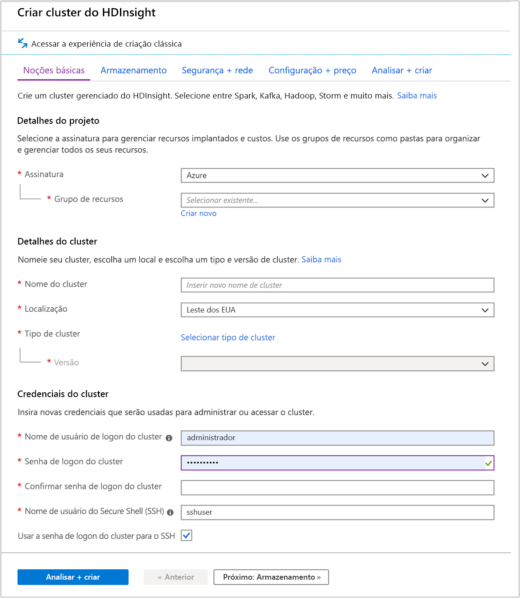
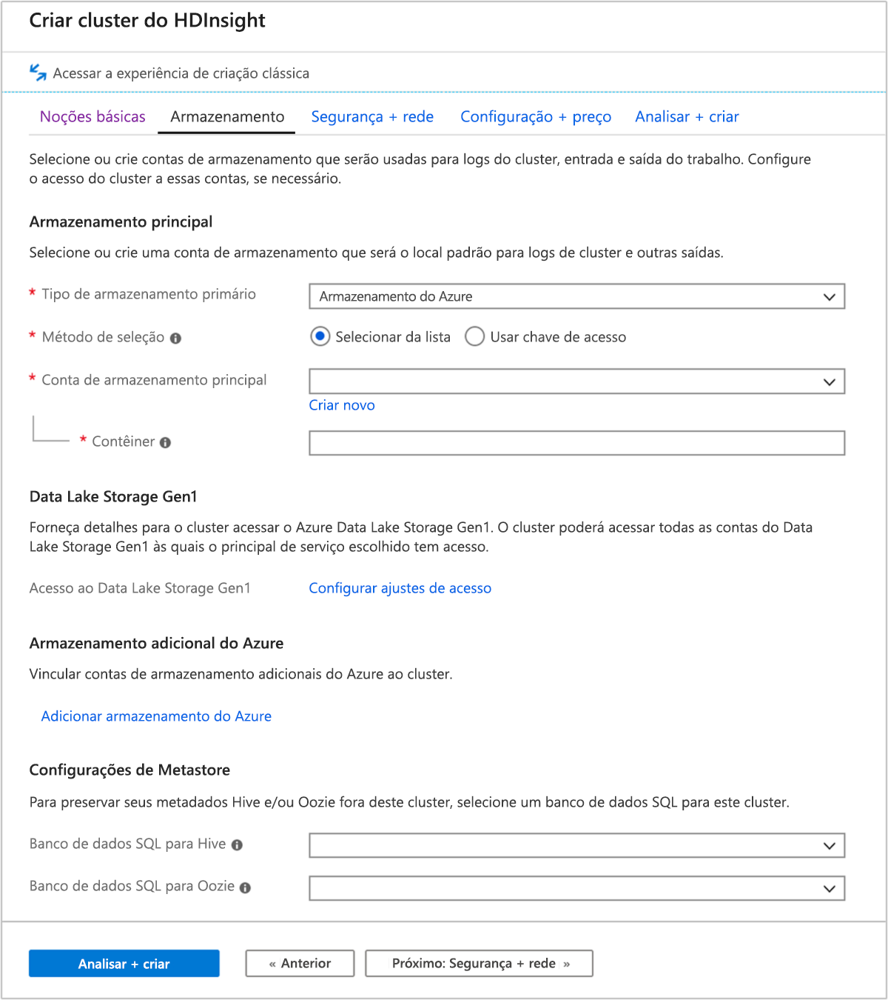
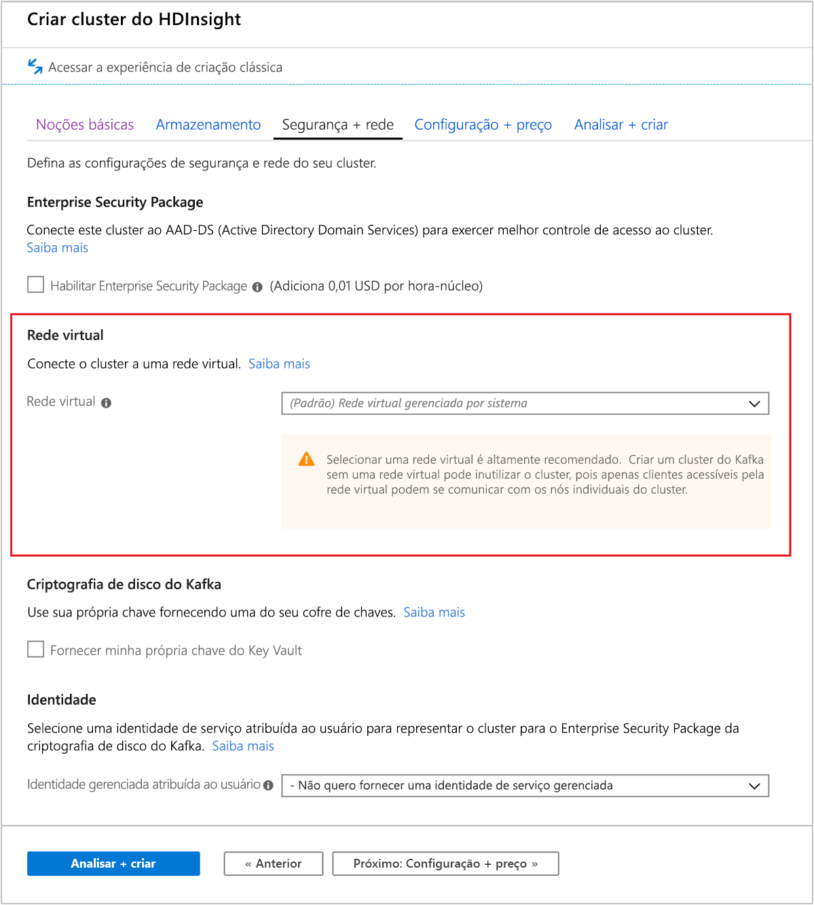
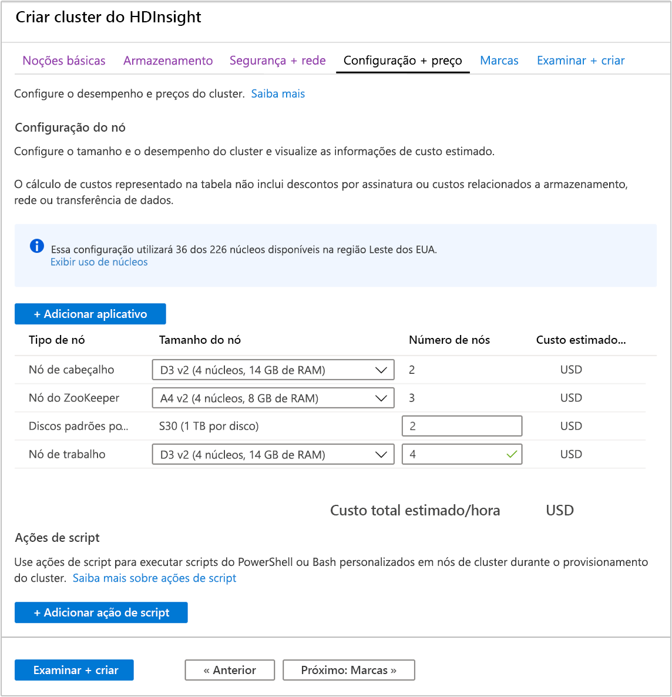
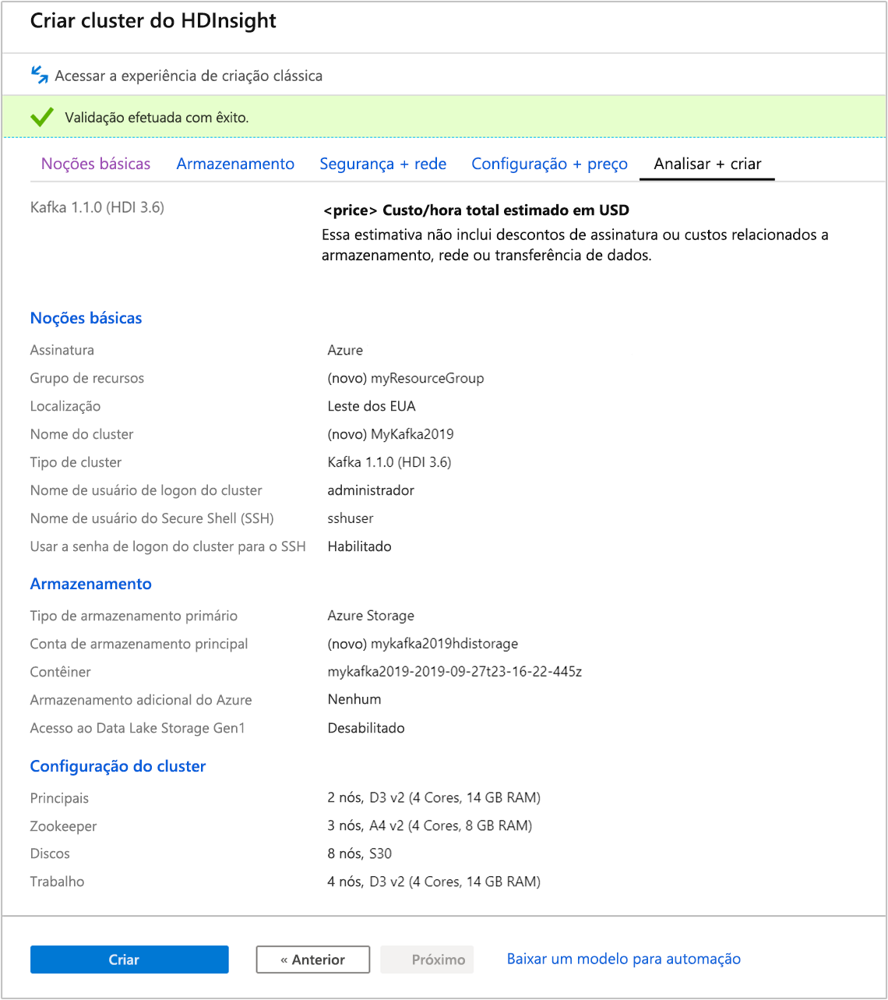

# <a name="quickstart-create-apache-kafka-cluster-in-azure-hdinsight-using-azure-portal"></a>Início Rápido: Criar cluster do Apache Kafka no Azure HDInsight usando o portal do Azure

O Apache Kafka é uma plataforma de streaming distribuída de software livre. Ela é geralmente usada como um agente de mensagens, pois fornece funcionalidade semelhante a uma fila de mensagens para publicação e assinatura.

Neste início rápido, você aprenderá a criar um cluster [Apache Kafka](https://kafka.apache.org) usando o Portal do Azure. Você também aprenderá a usar os utilitários incluídos para enviar e receber mensagens usando o Apache Kafka.

[!INCLUDE [delete-cluster-warning](../../../includes/hdinsight-delete-cluster-warning.md)]

A API do Apache Kafka só pode ser acessada por recursos dentro da mesma rede virtual. Neste início rápido, você acessará o cluster diretamente no SSH. Para conectar a outros serviços, redes ou máquinas virtuais ao Apache Kafka, primeiro crie uma rede virtual e, depois, crie os recursos na rede. Para saber mais, confira o documento [Conectar-se ao Apache Kafka usando uma rede virtual](apache-kafka-connect-vpn-gateway.md).

Se você não tiver uma assinatura do Azure, crie uma [conta gratuita](https://azure.microsoft.com/free/?WT.mc_id=A261C142F) antes de começar.

## <a name="prerequisites"></a>Pré-requisitos

Um cliente SSH. Para saber mais, confira [Conectar-se ao HDInsight (Apache Hadoop) usando SSH](../hdinsight-hadoop-linux-use-ssh-unix.md).

## <a name="create-an-apache-kafka-cluster"></a>Criar um cluster do Apache Kafka

Para criar um Apache Kafka no cluster do HDInsight, use as seguintes etapas:

1. Entre no [Portal do Azure](https://portal.azure.com).

1. No menu esquerdo, navegue até **+ Criar um recurso** > **Análise** > **HDInsight**.

    

1. Em **Conceitos Básicos**, insira ou selecione os seguintes valores:

    |Propriedade  |DESCRIÇÃO  |
    |---------|---------|
    |Subscription    |  Selecione sua assinatura do Azure. |
    |Resource group     | Crie um grupo de recursos ou selecione um grupo de recursos existente.  Um grupo de recursos é um contêiner de componentes do Azure.  Nesse caso, o grupo de recursos contém o cluster HDInsight e a conta de Armazenamento do Azure dependente. |
    |Nome do cluster   | Insira um nome para o cluster Hadoop. Como todos os clusters no HDInsight compartilham o mesmo namespace DNS esse nome precisa ser exclusivo. O nome pode ter até 59 caracteres incluindo letras, números e hifens. O primeiro e último caracteres do nome não podem ser hifens. |
    |Location    | Selecione um local do Azure no qual você deseja criar o cluster.  Escolha um local mais próximo a você para obter melhor desempenho. |
    |Tipo de cluster| Selecione **Selecione o tipo de cluster**. Em seguida, selecione **Kafka** como o tipo de cluster.|
    |Versão|A versão padrão do tipo de cluster será especificada. Selecione na lista suspensa se desejar especificar uma versão diferente.|
    |Nome de usuário e senha de logon do cluster    | O nome padrão de logon é **admin**. A senha deve ter no mínimo 10 caracteres e deve conter pelo menos um dígito, uma letra maiúscula, uma minúscula e um caractere não alfanumérico (exceto os caracteres ' " ` \). **Não forneça** senhas comuns, como "Pass@word1".|
    |Nome de usuário do Secure Shell (SSH) | O nome de usuário padrão é **sshuser**.  Você pode fornecer outro nome para o nome de usuário de SSH. |
    |Usar senha de logon do cluster para SSH| Marque essa caixa de seleção para usar a mesma senha para o usuário SSH que aquela fornecida para o usuário de logon do cluster.|

   

    Cada região do Azure (local) fornece _domínios de falha_. Um domínio de falha é um agrupamento lógico de hardware subjacente em um data center do Azure. Cada domínio de falha tem um comutador de rede e uma fonte de alimentação em comum. As máquinas virtuais e os discos gerenciados que implementam os nós em um cluster HDInsight são distribuídos entre esses domínios de falha. Essa arquitetura limita o possível impacto de falhas físicas de hardware.

    Para alta disponibilidade dos dados, selecione uma região (local) que contenha __três domínios de falha__. Para obter informações sobre o número de domínios de falha em uma região, consulte o documento [Disponibilidade de máquinas virtuais do Linux](../../virtual-machines/windows/manage-availability.md#use-managed-disks-for-vms-in-an-availability-set).

    Selecione **Próximo: Guia Armazenamento >>** para passar para as configurações de armazenamento.

1. Na guia **Armazenamento**, forneça os seguintes valores:

    |Propriedade  |DESCRIÇÃO  |
    |---------|---------|
    |Tipo de armazenamento primário|Use o valor padrão **Armazenamento do Azure**.|
    |Método de seleção|Use o valor padrão **Selecione na lista**.|
    |Conta de armazenamento primária|Use a lista suspensa para selecionar uma conta de armazenamento existente ou selecione **Criar**. Se você criar uma conta, o nome deverá ter entre 3 e 24 caracteres e poderá incluir apenas números e letras minúsculas|
    |Contêiner|Use o valor preenchido automaticamente.|

    

    Selecione a guia **Segurança + rede**.

1. Para este início rápido, deixe os padrões de configuração de segurança. Para saber mais sobre o Enterprise Security Package, visite [Configurar um cluster HDInsight com o Enterprise Security Package usando o Azure Active Directory Domain Services](../domain-joined/apache-domain-joined-configure-using-azure-adds.md). Para saber como usar sua própria chave no Apache Kafka Disk Encryption, visite [Traga sua própria chave para o Apache Kafka no Azure HDInsight](apache-kafka-byok.md)

   Se você deseja conectar seu cluster a uma rede virtual, selecione uma rede virtual na lista suspensa **Rede virtual**.

   

    Selecione a guia **Configuração + preços**.

1. Para garantir a disponibilidade do Apache Kafka no HDInsight, a entrada __número de nós__ para **Nó de trabalho** deve ser definida como 3 ou superior. O valor padrão é 4.

    A entrada **Discos padrão por nó de trabalho** configura a escalabilidade do Apache Kafka no HDInsight. O Apache Kafka no HDInsight usa o disco local das máquinas virtuais no cluster para armazenar dados. Como o Apache Kafka tem E/S bastante pesadas, os [Azure Managed Disks](../../virtual-machines/windows/managed-disks-overview.md) são usados para fornecer alta taxa de transferência e mais armazenamento por nó. O tipo de disco gerenciado pode ser __Standard__ (HDD) ou __Premium__ (SSD). O tipo de disco depende do tamanho da VM usado pelos nós de trabalho (agentes do Apache Kafka). Os discos Premium são usados automaticamente com VMs das séries DS e GS. Todos os outros tipos VM usam o padrão.

   

    Selecione a guia **Examinar + criar**.

1. Examine a configuração do cluster. Altere as configurações incorretas. Finalmente, selecione **Criar** para criar o cluster.

    

    Pode levar até 20 minutos para criar o cluster.

## <a name="connect-to-the-cluster"></a>Conectar-se ao cluster

1. Para conectar-se ao nó principal do cluster do Apache Kafka, use o comando a seguir. Substitua `sshuser` pelo nome de usuário SSH. Substitua `mykafka` pelo nome do cluster Apache Kafka.

    ```bash
    ssh sshuser@mykafka-ssh.azurehdinsight.net
    ```

2. Quando você se conectar pela primeira vez ao cluster, seu cliente SSH poderá exibir um aviso de que a autenticidade do host não pode ser estabelecida. Quando for solicitado, digite __sim__ e pressione __Enter__ para adicionar o host à lista de servidores confiáveis do cliente SSH.

3. Quando solicitado, insira a senha do usuário SSH.

    Após a conexão, você verá informações semelhantes ao seguinte texto:
    
    ```output
    Authorized uses only. All activity may be monitored and reported.
    Welcome to Ubuntu 16.04.4 LTS (GNU/Linux 4.13.0-1011-azure x86_64)
    
     * Documentation:  https://help.ubuntu.com
     * Management:     https://landscape.canonical.com
     * Support:        https://ubuntu.com/advantage
    
      Get cloud support with Ubuntu Advantage Cloud Guest:
        https://www.ubuntu.com/business/services/cloud
    
    83 packages can be updated.
    37 updates are security updates.


    Welcome to Apache Kafka on HDInsight.
    
    Last login: Thu Mar 29 13:25:27 2018 from 108.252.109.241
    ```

## <a id="getkafkainfo"></a>Obter as informações de host do Apache Zookeeper e do Broker

Ao trabalhar com Kafka, você deve conhecer os hosts do *Apache Zookeeper* e *Broker*. Esses hosts são usados com a API do Apache Kafka e muitos dos utilitários fornecidos com o Kafka.

Nesta seção, você obtém as informações do host da API REST do Apache Ambari no cluster.

1. Instale [jq](https://stedolan.github.io/jq/), um processador JSON de linha de comando. Esse utilitário é usado para analisar documentos JSON e é útil para analisar as informações do host. Na conexão SSH aberta, digite o seguinte comando para instalar o `jq`:

    ```bash
    sudo apt -y install jq
    ```

2. Configurar variáveis de ambiente. Substitua `PASSWORD` e `CLUSTERNAME` pela senha de logon do cluster e pelo nome do cluster, respectivamente, e digite o comando:

    ```bash
    export password='PASSWORD'
    export clusterNameA='CLUSTERNAME'
    ```

3. Extraia o nome do cluster com grafia correta de maiúsculas e minúsculas. A grafia de maiúsculas e minúsculas real do nome do cluster pode ser diferente do esperado, dependendo de como o cluster foi criado. Esse comando obterá a grafia de maiúsculas e minúsculas real, a armazenará em uma variável e, em seguida, exibirá o nome com grafia correta de maiúsculas e minúsculas e o nome fornecido anteriormente. Digite o seguinte comando:

    ```bash
    export clusterName=$(curl -u admin:$password -sS -G "https://$clusterNameA.azurehdinsight.net/api/v1/clusters" | jq -r '.items[].Clusters.cluster_name')
    echo $clusterName, $clusterNameA
    ```

4. Para definir uma variável de ambiente com informações de host Zookeeper, use o comando especificado abaixo. O comando recupera todos os hosts Zookeeper e retorna apenas as duas primeiras entradas. Isso ocorre porque você deseja certa redundância no caso de um host ficar inacessível.

    ```bash
    export KAFKAZKHOSTS=`curl -sS -u admin:$password -G http://headnodehost:8080/api/v1/clusters/$clusterName/services/ZOOKEEPER/components/ZOOKEEPER_SERVER | jq -r '["\(.host_components[].HostRoles.host_name):2181"] | join(",")' | cut -d',' -f1,2`
    ```

    Este comando consulta diretamente o serviço do Ambari no nó de cabeçalho do cluster. Também é possível acessar o Ambari usando o endereço público de `https://$CLUSTERNAME.azurehdinsight.net:80/`. Algumas configurações de rede podem impedir o acesso ao endereço público. Por exemplo, usar NSG (Grupos de Segurança de Rede) para restringir o acesso ao HDInsight em uma rede virtual.

5. Para verificar se a variável de ambiente é definida corretamente, use o seguinte comando:

    ```bash
    echo $KAFKAZKHOSTS
    ```

    Esse comando retorna informações semelhantes ao seguinte texto:

    `zk0-kafka.eahjefxxp1netdbyklgqj5y1ud.ex.internal.cloudapp.net:2181,zk2-kafka.eahjefxxp1netdbyklgqj5y1ud.ex.internal.cloudapp.net:2181`

6. Para definir uma variável de ambiente com informações de host agente do Apache Kafka, use o seguinte comando:

    ```bash
    export KAFKABROKERS=`curl -sS -u admin:$password -G http://headnodehost:8080/api/v1/clusters/$clusterName/services/KAFKA/components/KAFKA_BROKER | jq -r '["\(.host_components[].HostRoles.host_name):9092"] | join(",")' | cut -d',' -f1,2`
    ```

7. Para verificar se a variável de ambiente é definida corretamente, use o seguinte comando:

    ```bash   
    echo $KAFKABROKERS
    ```

    Esse comando retorna informações semelhantes ao seguinte texto:

    `wn1-kafka.eahjefxxp1netdbyklgqj5y1ud.cx.internal.cloudapp.net:9092,wn0-kafka.eahjefxxp1netdbyklgqj5y1ud.cx.internal.cloudapp.net:9092`

## <a name="manage-apache-kafka-topics"></a>Gerenciar tópicos do Apache Kafka

O Kafka armazena fluxos de dados em *tópicos*. Você pode usar o utilitário `kafka-topics.sh` para gerenciar tópicos.

* **Para criar um tópico**, use o seguinte comando para criar uma conexão SSH:

    ```bash
    /usr/hdp/current/kafka-broker/bin/kafka-topics.sh --create --replication-factor 3 --partitions 8 --topic test --zookeeper $KAFKAZKHOSTS
    ```

    Esse comando se conecta ao Zookeeper usando as informações de host armazenadas em `$KAFKAZKHOSTS`. Depois, ele cria um tópico do Apache Kafka chamado **teste**.

    * Os dados armazenados neste tópico são particionados em oito partições.

    * Cada partição é replicada em três nós de trabalho no cluster.

        Se você tiver criado o cluster em uma região do Azure que fornece três domínios de falha, use um fator de replicação de 3. Caso contrário, use um fator de replicação de 4.
        
        Em regiões com três domínios de falha, um fator de replicação de 3 permite a distribuição das réplicas entre os domínios de falha. Em regiões com dois domínios de falha, um fator de replicação de quatro permite a distribuição uniforme das réplicas entre os domínios.
        
        Para obter informações sobre o número de domínios de falha em uma região, consulte o documento [Disponibilidade de máquinas virtuais do Linux](../../virtual-machines/windows/manage-availability.md#use-managed-disks-for-vms-in-an-availability-set).

        O Apache Kafka não reconhece os domínios de falha do Azure. Durante a criação de réplicas da partição para tópicos, ele não poderá distribuir réplicas corretamente para alta disponibilidade.

        Para garantir a alta disponibilidade, use a [Ferramenta de redistribuição de partição do Apache Kafka](https://github.com/hdinsight/hdinsight-kafka-tools). Essa ferramenta deve ser executada em uma sessão SSH para o nó principal do seu cluster Apache Kafka.

        Para ter a mais alta disponibilidade de seus dados do Apache Kafka, balanceie novamente as réplicas de partição do tópico quando:

        * Você criar um novo tópico ou partição

        * Você escalar um cluster verticalmente

* **Para listar os tópicos**, use o seguinte comando:

    ```bash
    /usr/hdp/current/kafka-broker/bin/kafka-topics.sh --list --zookeeper $KAFKAZKHOSTS
    ```

    Esse comando lista os tópicos disponíveis no cluster Apache Kafka.

* **Para excluir um tópico**, use o seguinte comando:

    ```bash
    /usr/hdp/current/kafka-broker/bin/kafka-topics.sh --delete --topic topicname --zookeeper $KAFKAZKHOSTS
    ```

    Esse comando exclui o tópico chamado `topicname`.

    > [!WARNING]  
    > Se você excluir o tópico `test` criado anteriormente, deverá recriá-lo. Isso é usado em etapas posteriores neste documento.

Para saber mais sobre os comandos disponíveis com o utilitário `kafka-topics.sh`, use o seguinte comando:

```bash
/usr/hdp/current/kafka-broker/bin/kafka-topics.sh
```

## <a name="produce-and-consume-records"></a>Produzir e consumir registros

O Kafka armazena *registros* nos tópicos. Os registros são produzidos por *produtores* e consumidos por *consumidores*. Os produtores e consumidores se comunicam com o serviço *Agente de Kafka*. Cada nó de trabalho no cluster HDInsight é um host de agente do Apache Kafka.

Para armazenar registros no tópico teste criado anteriormente e lê-los usando um consumidor, use as seguintes etapas:

1. Para gravar registros no tópico, use o utilitário `kafka-console-producer.sh` da conexão SSH:

    ```bash
    /usr/hdp/current/kafka-broker/bin/kafka-console-producer.sh --broker-list $KAFKABROKERS --topic test
    ```

    Após esse comando, você chega em uma linha em branco.

2. Digite uma mensagem de texto na linha em branco e pressione enter. Insira algumas mensagens dessa forma e depois use **Ctrl + C** para retornar ao prompt normal. Cada linha é enviada como um registro separado para o tópico Apache Kafka.

3. Para ler registros no tópico, use o utilitário `kafka-console-consumer.sh` da conexão SSH:

    ```bash
    /usr/hdp/current/kafka-broker/bin/kafka-console-consumer.sh --bootstrap-server $KAFKABROKERS --topic test --from-beginning
    ```

    Esse comando recupera os registros do tópico e os exibe. O uso de `--from-beginning` instrui o consumidor a começar do início do fluxo, para que todos os registros sejam recuperados.

    Se estiver usando uma versão mais antiga do Kafka, substitua `--bootstrap-server $KAFKABROKERS` por `--zookeeper $KAFKAZKHOSTS`.

4. Use __Ctrl + C__ para interromper o consumidor.

Você também pode criar programaticamente produtores e consumidores. Para obter um exemplo de como usar essa API, confira o documento [API do Produtor e Consumidor do Apache Kafka com HDInsight](apache-kafka-producer-consumer-api.md).

## <a name="clean-up-resources"></a>Limpar recursos

Para limpar os recursos criados por este início rápido, você pode excluir o grupo de recursos. A exclusão do grupo de recursos também exclui o cluster HDInsight associado e todos os outros recursos associados ao grupo de recursos.

Para remover o grupo de recursos usando o portal do Azure:

1. No portal do Azure, expanda o menu à esquerda para abrir o menu de serviços e escolha __Grupo de Recursos__ para exibir a lista dos seus grupos de recursos.
2. Localize o grupo de recursos a ser excluído e clique com o botão direito do mouse no botão __Mais__ (...) do lado direito da lista.
3. Selecione __Excluir grupo de recursos__ e confirme.

> [!WARNING]  
> A cobrança do cluster HDInsight começa quando um cluster é criado e para quando o cluster é excluído. A cobrança ocorre por minuto, portanto, sempre exclua o cluster quando ele não estiver mais sendo usado.
>
> A exclusão de um Apache Kafka no cluster HDInsight exclui todos os dados armazenados no Kafka.

## <a name="next-steps"></a>Próximas etapas

> [!div class="nextstepaction"]
> [Usar o Apache Spark com o Apache Kafka](../hdinsight-apache-kafka-spark-structured-streaming.md)
