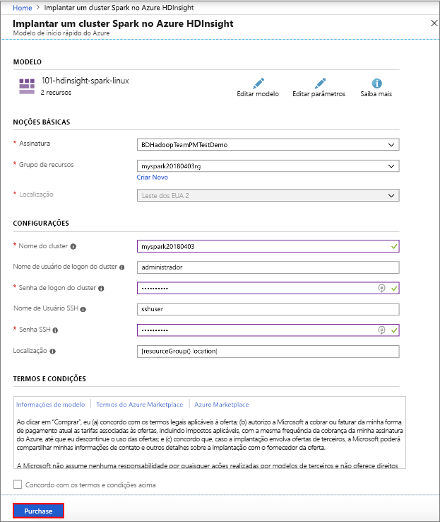

# <a name="quickstart-create-apache-spark-cluster-in-azure-hdinsight-using-resource-manager-template"></a>Início Rápido: Criar um cluster do Apache Spark no Azure HDInsight usando o modelo do Resource Manager

Neste início rápido, você usará um modelo do Azure Resource Manager para criar um cluster Apache Spark no Azure HDInsight. Em seguida, você criará um Jupyter notebook e o usará para executar consultas SQL do Spark em tabelas do Apache Hive. O Azure HDInsight é um serviço de análise de software livre gerenciado e de amplo espectro para empresas. A estrutura Apache Spark para HDInsight permite análises rápidas de dados e computação de cluster usando o processamento na memória. O Jupyter notebook permite que você interaja com seus dados, combine o código com texto markdown e faça visualizações simples.

[Visão geral: Apache Spark no Azure HDInsight](apache-spark-overview.md) | [Apache Spark](https://spark.apache.org/) | [Apache Hive](https://hive.apache.org/) | [Jupyter Notebook](https://jupyter.org/) | [Modelos de início rápido do Azure](https://azure.microsoft.com/resources/templates/?resourceType=Microsoft.Hdinsight&pageNumber=1&sort=Popular)

## <a name="prerequisites"></a>Prerequisites

- Uma conta do Azure com uma assinatura ativa. [Crie uma conta gratuitamente](https://azure.microsoft.com/free/?ref=microsoft.com&utm_source=microsoft.com&utm_medium=docs&utm_campaign=visualstudio).

## <a name="create-an-apache-spark-cluster"></a>Criar um cluster do Apache Spark

Crie um cluster Apache Spark no HDInsight usando um modelo do Azure Resource Manager. O modelo pode ser encontrado no [GitHub](https://azure.microsoft.com/resources/templates/101-hdinsight-spark-linux/). Para obter a sintaxe JSON e as propriedades do cluster, confira [Microsoft.HDInsight/clusters](/azure/templates/microsoft.hdinsight/clusters).

O cluster usa Azure Storage Blobs como o armazenamento de cluster. Para obter mais informações sobre como usar o Data Lake Storage Gen2, consulte o [Guia de Início Rápido: Configurar clusters no HDInsight](../../storage/data-lake-storage/quickstart-create-connect-hdi-cluster.md).

> [!IMPORTANT]  
> A cobrança dos clusters do HDInsight será proporcional por minuto, independentemente de eles estarem sendo usados ou não. Exclua seu cluster depois de terminar de usá-lo. Para saber mais, confira a seção [Recursos de limpeza](#clean-up-resources) deste artigo.

1. Selecione o link a seguir para abrir o modelo no Portal do Azure em uma nova guia do navegador:

    <a href="https://portal.azure.com/#create/Microsoft.Template/uri/https%3A%2F%2Fraw.githubusercontent.com%2FAzure%2Fazure-quickstart-templates%2Fmaster%2F101-hdinsight-spark-linux%2Fazuredeploy.json" target="_blank">Implantar no Azure</a>

2. Insira os valores a seguir:

    | Propriedade | Valor |
    |---|---|
    |**Assinatura**|Selecione sua assinatura do Azure usada para criar este cluster. A assinatura usada para este início rápido é **&lt;nome da assinatura do Azure>** . |
    | **Grupo de recursos**|Crie um grupo de recursos ou selecione um existente. O grupo de recursos é usado para gerenciar recursos do Azure em seus projetos. O novo nome do grupo de recursos usado para este início rápido é **myspark20180403rg**.|
    | **Localidade**|Selecione um local para o grupo de recursos. O modelo usa esse local para criar o cluster, bem como para o armazenamento de cluster padrão. O local usado para este início rápido é **Leste dos EUA 2**.|
    | **ClusterName**|Insira um nome para o cluster que deseja criar. O novo nome do cluster usado para este início rápido é **myspark20180403**.|
    | **Nome e senha de logon do cluster**|O nome padrão de logon é admin. Escolha uma senha para o logon do cluster. O nome de logon usado para este início rápido é **admin**.|
    | **Nome de usuário e senha de SSH**|Escolha uma senha para o usuário do SSH. O nome de usuário de SSH usado para este início rápido é **sshuser**.|

    

3. Selecione **Concordo com os termos e condições declarados acima**, selecione **Fixar no painel**e, em seguida, selecione **Comprar**. Veja um novo bloco intitulado **Implantar a implantação de modelo**. Demora cerca de 20 minutos para criar o cluster. O cluster deve ser criado antes de prosseguir para a próxima sessão.

Se você tiver um problema com a criação de clusters HDInsight, talvez você não tenha as permissões corretas para fazer isso. Para saber mais, confira [Requisitos do controle de acesso](../hdinsight-hadoop-create-linux-clusters-portal.md).

## <a name="install-intellijeclipse-for-spark-applications"></a>Instalar o IntelliJ/Eclipse para aplicativo Spark

Use o plug-in do Azure Toolkit for IntelliJ/Eclipse para desenvolver aplicativos Spark escritos em [Scala](https://www.scala-lang.org/) e, em seguida, enviá-los a um cluster Azure HDInsight diretamente do IDE (ambiente de desenvolvimento integrado) do IntelliJ/Eclipse. Para obter mais informações, consulte [Usar IntelliJ para criar/enviar aplicativo Spark](./apache-spark-intellij-tool-plugin.md) e [Usar Eclipse para criar/enviar aplicativo Spark](./apache-spark-eclipse-tool-plugin.md).

## <a name="install-vscode-for-pysparkhive-applications"></a>Instalar o VS Code para aplicativos PySpark/Hive

Saiba como usar as Ferramentas do Azure HDInsight para Visual Studio Code (VSCode) para criar e enviar trabalhos em lotes do Hive, consultas interativas do Hive, lote do PySpark e scripts interativos PySpark. As Ferramentas do Azure HDInsight podem ser instaladas em plataformas compatíveis com VSCode. Isso inclui Windows, Linux e macOS. Para obter mais informações, consulte [Usar o VSCode para criar/enviar aplicativo PySpark](../hdinsight-for-vscode.md).

## <a name="create-a-jupyter-notebook"></a>Criar um notebook Jupyter

O [Jupyter Notebook](https://jupyter.org/) é um ambiente de notebook interativo que oferece suporte a várias linguagens de programação. O notebook permite que você interaja com seus dados, combine o código com texto markdown e faça visualizações simples.

1. Abra o [Portal do Azure](https://portal.azure.com).

2. Selecione **Clusters HDInsight** e, em seguida, selecione o cluster que você criou.

    

3. No portal, na seção **Painéis de cluster**, selecione **Jupyter Notebook**. Em caso de solicitação, insira as credenciais de logon do cluster.

   

4. Selecione **Novo** > **PySpark** para criar um notebook.

   

   Um novo bloco de anotações é criado e aberto com o nome Untitled(Untitled.pynb).

## <a name="run-apache-spark-sql-statements"></a>Executar instruções SQL do Apache Spark

O SQL (Structured Query Language) é a linguagem mais comum e amplamente usada para consultar e transformar dados. O Spark SQL funciona como uma extensão do Apache Spark para processar dados estruturados, usando a sintaxe SQL familiar.

1. Verifique se o kernel está pronto. O kernel estará pronto quando você vir um círculo vazio ao lado do nome do kernel no notebook. Círculo sólido indica que o kernel está ocupado.

    

    Quando você inicia o notebook pela primeira vez, o kernel executa algumas tarefas em segundo plano. Aguarde a leitura do kernel.
1. Cole o código a seguir em uma célula vazia e pressione **SHIFT + ENTER** para executar o código. O comando lista as tabelas de Hive no cluster:

    ```sql
    %%sql
    SHOW TABLES
    ```

    Quando você usa um Jupyter Notebook com o cluster HDInsight, obtém uma sessão de predefinição `spark` que pode ser usada para executar consultas do Hive usando o Spark SQL. `%%sql` informa ao Notebook Jupyter para usar a sessão de predefinição `spark` para executar a consulta Hive. A consulta recupera as primeiras 10 linhas de uma tabela Hive (**hivesampletable**) que vem com todos os clusters HDInsight por padrão. Na primeira vez que você enviar a consulta, o Jupyter criará o aplicativo Spark para o notebook. O processo leva aproximadamente 30 segundos para ser concluído. Depois que o aplicativo Spark estiver pronto, a consulta será executada em aproximadamente um segundo e produzirá os resultados. A saída se parece com isso:

    

    Toda vez que você executar uma consulta no Jupyter, o título da janela do navegador da Web mostrará um status **(Ocupado)** com o título do bloco de anotações. Você também verá um círculo sólido ao lado do texto **PySpark** no canto superior direito.

1. Execute outra consulta para ver os dados em `hivesampletable`.

    ```sql
    %%sql
    SELECT * FROM hivesampletable LIMIT 10
    ```

    A tela deve ser atualizada para mostrar a saída da consulta.

    

1. No menu **Arquivo** do notebook, selecione **Fechar e Interromper**. O desligamento do notebook libera os recursos do cluster, incluindo o aplicativo Spark.

## <a name="clean-up-resources"></a>Limpar os recursos

O HDInsight salva seus dados e os notebooks do Jupyter no Armazenamento do Azure ou no Azure Data Lake Store, assim você poderá excluir um cluster quando ele não estiver em uso. Você também é cobrado por um cluster HDInsight, mesmo quando ele não está em uso. Como os encargos para o cluster são muitas vezes maiores do que os encargos para armazenamento, faz sentido, do ponto de vista econômico, excluir os clusters quando não estiverem em uso. Se você planeja trabalhar no tutorial listado em [Próximas etapas](#next-steps) imediatamente, convém manter o cluster.

Retorne ao Portal do Azure e selecione **Excluir**.


Também é possível selecionar o nome do grupo de recursos para abrir a página do grupo de recursos, e depois selecionar **Excluir grupo de recursos**. Ao excluir o grupo de recursos, você exclui o cluster HDInsight e a conta de armazenamento padrão.

## <a name="next-steps"></a>Próximas etapas

Neste início rápido, você aprendeu a criar um cluster Apache Spark no HDInsight e executar uma consulta SQL básica do Spark. Avance para o próximo tutorial para saber como usar um cluster HDInsight para executar consultas interativas em dados de exemplo.

> [!div class="nextstepaction"]
>[Executar consultas interativas no Apache Spark](./apache-spark-load-data-run-query.md)
