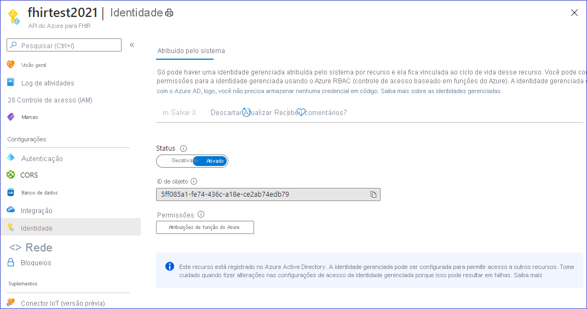
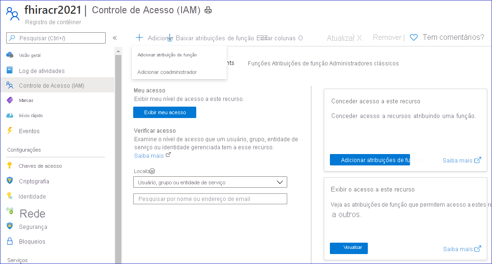
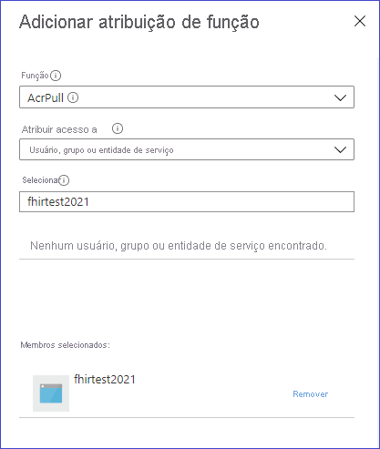

# <a name="how-to-convert-data-to-fhir-preview"></a>Como converter dados para FHIR (Versão prévia)

> [!IMPORTANT]
> Essa versão preliminar está na versão prévia pública, e é fornecida sem um contrato de nível de serviço e não é recomendada para cargas de trabalho em produção. Alguns recursos podem não ter suporte ou podem ter restrição de recursos. Para obter mais informações, consulte [Termos de Uso Complementares de Versões Prévias do Microsoft Azure](https://azure.microsoft.com/support/legal/preview-supplemental-terms/).

O ponto de extremidade personalizado $convert-data na API do Azure para FHIR destina-se à conversão de dados de formatos diferentes em FHIR. Ele usa o mecanismo de modelo Liquid e os modelos do projeto [Conversor FHIR](https://github.com/microsoft/FHIR-Converter) como os modelos padrão. Você pode personalizar esses modelos de conversão conforme necessário. No momento, ele dá suporte à conversão de HL7v2 em FHIR.

## <a name="use-the-convert-data-endpoint"></a>Usar o ponto de extremidade $convert-data

`https://<<FHIR service base URL>>/$convert-data`

$convert-data usa recurso de [Parâmetro](http://hl7.org/fhir/parameters.html) no corpo da solicitação, conforme descrito abaixo:

**Recurso de Parâmetro:**

| Nome do Parâmetro      | Descrição | Valores aceitos |
| ----------- | ----------- | ----------- |
| inputData      | Os dados a serem convertidos. | Um valor válido de tipo de dados de cadeia de caracteres JSON|
| inputDataType   | Tipo de dados da entrada. | ```HL7v2``` |
| templateCollectionReference | Referência a uma coleção de modelos. Pode ser uma referência aos **Modelos padrão** ou a uma imagem de modelo personalizada registrada com a API do Azure para FHIR. Confira abaixo para saber mais sobre como personalizar os modelos, hospedando-os no ACR e registrando-se na API do Azure para FHIR.  | ```microsofthealth/fhirconverter:default```, \<RegistryServer\>/\<imageName\>@\<imageDigest\> |
| rootTemplate | O modelo raiz a ser usado na transformação dos dados. | ```ADT_A01```, ```OML_O21```, ```ORU_R01```, ```VXU_V04``` |  

> [!WARNING]
> Os modelos padrão ajudam você a começar rapidamente. No entanto, eles podem ser atualizados quando atualizamos a API do Azure para FHIR. Para ter um comportamento de conversão de dados consistente entre diferentes versões da API do Azure para FHIR, você precisa hospedar a própria cópia de modelos em um Registro de Contêiner do Azure, registrá-los na API do Azure para FHIR e usá-los em suas chamadas à API, conforme descrito posteriormente.

**Solicitação de exemplo:**

```json
{
    "resourceType": "Parameters",
    "parameter": [
        {
            "name": "inputData",
            "valueString": "MSH|^~\\&|SIMHOSP|SFAC|RAPP|RFAC|20200508131015||ADT^A01|517|T|2.3|||AL||44|ASCII\nEVN|A01|20200508131015|||C005^Whittingham^Sylvia^^^Dr^^^DRNBR^PRSNL^^^ORGDR|\nPID|1|3735064194^^^SIMULATOR MRN^MRN|3735064194^^^SIMULATOR MRN^MRN~2021051528^^^NHSNBR^NHSNMBR||Kinmonth^Joanna^Chelsea^^Ms^^CURRENT||19870624000000|F|||89 Transaction House^Handmaiden Street^Wembley^^FV75 4GJ^GBR^HOME||020 3614 5541^HOME|||||||||C^White - Other^^^||||||||\nPD1|||FAMILY PRACTICE^^12345|\nPV1|1|I|OtherWard^MainRoom^Bed 183^Simulated Hospital^^BED^Main Building^4|28b|||C005^Whittingham^Sylvia^^^Dr^^^DRNBR^PRSNL^^^ORGDR|||CAR|||||||||16094728916771313876^^^^visitid||||||||||||||||||||||ARRIVED|||20200508131015||"
        },
        {
            "name": "inputDataType",
            "valueString": "Hl7v2"
        },
        {
            "name": "templateCollectionReference",
            "valueString": "microsofthealth/fhirconverter:default"
        },
        {
            "name": "rootTemplate",
            "valueString": "ADT_A01"
        }
    ]
}
```

**Resposta de exemplo:**

```json
{
  "resourceType": "Bundle",
  "type": "transaction",
  "entry": [
    {
      "fullUrl": "urn:uuid:9d697ec3-48c3-3e17-db6a-29a1765e22c6",
      "resource": {
        "resourceType": "Patient",
        "id": "9d697ec3-48c3-3e17-db6a-29a1765e22c6",
        ...
        ...
      "request": {
        "method": "PUT",
        "url": "Location/50becdb5-ff56-56c6-40a1-6d554dca80f0"
      }
    }
  ]
}
```

## <a name="customize-templates"></a>Personalizar modelos

Você pode usar a [extensão do Conversor FHIR](https://marketplace.visualstudio.com/items?itemName=ms-azuretools.vscode-health-fhir-converter) para Visual Studio Code para personalizar os modelos de acordo com suas necessidades. A extensão fornece uma experiência de edição interativa e facilita o download de dados de exemplo e modelos publicados pela Microsoft. Confira a documentação na extensão para obter detalhes.

## <a name="host-and-use-templates"></a>Hospedar e usar modelos

É recomendável que você hospede a própria cópia de modelos no ACR. Há quatro etapas envolvidas na hospedagem da sua cópia de modelos e no uso delas na operação $convert-data:

1. Efetuar push dos modelos para o Registro de Contêiner do Azure.
1. Habilitar a identidade gerenciada na instância da API do Azure para FHIR.
1. Fornecer acesso do ACR à identidade gerenciada da API do Azure para FHIR.
1. Registrar os servidores do ACR na API do Azure para FHIR.

### <a name="push-templates-to-azure-container-registry"></a>Efetuar push dos modelos para o Registro de Contêiner do Azure

Depois de criar uma instância do ACR, você pode usar o comando _Conversor FHIR: efetuar push de modelos_ na [extensão do Conversor FHIR](https://marketplace.visualstudio.com/items?itemName=ms-azuretools.vscode-health-fhir-converter) para efetuar push dos modelos personalizados para o ACR. Como alternativa, você pode usar a [ferramenta da CLI de Gerenciamento de Modelos](https://github.com/microsoft/FHIR-Converter/blob/main/docs/TemplateManagementCLI.md) para essa finalidade.

### <a name="enable-managed-identity-on-azure-api-for-fhir"></a>Habilitar a identidade gerenciada na API do Azure para FHIR

Navegue até sua instância do serviço da API do Azure para FHIR no portal do Azure e selecione a folha **Identidade**.
Altere o status para **Ativado** para habilitar a identidade gerenciada na API do Azure para FHIR.



### <a name="provide-access-of-the-acr-to-azure-api-for-fhir"></a>Fornecer acesso do ACR à API do Azure para FHIR

Navegue até a folha Controle de Acesso (IAM) em sua instância do ACR e selecione _Adicionar Atribuições de Função_.



Conceda a função AcrPull à sua instância de serviço da API do Azure para FHIR.



### <a name="register-the-acr-servers-in-azure-api-for-fhir"></a>Registrar os servidores do ACR na API do Azure para FHIR

Você pode registrar até 20 servidores do ACR na API do Azure para FHIR.

Instale a CLI healthcareapis do Azure PowerShell se necessário:

```powershell
az extension add -n healthcareapis
```

Registre os servidores do ACR na API do Azure para FHIR seguindo os exemplos abaixo:

#### <a name="register-a-single-acr-server"></a>Registrar apenas um servidor do ACR

```powershell
az healthcareapis acr add --login-servers "fhiracr2021.azurecr.io" --resource-group fhir-test --resource-name fhirtest2021
```

#### <a name="register-multiple-acr-servers"></a>Registrar vários servidores do ACR

```powershell
az healthcareapis acr add --login-servers "fhiracr2021.azurecr.io fhiracr2020.azurecr.io" --resource-group fhir-test --resource-name fhirtest2021
```

### <a name="verify"></a>Verificar

Faça uma chamada à API $convert-data especificando a referência de modelo no parâmetro templateCollectionReference.

`<RegistryServer>/<imageName>@<imageDigest>`

## <a name="known-issues-and-workarounds"></a>Problemas conhecidos e limitações

- Alguns arquivos de modelo padrão contêm a marca de ordem de byte UTF-8. Como resultado, os valores de ID gerados conterão um caractere de marca de ordem de byte. Isso pode criar um problema com o servidor FHIR. A solução alternativa é extrair modelos da Microsoft usando a extensão do VS Code e efetuar push deles para o próprio ACR depois de remover os caracteres da marca de ordem de byte de _ID/_Procedure.liquid_, _ID/_Provenance.liquid_ e _ID/_Immunization.liquid_.

