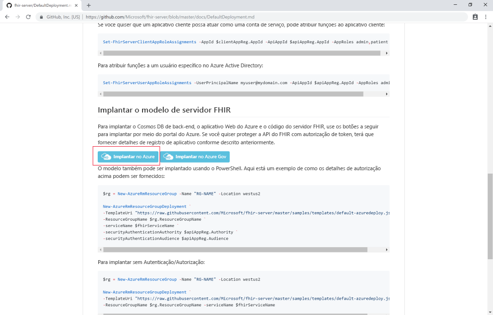
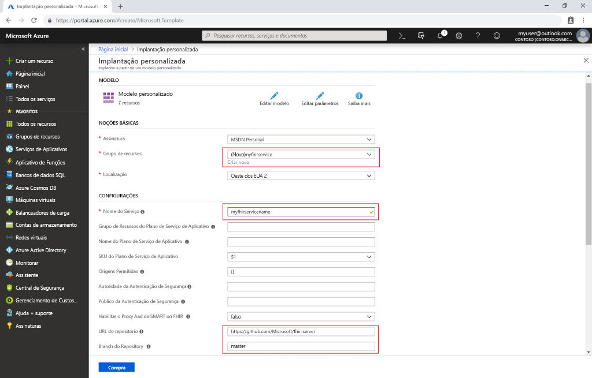

# Início Rápido: Implantar o servidor FHIR de software livre usando o portal do Azure

Neste guia de início rápido, você aprenderá a implantar um servidor FHIR de software livre no Azure usando o portal do Azure. Usaremos links de implantação fáceis no [Repositório de software livre](https://github.com/Microsoft/fhir-server)

Se você não tiver uma assinatura do Azure, crie uma [conta gratuita](https://azure.microsoft.com/free/?WT.mc_id=A261C142F) antes de começar.

## Repositório de software livre do GitHub

Navegue até a [página de Implantação do GitHub](https://github.com/Microsoft/fhir-server/blob/master/docs/DefaultDeployment.md) e localize os botões "Implantar no Azure":

>[!div class="mx-imgBorder"]
>

Clique no botão implantação e a portal do Azure será aberto.

## Preencher parâmetros de implantação

Escolha criar um grupo de recursos e dê a ele um nome. Somente outros parâmetros obrigatórios são o nome do serviço e a senha de administrador do SQL.

>[!div class="mx-imgBorder"]
>

Depois de preencher os detalhes, você pode iniciar a implantação.

## Validar se o servidor FHIR está em execução

Depois que a implantação estiver concluída, você poderá apontar seu navegador para `https://SERVICENAME.azurewebsites.net/metadata` para obter uma declaração de capacidade. Levará um minuto para que o servidor responda pela primeira vez.

## Limpar os recursos

Quando o grupo de recursos e todos os recursos relacionados não forem mais necessários, exclua-os. Para fazer isso, selecione o grupo de recursos que contém os recursos provisionados, selecione **Excluir grupo de recursos** e confirme o nome do grupo de recursos a ser excluído.

## Próximas etapas

Neste tutorial, você implantou o servidor FHIR de software livre da Microsoft para o Azure em sua assinatura. Para saber como acessar a API do FHIR usando o Postman, prossiga para o tutorial do Postman.
 
>[!div class="nextstepaction"]
>[Acessar a API do FHIR usando o Postman](access-fhir-postman-tutorial.md)