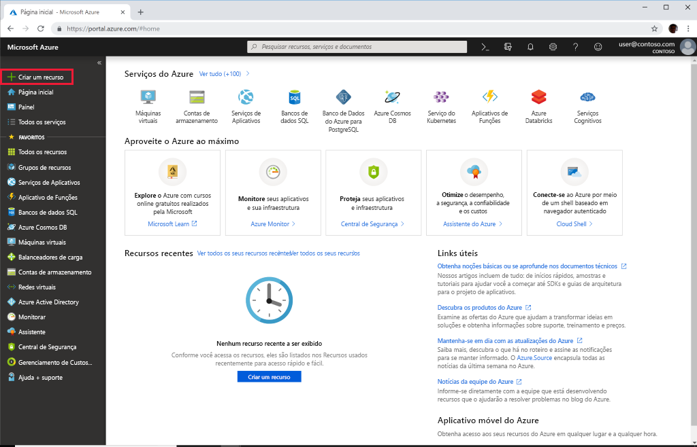
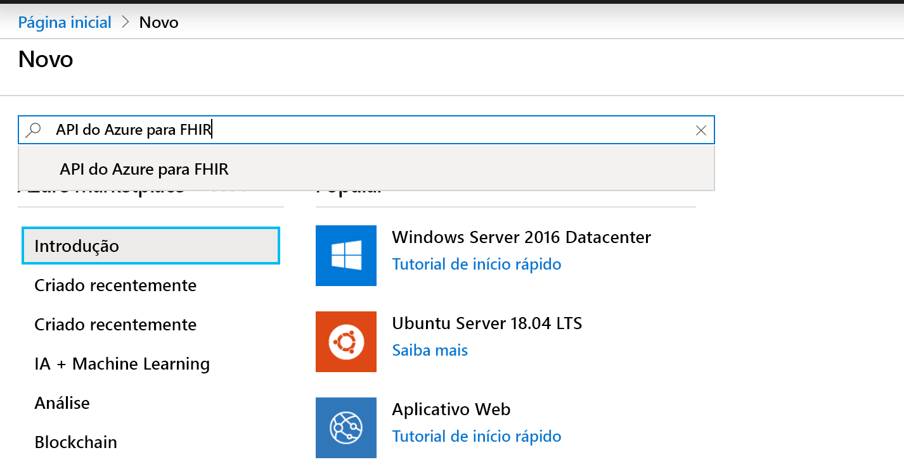
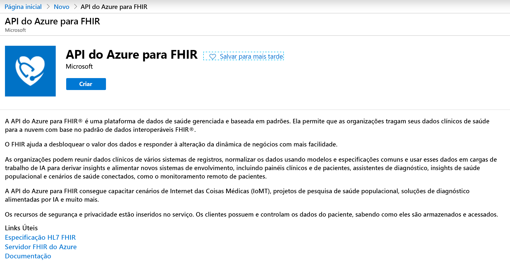
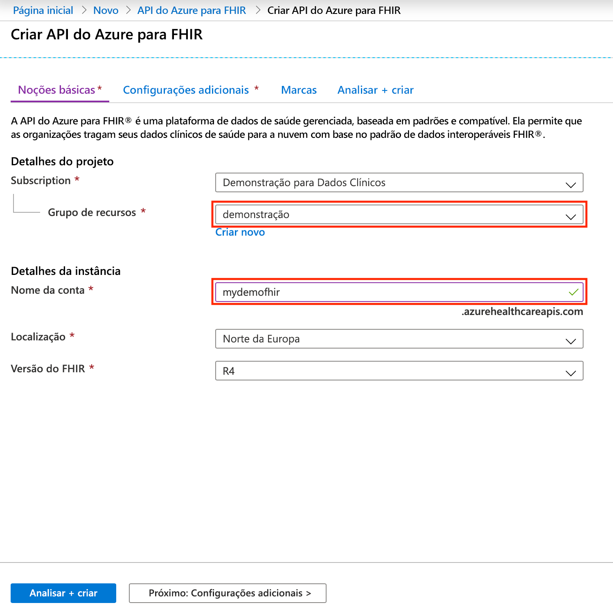

# Início Rápido: Implantar a API do Azure para FHIR usando o portal do Azure

Neste guia de início rápido, você aprenderá a implantar a API do Azure para FHIR usando o portal do Azure.

Se você não tiver uma assinatura do Azure, crie uma [conta gratuita](https://azure.microsoft.com/free/?WT.mc_id=A261C142F) antes de começar.

## Criar novo recurso

Abra o [portal do Azure](https://portal.azure.com) e clique em **Criar um recurso**

## Pesquisar a API do Azure para FHIR

Você pode encontrar a API do Azure para FHIR digitando "FHIR" na caixa de pesquisa:

## Criar conta da API do Azure para FHIR

Selecione **Criar** para criar uma conta da API do Azure para FHIR:

## Inserir detalhes da conta

Selecione um grupo de recursos ou crie um, escolha um nome para a conta e, por fim, clique em **Examinar + criar**:

Confirme a criação e aguarde a implantação da API do FHIR.

## Configurações adicionais

Clique em **Próximo: Configurações adicionais** para configurar a autoridade, o público-alvo, as IDs de objeto de identidade que devem ter permissão para acessar essa API do Azure para FHIR, habilitar o SMART on FHIR se necessário e configurar a taxa de transferência do banco de dados:

- **Autoridade:** você pode especificar um locatário do Azure AD diferente daquele ao qual você está conectado como autoridade de autenticação para o serviço.
- **Público-alvo:** a prática recomendada e a configuração padrão é que o público-alvo é definido para a URL do servidor FHIR. Você pode alterar isso aqui. O público-alvo identifica o destinatário ao qual o token se destina. Nesse contexto, ele deve ser definido como algo que representa a API do FHIR em si.
- **IDs de objeto permitidas:** você pode especificar IDs de objeto de identidade que devem ter permissão para acessar essa API do Azure para FHIR. Saiba mais sobre como localizar a ID de objeto para usuários e entidades de serviço no guia de instruções [Localizar IDs de objeto de identidade](find-identity-object-ids.md).  
- **Proxy do Smart On FHIR:** você pode habilitar o proxy do SMART on FHIR. Para obter detalhes sobre como configurar o proxy do SMART on FHIR, confira o tutorial [Proxy do SMART on FHIR da API do Azure para FHIR](https://docs.microsoft.com/azure/healthcare-apis/use-smart-on-fhir-proxy)  
- **Taxa de transferência provisionada (RU/s):** aqui você pode especificar as configurações de taxa de transferência para o banco de dados subjacente para a API do Azure para FHIR. Você pode alterar essa configuração posteriormente na folha do banco de dados. Para obter mais detalhes, confira a página [Definir configurações de banco de dados](configure-database.md).

## Instrução de funcionalidade Buscar API de FHIR

Para validar que a nova conta da API do FHIR é provisionada, busque uma declaração de capacidade apontando um navegador para `https://<ACCOUNT-NAME>.azurehealthcareapis.com/metadata`.

## Limpar os recursos

Quando ele não for mais necessário, você poderá excluir o grupo de recursos, API do Azure para FHIR e todos os recursos relacionados. Para fazer isso, selecione o grupo de recursos que contém a conta da API do Azure para FHIR, selecione **Excluir grupo de recursos** e confirme o nome do grupo de recursos a ser excluído.

## Próximas etapas

Neste guia de início rápido, você implantou a API do Azure para FHIR em sua assinatura. Para definir configurações adicionais em sua API do Azure para FHIR, vá para o guia de instruções de configurações adicionais.

>[!div class="nextstepaction"]
>[Configurações adicionais na API do Azure para FHIR](azure-api-for-fhir-additional-settings.md)
