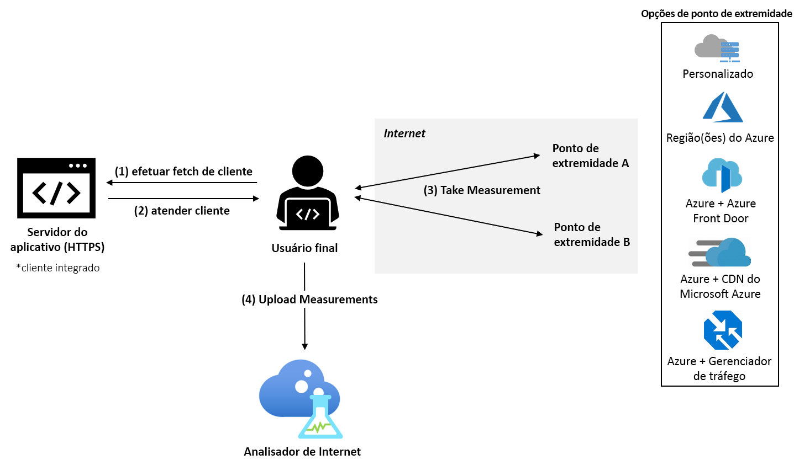

# O que é o Analisador de Internet? (Visualização)

O Analisador de Internet é uma plataforma de medição para o cliente testar como as alterações na infraestrutura de rede afetam o desempenho dos seus clientes. Seja para migrar do local para o Azure ou para avaliar um novo serviço do Azure, o Analisador de Internet permite que você aprenda com os dados dos usuários e com a análise avançada da Microsoft para entender melhor e otimizar a arquitetura de rede com o Azure — antes de migrar.

O Analisador de Internet usa um cliente JavaScript inserido no seu aplicativo Web para medir a latência dos usuários finais em relação ao conjunto selecionado de destinos de rede, que chamamos de _pontos de extremidade_. O Analisador de Internet possibilita configurar vários testes lado a lado, permitindo avaliar vários cenários à medida que a infraestrutura e as necessidades do cliente evoluem. O Analisador de Internet seleciona pontos de extremidade personalizados e pré-configurados, oferecendo a conveniência e a flexibilidade de tomar decisões de desempenho para seus usuários finais. 

> [!IMPORTANT]
> Essa versão prévia pública é fornecida sem um SLA e não deve ser usada para cargas de trabalho de produção. Determinados recursos podem não ter suporte, podem ter restrição ou podem não estar disponíveis em todos os locais do Azure. Veja os [Termos de Uso Adicionais para Visualizações do Microsoft Azure](https://azure.microsoft.com/support/legal/preview-supplemental-terms/) para obter detalhes.
>

## Testes rápidos e personalizáveis

O Analisador de Internet aborda questões relacionadas ao desempenho para migração na nuvem, implantação em regiões novas ou adicionais do Azure, ou o teste de novas plataformas de entrega de aplicativos e conteúdo no Azure, como o [Azure Front Door](https://azure.microsoft.com/services/frontdoor/) e a [CDN do Azure da Microsoft](https://azure.microsoft.com/services/cdn/). 

Cada teste que você cria no Analisador de Internet é composto por dois pontos de extremidade: ponto de extremidade A e ponto de extremidade B. O desempenho do ponto de extremidade B é analisado em relação ao ponto de extremidade A. 

Você pode configurar seu próprio ponto de extremidade personalizado ou selecionar entre vários pontos de extremidade pré-configurados no Azure. Os pontos de extremidade personalizados devem ser usados para avaliar cargas de trabalho locais, suas instâncias em outros provedores de nuvem ou suas configurações personalizadas do Azure. Os testes podem ser compostos de dois pontos de extremidade personalizados; no entanto, pelo menos um ponto de extremidade personalizado precisa estar hospedado no Azure. Os pontos de extremidade pré-configurados do Azure são uma maneira rápida e fácil de avaliar o desempenho das plataformas de rede populares do Azure, como o Azure Front Door, o Gerenciador de Tráfego do Azure e a CDN do Azure. 

Durante a visualização, os seguintes pontos de extremidade pré-configurados estão disponíveis: 

* **Regiões do Azure**
    * Sul do Brasil
    * Índia Central
    * Centro dos EUA
    * Leste da Ásia
    * Leste dos EUA
    * Oeste do Japão
    * Norte da Europa
    * Norte da África do Sul
    * Sudeste Asiático 
    * Norte dos EAU
    * Oeste do Reino Unido  
    * Europa Ocidental
    * Oeste dos EUA 
    * Oeste dos EUA 2
* **Várias combinações de regiões do Azure** 
    * Leste dos EUA, Sul do Brasil 
    * Leste dos EUA, Leste da Ásia 
    * Oeste da Europa, Sul do Brasil
    * Oeste da Europa, Sudeste Asiático
    * Oeste da Europa, Norte dos EAU
    * Oeste dos EUA, Leste dos EUA 
    * Oeste dos EUA, Oeste da Europa
    * Oeste dos EUA, Norte dos EAU
    * Oeste da Europa, Norte dos EAU, Sudeste Asiático
    * Oeste dos EUA, Oeste da Europa, Leste da Ásia
    * Oeste dos EUA, Norte da Europa, Sudeste Asiático, Norte dos EAU, Norte da África do Sul 
* **Azure + Azure Front Door**: implantação em qualquer combinação única ou múltipla de regiões do Azure listada acima
* **Azure + CDN do Azure do Microsoft**: implantação em qualquer combinação de regiões única do Azure listada acima
* **Azure + Gerenciador de Tráfego do Azure**: implantação em qualquer combinação de regiões múltiplas do Azure listada acima

## Cenários de teste sugeridos 

Para ajudá-lo a tomar as melhores decisões de desempenho para seus clientes, o Analisador de Internet possibilita avaliar dois pontos de extremidade para sua população específica de usuários finais. 

Embora o Analisador de Internet possa responder a várias perguntas, algumas das mais comuns são: 
* Qual é o impacto da migração para a nuvem no desempenho? 
    * *Teste sugerido: Personalizado (sua infraestrutura local atual) versus Azure (qualquer ponto de extremidade pré-configurado)*
* Qual é o valor de colocar meus dados na borda versus em um data center? 
    *  *Teste sugerido: Azure versus Azure Front Door, Azure versus CDN do Azure da Microsoft*
* Qual é o benefício de desempenho do Azure Front Door?
    *  *Teste sugerido: Personalizado/Azure/CDN versus Azure Front Door*
* Qual é o benefício de desempenho da CDN do Azure da Microsoft? 
    *  *Teste sugerido: Personalizado/Azure/AFD versus CDN do Azure da Microsoft*
* Como a CDN do Azure da Microsoft cresce? 
    *  *Teste sugerido: Personalizado (outro ponto de extremidade de CDN) versus CDN do Azure da Microsoft*
* Qual é a melhor nuvem para sua população de usuários finais em cada região? 
    *  *Teste sugerido: Personalizado (outro serviço de nuvem) vs. Azure (qualquer ponto de extremidade pré-configurado)*

## Como ele funciona

Para usar o Analisador de Internet, configure um recurso do Analisador de Internet no portal do Microsoft Azure e instale o cliente JavaScript no seu aplicativo. O cliente mede a latência dos usuários finais para os pontos de extremidade selecionados baixando uma imagem de um pixel por HTTPS. Após coletar as medidas de latência, o cliente envia os dados para o Analisador de Internet.

Quando um usuário visita o aplicativo Web, o cliente JavaScript seleciona dois pontos de extremidade para medir em todos os testes configurados. Para cada ponto de extremidade, o cliente executa uma medida _quente_ e uma _fria_. A medida _fria_ incorre em latência adicional além da latência de rede pura entre o usuário e o ponto de extremidade, como resolução DNS, handshake de conexão TCP e negociação SSL/TLS. A medida _quente_ segue logo após a conclusão da _fria_ e usa o gerenciamento persistente de conexões TCP dos navegadores modernos para obter uma medida precisa da latência de ponta a ponta. Quando há suporte no navegador do usuário, a API de tempo do recurso W3C é usada para calcular o tempo exato da medida. Atualmente, somente as medidas de latência a quente são usadas para análise.

## Scorecards 

Ao iniciar um teste, os dados telemétricos ficam visíveis no recurso do Analisador de Internet, na guia Scorecard. Esses dados sempre são agregados. Use os filtros a seguir para alterar a exibição dos dados que você vê: 

* **Teste:** Selecione o teste para o qual você gostaria de exibir os resultados. Os dados de teste aparecem quando há dados suficientes para concluir a análise: na maioria dos casos, dentro de 24 horas. 
* **Período de tempo e data de término:** o Analisador de Internet gera três scorecards diariamente, cada scorecard reflete um período de agregação diferente: as 24 horas anteriores (dia), os sete dias anteriores (semana) e os 30 dias anteriores (mês). Use o filtro de "data de término" para selecionar o período de tempo que você deseja ver. 
* **País:** use este filtro para visualizar dados específicos para usuários finais residentes em um país. O filtro global mostra dados em todas as regiões geográficas.  

Saiba mais sobre scorecards na página [Como interpretar seu scorecard](internet-analyzer-scorecard.md). 

## Próximas etapas

* Saiba como [Criar seu primeiro recurso do Analisador de Internet](internet-analyzer-create-test-portal.md).
* Leia as [Perguntas frequentes sobre o Analisador de Internet](internet-analyzer-faq.md). 
