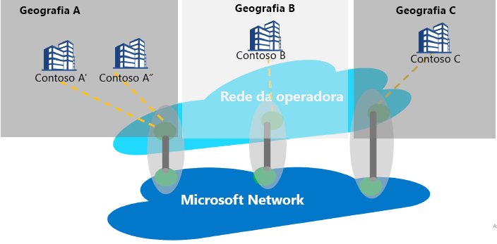

# Emparelhamento de Internet vs. Serviço de Emparelhamento

O emparelhamento da Internet refere-se a qualquer interconexão entre a rede global da Microsoft (AS8075) e a rede das operadoras ou dos provedores de serviços. Um provedor de serviços pode se tornar um parceiro do Serviço de Emparelhamento implementando os requisitos de parceria do Serviço de Emparelhamento explicados abaixo para fornecer conectividade pública confiável e de alto desempenho com os roteiros ideais do cliente para a rede da Microsoft.

## Sobre o Serviço de Emparelhamento
O Serviço de Emparelhamento é um programa de parceria com os principais provedores de serviços para fornecer a melhor conectividade com a Internet pública aos usuários empresariais. Os parceiros que fazem parte do programa terão conexões diretas, altamente disponíveis e com redundância geográfica e os roteiros otimizados para a Microsoft. O Serviço de Emparelhamento é uma adição ao portfólio de conectividade da Microsoft:
*   ExpressRoute para conectividade privada com recursos de IaaS ou PaaS (suporte para espaço de IP privado)
    *   Conectividade baseada em parceiro
    *   Conectividade direta de 100 G com a Microsoft
*   IPsec pela Internet para conectividade de VPN com a nuvem
*   Conectividade SD-WAN com o Azure por meio da WAN Virtual

O segmento-alvo do Serviço de Emparelhamento são os clientes da SD-WAN, da conectividade SaaS, que desejam criar uma sessão em grupo da Internet na filial e os clientes que têm MPLS de estratégia dupla e Internet de nível empresarial.

A meta principal ao se conectar à Nuvem da Microsoft deve ser minimizar a latência, reduzindo o RTT (tempo de viagem de ida e volta) de um site de usuário para a rede global da Microsoft, que é o backbone de rede pública da Microsoft que interconecta todos os datacenters da Microsoft e vários pontos de entrada de aplicativos de nuvem. Confira [Como obter a melhor conectividade e o melhor desempenho no Office 365](https://techcommunity.microsoft.com/t5/Office-365-Blog/Getting-the-best-connectivity-and-performance-in-Office-365/ba-p/124694).

> [!div class="mx-imgBorder"]
> 

Na figura acima, cada filial de uma empresa global conecta-se à localização de borda da Microsoft mais próxima possível por meio da rede do parceiro.

**Benefícios para o cliente do Serviço de Emparelhamento:**
* Melhores roteiros públicos pela Internet aos serviços em nuvem da Microsoft para desempenho e confiabilidade ideais.
* Capacidade de selecionar o SP preferencial para se conectar à Nuvem da Microsoft.
* Insights de tráfego, como relatórios de latência e monitoramento de prefixo.
* Saltos de rede ideais (saltos AS) da Nuvem da Microsoft.
* Análise de roteiros e estatísticas: eventos de anomalias de rota do [BGP](https://en.wikipedia.org/wiki/Border_Gateway_Protocol) (Border Gateway Protocol) (detecção de vazamento/sequestro) e roteamento abaixo do ideal.

## Requisitos de parceria do Serviço de Emparelhamento
* Conectividade com a Nuvem da Microsoft em uma localização mais próxima ao cliente. Um provedor de serviços parceiro roteará o tráfego do usuário para a borda da Microsoft mais próxima ao usuário. Da mesma forma, no tráfego para o usuário, a Microsoft roteará o tráfego (usando a marca do BGP) para a localização de borda mais próxima ao usuário e o SP entregará o tráfego ao usuário.
* O parceiro manterá uma conectividade altamente disponível, com alta taxa de transferência e redundância geográfica com a rede global da Microsoft.
* O parceiro pode utilizar o emparelhamento existente para dar suporte ao Serviço de Emparelhamento caso ele atenda ao requisito

## Perguntas frequentes
Para obter as perguntas frequentes, confira [Serviço de Emparelhamento: perguntas frequentes](service-faqs.md).

## Próximas etapas

* Saiba mais sobre os benefícios do cliente com o [Serviço de Emparelhamento](https://docs.microsoft.com/azure/peering-service/).
* Saiba mais sobre as etapas usadas para habilitar um emparelhamento direto no Serviço de Emparelhamento no [passo a passo do parceiro do Serviço de Emparelhamento](walkthrough-peering-service-all.md).
