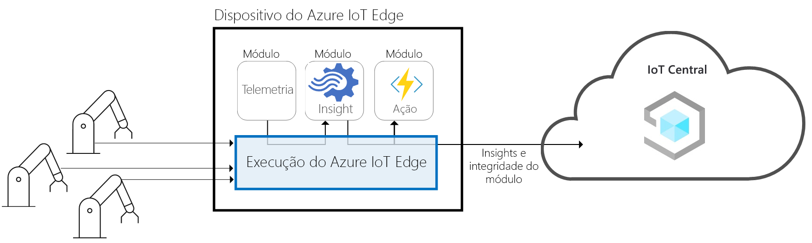
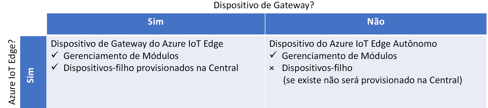
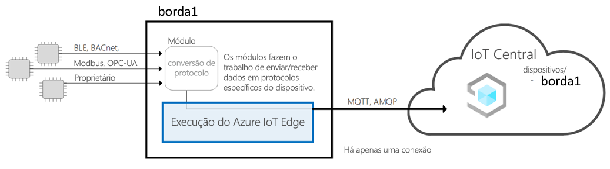
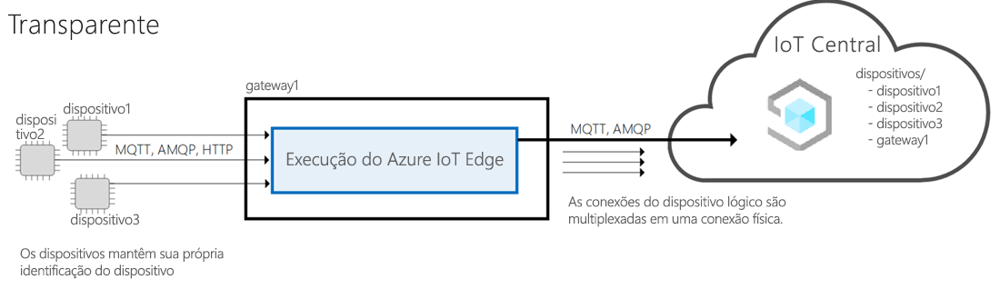
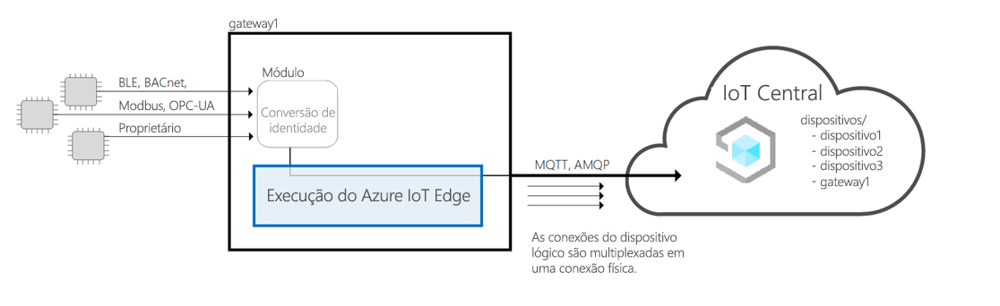
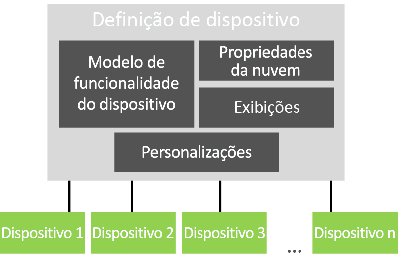

# Arquitetura do Azure IoT Central

Este artigo fornece uma visão geral da arquitetura do Microsoft Azure IoT Central.

## Dispositivos

Os dispositivos trocam dados com o aplicativo Azure IoT Central. Um dispositivo pode:

- Enviar medidas, como telemetria.
- Sincronizar as configurações com o aplicativo.

No Azure IoT Central, os dados que um dispositivo pode trocar com seu aplicativo são especificados em um modelo de dispositivo. Para obter mais informações sobre modelos de dispositivos, consulte [Gerenciamento de metadados](#metadata-management).

Para saber mais sobre como os dispositivos conectam ao aplicativo do Azure IoT Central, consulte [Conectividade de Dispositivo](concepts-get-connected.md).

## Dispositivos do Azure IoT Edge

Além dos dispositivos criados usando os [SDKs do Azure IoT](https://github.com/Azure/azure-iot-sdks), você também pode conectar [dispositivos com Azure IoT Edge](../../iot-edge/about-iot-edge.md) a um aplicativo IoT Central. IoT Edge permite que você execute a inteligência de nuvem e a lógica personalizada diretamente em dispositivos IoT gerenciados pelo IoT Central. Com o tempo de execução do IoT Edge você:

- Instala e atualiza as cargas de trabalho no dispositivo.
- Mantenha os padrões de segurança IoT Edge no dispositivo.
- Garante que os módulos do IoT Edge sempre estejam em execução.
- Relata a integridade do módulo à nuvem para monitoramento remoto.
- Gerencia a comunicação entre dispositivos folha downstream e um dispositivo do IoT Edge, entre módulos em um dispositivo do IoT Edge e entre um dispositivo do IoT Edge e a nuvem.

O IoT Central permite os seguintes recursos para dispositivos IoT Edge:

- Modelos de dispositivo para descrever os recursos de um dispositivo IoT Edge, como:
  - Recurso de upload de manifesto de implantação, que ajuda você a gerenciar um manifesto para uma frota de dispositivos.
  - Módulos que são executados no dispositivo IoT Edge.
  - A telemetria que cada módulo envia.
  - As propriedades que cada módulo relata.
  - Os comandos aos quais cada módulo responde.
  - As relações entre um dispositivo de gateway IoT Edge e um dispositivo downstream.
  - Propriedades de nuvem que não são armazenadas no dispositivo IoT Edge.
  - Personalizações, painéis e formulários que fazem parte do aplicativo do IoT Central.

  Para obter mais informações, consulte o artigo [conectar Azure IOT Edge dispositivos a um aplicativo IOT central do Azure](./concepts-iot-edge.md) .

- A capacidade de provisionar dispositivos IoT Edge em escala usando o serviço de provisionamento de dispositivos IoT do Azure
- Regras e ações.
- Painéis e análises personalizados.
- Exportação contínua de dados de telemetria de dispositivos IoT Edge.

### IoT Edge tipos de dispositivo

IoT Central classifica IoT Edge tipos de dispositivo da seguinte maneira:

- Dispositivos folha. Um dispositivo IoT Edge pode ter dispositivos de folha downstream, mas esses dispositivos não são provisionados no IoT Central.
- Dispositivos de gateway com dispositivos downstream. O dispositivo de gateway e os dispositivos downstream são provisionados no IoT Central

### Padrões de IoT Edge

O IoT Central dá suporte aos seguintes padrões de dispositivo IoT Edge:

#### IoT Edge como dispositivo de folha

O dispositivo IoT Edge é provisionado no IoT Central e em dispositivos downstream e sua telemetria é representada como proveniente do dispositivo IoT Edge. Os dispositivos downstream conectados ao dispositivo IoT Edge não são provisionados no IoT Central.

#### IoT Edge dispositivo de gateway conectado a dispositivos downstream com identidade

O dispositivo IoT Edge é provisionado no IoT Central junto com os dispositivos downstream conectados ao dispositivo IoT Edge. O suporte ao tempo de execução para o provisionamento de dispositivos downstream por meio do gateway não tem suporte no momento.

#### IoT Edge dispositivo de gateway conectado a dispositivos downstream com identidade fornecida pelo gateway de IoT Edge

O dispositivo IoT Edge é provisionado no IoT Central junto com os dispositivos downstream conectados ao dispositivo IoT Edge. O suporte de tempo de execução do gateway que fornece identidade para dispositivos downstream e o provisionamento de dispositivos downstream não tem suporte no momento. Se você colocar seu próprio módulo de conversão de identidade, IoT Central poderá dar suporte a esse padrão.

## Gateway de nuvem

O Azure IoT Central usa o Hub IoT como um gateway de nuvem que permite a conectividade de dispositivo. O Hub IoT permite:

- Ingestão de dados em escala na nuvem.
- Gerenciamento de dispositivo.
- Conectividade de dispositivo segura.

Para saber mais sobre Hub IoT, consulte [Hub IoT](../../iot-hub/index.yml).

Para saber mais sobre a conectividade de dispositivos no Azure IoT Central, consulte [Conectividade de dispositivo](concepts-get-connected.md).

## Armazenamentos de dados

O Azure IoT Central armazena dados de aplicativos na nuvem. Os dados armazenados de aplicativo armazenados incluem:

- Modelos de dispositivos.
- Identidades de dispositivos.
- Metadados do dispositivo.
- Dados de usuário e função.

O Azure IoT Central usa um armazenamento de série temporal para os dados de medida enviados dos dispositivos. Os dados da série temporal dos dispositivos usados pelo serviço analítico.

## Análise

O serviço analítico é responsável por gerar os dados de relatório personalizados que o aplicativo exibe. Um operador pode [personalizar a análise](howto-create-analytics.md) exibida no aplicativo. O serviço analítico é compilado no [Azure Time Series Insights](https://azure.microsoft.com/services/time-series-insights/) e processa os dados de medida enviados a partir dos dispositivos.

## Regras e ações

[Regras e ações](tutorial-create-telemetry-rules.md) trabalham em conjunto para automatizar tarefas no aplicativo. Um construtor pode definir regras baseadas na telemetria de dispositivo, como a temperatura que excede um limite definido. O Azure IoT Central usa um processador de fluxo para determinar quando as condições da regra são atendidas. Quando uma condição de regra é atendida, ela dispara uma ação definida pelo construtor. Por exemplo, uma ação pode enviar um email para notificar um engenheiro de que a temperatura em um dispositivo está muito alta.

## Gerenciamento de metadados

Em um aplicativo do Azure IoT Central, os modelos de dispositivo definem o comportamento e a capacidade dos tipos de dispositivo. Por exemplo, um modelo de dispositivo de refrigerador especifica a telemetria que um refrigerador envia ao aplicativo.

Em um [modelo de dispositivo](concepts-device-templates.md) IOT central contém:

- Um **modelo de dispositivo** para especificar os recursos de um dispositivo, como a telemetria que ele envia, as propriedades que definem o estado do dispositivo e os comandos que o dispositivo responde. Os recursos do dispositivo são organizados em uma ou mais interfaces.
- **Propriedades de nuvem** especifique as propriedades IOT central repositórios para um dispositivo. Essas propriedades são armazenadas somente em IoT Central e nunca são enviadas a um dispositivo.
- As **exibições** especificam os painéis e formulários criados pelo construtor para permitir que o operador monitore e gerencie os dispositivos.
- As **personalizações** permitem que o Construtor substitua algumas das definições no modelo de dispositivo para torná-las mais relevantes para o aplicativo IOT central.

Um aplicativo pode ter um ou mais dispositivos simulados e reais com base em cada modelo de dispositivo.

## Exportação de dados

Em um aplicativo IoT Central do Azure, você pode [Exportar continuamente seus dados](howto-export-data.md) para seus próprios hubs de eventos do Azure e instâncias do barramento de serviço do Azure. Você também pode exportar periodicamente seus dados para sua conta de armazenamento de BLOBs do Azure. IoT Central pode exportar medidas, dispositivos e modelos de dispositivo.

## Atualizações de dispositivo do lote

Em um aplicativo IoT Central do Azure, você pode [criar e executar trabalhos](howto-run-a-job.md) para gerenciar dispositivos conectados. Esses trabalhos permitem que você faça atualizações em massa nas propriedades ou configurações do dispositivo ou execute comandos. Por exemplo, você pode criar um trabalho para aumentar a velocidade do ventilador para várias máquinas de venda com refrigeração.

## RBAC (Controle de Acesso Baseado em Função)

Cada aplicativo de IoT Central tem seu próprio sistema RBAC interno. Um [administrador pode definir regras de acesso](howto-manage-users-roles.md) para um aplicativo de IOT central do Azure usando uma das funções predefinidas ou criando uma função personalizada. As funções determinam a quais áreas do aplicativo um usuário tem acesso e quais ações ele pode executar.

## Segurança

Os recursos de segurança do Azure IoT Central incluem:

- Os dados são criptografados em trânsito e em repouso.
- A autenticação é fornecida pelo Azure Active Directory ou pela Conta Microsoft. A autenticação de dois fatores tem suporte.
- Isolamento de locatário completo.
- Segurança em nível de dispositivo.

## Shell de interface do usuário

O shell de interface do usuário é um aplicativo dinâmico e moderno com base no navegador HTML5.
Um administrador pode personalizar a interface do usuário do aplicativo aplicando temas personalizados e modificando os links da ajuda para apontar para seus próprios recursos de ajuda personalizados. Para saber mais sobre a personalização da interface do usuário, consulte [o artigo personalizar a interface do usuário IOT central do Azure](howto-customize-ui.md) .

Um operador pode criar painéis de aplicativo personalizados. Você pode ter vários painéis que exibem dados diferentes e alternam entre eles.

## Próximas etapas

Agora que você aprendeu sobre a arquitetura do Azure IoT Central, a próxima etapa sugerida é saber mais sobre a [conectividade do dispositivo](concepts-get-connected.md) na IOT central do Azure.