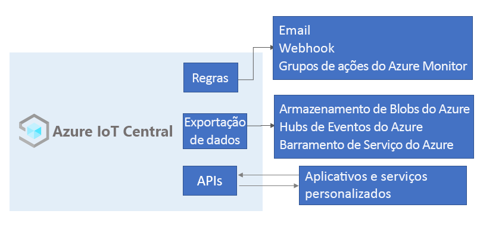

# O que é Azure IoT Central?

O Azure IoT Central é uma plataforma de aplicativo IoT que reduz a carga e o custo de desenvolvimento, gerenciamento e manutenção de soluções de IoT de nível empresarial. Optar por criar com o Azure IoT Central oferece a oportunidade de concentrar o tempo, o dinheiro e a energia na transformação de seus negócios com os dados de IoT, em vez de apenas manter e atualizar uma infraestrutura de IoT complexa e em evolução contínua.

A interface do usuário da Web permite que você monitore as condições do dispositivo, crie regras e gerencie milhões de dispositivos e seus dados ao longo de seu ciclo de vida. Além disso, permite que você atue com base em insights do dispositivo estendendo a inteligência da IoT em aplicativos de linha de negócios.

Este artigo descreve os seguintes tópicos do Azure IoT Central:

- As funções de usuário típicas associadas a um projeto.
- Como criar seu aplicativo.
- Como conectar seus dispositivos ao seu aplicativo
- Como gerenciar seu aplicativo.
- Funcionalidades do Azure IoT Edge no IoT Central.
- Como conectar seus dispositivos capacitados com o runtime do Azure IoT Edge ao seu aplicativo.

## Funções de usuário

A documentação do IoT Central faz refere-se a quatro funções de usuário que interagem com um aplicativo do IoT Central:

- Um _criador de soluções_ é responsável por [criar um aplicativo](quick-deploy-iot-central.md), [configurar regras e ações](quick-configure-rules.md), [definir integrações a outros serviços](howto-export-data.md) e personalizar ainda mais o aplicativo para operadores e desenvolvedores de dispositivos.
- Um _operador_ [gerencia os dispositivos](howto-manage-devices.md) conectados ao aplicativo.
- Um _administrador_ é responsável por tarefas administrativas, como gerenciar [funções de usuários e permissões](howto-administer.md) dentro do aplicativo.
- Um _desenvolvedor de dispositivo_ [cria o código que é executado em um dispositivo](concepts-telemetry-properties-commands.md) ou no [módulo do IoT Edge](concepts-iot-edge.md) conectado ao seu aplicativo.

## Criar seu aplicativo do IoT Central

Como construtor se solução, você usa o IoT Central para criar uma solução de IoT personalizada e hospedada na nuvem para sua organização. Uma solução de IoT personalizada normalmente consiste em:

- Um aplicativo baseado em nuvem que recebe telemetria de seus dispositivos e permite o gerenciamento dos dispositivos.
- Vários dispositivos executando o código personalizado conectado ao seu aplicativo baseado em nuvem.

É possível implantar rapidamente um novo aplicativo do IoT Central e personalizá-lo de acordo com os requisitos específicos de seu navegador. Comece com um _modelo de aplicativo_ genérico ou um dos modelos de aplicativo voltados para o setor para [Varejo](../retail/overview-iot-central-retail.md), [Energia](../energy/overview-iot-central-energy.md), [Governo](../government/overview-iot-central-government.md) ou [Serviços de saúde](../healthcare/overview-iot-central-healthcare.md).

Como construtor de soluções, você usa as ferramentas baseadas na Web para criar um _modelo de dispositivo_ para os dispositivos que se conectam ao seu aplicativo. Um modelo de dispositivo é um blueprint que define as características e o comportamento de um tipo de dispositivo, como:

- A telemetria que ele envia. Os exemplos incluem temperatura e umidade. A telemetria está transmitindo dados.
- As propriedades de negócios que um operador pode modificar. Os exemplos incluem um endereço de cliente e uma data em que ele foi atendido pela última vez.
- As propriedades do dispositivo que são definidas por um dispositivo e são somente leitura no aplicativo. Por exemplo, o estado de uma válvula como aberta ou fechada.
- Propriedades, definidas por um operador, que determinam o comportamento do dispositivo. Por exemplo, uma temperatura de destino para o dispositivo.
- Comandos, que um operador pode chamar, que são executados em um dispositivo. Por exemplo, um comando para reinicializar um dispositivo remotamente.

Este [modelo de dispositivo](howto-set-up-template.md) inclui:

- Um _modelo de dispositivo_ que descreve as funcionalidades que um dispositivo deve implementar. As funcionalidades do dispositivo incluem:

  - A telemetria que ele transmite para o IoT Central.
  - As propriedades somente leitura que ele usa para relatar o estado para o IoT Central.
  - As propriedades graváveis que ele recebe do IoT Central para definir o estado do dispositivo.
  - Os comandos chamados do IoT Central.

- Propriedades de nuvem que não são armazenadas no dispositivo.
- Personalizações, painéis e formulários que fazem parte do aplicativo do IoT Central.

### Criar modelos de dispositivo

Como construtor de solução, você tem várias opções para criar modelos de dispositivo:

- Crie o modelo de dispositivo no IoT Central e implementar o modelo de dispositivo dele no código do dispositivo.
- Crie um modelo de dispositivo usando o Visual Studio Code e publicar o modelo em um repositório. Implemente o código do dispositivo do modelo e conecte o dispositivo ao aplicativo do IoT Central. O IoT Central encontra o modelo de dispositivo no repositório e cria um modelo de dispositivo simples para você.
- Crie um dispositivo usando o Visual Studio Code. Implemente o código do dispositivo do modelo. Importe manualmente o modelo de dispositivo para o aplicativo do IoT Central e, em seguida, adicione todas as propriedades de nuvem, personalizações e painéis de que seu aplicativo do IoT Central precisa.

Como um construtor de soluções, você pode usar o IoT Central a fim de gerar um código para testar dispositivos e validar seus modelos de dispositivo.

Se você é um desenvolvedor de dispositivos, confira a [Visão geral de desenvolvimento de dispositivos no IoT Central](./overview-iot-central-developer.md) para obter uma introdução à implementação de dispositivos que usam esses modelos de dispositivo.

### Personalizar a interface do usuário

Como construtor de soluções, você também pode personalizar a interface do usuário do aplicativo IoT Central para os operadores responsáveis pelo uso diário do aplicativo. As personalizações possíveis para um construtor de soluções incluem:

- A definição do layout de propriedades e configurações em um modelo do dispositivo.
- A configuração de painéis personalizados para ajudar os operadores a descobrirem insights e resolverem problemas mais rapidamente.
- A configuração da análise personalizada para explorar os dados de série temporal de seus dispositivos conectados.

## Gerenciar seus dispositivos

Como operador, use o aplicativo do IoT Central para [gerenciar os dispositivos](howto-manage-devices.md) na sua solução do IoT Central. Operadores realizam tarefas como:

- Monitorar os dispositivos conectados ao aplicativo.
- Solucionar e corrigir problemas com dispositivos.
- Provisionar novos dispositivos.

Como construtor de soluções, você pode [definir regras e ações personalizadas](howto-configure-rules.md) que operem em um streaming de dados nos dispositivos conectados. Um operador pode habilitar ou desabilitar essas regras no nível do dispositivo para controlar e automatizar tarefas dentro do aplicativo.

Com qualquer solução de IoT projetada para operar em escala, é importante ter uma abordagem estruturada para o gerenciamento de dispositivo. Não é suficiente apenas conectar seus dispositivos à nuvem; você precisa mantê-los conectados e íntegros. Um operador pode usar as seguintes funcionalidades do IoT Central para gerenciar os dispositivos ao longo do ciclo de vida do aplicativo:

### Painéis

Os [painéis](./howto-set-up-template.md#generate-default-views) internos fornecem uma interface do usuário personalizável para monitorar a integridade e a telemetria do dispositivo. Comece com um painel predefinido em um [modelo de aplicativo](howto-use-app-templates.md) ou crie os próprios painéis adaptados às necessidades de seus operadores. Você pode compartilhar painéis com todos os usuários em seu aplicativo ou mantê-los particulares.

### Regras e ações

Crie [regras personalizadas](tutorial-create-telemetry-rules.md) com base no estado e na telemetria do dispositivo para identificar os dispositivos que precisam de atenção. Configure ações para notificar as pessoas certas e garanta que as medidas corretivas sejam executadas em tempo hábil.

### Trabalhos

Os [trabalhos](howto-run-a-job.md) permitem que você aplique atualizações individuais ou em massa aos dispositivos definindo propriedades ou chamando comandos.

## Integrar com outros serviços

Como uma plataforma de aplicativos, o IoT Central permite transformar seus dados de IoT em informações de negócios que geram resultados práticos. As [regras](./tutorial-create-telemetry-rules.md), a [exportação de dados](./howto-export-data.md) e a [API REST pública](/learn/modules/manage-iot-central-apps-with-rest-api/) são exemplos de como você pode integrar o IoT Central aos aplicativos de linha de negócios:

Você pode gerar informações de negócios, como determinar tendências de eficiência dos computadores ou prever o uso futuro de energia em um chão de fábrica, criando pipelines de análise personalizados para processar a telemetria de seus dispositivos e armazenar os resultados. Configure exportações de dados no aplicativo do IoT Central para exportar telemetria, alterações de propriedade do dispositivo e alterações de modelo do dispositivo para outros serviços, nos quais você poderá analisar, armazenar e visualizar os dados com as suas ferramentas preferidas.

### Criar soluções de IoT e integrações personalizadas com as APIs REST

Crie soluções de IoT, como:

- Aplicativos do Complemento Móvel que possam configurar e controlar dispositivos remotamente.
- Integrações personalizadas que permitam que os aplicativos de linha de negócios existentes interajam com os dados e os dispositivos de IoT.
- Aplicativos de gerenciamento de dispositivo para modelagem de dispositivos, integração, gerenciamento e acesso a dados.

## Administrar seu aplicativo

Aplicativos do IoT Central são totalmente hospedados pela Microsoft, o que reduz a sobrecarga de administração do gerenciamento de seus aplicativos. Os administradores gerenciam o acesso ao seu aplicativo [com funções de usuário e permissões](howto-administer.md).

## Preços

Você pode criar um aplicativo do IoT Central usando uma avaliação gratuita de 7 dias ou usar um plano de preços Standard.

- Os aplicativos criados com o plano *gratuito* são gratuitos por sete dias e dão suporte a até cinco dispositivos. Você pode convertê-los para usar um plano de preços Standard a qualquer momento antes que eles expirem.
- Os aplicativos criados com o plano *Standard* são cobrados por dispositivo; você pode escolher o plano de preços **Standard 0**, **Standard 1** ou **Standard 2** com os dois primeiros dispositivos sendo gratuitos. Saiba mais sobre os [preços do IoT Central](https://aka.ms/iotcentral-pricing).

## Cotas

Cada assinatura do Azure tem cota padrão que podem afetar o escopo de sua solução de IoT. No momento, o IoT Central limita o número de aplicativos que você pode implantar em uma assinatura a 10. Se precisar aumentar esse limite, entre em contato com o [Suporte da Microsoft](https://azure.microsoft.com/support/options/).

## Problemas conhecidos

- A exportação de dados contínua não é compatível com o formato Avro.
- Atualmente, não há compatibilidade com GeoJSON.
- Atualmente, não há compatibilidade com peças de mapa.
- Não há compatibilidade com tipos de esquema de matriz.
- Somente o SDK do dispositivo C e os SDKs do serviço e do dispositivo Node.js são compatíveis.
- No momento, o IoT Central está disponível nos Estados Unidos, na Europa, no Pacífico Asiático, na Austrália, no Reino Unido e no Japão.

## Próximas etapas

Agora que você tem uma visão geral do IoT Central, estas são as próximas etapas sugeridas:

- Se você é um desenvolvedor de dispositivos e deseja se aprofundar em algum código, a próxima etapa sugerida é [Criar e conectar um aplicativo cliente ao seu aplicativo do Azure IoT Central](./tutorial-connect-device.md).
- Familiarizar-se com a [interface do usuário do Azure IoT Central](overview-iot-central-tour.md).
- Comece com a [criação de um aplicativo do Azure IoT Central](quick-deploy-iot-central.md).
