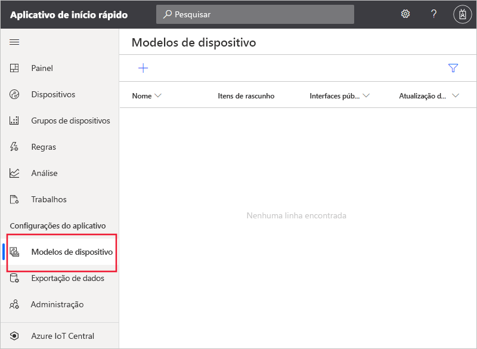
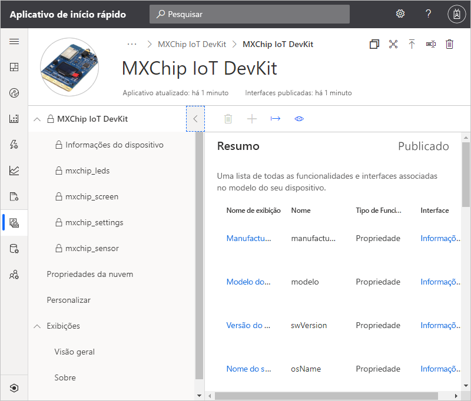
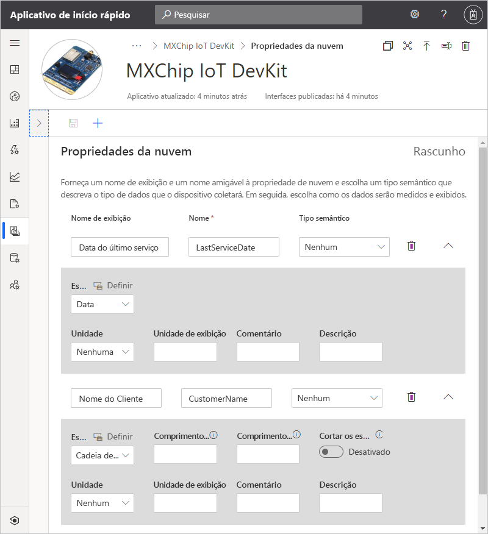
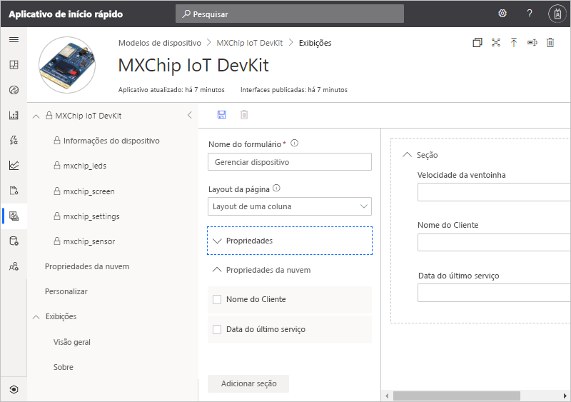
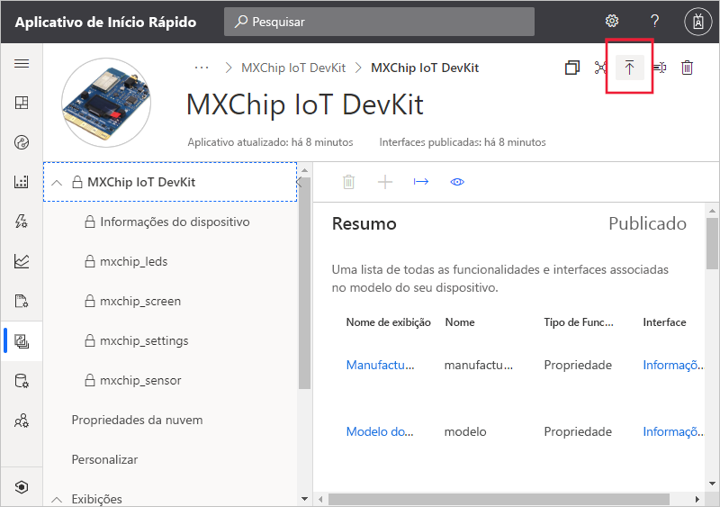
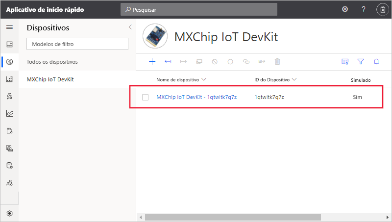
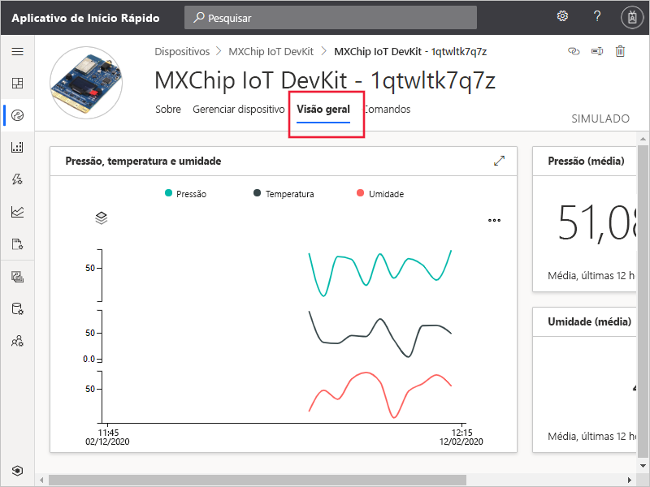
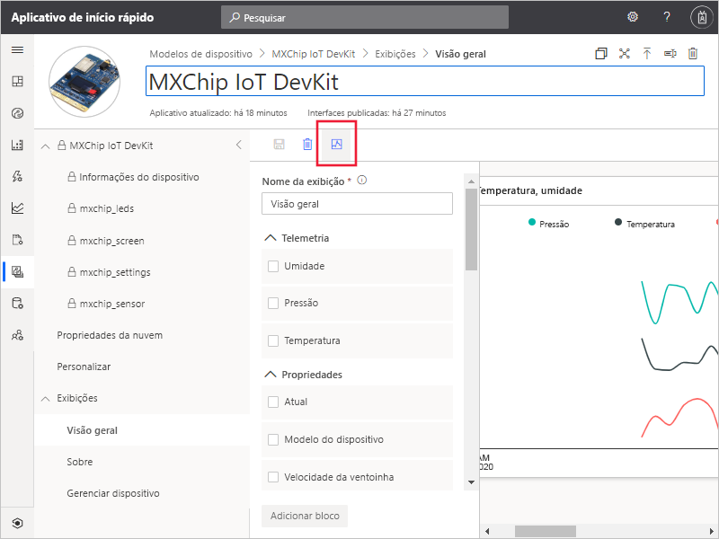

# Início Rápido: Adicionar um dispositivo simulado ao seu aplicativo IoT Central

*Este artigo aplica-se a operadores, construtores e administradores.*

Um modelo de dispositivo define as funcionalidades de um dispositivo que se conecta ao seu aplicativo do IoT Central. Os recursos incluem telemetria que o dispositivo envia, as propriedades do dispositivo e os comandos aos quais um dispositivo responde. Em um modelo de dispositivo, um compilador ou operador pode adicionar dispositivos reais e simulados a um aplicativo. Dispositivos simulados são úteis para testar o comportamento do seu aplicativo do IoT Central antes de conectar dispositivos reais.

Neste guia de início rápido, você adiciona um modelo de dispositivo a uma placa *MXChip IoT DevKit* (DevKit) e cria um dispositivo simulado. Para concluir este início rápido, você não precisa de um dispositivo real, pois trabalhará com uma simulação do dispositivo. Um dispositivo DevKit:

* Envia telemetria como a temperatura.
* Relata propriedades específicas do dispositivo, como o nível de brilho.
* Responde a comandos como ativar e desativar.
* Relata propriedades genéricas de dispositivo como a versão de firmware e o número de série.

## Pré-requisitos

Conclua o início rápido [Criar um aplicativo do Azure IoT Central](./quick-deploy-iot-central.md) para criar um aplicativo do IoT Central usando o modelo de **App personalizado > Aplicativo personalizado**.

## Criar um modelo

Como um construtor, você pode criar e editar os modelos de dispositivo no seu aplicativo IoT Central. Depois de publicar um modelo de dispositivo, você pode gerar um dispositivo simulado ou conectar dispositivos reais do modelo de dispositivo. Dispositivos simulados permitem testar o comportamento do aplicativo antes de você conectar um dispositivo real.

Para adicionar um novo modelo de dispositivo a seu aplicativo, selecione a guia **Modelos de dispositivo** no painel esquerdo.

Um modelo de dispositivo inclui um modelo de funcionalidade de dispositivo que define a telemetria que o dispositivo envia, as propriedades do dispositivo e os comandos aos quais o dispositivo responde.

### Adicionar um modelo de funcionalidade do dispositivo

Há várias opções para adicionar um modelo de funcionalidade do dispositivo no aplicativo IoT Central. Você pode criar um modelo do zero, importar um modelo de um arquivo ou selecionar um dispositivo no catálogo de dispositivos. O IoT Central também dá suporte a uma abordagem de *dispositivo primeiro*, na qual ele importa automaticamente um modelo de um repositório quando um dispositivo se conecta pela primeira vez. Neste início rápido, você escolhe um dispositivo do catálogo de dispositivos para importar seu modelo de funcionalidade do dispositivo.

As etapas a seguir mostram como usar o catálogo de dispositivos para importar o modelo de capacidade para um dispositivo **MXChip IoT DevKit**. Esses dispositivos enviam a telemetria, como a temperatura, para seu aplicativo:

1. Para adicionar um novo modelo de dispositivo, selecione **+** na página **Modelos de dispositivo**.

1. Na página **Selecionar o tipo de modelo**, role a tela para baixo até encontrar o bloco **MXChip IoT DevKit**.

1. Selecione o bloco **MXChip IoT DevKit** e, em seguida, selecione **Avançar: Personalizar**.

1. Na página **Examinar**, selecione **Criar**.

1. Depois de alguns segundos, você pode ver o novo modelo de dispositivo:

    

    O modelo de capacidade MXChip IoT DevKit inclui interfaces como **mxchip_sensor**, **mxchip_settings**e **Informações do dispositivo**. As interfaces definem as capacidades de um dispositivo MXChip IoT DevKit. Os recursos incluem a telemetria que o dispositivo envia, as propriedades que o dispositivo relata e os comandos aos quais um dispositivo responde.

### Adicionar propriedades da nuvem

Um modelo de dispositivo pode incluir propriedades de nuvem. As propriedades de nuvem existem somente no aplicativo IoT Central e nunca são enviadas ou recebidas de um dispositivo. Para adicionar uma propriedade de nuvem:

1. Selecione **Propriedades da Nuvem** e, em seguida, **+ Adicionar propriedade de nuvem**. Use as informações da seguinte tabela para adicionar duas propriedades de nuvem ao seu modelo de dispositivo:

    | Nome de exibição      | Tipo Semântico | Esquema |
    | ----------------- | ------------- | ------ |
    | Data do Último Serviço | Nenhum          | Data   |
    | Nome do Cliente     | Nenhum          | String |

1. Selecione **Salvar** para salvar as alterações:

    

## Exibições

Como um construtor, você pode personalizar o aplicativo para exibir informações relevantes sobre o dispositivo para um operador. Suas personalizações permitem que o operador gerencie os dispositivos conectados ao aplicativo. Você pode criar dois tipos de modos de exibição para que um operador use para interagir com dispositivos:

* Formulários para exibir e editar propriedades de dispositivo e de nuvem.
* Painéis para visualizar dispositivos que incluem a telemetria que enviam.

### Exibições padrão

As exibições padrão são uma maneira rápida de começar a visualizar as informações importantes do dispositivo. Você pode ter até três modos de exibição padrão geradas para seu modelo de dispositivo:

* O modo de exibição **Comandos** permite que o operador despache comandos para seu dispositivo.
* O modo de exibição **Visão Geral** usa gráficos e métricas para exibir a telemetria do dispositivo.
* O modo de exibição **Sobre** exibe as propriedades do dispositivo.

Selecione o nó **Exibições** no modelo de dispositivo. Você pode ver que o IoT Central gerou uma **Visão geral** e uma exibição **Sobre** para você quando adicionou o modelo.

Para adicionar um novo formulário **Gerenciar dispositivo** que um operador pode usar para gerenciar o dispositivo:

1. Selecione o nó **Exibições** e, em seguida, selecione o bloco **Editando dados de dispositivo e de nuvem** para adicionar uma nova exibição.

1. Altere o nome do formulário para **Gerenciar dispositivo**.

1. Selecione as propriedades de nuvem **Nome do cliente** e **Data do último serviço**, bem como a propriedade **Velocidade do ventilador**. Em seguida, selecione **Adicionar Seção**:

    

1. Selecione **Salvar** para salvar seu novo formulário.

## Publicar um modelo de dispositivo

Antes de criar um dispositivo simulado ou conectar um dispositivo real, você precisa publicar o modelo de dispositivo. Embora o IoT Central tenha publicado o modelo quando você o criou pela primeira vez, é necessário publicar a versão atualizada.

Para publicar um modelo de dispositivo:

1. Vá para seu modelo de dispositivo na página **Modelos de Dispositivo**.

1. Selecione **Publicar**:

    

1. Na caixa de diálogo **Publicar este modelo de dispositivo no aplicativo**, selecione **Publicar**. 

Depois de publicar um modelo de dispositivo, ele fica visível na página **Dispositivos**. Em um modelo de dispositivo publicado, você não pode editar um modelo de funcionalidade do dispositivo sem criar uma nova versão. No entanto, você pode fazer atualizações nas propriedades de nuvem, nas personalizações e nos modos de exibição, em um modelo de dispositivo publicado sem controle de versão. Depois de fazer qualquer alteração, selecione **Publicar** para enviar por push essas alterações para o operador.

## Adicionar um dispositivo simulado

Para adicionar um dispositivo simulado ao seu aplicativo, use o modelo de dispositivo **MXChip IoT DevKit** que você criou.

1. Para adicionar um novo dispositivo como um operador, escolha **Dispositivos** no painel esquerdo. A guia **Dispositivos** mostra **Todos os dispositivos** e o modelo de dispositivo **MXChip IoT DevKit**. Selecione **MXChip IoT DevKit**.

1. Para adicionar um dispositivo DevKit simulado, selecione **+** . Use a **ID do Dispositivo** sugerida ou insira sua própria **ID do Dispositivo** em minúsculas. Você também pode inserir um nome para o novo dispositivo. Confira se a opção **Simulado** está como **Ativado** e, em seguida, selecione **Criar**.

    

Agora você pode interagir com as exibições que foram criadas pelo construtor para o modelo de dispositivo usando dados simulados:

1. Selecione o dispositivo simulado na página **Dispositivos**

    * A exibição **Visão geral** mostra um gráfico da telemetria simulada:

        

    * A exibição **Sobre** mostra valores de propriedade, incluindo as propriedades de nuvem que você adicionou à exibição.

    * A exibição **Comando** permite que você execute comandos, como **blink**, no dispositivo.

    * A exibição **Gerenciar dispositivos** é o formulário que você criou para o operador gerenciar o dispositivo.

    * A exibição **Dados brutos** permite que você veja a telemetria bruta e os valores de propriedade enviados pelo dispositivo. Essa exibição é útil para a depuração de dispositivos.

## Usar um dispositivo simulado para melhorar as exibições

Depois de criar um novo dispositivo simulado, o construtor pode usar esse dispositivo para continuar a melhorar e reforçar as exibições para o modelo de dispositivo.

1. Escolha **Modelos de dispositivo** no painel esquerdo e selecione o modelo **MXChip IoT DevKit**.

1. Selecione qualquer uma das exibições que você gostaria de editar ou crie uma nova exibição. Selecione **Configurar dispositivo de versão prévia** e **Selecionar em um dispositivo em execução**. Aqui, você pode optar por não ter nenhum dispositivo de versão prévia, um dispositivo real que pode ser configurado para teste ou um dispositivo existente que você adicionou ao IoT Central.

1. Escolha seu dispositivo simulado na lista. Em seguida, selecione **Aplicar**. Agora você pode ver o mesmo dispositivo simulado em sua experiência de construção de exibições de modelo de dispositivo. Essa exibição é particularmente útil para gráficos e outras visualizações.

    

## Próximas etapas

Neste início rápido, você aprendeu a criar um modelo de dispositivo **MXChip IoT DevKit** e a adicionar um dispositivo simulado ao seu aplicativo.

Para saber mais sobre como monitorar dispositivos conectados ao seu aplicativo, passe para o início rápido:

> [!div class="nextstepaction"]
> [Configurar regras e ações](./quick-configure-rules.md)
