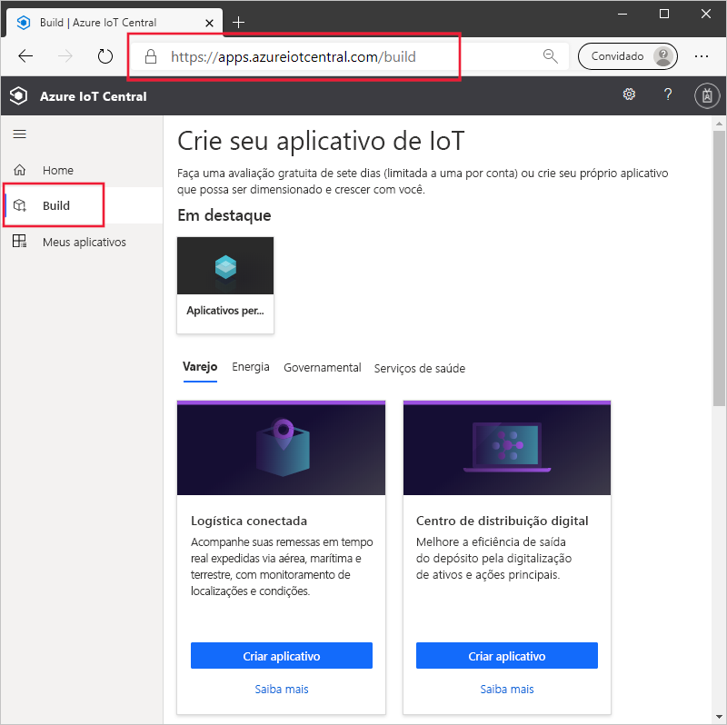
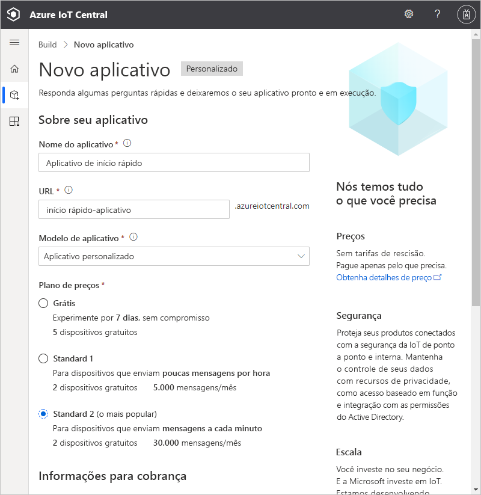
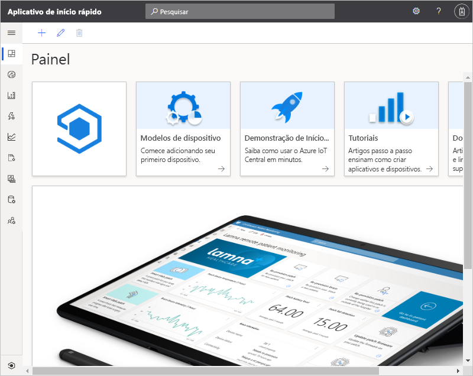

# Crie um aplicativo Azure IoT Central

Este início rápido mostra como criar um aplicativo do Azure IoT Central.

## Criar um aplicativo

Navegue até o site do [Build do Azure IoT Central](https://aka.ms/iotcentral). Em seguida, entre com uma conta pessoal, corporativa ou de estudante da Microsoft.

Crie um aplicativo da lista de modelos do IoT Central relevantes do setor para ajudar você a começar rapidamente, ou comece do zero, usando o modelo **Aplicativo personalizado**. Neste início rápido, você usará o modelo de **Aplicativo personalizado**.

Para criar um aplicativo do Azure IoT Central com base no modelo de **Aplicativo personalizado**:

1. Navegue até a página **Criar**:

    

1. Escolha **Aplicativo personalizado** e verifique se o modelo de **Aplicativo personalizado** está selecionado.

1. O Azure IoT Central sugere automaticamente um **nome de aplicativo** com base no modelo de aplicativo que você selecionou. Você pode usar esse nome ou inserir seu próprio nome de aplicativo amigável.

1. O Azure IoT Central também gera um prefixo de **URL de aplicativo** único para você, com base no nome do aplicativo. Use esta URL para acessar seu aplicativo. Altere esse prefixo de URL para algo mais fácil de memorizar se desejar.

    

    

    > [!NOTE]
    > Se você escolher **Aplicativo personalizado** na página anterior, verá um menu suspenso **Modelo de aplicativo**. Nele, você poderá alternar entre modelos personalizados e herdados. Você também pode ver outros modelos que foram disponibilizados para sua organização.

1. Opte por criar este aplicativo usando o plano de preços de avaliação gratuita de 7 dias ou um dos planos de preços Standard:

    - Os aplicativos criados com o plano *gratuito* são gratuitos por sete dias e dão suporte a até cinco dispositivos. Você pode convertê-los para usar um plano de preços Standard a qualquer momento antes que eles expirem.
    - Os aplicativos criados com um plano *Standard* são cobrados por dispositivo; você pode escolher o plano de preços **Standard 1** ou **Standard 2** com os dois primeiros dispositivos sendo gratuitos. Saiba mais sobre os planos de preços Gratuito e Standard na [página de preços do Azure IoT Central](https://azure.microsoft.com/pricing/details/iot-central/). Se você criar um aplicativo Standard, precisará selecionar o *Diretório*, a *Assinatura do Azure* e a *Localização*:
        - *Diretório* é o Azure Active Directory no qual você criará o aplicativo. Um Azure Active Directory contém identidades de usuário, credenciais e outras informações organizacionais. Caso não tenha um Azure Active Directory, será criado um para você ao criar uma assinatura do Azure.
        - Uma *Assinatura do Azure* permite que você crie instâncias de serviços do Azure. O IoT Central provisiona recursos em sua assinatura. Caso você não tenha uma assinatura do Azure, crie uma gratuitamente na [página de inscrição do Azure](https://aka.ms/createazuresubscription). Depois de criar a assinatura do Azure, navegue de volta até a página **Novo aplicativo**. Agora a nova assinatura será exibida na lista suspensa **Assinatura do Azure**.
        - *Localização* é a [geografia](https://azure.microsoft.com/global-infrastructure/geographies/) em que você deseja criar seu aplicativo. Normalmente, você deve escolher a localização fisicamente mais próxima de seus dispositivos para obter um desempenho ideal. Depois de escolher uma localização, você não poderá mover o aplicativo posteriormente para outra localização.

1. Examine os Termos e Condições e selecione **Criar** na parte inferior da página. Após alguns minutos, o aplicativo do IoT Central estará pronto para uso:

    

## Próximas etapas

Neste início rápido, você criou um aplicativo IoT Central. Aqui estão sugestões para as próximas etapas:

> [!div class="nextstepaction"]
> [Adicionar um dispositivo simulado ao seu aplicativo IoT Central](./quick-create-pnp-device.md)
