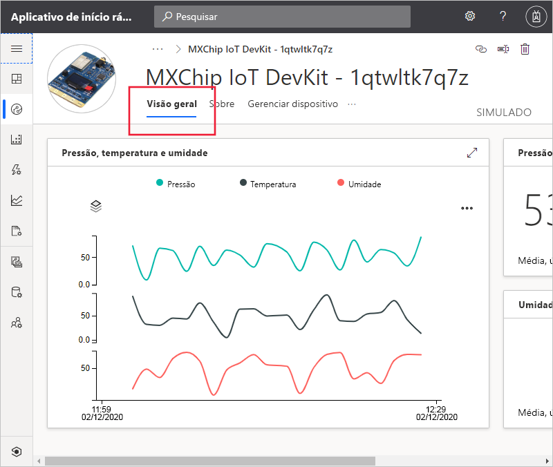
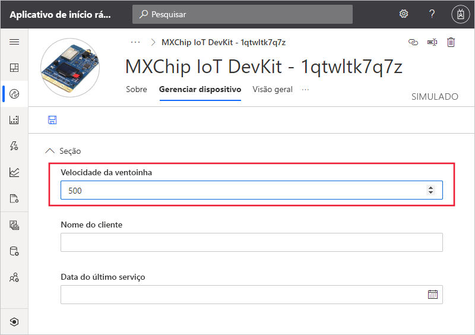

# Início Rápido: Use o Azure IoT Central para monitorar seus dispositivos

*Este artigo aplica-se a operadores, construtores e administradores.*

Este início rápido mostra a você, como um operador, como usar o seu aplicativo do Microsoft Azure IoT Central para monitorar seus dispositivos e alterar as configurações.

## Pré-requisitos

Antes de começar, você deve concluir os três inícios rápidos anteriores [Criar um aplicativo do Azure IoT Central](./quick-deploy-iot-central.md), [Adicionar um dispositivo simulado ao seu aplicativo do IoT Central](./quick-create-simulated-device.md) e [Configurar regras e ações para seu dispositivo](quick-configure-rules.md).

## Receber uma notificação

O Azure IoT Central envia notificações sobre dispositivos como mensagens de email. O construtor adicionou uma regra para enviar uma notificação quando a temperatura em um sensor de dispositivo conectado exceder um limite. Verifique os emails enviados para a conta escolhida pelo construtor para receber notificações.

Abra a mensagem de email recebida no final do início rápido [Configurar regras e ações para o seu dispositivo](quick-configure-rules.md). No email, selecione o link para o dispositivo:

A exibição **Visão geral** do dispositivo simulado que você criou nos inícios rápidos anteriores é aberta no navegador:

## Investigar um problema

Como um operador, você pode exibir informações sobre o dispositivo nas exibições **Visão geral**, **Sobre** e **Comandos**. O construtor criou uma exibição **Gerenciar dispositivos** para que você edite informações do dispositivo e defina as propriedades do dispositivo.

O gráfico no painel mostra um gráfico de temperatura do dispositivo. Você decide se a temperatura do dispositivo está muito alta.

## Resolver um problema

Para fazer uma alteração no dispositivo, use a página **Gerenciar dispositivo**.

Altere a **Velocidade do ventilador** para 500 para resfriar o dispositivo. Escolha **Salvar** para atualizar o dispositivo. Quando o dispositivo confirma as alterações de configuração, o status da propriedade muda para **sincronizado**:

## Próximas etapas

Neste guia de início rápido, você aprendeu a:

* Receber uma notificação
* Investigar um problema
* Resolver um problema

Agora que você sabe como monitorar o dispositivo, a próxima etapa sugerida é:

> [!div class="nextstepaction"]
> [Criar e gerenciar um modelo de dispositivo](howto-set-up-template.md).
