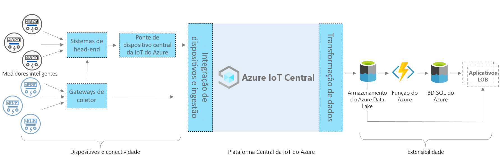

# Azure IoT Central – Arquitetura de aplicativo de medidor inteligente

[!INCLUDE [iot-central-pnp-original](../../../includes/iot-central-pnp-original-note.md)]

Este artigo fornece uma visão geral da arquitetura do modelo de aplicativo de monitoramento do medidor inteligente. O diagrama abaixo mostra uma arquitetura comumente usada para o aplicativo de medidor inteligente no Azure usando a plataforma do IoT Central.

> [!div class="mx-imgBorder"]
> 

Essa arquitetura é formada pelos componentes a seguir. Algumas soluções não exigem todos os componentes listados aqui.

## Medidores inteligentes e conectividade 

Um medidor inteligente é um dos dispositivos mais importantes entre todos os ativos de energia. Ele registra e comunica os dados de consumo de energia aos serviços públicos para monitoramento e outros casos de uso, como cobrança e resposta de demanda. Com base no tipo de medidor, ele pode se conectar o IoT Central por meio de gateways ou outros dispositivos, ou sistemas intermediários, como dispositivos de borda e sistemas de cabeceira de rede. Crie uma ponte de dispositivo do IoT Central para conectar dispositivos que não podem ser conectados diretamente. A ponte de dispositivo do IoT Central é uma solução de código aberto e você pode encontrar todos os detalhes [aqui](https://docs.microsoft.com/azure/iot-central/core/howto-build-iotc-device-bridge). 

## Plataforma do IoT Central

O Azure IoT Central é uma plataforma que simplifica a criação de sua solução de IoT e ajuda a reduzir a carga e os custos de gerenciamento, operações e desenvolvimento de IoT. Com o IoT Central é possível conectar, monitorar e gerenciar facilmente seus ativos da IoT (Internet das Coisas) em escala. Depois de conectar seus medidores inteligentes ao IoT Central, o modelo de aplicativo usa recursos internos, como modelos de dispositivo, comandos e painéis. O modelo do aplicativo também usa o armazenamento do IoT Central para cenários de categorização de dados mornos, como monitoramento de dados em tempo real, análises, regras e visualização. 

## Opções de extensibilidade para criar com o IoT Central
A plataforma do IoT Central fornece duas opções de extensibilidade: CDE (Exportação de dados contínua) e APIs. Os clientes e parceiros podem escolher entre essas opções com base em suas necessidades de personalização de soluções específicas. Por exemplo, um de nossos parceiros configurou o CDE com o ADLS (Azure Data Lake Storage). Eles estão usando ADLS para retenção de dados a longo prazo e outros cenários de armazenamento de caminho frio, como processamento em lote, auditoria e relatórios. 

## Próximas etapas

* Agora que você aprendeu sobre a arquitetura, [Crie um aplicativo de medidor inteligente gratuitamente](https://apps.azureiotcentral.com/build/new/smart-meter-monitoring)
* Para saber mais sobre o IoT Central, confira [Visão geral do IoT Central](https://docs.microsoft.com/azure/iot-central/)
