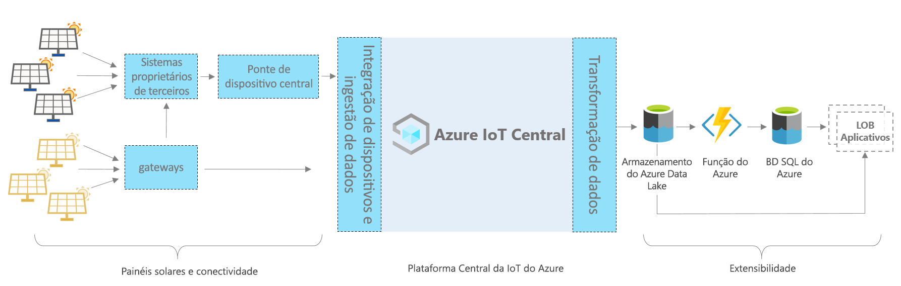

# Azure IoT Central – arquitetura de aplicativo do painel solar

Este artigo fornece uma visão geral da arquitetura do modelo de aplicativo de monitoramento do painel solar. O diagrama abaixo mostra uma arquitetura comum para o aplicativo de painel solar no Azure usando a plataforma IoT Central.

> [!div class="mx-imgBorder"]
> 

Essa arquitetura é formada pelos componentes a seguir. Alguns aplicativos não exigem todos os componentes listados aqui.

## Painéis solares e conectividade

Os painéis solares são uma das fontes mais significativas de energia renovável. Dependendo do tipo e da configuração do painel solar, você pode conectá-lo usando gateways ou outros dispositivos intermediários e sistemas proprietários. Talvez você precise criar uma ponte de dispositivos do IoT Central para conectar dispositivos que não possam ser conectados diretamente. A ponte de dispositivo do IoT Central é uma solução de código aberto e você pode encontrar todos os detalhes [aqui](../core/howto-build-iotc-device-bridge.md). 

## Plataforma do IoT Central
O Azure IoT Central é uma plataforma que simplifica a criação de sua solução de IoT e ajuda a reduzir a carga e os custos de gerenciamento, operações e desenvolvimento de IoT. Com o IoT Central é possível conectar, monitorar e gerenciar facilmente seus ativos da IoT (Internet das Coisas) em escala. Depois de conectar os painéis solares ao IoT Central, o modelo de aplicativo usa recursos internos, como modelos de dispositivo, comandos e painéis. O modelo do aplicativo também usa o armazenamento do IoT Central para cenários de categorização de dados mornos, como monitoramento de dados em tempo real, análises, regras e visualização.

## Opções de extensibilidade para criar com o IoT Central
A plataforma do IoT Central fornece duas opções de extensibilidade: CDE (Exportação de Dados Contínua) e APIs. Os clientes e parceiros podem escolher entre essas opções com base em suas necessidades de personalização de soluções específicas. Por exemplo, um de nossos parceiros configurou o CDE com o ADLS (Azure Data Lake Storage). Ele está usando ADLS para retenção de dados a longo prazo e outros cenários de armazenamento de fluxo frio, como processamento em lote, auditoria e relatórios. 

## Próximas etapas

* Agora que você aprendeu sobre a arquitetura, [crie um aplicativo de painel solar gratuitamente](https://apps.azureiotcentral.com/build/new/solar-panel-monitoring)
* Para saber mais sobre o IoT Central, confira [Visão geral do IoT Central](../index.yml)
