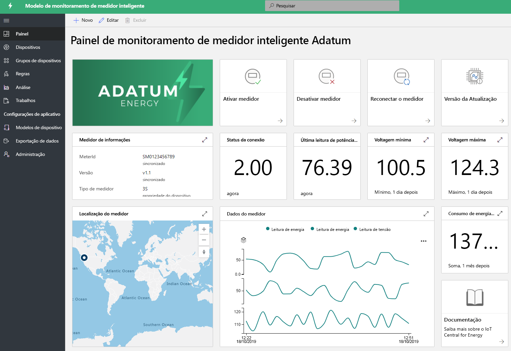

# O que são as soluções de energia do IoT Central?

Os medidores inteligentes e os painéis solares estão desempenhando uma função importante na transformação do setor de energia. Os medidores inteligentes fornecem mais controles e informações em tempo real sobre os consumos de energia e o crescimento dos painéis solares está impulsionando a inovação na geração de energia renovável. Os aplicativos de monitoramento de medidores inteligentes e de painéis solares são modelos de exemplo para mostrar os vários recursos. Os parceiros podem aproveitar esses modelos para criar soluções de energia com IoT Central para suas necessidades específicas. Nenhuma nova codificação e nenhum custo adicional são necessários para implantar e usar esses aplicativos. Saiba mais sobre modelos de aplicativos de energia e seus recursos.

## O que é o aplicativo de monitoramento de medidor inteligente?
 Os medidores inteligentes não apenas permitem a cobrança automatizada, mas também os casos de uso de medição avançada, como leituras em tempo real e comunicação bidirecional. O modelo de aplicativo de medidor inteligente permite que os serviços públicos e os parceiros monitorem o status e os dados dos medidores inteligentes, definam alarmes e notificações. Ele fornece comandos de exemplo, como desconectar o medidor e atualizar o software. Os dados do medidor podem ser configurados para saída para outros aplicativos de negócios e para desenvolver soluções personalizadas. 

Funcionalidades principais do aplicativo: 

* Modelo de dispositivo de exemplo de medição 
* Informações de medidor e status ao vivo 
* Leituras de medidores, como energia, potência e voltagens
* Exemplos de comando do medidor 
* Visualização e painéis internos
* Extensibilidade para desenvolvimento de solução personalizada

Você pode experimentar o [aplicativo de monitoramento de medidor inteligente gratuitamente](https://apps.azureiotcentral.com/build/new/smart-meter-monitoring) sem uma assinatura do Azure e qualquer compromisso.

Depois de implantar o aplicativo, você verá os dados de medidor simulados no painel, como mostrado na figura abaixo. Este modelo é um aplicativo de exemplo que você pode estender e personalizar com facilidade para seus casos de uso específicos.

> [!div class="mx-imgBorder"]
> 

## O que é o aplicativo de monitoramento de painel solar?
O aplicativo de monitoramento de painel solar permite que os serviços públicos e parceiros monitorem painéis solares, como a geração de energia e o status da conexão quase em tempo real. Ele pode enviar notificações com base nos critérios de limite definidos. Ele fornece comandos de exemplo, como atualizar o firmware e outras propriedades. Os dados do painel solar podem ser configurados para saída para outros aplicativos de negócios e para desenvolver soluções personalizadas. 

Funcionalidades principais do aplicativo: 

* Modelo de dispositivo de exemplo do painel solar 
* Informações do painel solar e status ao vivo
* Geração de energia solar e outras leituras
* Exemplos de comando e controle
* Visualização e painéis internos
* Extensibilidade para desenvolvimento de solução personalizada

Você pode experimentar o [aplicativo de monitoramento de painel solar gratuitamente](https://apps.azureiotcentral.com/build/new/solar-panel-monitoring) sem uma assinatura do Azure e qualquer compromisso.

Depois de implantar o aplicativo, você verá os dados do painel solar simulado em 1 a 2 minutos, como mostrado no painel abaixo. Este modelo é um aplicativo de exemplo que você pode estender e personalizar com facilidade para seus casos de uso específicos. 

> [!div class="mx-imgBorder"]
> 

## Próximas etapas

Para começar a criar uma solução de energia:

* Crie modelos de aplicativos gratuitamente: [aplicativo de medidor inteligente](https://apps.azureiotcentral.com/build/new/smart-meter-monitoring), [aplicativo de painel solar](https://apps.azureiotcentral.com/build/new/solar-panel-monitoring)
* Saiba mais sobre os [conceitos do aplicativo de monitoramento de medidor inteligente](./concept-iot-central-smart-meter-app.md)
* Saiba mais sobre os [conceitos do aplicativo de monitoramento de painel solar](./concept-iot-central-solar-panel-app.md)
