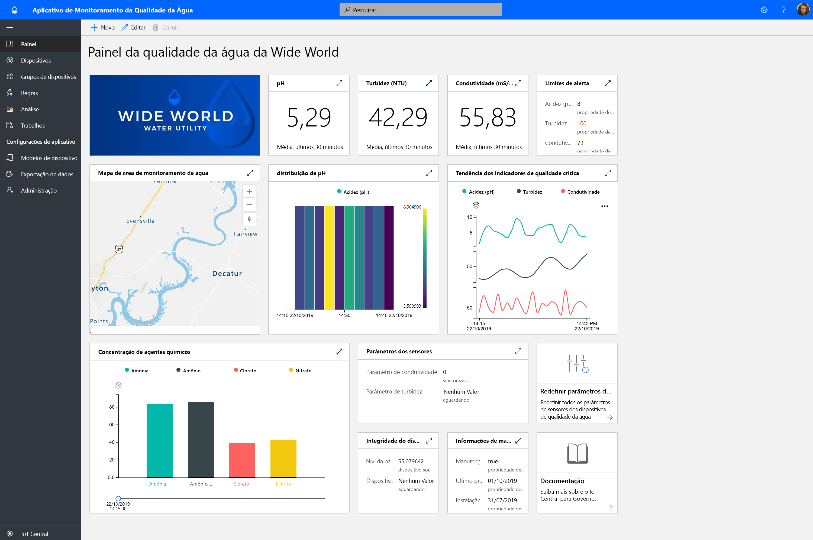
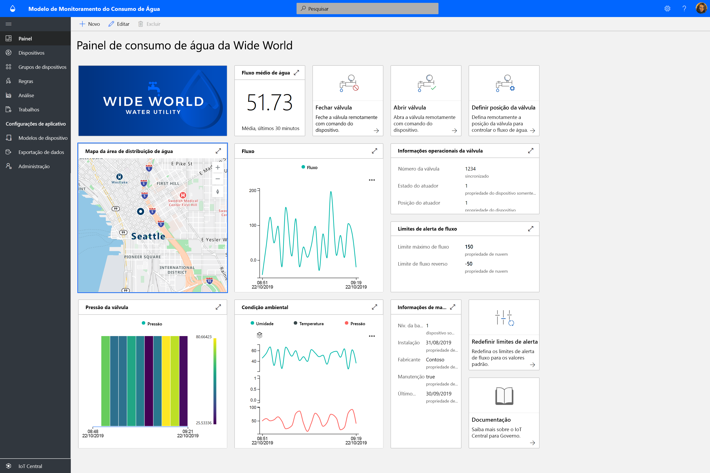
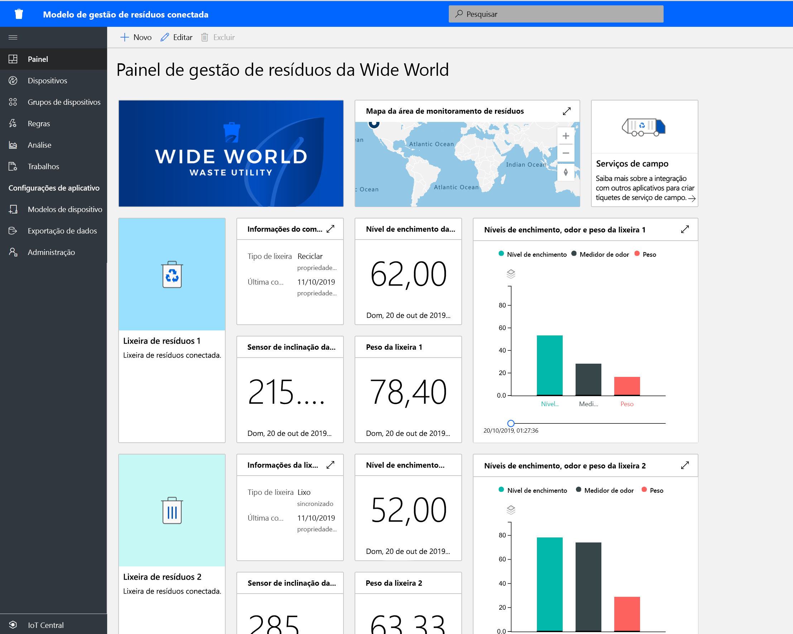

# O que são as soluções governamentais do IoT Central?

Comece a criar soluções de cidade inteligente usando modelos de aplicativo do Azure IoT Central. Comece agora com **monitoramento da qualidade da água**, **monitoramento do consumo de água** e **gestão de resíduos conectada**.

## O que é o modelo de aplicativo de monitoramento da qualidade da água?   

O monitoramento da qualidade da água tradicional se baseia em técnicas de amostragem manuais e análise de laboratório de campo, o que é demorado e dispendioso. Ao monitorar remotamente a qualidade da água em tempo real, os problemas de qualidade da água podem ser gerenciados antes que os cidadãos sejam afetados. Além disso, com a análise avançada, os utilitários de água e as agências ambientais podem agir com base em avisos antecipados sobre possíveis problemas de qualidade da água e planejar o tratamento da água com antecedência.  

O aplicativo de monitoramento da qualidade da água é um modelo de aplicativo do IoT Central para ajudar você a começar rapidamente seu desenvolvimento de solução de IoT e a permitir que os utilitários de água monitorem digitalmente a qualidade da água em cidades inteligentes. 

O modelo de aplicativo consiste em:
* painéis de operador de exemplo;
* modelos de dispositivos de monitor da qualidade da água de exemplo;
* dispositivos monitores da qualidade da água simulados;
* regras e trabalhos pré-configurados e
* marcação usando rótulo branco. 

Introdução ao [Tutorial do aplicativo de monitoramento da qualidade da água](./tutorial-water-quality-monitoring.md).

## O que é o modelo de aplicativo de monitoramento do consumo de água? 

O controle do consumo de água tradicional se baseia em operadores de água lendo manualmente os medidores de consumo de água nos locais de medição. Cada vez mais cidades estão substituindo os medidores tradicionais por medidores inteligentes avançados, permitindo o monitoramento remoto do consumo e controlando remotamente as válvulas para controlar o fluxo de água. O monitoramento de consumo de água, em conjunto com mensagens digitais com comentários para o cidadão, pode aumentar a conscientização e reduzir o consumo de água. 

O aplicativo de monitoramento do consumo de água é um modelo de aplicativo do IoT Central para ajudar você a iniciar rapidamente seu desenvolvimento de solução de IoT para permitir que companhias de água e cidades monitorem e controlem remotamente o fluxo de água para reduzir o consumo. 

  

O modelo de aplicativo Monitoramento do Consumo de Água consiste nos seguintes itens pré-configurados:
* painéis de operador de exemplo;
* modelos de dispositivos de monitor da qualidade da água de exemplo;
* dispositivos monitores da qualidade da água simulados;
* regras e trabalhos pré-configurados e
* marcação usando rótulo branco. 

 Introdução ao [Tutorial do aplicativo de monitoramento do consumo de água](./tutorial-water-consumption-monitoring.md).

## O que é um modelo de aplicativo de gestão de resíduos conectada? 

O aplicativo de Gestão de resíduos conectada é um modelo de aplicativo do IoT Central para ajudar você a iniciar rapidamente seu desenvolvimento de solução de IoT, a fim de permitir que as cidades inteligentes monitorem remotamente visando maximizar a coleta de lixo eficiente. 

 

O modelo de aplicativo de gestão de resíduos conectada consiste nos seguintes elementos pré-configurados:
* painéis de operador de exemplo;
* exemplo de modelos de dispositivo conectado de recipiente para lixo
* dispositivos simulados conectados de recipiente para lixo
* regras e trabalhos pré-configurados e
* marcação usando rótulo branco. 

Introdução ao [Tutorial do aplicativo de gestão de resíduos conectada](./tutorial-connected-waste-management.md).

## Próximas etapas

* Saiba mais sobre os [conceitos de monitoramento da qualidade da água](./concepts-waterqualitymonitoring-architecture.md)
* Saiba mais sobre os [conceitos de monitoramento do consumo de água](./concepts-waterconsumptionmonitoring-architecture.md)
* Saiba mais sobre os [conceitos de gestão de resíduos conectada](./concepts-connectedwastemanagement-architecture.md)  
