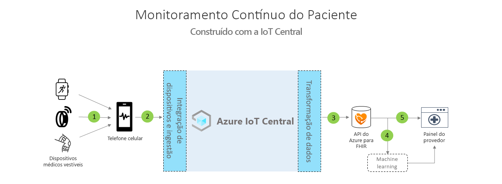

# Arquitetura do monitoramento contínuo do paciente

As soluções de monitoramento contínuo de pacientes podem ser criadas com o modelo de aplicativo fornecido e a arquitetura descrita abaixo como diretriz.

>[!div class="mx-imgBorder"] 
>

1. Dispositivos médicos que se comunicam por meio do BLE (Bluetooth de Baixa Energia)
1. Gateway de celular que recebe dados do BLE e os envia para IoT Central
1. Exportação contínua dos dados de saúde do paciente para a API do Azure para FHIR&reg;
1. Aprendizado de máquina baseado em dados interoperáveis
1. Painel da equipe de atendimento criada com base nos dados de FHIR

## Detalhes
Esta seção descreve cada parte do diagrama da arquitetura com mais detalhes.

### Dispositivos médicos BLE
Muitos acessórios médicos usados no espaço de IoT de serviços de saúde são dispositivos Bluetooth de Baixa Energia. Eles não podem se comunicar diretamente com a nuvem e precisarão passar por um gateway. Essa arquitetura sugere o uso de um aplicativo de celular como esse gateway.

### Gateway de celular
A função principal do aplicativo de celular é ingerir os dados de BLE dos dispositivos médicos e transmiti-los para o Azure IoT Central. Além disso, o aplicativo pode ajudar a orientar os pacientes por meio de um fluxo de configuração e provisionamento do dispositivo e pode ajudá-los a ter uma visão dos respectivos dados de saúde pessoais. Outras soluções poderão usar um gateway de tablet ou um gateway estático se estiverem dentro de um quarto de hospital para atingir o mesmo fluxo de comunicação.

### Exportar para a API do Azure para FHIR&reg;
O Azure IoT Central está em conformidade com o HIPAA e tem a certificação HITRUST&reg;, mas você também pode querer enviar dados relacionados à saúde do paciente à API do Azure para FHIR. A [API do Azure para FHIR](../../healthcare-apis/overview.md) é uma API compatível, totalmente gerenciada e baseada em padrões para dados de serviços de saúde clínica que habilita a criação de sistemas de engajamento com seus dados de saúde. Ela possibilita a troca rápida de dados por meio das APIs de FHIR e tem suporte de uma oferta de PaaS (plataforma como serviço) gerenciada na nuvem. Usando a funcionalidade de exportação de dados contínua do IoT Central, você pode enviar dados para a API do Azure para FHIR.

### Aprendizado de máquina
Depois de agregar seus dados e convertê-los para o formato FHIR, você pode criar modelos de machine learning que podem enriquecer insights e permitir a tomada de decisões mais inteligente para sua equipe de atendimento. Há diferentes tipos de serviços que podem ser usados para criar, treinar e implantar modelos de machine learning. Mais informações sobre como usar as ofertas de aprendizado de máquina do Azure podem ser encontradas em nossa [documentação sobre aprendizado de máquina](../../machine-learning/index.yml).

### Dashboard do provedor
Os dados localizados na API do Azure para FHIR podem ser usados para criar um dashboard de insights do paciente ou podem ser integrados diretamente a um EMR para ajudar as equipes de atendimento a visualizarem o status do paciente. As equipes de cuidado podem usar esse painel para prestar atendimento aos pacientes que precisam de assistência e identificar com antecedência sinais de aviso de agravamento de doenças. Para saber como criar um dashboard do provedor no Power BI em tempo real, siga nosso [guia de instruções](howto-health-data-triage.md).

## Próximas etapas
* [Saiba como implantar um modelo de aplicativo de monitoramento contínuo de pacientes](tutorial-continuous-patient-monitoring.md)