# Fazer um tour pela interface do usuário do Azure IoT Central (versão prévia dos recursos)

[!INCLUDE [iot-central-pnp-original](../../../includes/iot-central-pnp-original-note.md)]

Este artigo apresenta a interface do usuário do Microsoft Azure IoT Central. Você pode usar a interface do usuário para criar, gerenciar e usar uma solução do Azure IoT Central e seus dispositivos conectados.

Como um _construtor de soluções_, você usa a interface do usuário do Azure IoT Central para definir sua solução do Azure IoT Central. Você pode usar a interface do usuário para:

* Definir os tipos de dispositivos que se conectam à sua solução.
* Configurar as regras e ações para seus dispositivos. 
* Personalizar a interface do usuário para um _operador_ que usa sua solução.

Como um _operador_, você pode usar a interface do usuário do Azure IoT Central para gerenciar sua solução do Azure IoT Central. Você pode usar a interface do usuário para:

* Monitorar seus dispositivos.
* Configurar seus dispositivos.
* Solucionar e corrigir problemas com dispositivos.
* Provisione novos dispositivos.

## Página inicial do IoT Central

Na [página inicial do IoT Central](https://aka.ms/iotcentral-get-started), você pode saber mais sobre as notícias e os recursos mais recentes disponíveis no IoT Central, criar novos aplicativos e ver e iniciar o aplicativo existente.

> [!div class="mx-imgBorder"]
> 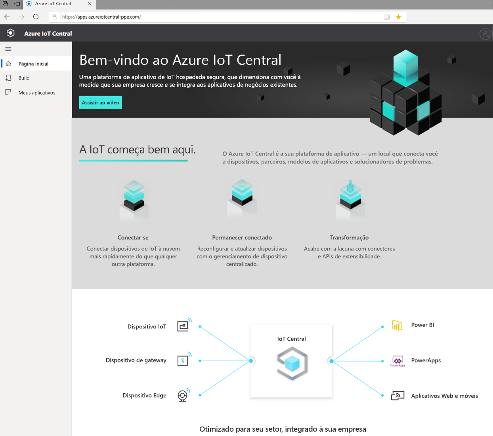

### Criar um aplicativo

Na seção Build, você pode navegar na lista de modelos IoT Central relevantes para o setor para ajudar você a começar rapidamente, ou começar do zero usando um modelo de aplicativo personalizado.  
> [!div class="mx-imgBorder"]
> 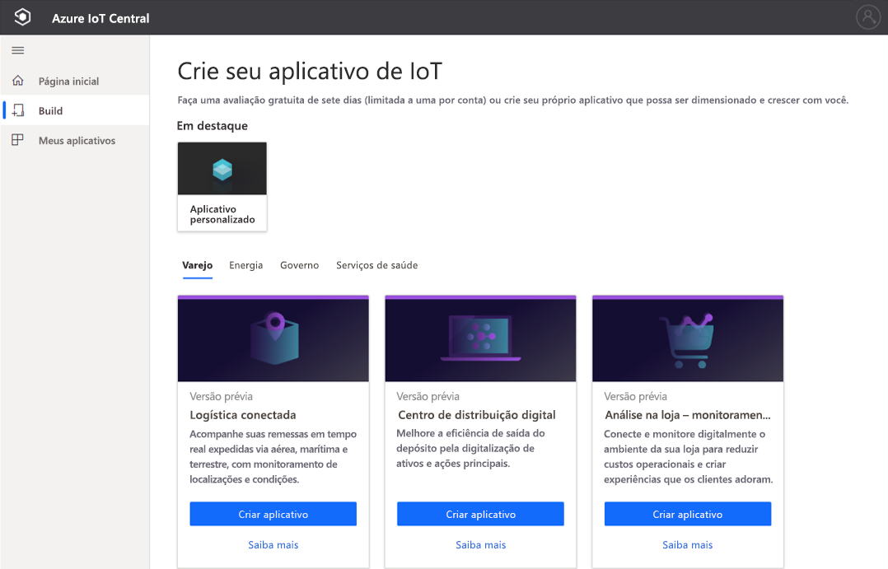

Para saber mais, confira o início rápido [Criar um aplicativo Azure IoT Central](quick-deploy-iot-central.md).

### Iniciar seu aplicativo

Você pode iniciar o aplicativo IoT Central acessando a URL que você ou o criador de soluções escolheu durante a criação do aplicativo. Você também pode ver uma lista de todos os aplicativos aos quais você tem acesso no [Gerenciador de aplicativos do IoT Central](https://aka.ms/iotcentral-apps).

> [!div class="mx-imgBorder"]
> 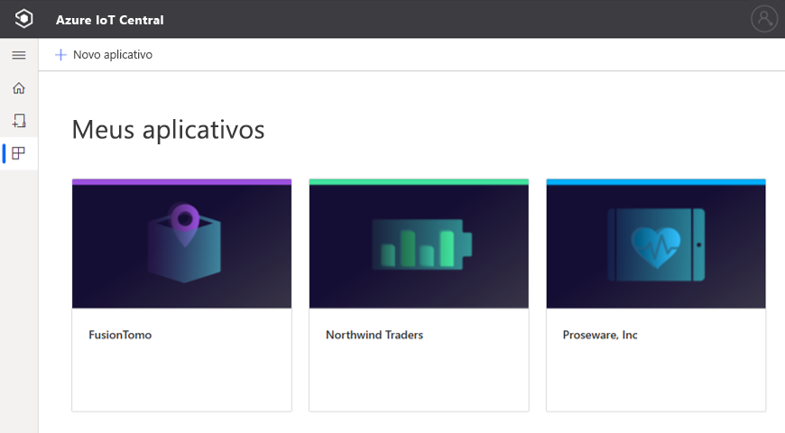

## Navegar em seu aplicativo

Quando você estiver em seu aplicativo IoT, use o painel esquerdo para acessar as diferentes áreas. Você pode expandir ou recolher a barra de navegação selecionando o ícone de três linhas na parte superior da barra de navegação:

> [!NOTE]
> Os itens que você vê na barra de navegação dependerão de sua função de usuário. Saiba mais sobre [como gerenciar usuários e funções](howto-manage-users-roles.md). 

:::row:::
  :::column span="":::
      > [!div class="mx-imgBorder"]
      > 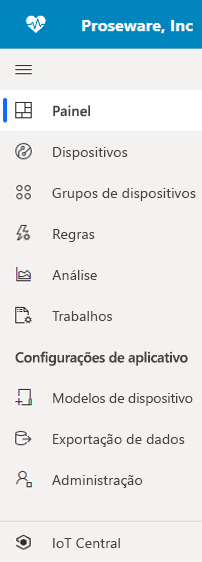
  :::column-end:::
  :::column span="2":::
     **Painel** exibe o painel de seu aplicativo. Como um *construtor de soluções*, você pode personalizar o painel global para seus operadores. Dependendo de sua função de usuário, os operadores também podem criar os próprios painéis pessoais.
     
     A opção **Dispositivos** permite que você gerencie seus dispositivos conectados, tanto reais quanto simulados.

     A opção **Grupos de dispositivos** permite exibir e criar coleções lógicas de dispositivos especificados por uma consulta. Você pode salvar essa consulta e usar grupos de dispositivos por meio do aplicativo para executar operações em massa.

     A opção **Regras** permite criar e editar regras para monitorar dispositivos. As regras são avaliadas com base na telemetria do dispositivo e disparam ações personalizáveis.

     A opção **Análise** permite criar exibições personalizadas sobre dados do dispositivo para derivar insights de seu aplicativo.

     A opção **Trabalhos** permite que você gerencie seus dispositivos em escala executando operações em massa.

     A opção **Modelos de dispositivo** permite criar e gerenciar as características dos dispositivos que se conectam ao seu aplicativo.

     A opção **Exportação de dados** permite configurar uma exportação contínua para serviços externos, como armazenamento e filas.

     A opção **Administração** permite gerenciar as configurações, a personalização, a cobrança, os usuários e as funções do seu aplicativo.

     A opção **IoT Central** permite que os *administradores* retornem ao gerenciador de aplicativos do IoT Central.
     
   :::column-end:::
:::row-end:::

### Pesquisa, ajuda, tema e suporte

O menu superior aparece em cada página:

> [!div class="mx-imgBorder"]
> 

* Para procurar dispositivos e modelos de dispositivo, insira um valor **Pesquisar**.
* Para alterar o idioma da interface do usuário ou o tema, escolha o ícone **Configurações**. Saiba mais sobre [como gerenciar suas preferências de aplicativo](../core/howto-manage-preferences.md?toc=/azure/iot-central/preview/toc.json&bc=/azure/iot-central/preview/breadcrumb/toc.json)
* Para sair do aplicativo, escolha o ícone **Conta**.
* Para obter ajuda e suporte, escolha o menu suspenso da **Ajuda** para ver uma lista de recursos. Em um aplicativo de avaliação, os recursos de suporte incluem o acesso ao [chat ao vivo](../core/howto-show-hide-chat.md?toc=/azure/iot-central/preview/toc.json&bc=/azure/iot-central/preview/breadcrumb/toc.json).

Você pode escolher entre um tema claro ou escuro para a interface do usuário:

> [!NOTE]
> A opção de escolher entre os temas claro e escuro não estará disponível se o administrador tiver configurado um tema personalizado para o aplicativo.

> [!div class="mx-imgBorder"]
> 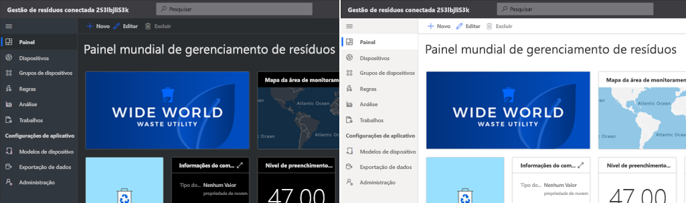

### Painel
> [!div class="mx-imgBorder"]
> 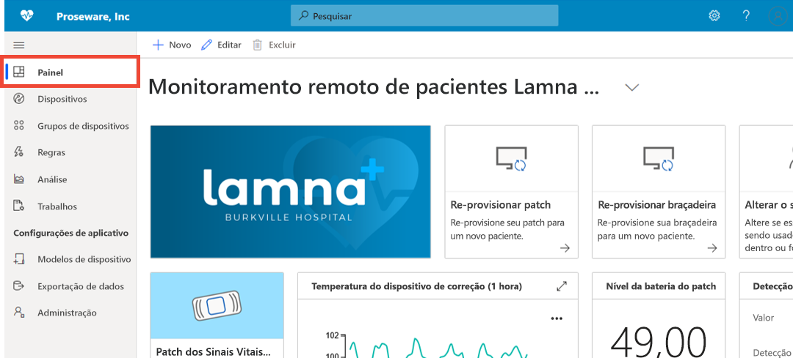

* O painel é a primeira página que você vê quando entra no seu aplicativo do Azure IoT Central. Como um *construtor de soluções*, você pode criar e personalizar vários painéis de aplicativos globais para outros usuários. Saiba mais sobre [como adicionar blocos ao seu painel](../core/howto-add-tiles-to-your-dashboard.md?toc=/azure/iot-central/preview/toc.json&bc=/azure/iot-central/preview/breadcrumb/toc.json)

* Como um *operador*, se sua função de usuário permitir, você poderá criar painéis pessoais para monitorar o que importa. Para saber mais, confira o artigo de instruções [Criar painéis pessoais do Azure IoT Central](../core/howto-create-personal-dashboards.md?toc=/azure/iot-central/preview/toc.json&bc=/azure/iot-central/preview/breadcrumb/toc.json).

### Dispositivos

> [!div class="mx-imgBorder"]
> 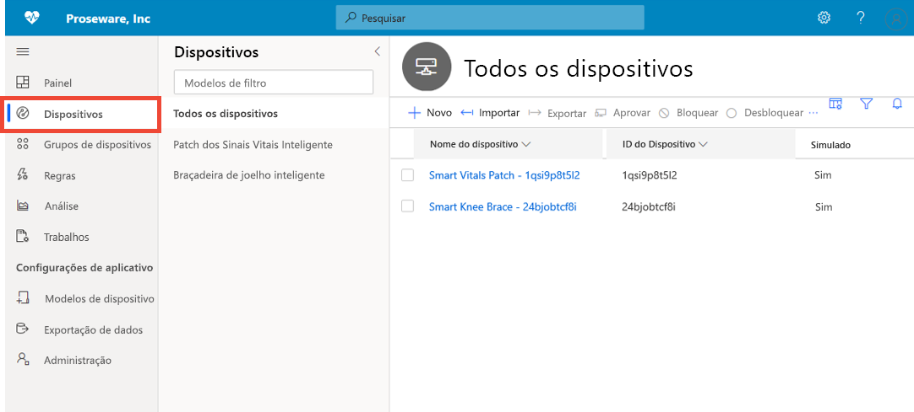

A página Explorer mostra os _dispositivos_ no aplicativo do Azure IoT Central agrupados por _modelo de dispositivo_. 

* Um modelo do dispositivo define um tipo de dispositivo que pode se conectar ao seu aplicativo.
* Um dispositivo representa um dispositivo real ou simulado no seu aplicativo.

Para saber mais, confira o início rápido [Monitorar seus dispositivos](./quick-monitor-devices.md). 

### Grupos de dispositivos

> [!div class="mx-imgBorder"]
> 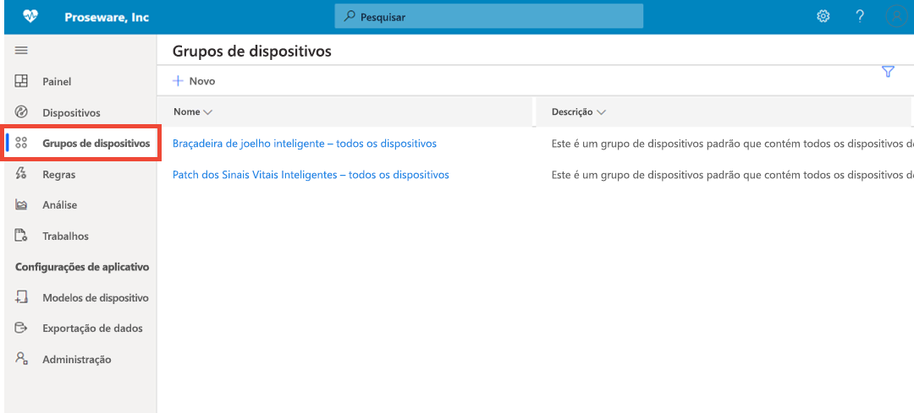

Um grupo de dispositivos consiste em uma coleção de dispositivos relacionados. Um *construtor de soluções* define uma consulta para identificar os dispositivos que estão incluídos em um grupo de dispositivos. Você usa grupos de dispositivos para executar operações em massa em seu aplicativo. Para saber mais, confira o artigo [Usar grupos de dispositivos no aplicativo do Azure IoT Central](tutorial-use-device-groups.md).

### Regras
> [!div class="mx-imgBorder"]
> 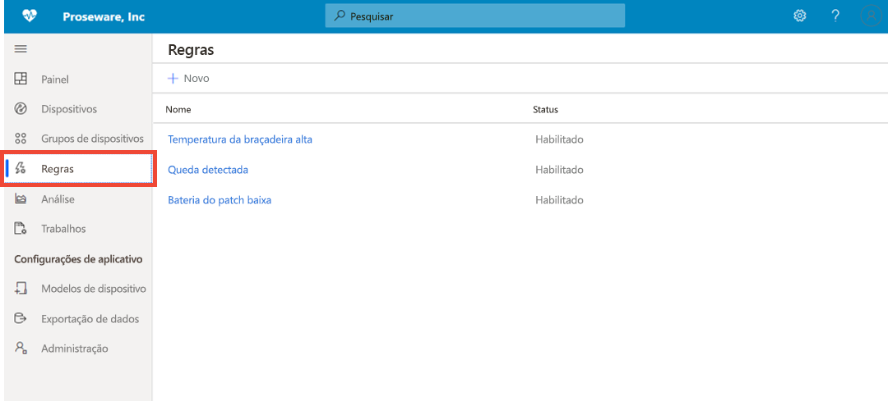

A página Regras permite definir regras com base na telemetria, estado ou eventos dos dispositivos. Quando uma regra é acionada, ela pode disparar uma ou mais ações, como enviar um email, notificar um sistema externo por meio de alertas de webhook, etc. Para saber mais, confira o tutorial [Como configurar regras](tutorial-create-telemetry-rules.md). 

### Análise

> [!div class="mx-imgBorder"]
> 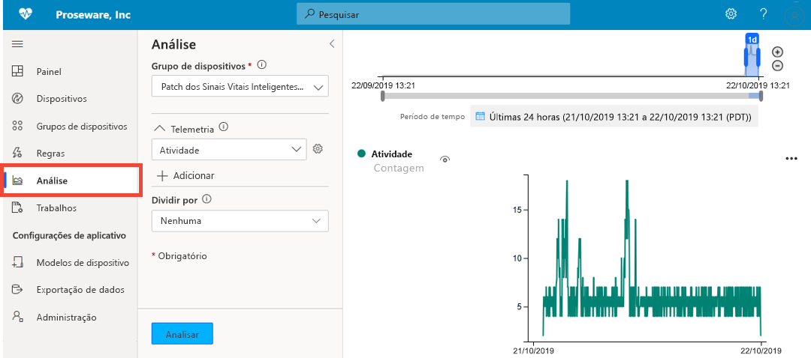

A análise permite criar exibições personalizadas sobre dados do dispositivo para derivar insights de seu aplicativo. Para saber mais, confira o artigo [Criar análises para seu aplicativo do Azure IoT Central](howto-create-analytics.md).

### Trabalhos

> [!div class="mx-imgBorder"]
> 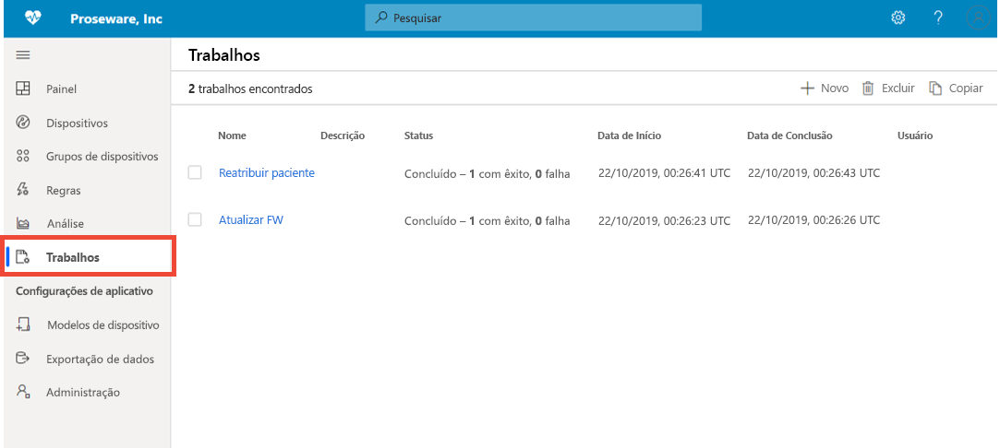

A página Trabalhos permite que você execute operações de gerenciamento de dispositivo em massa em seus dispositivos. Você pode atualizar propriedades e configurações do dispositivo e executar comandos em grupos de dispositivos. Para saber mais, consulte o artigo [Executar um trabalho](../core/howto-run-a-job.md?toc=/azure/iot-central/preview/toc.json&bc=/azure/iot-central/preview/breadcrumb/toc.json).

### Modelos de dispositivo

> [!div class="mx-imgBorder"]
> 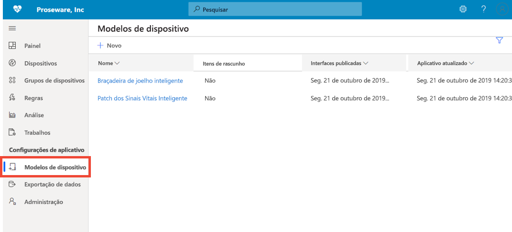

A página Modelos de Dispositivo é o local em que um construtor cria e gerencia os modelos de dispositivo no aplicativo. Um modelo de dispositivo especifica as características dos dispositivos, como:

* medidas de telemetria, estado e evento
* Propriedades
* Comandos
* Exibições

O *construtor de soluções* também pode criar formulários e painéis para uso dos operadores no gerenciamento de dispositivo.

Para saber mais, consulte o tutorial [Definir um novo tipo de dispositivo em seu aplicativo do Azure IoT Central](howto-set-up-template.md). 

### Exportação de dados
> [!div class="mx-imgBorder"]
> 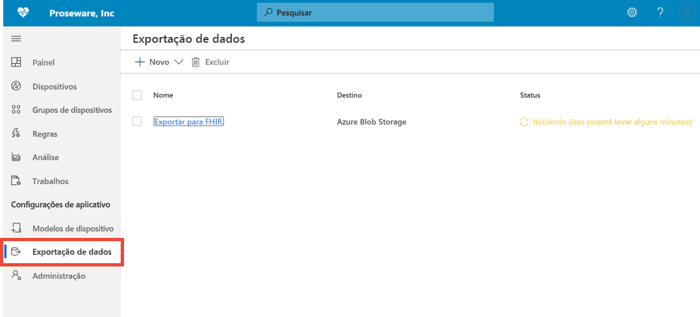

A exportação de dados permite configurar fluxos de dados, como telemetria, do aplicativo para sistemas externos. Para saber mais, confira o artigo [Exportar seus dados no Azure IoT Central](./howto-export-data.md).

### Administração
> [!div class="mx-imgBorder"]
> 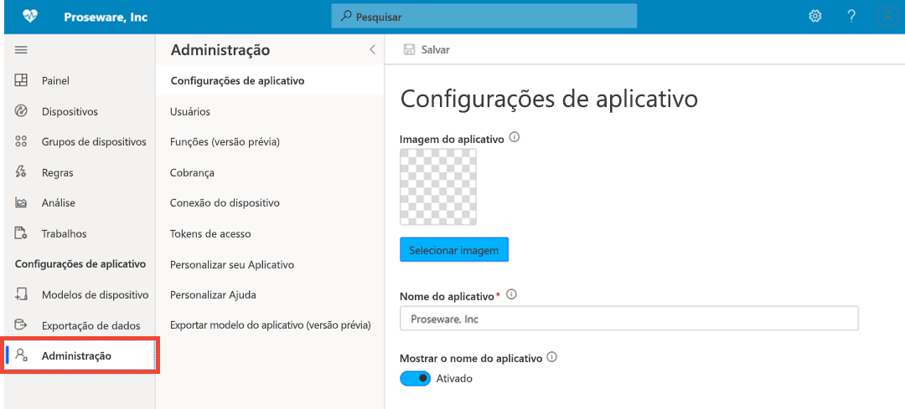

A página Administração permite configurar e personalizar o aplicativo IoT Central. Aqui você pode alterar o nome do aplicativo, a URL, o tema, o gerenciamento de usuários e as funções, criar tokens de API e exportar seu aplicativo. Para saber mais, consulte o artigo [Administrar seu aplicativo do Azure IoT Central](howto-administer.md).

## Próximas etapas

Agora que você tem uma visão geral do Azure IoT Central e está familiarizado com o layout da interface do usuário, a próxima etapa sugerida é concluir o início rápido [Criar um aplicativo do Azure IoT Central](quick-deploy-iot-central.md).
