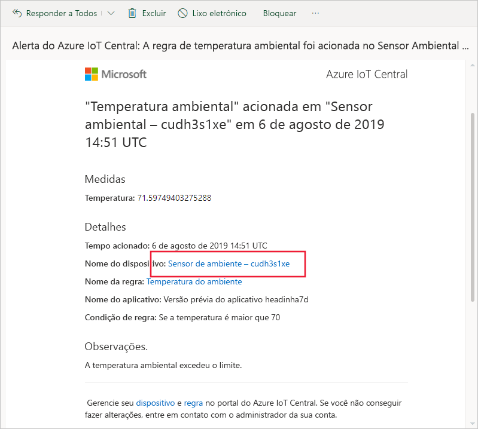
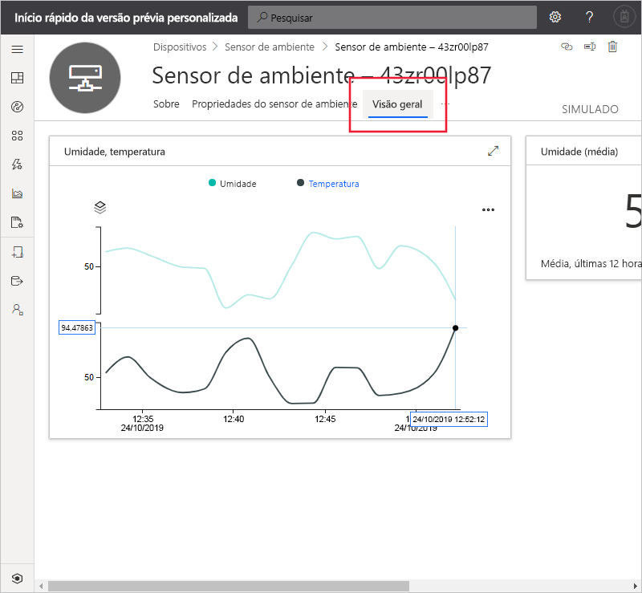
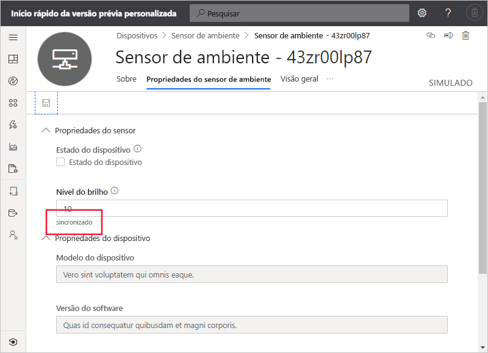

# Início Rápido: Use o Azure IoT Central para monitorar seus dispositivos (versão prévia dos recursos)

*Este artigo aplica-se a operadores, construtores e administradores.*

[!INCLUDE [iot-central-pnp-original](../../../includes/iot-central-pnp-original-note.md)]

Este início rápido mostra a você, como um operador, como usar o aplicativo do Microsoft Azure IoT Central para monitorar seus dispositivos e alterar as configurações.

## Prerequisites

Antes de começar, você deve concluir os três inícios rápidos anteriores [Criar um aplicativo do Azure IoT Central](./quick-deploy-iot-central.md), [Adicionar um dispositivo simulado ao seu aplicativo do IoT Central](./quick-create-pnp-device.md) e [Configurar regras e ações para seu dispositivo](quick-configure-rules.md).

## Receber uma notificação

O Azure IoT Central envia notificações sobre dispositivos como mensagens de email. O construtor adicionou uma regra para enviar uma notificação quando a temperatura em um ar-condicionado conectado excede um limite. Verifique os emails enviados para a conta escolhida pelo construtor para receber notificações.

Abra a mensagem de email recebida no final do início rápido [Configurar regras e ações para seu dispositivo](quick-configure-rules.md). No email, selecione o link para o dispositivo:

A exibição **Painel** do dispositivo simulado do sensor ambiental que você criou nos inícios rápidos anteriores é aberta no navegador:

## Investigar um problema

Como um operador, você pode exibir informações sobre o dispositivo nas páginas **Visão geral**, **Propriedades do Sensor Ambiental** e **Comandos**. O construtor personalizou as páginas **Painel** e **Propriedades do Sensor Ambiental** para exibir informações importantes sobre um dispositivo de sensor ambiental conectado.

Escolha a exibição **Visão geral** para ver informações sobre o dispositivo.

O gráfico no painel mostra um gráfico de temperatura do dispositivo. Você decide se a temperatura do dispositivo está muito alta.

## Resolver um problema

Para fazer uma alteração no dispositivo, use a página **Propriedades do Sensor Ambiental**.

Escolha **Propriedades do Sensor Ambiental**. Altere o **Nível de Brilho** para 10. Escolha **Salvar** para atualizar o dispositivo. Quando o dispositivo confirma as alterações de configuração, o status da propriedade muda para **sincronizado**:

## Próximas etapas

Neste guia de início rápido, você aprendeu a:

* Receber uma notificação
* Investigar um problema
* Resolver um problema

Agora que você sabe como monitorar o dispositivo, a próxima etapa sugerida é:

> [!div class="nextstepaction"]
> [Criar e gerenciar um modelo de dispositivo](howto-set-up-template.md).
